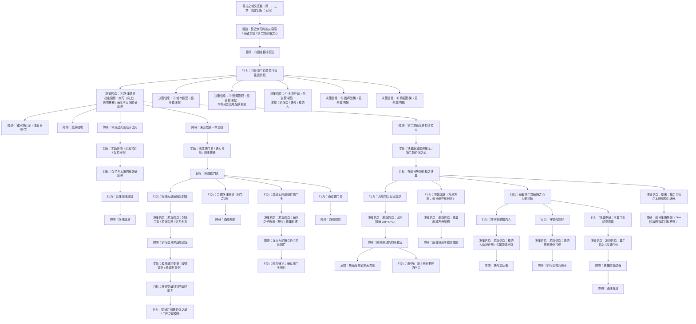

← [草稿](./README.md)

**校验状态**：待校验  
**最后更新**：2026-07-10  
**性质**：**章节切片 · 指定目标为太阳**（第一、二章）；最上层与 [全篇版](./交互链-循光之城.md) 共用 **向指定目标前进**，本篇仅展开①块中 **太阳** 一路的里程碑与细节。  
**对照切片**：[第三、四章 · 指定目标为渊光](./交互链-循光之城-追渊光三四章.md)  
**依据**：[交互链-循光之城 · 核心抽象](./交互链-循光之城.md#核心抽象)、[章节划分与故事大纲 · 第一、二章](../04-设定/05-隐秘真相/章节划分与故事大纲.md)

# 交互链：循光之城（第一、二章 · 指定目标：太阳）

## 在本作抽象中的位置

全篇交互链为 **向指定目标前进 + 六块**（见 [核心抽象 · 六块](./交互链-循光之城.md#六块当前位置经营)）。本篇在①块展开 **指定目标 = 太阳**；②～⑥与追渊光阶段同构。

| 包含 | 不包含 |
|------|--------|
| 指定目标为太阳时的①块展开 | 指定目标为渊光（三四章） |
| 第一章铁门关、第二章铁巢与骄阳之心 | 第五章指挥塔终局 |
| 日照带、速度差等环境口径 | 全局暗渊带（太阳移动停用） |

## 图例（与全篇版一致）

| 类型 | 含义 |
|------|------|
| **目标** | 玩家要达成什么 |
| **行为** | 玩家主动做什么 |
| **障碍** | 卡住、失败或需克服的状态 |
| **奖励** | 资源、情绪收益等较持久的正向结果 |
| **反馈** | 行为后的即时正向结果 |
| **决策信息** | 支撑判断的信息、分支与心算维度 |

> **拓扑**：**只向下分散、不向下合并**。

---

## 全图：向指定目标前进（太阳）→ 六块决策信息

> 最上层与全篇版一致；本篇 **详展开①块**（指定目标：太阳）。②～⑥ 与全篇 [六大板块详图](./交互链-循光之城.md#六大板块详图) 同构，本章特异口径见下文。

---

## ②～⑥ 与全篇同构

完整交互链见 [交互链-循光之城 · 六大板块详图](./交互链-循光之城.md#六大板块详图)。本篇仅在下列块上有**章节特异**口径：

| 块 | 本篇特异 |
|----|----------|
| **② 城市经营** | 追日途中 **停泊多停 1 回合** 时推进回合损失更重；佣兵 / 工匠模块支撑铁门关突破 |
| **③ 资源管理** | **荒地站队**：猎壳人（金属能源可观 vs 铁壳反击）vs 铁壳（随处可得 vs 骄阳会亵渎） |
| **④ 关系经营** | 骄阳会封锁、铁巢三路径站队（猎壳人 / 铁壳 / 攻城）对关系与贸易的连锁 |
| **⑤ 指挥战棋** | 与全篇同构；追日期间停泊时勘探子循环节奏更紧 |
| **⑥ 情报勘探** | 与全篇同构；铁门关封锁工事 / 游荡军队情报支撑①突破 |

### 六块决策信息（附属于「持续向当前章节目标推进航线」）

| 顺序 | 块 | 本篇侧重 |
|------|-----|----------|
| ① | **路线规划** | **太阳**一路：铁门关 / 速度差 / 铁巢 / 骄阳之心 → 章末切换渊光 |
| ②～⑥ | 见全篇详图 | 上表章节特异；其余与 [全篇版](./交互链-循光之城.md) 同构 |

### 与追渊光切片的对照

| | 本篇（一二章） | [追渊光三四章](./交互链-循光之城-追渊光三四章.md) |
|---|----------------|--------------------------------------------------|
| **指定目标** | 太阳 | 渊光 |
| **卷轴** | 向上 | 向下 |
| **① 环境口径** | 日照带、速度差 | 全局暗渊、无日照梯度 |
| **① 章节锚点** | 铁门关、铁巢 | 入暗渊转向、返程救援 |
| **②～⑥** | 同构（见上表特异） | 同构（见该篇特异表） |

---

## 待补

- [ ] 铁门关通过的具体玩法障碍（战斗 / 外交 / 混合）写入 ① 支路
- [ ] 速度差拉大的数值体感写入决策信息块（与 OPEN-006 对齐后）
- [ ] 骄阳之心获取三路径与 [指挥塔的真相](../04-设定/05-隐秘真相/指挥塔的真相.md) 专名对照表
- [ ] ②～⑥ 若需本章独立 mermaid，从全篇详图 fork 后仅改标注（当前以引用为主）
