← [草稿](./README.md)

**校验状态**：待校验  
**最后更新**：2026-07-09  
**性质**：**章节切片 · 指定目标为太阳**（第一、二章）；顶栏与 [全篇版](./交互链-循光之城.md) 共用抽象 **向指定目标前进**，本篇仅展开①块中 **太阳** 一路的里程碑与细节。  
**对照切片**：[第三、四章 · 指定目标为渊光](./交互链-循光之城-追渊光三四章.md)  
**依据**：[交互链-循光之城 · 核心抽象](./交互链-循光之城.md#核心抽象)、[章节划分与故事大纲 · 第一、二章](../04-设定/05-隐秘真相/章节划分与故事大纲.md)

# 交互链：循光之城（第一、二章 · 指定目标：太阳）

## 在本作抽象中的位置

全篇交互链的最远目的是 **向指定目标前进**；第一、二章的**指定目标 = 太阳**（卷轴向上）。②③④ 四块与追渊光阶段**同构**，本篇只细化①块太阳一路。

| 包含 | 不包含 |
|------|--------|
| 指定目标为太阳时的①块展开 | 指定目标为渊光（三四章） |
| 第一章铁门关、第二章铁巢与骄阳之心 | 第五章指挥塔终局 |
| 日照带、速度差等环境口径 | 全局暗渊带（太阳移动停用） |

## 图例（与全篇版一致）

| 类型 | 含义 |
|------|------|
| **目标** | 玩家要达成什么 |
| **行为** | 玩家主动做什么 |
| **障碍** | 卡住、失败或需克服的状态 |
| **奖励** | 资源、情绪收益等较持久的正向结果 |
| **反馈** | 行为后的即时正向结果 |
| **决策信息** | 支撑判断的信息、分支与心算维度 |

> **拓扑**：**只向下分散、不向下合并**。

---

## 全图：向指定目标前进（太阳）→ 四块决策信息

> 顶栏与全篇版一致；①块在共用骨架之上展开 **指定目标：太阳** 的章节里程碑。

```mermaid
flowchart TD
  T["循光之城交互链（第一、二章 · 指定目标：太阳）"]
  R["奖励：靠近太阳时的从容感 / 突破封锁 / 第二颗骄阳之心"]
  G["目标：向指定目标前进"]
  A["行为：持续向当前章节目标前进"]
  T --> R --> G --> A

  A --> D_route["决策信息：指定目标：太阳（向上）<br/>光带推移 / 速度与太阳的速度差 / 停滞会脱离日照"]
  A --> D_city["决策信息：城市形态能通过前方地形 / 舍得牺牲模块<br/>停泊与航行切换时机正确"]
  A --> D_res["决策信息：四种资源平衡 / 周总结粮食够分<br/>移动前生存线达标 / 荒地站队取舍"]
  A --> D_cmd["决策信息：多回合工作能按时完成 / 情报同步及时<br/>委托与危机可并行处理"]

  %% ① 共用骨架（与全篇版同构）
  D_route --> O_s1["障碍：被环境吞没（脱离日照带）"]
  D_route --> O_s2["障碍：资源枯竭"]
  D_route --> O_s3stall["障碍：停滞过久落后于太阳"]
  O_s3stall --> R_s3close["奖励：奖励倾向（距离拉近 / 保持日照）"]
  R_s3close --> G_s3gap["目标：保持与太阳的有效速度差"]
  G_s3gap --> A_s3rp1["行为：合理路线规划"]
  A_s3rp1 --> O_rp_s3rp1["障碍：路线规划"]

  %% ① 太阳一路里程碑
  D_route --> O_ch1["障碍：未完成第一章主线"]
  O_ch1 --> R_ch1["奖励：穿越铁门关 / 进入荒地 / 叙事推进"]
  R_ch1 --> G_ch1["目标：穿越铁门关"]
  G_ch1 --> A_ch1a["行为：突破无敌骄阳会封锁"]
  G_ch1 --> A_ch1b["行为：合理路线规划（日生之地）"]
  A_ch1a --> D_ch1a["决策信息：游戏信息：封锁工事 / 游荡军队 / 势力关系"]
  D_ch1a --> O_ch1a["障碍：骄阳会地界敌意过强"]
  O_ch1a --> R_ch1a2["奖励：模块城区支援（安德雷亚 / 赫菲斯提亚）"]
  R_ch1a2 --> G_ch1a2["目标：获得突破封锁的城区能力"]
  G_ch1a2 --> A_ch1a2["行为：接纳并部署佣兵之城 / 工匠之城模块"]
  A_ch1b --> O_rp_ch1b["障碍：路线规划"]
  G_ch1 --> A_ch1c["行为：越过太阳城前往铁门关"]
  A_ch1c --> D_ch1c["决策信息：游戏信息：骄阳之子通讯（放行 / 铁巢祈求）"]
  D_ch1c --> O_ch1c["障碍：误以为骄阳会仍会持续阻拦"]
  O_ch1c --> A_ch1c1["行为：响应通讯：确认铁门关放行"]
  G_ch1 --> A_ch1d["行为：通过铁门关"]
  A_ch1d --> O_rp_ch1d["障碍：路线规划"]

  %% ① 第二章里程碑
  D_route --> O_ch2["障碍：第二章速度差持续拉大"]
  O_ch2 --> R_ch2["奖励：铁巢废墟遗迹揭示 / 第二颗骄阳之心"]
  R_ch2 --> G_ch2["目标：在追日失效前抵达铁巢"]
  G_ch2 --> A_ch2a["行为：荒地向上追日跋涉"]
  G_ch2 --> A_ch2b["行为：穿越暗渊（荒地方向，追日途中有日照）"]
  A_ch2a --> D_ch2a["决策信息：游戏信息：太阳加速 v(t)=v₀+a·t"]
  D_ch2a --> O_ch2a["障碍：同向移动仍持续拉远"]
  O_ch2a --> F_ch2a["反馈：角速度章名的无力感"]
  O_ch2a --> A_ch2a1["行为：（技巧）减少非必要停泊回合"]
  A_ch2b --> D_ch2b["决策信息：游戏信息：铁巢废墟方舟结构"]
  D_ch2b --> O_ch2b["障碍：废墟地形与铁壳威胁"]
  G_ch2 --> G_ch2k["目标：获取第二颗骄阳之心（埃厄斯）"]
  G_ch2k --> A_ch2k1["行为：站队协助猎壳人"]
  G_ch2k --> A_ch2k2["行为：与铁壳交好"]
  G_ch2k --> A_ch2k3["行为：铁巢终局：与巢主对峙或攻城"]
  A_ch2k1 --> D_ch2k1["决策信息：游戏信息：猎壳人营地开放 / 金属能源可观"]
  D_ch2k1 --> O_ch2k1["障碍：铁壳会反击"]
  A_ch2k2 --> D_ch2k2["决策信息：游戏信息：铁壳物资随处可得"]
  D_ch2k2 --> O_ch2k2["障碍：骄阳会视为亵渎"]
  A_ch2k3 --> D_ch2k3["决策信息：游戏信息：巢主关系 / 攻城代价"]
  D_ch2k3 --> O_ch2k3["障碍：铁巢防御过强"]
  O_ch2k3 --> O_rp_ch2k3["障碍：路线规划"]
  G_ch2 --> D_ch2end["决策信息：章末：指定目标由太阳切换为渊光"]
  D_ch2end --> O_ch2end["障碍：追日策略失效（下一阶段的指定目标更换）"]

  %% ② 城市形态与取舍（追日阶段侧重）
  D_city --> O_c1["障碍：城市形态规划不合理：模块过多 / 模块过少 / 布局不适配"]
  O_c1 --> R_c1["奖励：通过地形的成就感 / 模块重组后的新能力"]
  R_c1 --> G_c1["目标：城市 footprint 适配追日路线前方地形"]
  R_c1 --> G_c1 --> A_c1["行为：获得一套能通过当前地形的城区组合"]
  A_c1 --> D_cdeck["决策信息：关键城区未建成<br/>负载成本过高<br/>能源账单压垮预算<br/>分离后完整度损失<br/>停泊改位占用多回合"]
  D_cdeck --> O_cdeck["障碍：城区效能不够：关键能力缺失 / 负载过高 / 能源周转不足 / 完整度不足"]
  O_cdeck --> R_cd1["奖励：城区效能上升，追日行进更顺畅"]
  R_cd1 --> G_cd1["目标：补足关键城区能力"]
  O_cdeck --> R_cd2["奖励：通过铁门关 / 荒地窄道，保持追日路线"]
  R_cd2 --> G_cd2["目标：缩小 footprint 或通过窄道"]
  O_cdeck --> R_cd3["奖励：能源与金属周转改善，减少停泊补给回合"]
  R_cd3 --> G_cd3["目标：降低城区运转账单"]
  O_cdeck --> R_cd4["奖励：模块联动增强（佣兵 / 工匠城区 + 特殊城区）"]
  R_cd4 --> G_cd4["目标：获得协同城区组合"]

  G_cd1 --> A_cd1a["行为：建设一般城区设施"]
  G_cd1 --> A_cd1b["行为：修复破损城区"]
  A_cd1a --> D_cd1a1["决策信息：金属 / 人口不够执行建设"]
  D_cd1a1 --> O_cd1a1["障碍：资源不足"]
  O_cd1a1 --> R_cd1a1["奖励：资源充裕 / 行为自由"]
  R_cd1a1 --> G_cd1a1["目标：获得足够金属与人口"]
  G_cd1a1 --> A_cd1a1a["行为：解决资源与补给"]
  G_cd1a1 --> A_cd1a1b["行为：收集情报与线索"]
  A_cd1a1a --> O_rp_cd1a1a["障碍：路线规划"]
  A_cd1a1b --> O_rp_cd1a1b["障碍：路线规划"]

  G_cd2 --> A_cd2a["行为：分离城区（停泊多回合）"]
  G_cd2 --> A_cd2b["行为：拆解结构回收金属"]
  G_cd2 --> A_cd2c["行为：航行放弃城区（即时执行）"]
  A_cd2a --> D_cd2a["决策信息：分离完整度代价可接受"]
  D_cd2a --> O_cd2a["障碍：不舍得牺牲模块"]
  A_cd2b --> D_cd2b["决策信息：拆解后产能损失可接受"]
  D_cd2b --> O_cd2b["障碍：拆解后短期产能下降"]
  A_cd2c --> D_cd2c["决策信息：放弃城区各减 30% 至 50% 完整度"]
  D_cd2c --> O_cd2c["障碍：完整度损失过大"]
  G_cd2 --> A_cd2d["行为：城区改位（仅停泊，3 至 5 回合地基预占）"]
  A_cd2d --> O_rp_cd2d["障碍：路线规划"]

  G_cd3 --> A_cd3a["行为：切换停泊：关闭高耗能城区能力"]
  G_cd3 --> A_cd3b["行为：优化人口与工作分配"]
  A_cd3a --> O_rp_cd3a["障碍：路线规划"]
  A_cd3b --> O_rp_cd3b["障碍：路线规划"]

  G_cd4 --> A_cd4a["行为：招募领袖并任职城区"]
  G_cd4 --> A_cd4b["行为：连接新城区模块"]
  A_cd4a --> D_cd4a["决策信息：游戏信息：领袖词条与城区匹配"]
  D_cd4a --> O_cd4a["障碍：领袖与城区不匹配"]
  A_cd4b --> O_rp_cd4b["障碍：路线规划"]

  A_c1 --> D_cdock["决策信息：停泊与航行切换占 1 回合 / 航行禁止占格建设"]
  D_cdock --> O_cdock["障碍：切换时机错误：追日途中被迫多停 1 回合"]
  O_cdock --> A_cdock1["行为：（技巧）提前规划 dock_to_sail / sail_to_dock"]
  A_c1 --> O_c1luck["障碍：运气不好"]

  %% ③ 资源与生存（含荒地站队）
  D_res --> O_r1["障碍：四种资源失衡"]
  O_r1 --> R_r1["奖励：资源充裕时的从容感 / 扩张行为自由"]
  R_r1 --> G_r1["目标：维持四种资源充足"]
  R_r1 --> G_r1 --> A_r1["行为：获得一套能支撑一轮活动循环的资源储备"]
  A_r1 --> D_ract["决策信息：任务与委托 / 解决敌人与危机<br/>解决资源与补给 / 收集情报与线索"]
  D_ract --> O_ract["障碍：本轮四类活动未达最低生存线"]
  O_ract --> G_ract["目标：完成一轮活动并确认生存"]
  G_ract --> A_ract1["行为：任务与领袖委托"]
  G_ract --> A_ract2["行为：解决敌人与危机"]
  G_ract --> A_ract3["行为：解决资源与补给"]
  G_ract --> A_ract4["行为：收集情报与线索"]
  A_ract1 --> D_ract1["决策信息：游戏信息：委托类型与奖励（恒 3 条至少 2 种）"]
  D_ract1 --> O_ract1a["障碍：委托与追日时间窗口冲突"]
  D_ract1 --> O_ract1b["障碍：已接取委托失败扣关系"]
  A_ract2 --> D_ract2["决策信息：游戏信息：铁壳集群 / 猎壳人威胁"]
  D_ract2 --> O_ract2["障碍：交战伤亡导致人口损失"]
  A_ract3 --> D_ract3["决策信息：游戏信息：资源点储量与距离"]
  D_ract3 --> O_ract3["障碍：荒野设施带不走：投资回收期过长"]
  A_ract4 --> D_ract4["决策信息：游戏信息：通讯同步状态"]
  D_ract4 --> O_ract4["障碍：情报未同步导致补给判断失准"]

  D_res --> D_faction["决策信息：荒地站队：猎壳人 vs 铁壳"]
  D_faction --> O_faction["障碍：站队与当前资源需求冲突"]
  O_faction --> G_faction["目标：选定荒地资源获取路径"]
  G_faction --> A_faction1["行为：协助猎壳人猎杀铁壳"]
  G_faction --> A_faction2["行为：与铁壳交好接受物资"]
  A_faction1 --> D_faction1["决策信息：金属能源可观 vs 铁壳反击风险"]
  D_faction1 --> O_rp_faction1["障碍：路线规划"]
  A_faction2 --> D_faction2["决策信息：单次少但随处可得 vs 骄阳会关系"]
  D_faction2 --> O_rp_faction2["障碍：路线规划"]

  A_r1 --> D_food["决策信息：周总结前粮食库存 / L1 L2 L3 分配预期"]
  D_food --> O_food["障碍：粮食不足：未分到者半数减员"]
  O_food --> R_food["奖励：人口稳定 / 队伍编制完整 / 继续追日的机会"]
  R_food --> G_food["目标：周总结时粮食够分"]
  G_food --> A_food1["行为：停泊后建设果园 / 矿区 / 能源站"]
  G_food --> A_food2["行为：运输队补给回流主城"]
  G_food --> A_food3["行为：前往村镇或城市据点贸易"]
  A_food1 --> O_rp_food1["障碍：路线规划"]
  A_food2 --> O_rp_food2["障碍：路线规划"]
  A_food3 --> O_rp_food3["障碍：路线规划"]
  A_food3 --> D_food3["决策信息：游戏信息：领袖关系与贸易门槛"]
  D_food3 --> O_food3["障碍：关系不足无法贸易"]

  A_r1 --> D_move["决策信息：确认生存后移动：发展与维持五方向"]
  D_move --> G_move["目标：确认生存，移动"]
  G_move --> A_move["行为：移动城市至新位置（向上，向太阳）"]
  A_move --> O_rp_move["障碍：路线规划"]
  A_r1 --> O_r1luck["障碍：运气不好"]
  O_r1luck --> F_r1luck["反馈：感觉自己命好"]

  %% ④ 指挥与多回合规划
  D_cmd --> O_cmd1["障碍：指挥技巧 — 正确指令编排（技巧）"]
  O_cmd1 --> F_cmd1["反馈：更高工作效率 / 更少伤亡 / 更远的前进距离"]
  F_cmd1 --> G_cmd1["目标：指令编排"]
  G_cmd1 --> A_cmd1["行为：单回合指挥"]
  G_cmd1 --> A_cmd2["行为：多回合工作规划"]
  G_cmd1 --> A_cmd3["行为：预测外部城市行动"]

  A_cmd1 --> D_cmd1a["决策信息：大脑算不过来（无时间限制，慢慢算），辅助计算信息"]
  D_cmd1a --> O_cmd1a["障碍：算力不够"]
  O_cmd1a --> A_cmd1a["行为：（练习）练习算力"]
  O_cmd1a --> A_cmd1b["行为：（技巧）减少计算压力：查攻略"]
  A_cmd1 --> G_cmd1b["目标：想做的事情不让做"]
  G_cmd1b --> O_cmd1b["障碍：行动力 / 移动力不足"]
  A_cmd1 --> D_cmd1c["决策信息：游戏信息：综合游戏信息"]
  D_cmd1c --> O_cmd1c["障碍：游戏信息获取不完整"]
  O_cmd1c --> A_cmd1c["行为：（技巧）多次游玩获取信息"]
  O_cmd1c --> A_cmd1d["行为：（技巧）查询信息"]
  A_cmd1 --> D_cmd1d["决策信息：游戏信息：单位状态 / 行动表顺序"]
  D_cmd1d --> O_cmd1d["障碍：单回合指挥信息获取不完整"]
  O_cmd1d --> A_cmd1e["行为：（BUG 技巧）S/L"]
  O_cmd1d --> A_cmd1f["行为：赌！"]

  A_cmd2 --> D_cmd2a["决策信息：游戏信息：工作完成度 / 工作效率 Attribute"]
  D_cmd2a --> O_cmd2a["障碍：跨回合工作信息获取不完整"]
  O_cmd2a --> A_cmd2a["行为：（技巧）多次游玩获取信息"]
  O_cmd2a --> A_cmd2b["行为：（技巧）查询信息"]
  A_cmd2 --> D_cmd2b["决策信息：游戏信息：任务中断条件"]
  D_cmd2b --> O_cmd2b["障碍：意外打断 / 行动打断"]
  O_cmd2b --> A_cmd2c["行为：主动中止并重编指令表"]
  A_cmd2 --> D_cmd2c["决策信息：精细规划结果不同"]
  D_cmd2c --> O_cmd2c["障碍：人口与工作分配不合理"]
  O_cmd2c --> A_cmd2d["行为：（练习）练习算力"]
  A_cmd2 --> D_cmd2d["决策信息：游戏信息：停泊勘探子循环"]
  D_cmd2d --> O_cmd2d["障碍：勘探与开发节奏失控（追日窗口流失）"]
  O_cmd2d --> A_cmd2e["行为：派出侦察队 / 勘探队 / 工程队 / 运输队"]

  A_cmd3 --> D_cmd3a["决策信息：游戏信息：外部城市行动顺序（game_seed）"]
  D_cmd3a --> O_cmd3a["障碍：无信息（未遭遇过该势力）"]
  O_cmd3a --> A_cmd3b["行为：（技巧）多次游玩获取信息"]
  O_cmd3a --> A_cmd3c["行为：（技巧）查询信息"]
  A_cmd3 --> D_cmd3b["决策信息：游戏信息：通讯站视野与待同步队列"]
  D_cmd3b --> O_cmd3b["障碍：情报延迟：基于旧信息下达指令"]
  O_cmd3b --> A_cmd3d["行为：建设通讯站触发式视野"]

  A_cmd1 --> D_cmdluck["决策信息：运气"]
  D_cmdluck --> R_cmdl1["奖励：掌控命运！"]
  R_cmdl1 --> A_cmdl1["行为：掌控运气"]
  D_cmdluck --> A_cmdl2["行为：消耗气运"]
  A_cmdl2 --> D_cmdl5["决策信息：赌"]
  D_cmdl5 --> F_cmdl1["反馈：增加的博弈反馈"]
  D_cmdl5 --> O_cmdl1["障碍：命不好"]
  D_cmdluck --> R_cmdl2["奖励：额外的机会"]
  R_cmdl2 --> G_cmdl1["目标：再来一把"]
  R_cmdl2 --> G_cmdl1 --> A_cmdl3["行为：重开"]
  A_cmdl3 --> F_cmdl0["反馈：增加了复玩度"]
  A_cmdl3 --> D_cmdl6["决策信息：综合游戏信息"]
  D_cmdl6 --> O_cmdl2["障碍：放弃这一局的心理负担 / 无难度"]
  O_cmdl2 --> F_cmdl2["反馈：SL BUG 给玩家多次机会"]
```

### 四块决策信息（附属于「持续向当前章节目标前进」）

| 顺序 | 块 | 本篇侧重 |
|------|-----|----------|
| ① | **路线与指定目标** | **太阳**一路：铁门关 / 速度差 / 铁巢 / 骄阳之心 → 章末切换渊光 |
| ② | **城市形态与取舍** | 与全篇同构（见 [全篇版](./交互链-循光之城.md)） |
| ③ | **资源与生存** | 与全篇同构；另含荒地站队 |
| ④ | **指挥与多回合规划** | 与全篇同构 |

### 与追渊光切片的对照

| | 本篇（一二章） | [追渊光三四章](./交互链-循光之城-追渊光三四章.md) |
|---|----------------|--------------------------------------------------|
| **指定目标** | 太阳 | 渊光 |
| **卷轴** | 向上 | 向下 |
| **① 环境口径** | 日照带、速度差 | 全局暗渊、无日照梯度 |
| **① 章节锚点** | 铁门关、铁巢 | 入暗渊转向、返程救援 |
| **②～④** | 同构 | 同构 |

---

## 待补

- [ ] 铁门关通过的具体玩法障碍（战斗 / 外交 / 混合）写入 ① 支路
- [ ] 速度差拉大的数值体感写入决策信息块（与 OPEN-006 对齐后）
- [ ] 骄阳之心获取三路径与 [指挥塔的真相](../04-设定/05-隐秘真相/指挥塔的真相.md) 专名对照表
