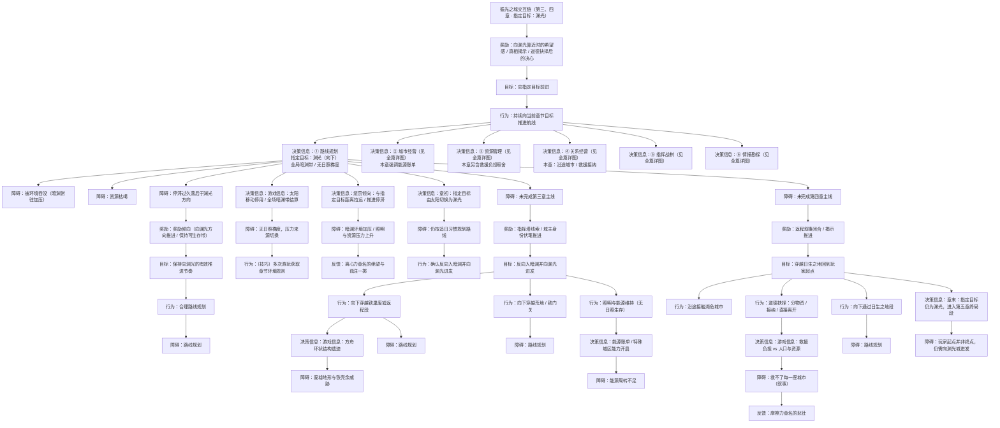
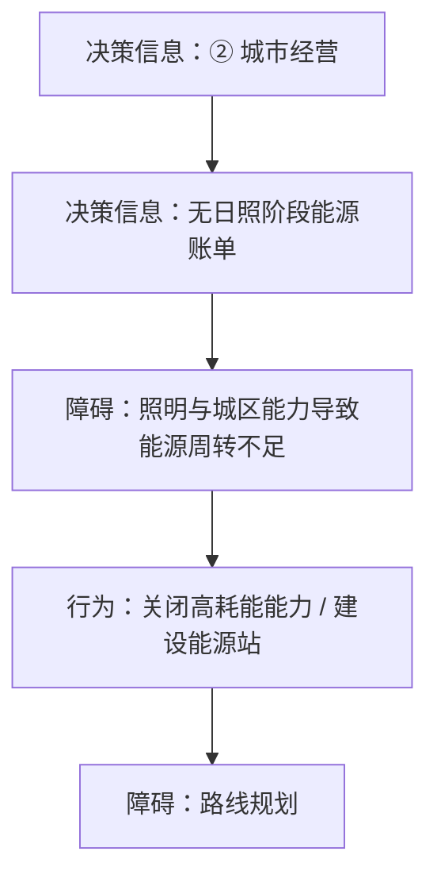
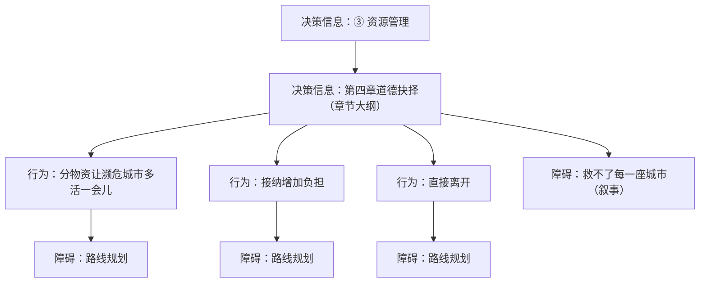
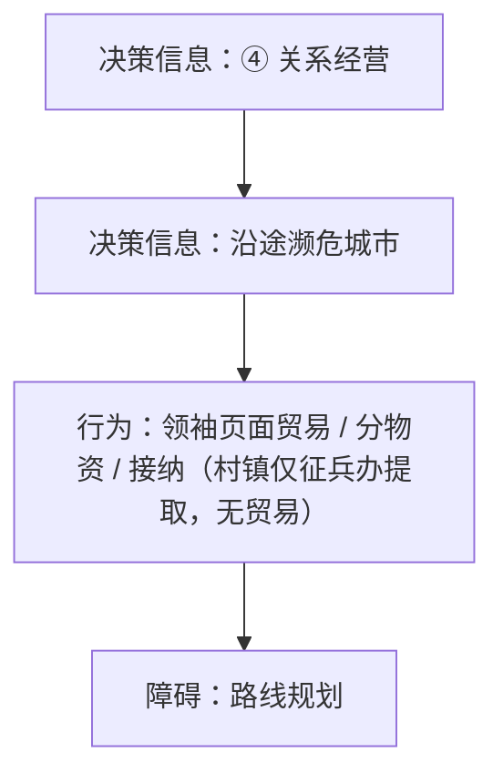
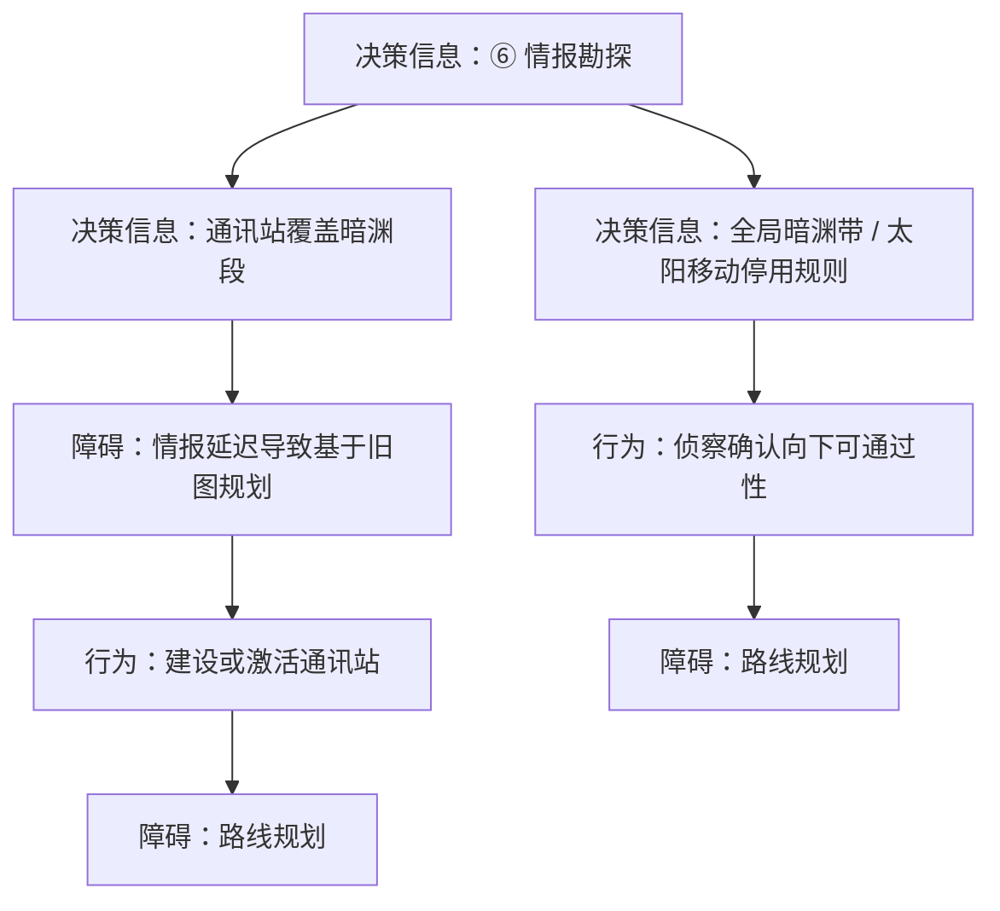

← [草稿](./README.md)

**校验状态**：待校验  
**最后更新**：2026-07-10  
**性质**：**章节切片 · 指定目标为渊光**（第三、四章）；最上层与 [全篇版](./交互链-循光之城.md) 共用 **向指定目标前进**，本篇仅展开①块中 **渊光** 一路的里程碑与细节。  
**对照切片**：[第一、二章 · 指定目标为太阳](./交互链-循光之城-追日一二章.md)  
**依据**：[交互链-循光之城 · 核心抽象](./交互链-循光之城.md#核心抽象)、[章节划分与故事大纲 · 第三、四章](../04-设定/05-隐秘真相/章节划分与故事大纲.md)

# 交互链：循光之城（第三、四章 · 指定目标：渊光）

## 在本作抽象中的位置

全篇交互链为 **向指定目标前进 + 六块**（见 [核心抽象 · 六块](./交互链-循光之城.md#六块当前位置经营)）。本篇在①块展开 **指定目标为渊光**；②～⑥见本章详图与全篇同构。

| 包含 | 不包含 |
|------|--------|
| 指定目标为渊光时的①块展开 | 指定目标为太阳（一二章） |
| 第三章入暗渊转向、第四章返程救援 | 第五章指挥塔终局供能细节 |
| 全局暗渊带、太阳移动停用口径 | 日照带、速度差追日 |

## 图例（与全篇版一致）

| 类型 | 含义 |
|------|------|
| **目标** | 玩家要达成什么 |
| **行为** | 玩家主动做什么 |
| **障碍** | 卡住、失败或需克服的状态 |
| **奖励** | 资源、情绪收益等较持久的正向结果 |
| **反馈** | 行为后的即时正向结果 |
| **决策信息** | 支撑判断的信息、分支与心算维度 |

> **拓扑**：**只向下分散、不向下合并**。

---

## 全图：向指定目标前进（渊光）→ 六块决策信息

> 最上层与全篇版一致；本篇 **详展开①块**（指定目标：渊光）。②～⑥ 与全篇 [六大板块详图](./交互链-循光之城.md#六大板块详图) 同构，本章特异口径见下文。

---

## ②～⑥ 本章详图

全篇骨架见 [交互链-循光之城 · 六大板块详图](./交互链-循光之城.md#六大板块详图)。下列五图为**三四章特异叠加**（拓扑：只分散不合并）。

### ② 城市经营（三四章）

### ③ 资源管理（三四章）

### ④ 关系经营（三四章）

### ⑤ 指挥战棋（三四章）

> 三四章无已定特异节点；见 [全篇⑤ 指挥战棋](./交互链-循光之城.md#⑤-指挥战棋)。

### ⑥ 情报勘探（三四章）

### 六块摘要

| 顺序 | 块 | 本篇侧重 |
|------|-----|----------|
| ① | **路线规划** | **渊光**一路：入暗渊转向 → 第三章向下 → 第四章返程救援 |
| ②～⑥ | 上列本章详图 + [全篇详图](./交互链-循光之城.md#六大板块详图) | 特异叠加；其余同构 |

叙事设定（含骄阳之心）见 [设定母本](../04-设定/05-隐秘真相/骄阳之心.md)，**不在**交互链单独成章。

### 与追太阳切片的对照

| | [追日一二章](./交互链-循光之城-追日一二章.md) | 本篇（三四章） |
|---|-----------------------------------------------|----------------|
| **指定目标** | 太阳 | 渊光 |
| **卷轴** | 向上 | 向下 |
| **① 环境口径** | 日照带、速度差 | 全局暗渊、太阳移动停用 |
| **① 章节锚点** | 铁门关、铁巢 | 入暗渊、返程救援 |
| **②～⑥** | 同构（见该篇特异表） | 同构（见上表特异） |

---

## 待补

- [ ] 第三章「前期仍可能启用太阳移动」与「前期结束后停用」分两段子链
- [ ] 照明与能源压力的具体决策信息块（对齐 sy-01 后）
- [ ] 第四章各道德抉择支路的下游资源 / 关系后果展开
- [x] ②～⑥ 本章独立 mermaid（见 `## ②～⑥ 本章详图`）

## 修订记录

| 日期 | 版本 | 说明 |
|------|------|------|
| 2026-07-10 | 0.0.2 | ④关系经营：村镇无贸易，仅征兵办提取人口 |
