← [草稿](./README.md)

**校验状态**：待校验  
**最后更新**：2026-07-09  
**性质**：**章节切片 · 指定目标为渊光**（第三、四章）；顶栏与 [全篇版](./交互链-循光之城.md) 共用抽象 **向指定目标前进**，本篇仅展开①块中 **渊光** 一路的里程碑与细节。  
**对照切片**：[第一、二章 · 指定目标为太阳](./交互链-循光之城-追日一二章.md)  
**依据**：[交互链-循光之城 · 核心抽象](./交互链-循光之城.md#核心抽象)、[章节划分与故事大纲 · 第三、四章](../04-设定/05-隐秘真相/章节划分与故事大纲.md)

# 交互链：循光之城（第三、四章 · 指定目标：渊光）

## 在本作抽象中的位置

全篇交互链的最远目的是 **向指定目标前进**；第三、四章的**指定目标 = 渊光**（卷轴向下，朝暗渊深处的指挥塔所在进发）。与追太阳阶段**同构**：②③④ 四块不变，①块仅换**指定目标**、**环境口径**与**章节里程碑**。

| 包含 | 不包含 |
|------|--------|
| 指定目标为渊光时的①块展开 | 指定目标为太阳（一二章） |
| 第三章入暗渊转向、第四章返程救援 | 第五章指挥塔终局仪式细节 |
| 全局暗渊带、太阳移动停用口径 | 日照带、速度差追日 |

## 图例（与全篇版一致）

| 类型 | 含义 |
|------|------|
| **目标** | 玩家要达成什么 |
| **行为** | 玩家主动做什么 |
| **障碍** | 卡住、失败或需克服的状态 |
| **奖励** | 资源、情绪收益等较持久的正向结果 |
| **反馈** | 行为后的即时正向结果 |
| **决策信息** | 支撑判断的信息、分支与心算维度 |

> **拓扑**：**只向下分散、不向下合并**。

---

## 全图：向指定目标前进（渊光）→ 四块决策信息

> 顶栏与全篇版一致；①块在共用骨架之上展开 **指定目标：渊光** 的章节里程碑。

```mermaid
flowchart TD
  T["循光之城交互链（第三、四章 · 指定目标：渊光）"]
  R["奖励：向渊光靠近时的希望感 / 真相揭示 / 道德抉择后的决心"]
  G["目标：向指定目标前进"]
  A["行为：持续向当前章节目标前进"]
  T --> R --> G --> A

  A --> D_route["决策信息：指定目标：渊光（向下）<br/>全局暗渊带 / 无日照梯度 / 停滞会落后于目标"]
  A --> D_city["决策信息：城市形态能通过前方地形 / 舍得牺牲模块<br/>停泊与航行切换时机正确"]
  A --> D_res["决策信息：四种资源平衡 / 周总结粮食够分<br/>移动前生存线达标 / 救援负担取舍"]
  A --> D_cmd["决策信息：多回合工作能按时完成 / 情报同步及时<br/>委托与危机可并行处理"]

  %% ① 共用骨架（与全篇版同构）
  D_route --> O_s1["障碍：被环境吞没（暗渊常驻加压）"]
  D_route --> O_s2["障碍：资源枯竭"]
  D_route --> O_s3stall["障碍：停滞过久落后于渊光方向"]
  O_s3stall --> R_s3close["奖励：奖励倾向（向渊光方向推进 / 保持可生存带）"]
  R_s3close --> G_s3gap["目标：保持向渊光的有效推进节奏"]
  G_s3gap --> A_s3rp1["行为：合理路线规划"]
  A_s3rp1 --> O_rp_s3rp1["障碍：路线规划"]

  D_route --> D_s3yg["决策信息：游戏信息：太阳移动停用 / 全场暗渊带结算"]
  D_s3yg --> O_s3yg["障碍：无日照梯度，压力来源切换"]
  O_s3yg --> A_s3yg1["行为：（技巧）多次游玩获取章节环境规则"]
  D_route --> D_s3pen["决策信息：惩罚倾向：与指定目标距离拉远 / 推进停滞"]
  D_s3pen --> O_s3pen["障碍：暗渊环境加压 / 照明与资源压力上升"]
  O_s3pen --> F_s3pen["反馈：离心力章名的绝望与孤注一掷"]

  %% ① 章初：指定目标切换
  D_route --> D_chstart["决策信息：章初：指定目标由太阳切换为渊光"]
  D_chstart --> O_chstart["障碍：仍按追日习惯规划路线"]
  O_chstart --> A_chstart["行为：确认反向入暗渊并向渊光进发"]

  %% ① 第三章里程碑
  D_route --> O_ch3["障碍：未完成第三章主线"]
  O_ch3 --> R_ch3["奖励：指挥塔线索 / 城主身份伏笔推进"]
  R_ch3 --> G_ch3["目标：反向入暗渊并向渊光进发"]
  G_ch3 --> A_ch3a["行为：向下穿越铁巢废墟返程段"]
  G_ch3 --> A_ch3b["行为：向下穿越荒地 / 铁门关"]
  A_ch3a --> D_ch3a["决策信息：游戏信息：方舟环状结构遗迹"]
  D_ch3a --> O_ch3a["障碍：废墟地形与铁壳余威胁"]
  A_ch3a --> O_rp_ch3a["障碍：路线规划"]
  A_ch3b --> O_rp_ch3b["障碍：路线规划"]
  G_ch3 --> A_ch3c["行为：照明与能源维持（无日照生存）"]
  A_ch3c --> D_ch3c["决策信息：能源账单 / 特殊城区能力开启"]
  D_ch3c --> O_ch3c["障碍：能源周转不足"]

  %% ① 第四章里程碑
  D_route --> O_ch4["障碍：未完成第四章主线"]
  O_ch4 --> R_ch4["奖励：返程叙事闭合 / 骄阳之心真相线索"]
  R_ch4 --> G_ch4["目标：穿越日生之地回到玩家起点"]
  G_ch4 --> A_ch4a["行为：沿途接触濒危城市"]
  G_ch4 --> A_ch4b["行为：道德抉择：分物资 / 接纳 / 直接离开"]
  A_ch4a --> D_ch4a["决策信息：游戏信息：沿途城市人口与资源状态"]
  D_ch4a --> O_ch4a["障碍：救援会拖慢向渊光推进"]
  A_ch4b --> D_ch4b["决策信息：游戏信息：救援负担 vs 人口与资源"]
  D_ch4b --> O_ch4b["障碍：救不了每一座城市的心理负担"]
  O_ch4b --> F_ch4b["反馈：摩擦力章名的悲壮"]
  G_ch4 --> A_ch4c["行为：向下通过日生之地段"]
  A_ch4c --> O_rp_ch4c["障碍：路线规划"]
  G_ch4 --> D_ch4end["决策信息：章末：指定目标仍为渊光，进入第五章终局段"]
  D_ch4end --> O_ch4end["障碍：玩家起点并非终点，仍需向渊光城进发"]

  %% ② 城市形态与取舍（与追日同构，措辞略调）
  D_city --> O_c1["障碍：城市形态规划不合理：模块过多 / 模块过少 / 布局不适配"]
  O_c1 --> R_c1["奖励：通过地形的成就感 / 模块重组后的新能力"]
  R_c1 --> G_c1["目标：城市 footprint 适配暗渊返程前方地形"]
  R_c1 --> G_c1 --> A_c1["行为：获得一套能通过当前地形的城区组合"]
  A_c1 --> D_cdeck["决策信息：关键城区未建成<br/>负载成本过高<br/>能源账单压垮预算<br/>分离后完整度损失<br/>停泊改位占用多回合"]
  D_cdeck --> O_cdeck["障碍：城区效能不够"]
  O_cdeck --> R_cd1["奖励：城区效能上升，向渊光推进更顺畅"]
  R_cd1 --> G_cd1["目标：补足关键城区能力"]
  O_cdeck --> R_cd3["奖励：能源周转改善（无日照阶段关键）"]
  R_cd3 --> G_cd3["目标：降低城区运转账单"]
  G_cd3 --> A_cd3a["行为：切换停泊：关闭高耗能城区能力"]
  G_cd3 --> A_cd3b["行为：优化人口与工作分配"]
  A_cd3a --> O_rp_cd3a["障碍：路线规划"]
  A_cd3b --> O_rp_cd3b["障碍：路线规划"]
  A_c1 --> O_c1luck["障碍：运气不好"]

  %% ③ 资源与生存（含救援取舍）
  D_res --> O_r1["障碍：四种资源失衡"]
  O_r1 --> R_r1["奖励：资源充裕时的推进余量"]
  R_r1 --> G_r1["目标：维持四种资源充足"]
  R_r1 --> G_r1 --> A_r1["行为：获得一套能支撑一轮活动循环的资源储备"]
  A_r1 --> D_ract["决策信息：任务与委托 / 解决敌人与危机<br/>解决资源与补给 / 收集情报与线索"]
  D_ract --> O_ract["障碍：本轮四类活动未达最低生存线"]
  O_ract --> G_ract["目标：完成一轮活动并确认生存"]
  G_ract --> A_ract1["行为：任务与领袖委托"]
  G_ract --> A_ract2["行为：解决敌人与危机"]
  G_ract --> A_ract3["行为：解决资源与补给"]
  G_ract --> A_ract4["行为：收集情报与线索"]
  A_ract3 --> D_ract3["决策信息：游戏信息：救援分物资 vs 自用储备"]
  D_ract3 --> O_ract3["障碍：救援消耗拖慢向渊光推进"]

  D_res --> D_rescue["决策信息：第四章道德抉择：救 vs 走"]
  D_rescue --> G_rescue["目标：在负担可承受下处理沿途濒危城市"]
  G_rescue --> A_rescue1["行为：分物资让它们多活一会儿"]
  G_rescue --> A_rescue2["行为：接纳增加人口与负担"]
  G_rescue --> A_rescue3["行为：直接离开"]
  A_rescue1 --> O_rp_rescue1["障碍：路线规划"]
  A_rescue2 --> O_rp_rescue2["障碍：路线规划"]
  A_rescue3 --> O_rp_rescue3["障碍：路线规划"]

  A_r1 --> D_food["决策信息：周总结前粮食库存 / L1 L2 L3 分配预期"]
  D_food --> O_food["障碍：粮食不足：未分到者半数减员"]
  O_food --> R_food["奖励：人口稳定 / 继续向渊光推进的机会"]
  R_food --> G_food["目标：周总结时粮食够分"]
  G_food --> A_food1["行为：停泊后建设果园 / 矿区 / 能源站"]
  G_food --> A_food2["行为：运输队补给回流主城"]
  A_food1 --> O_rp_food1["障碍：路线规划"]
  A_food2 --> O_rp_food2["障碍：路线规划"]

  A_r1 --> D_move["决策信息：确认生存后移动"]
  D_move --> G_move["目标：确认生存，移动"]
  G_move --> A_move["行为：移动城市至新位置（向下，向渊光）"]
  A_move --> O_rp_move["障碍：路线规划"]
  A_r1 --> O_r1luck["障碍：运气不好"]

  %% ④ 指挥与多回合规划（与追日同构）
  D_cmd --> O_cmd1["障碍：指挥技巧 — 正确指令编排（技巧）"]
  O_cmd1 --> F_cmd1["反馈：更高工作效率 / 更少伤亡 / 更远的前进距离"]
  F_cmd1 --> G_cmd1["目标：指令编排"]
  G_cmd1 --> A_cmd1["行为：单回合指挥"]
  G_cmd1 --> A_cmd2["行为：多回合工作规划"]
  G_cmd1 --> A_cmd3["行为：预测外部城市行动"]
  A_cmd2 --> D_cmd2d["决策信息：游戏信息：停泊勘探子循环"]
  D_cmd2d --> O_cmd2d["障碍：勘探与开发节奏失控（向渊光推进窗口流失）"]
  O_cmd2d --> A_cmd2e["行为：派出侦察队 / 勘探队 / 工程队 / 运输队"]
  A_cmd3 --> D_cmd3b["决策信息：游戏信息：通讯站视野与待同步队列"]
  D_cmd3b --> O_cmd3b["障碍：情报延迟：基于旧信息下达指令"]
  O_cmd3b --> A_cmd3d["行为：建设通讯站触发式视野"]
```

### 四块决策信息（附属于「持续向当前章节目标前进」）

| 顺序 | 块 | 本篇侧重 |
|------|-----|----------|
| ① | **路线与指定目标** | **渊光**一路：入暗渊转向 → 第三章向下推进 → 第四章返程救援 → 章末仍向渊光城 |
| ② | **城市形态与取舍** | 与追日同构；无日照阶段强调能源账单 |
| ③ | **资源与生存** | 与追日同构；另含救援道德抉择与负担 |
| ④ | **指挥与多回合规划** | 与追日同构 |

### 与追太阳切片的对照

| | [追日一二章](./交互链-循光之城-追日一二章.md) | 本篇（三四章） |
|---|-----------------------------------------------|----------------|
| **指定目标** | 太阳 | 渊光 |
| **卷轴** | 向上 | 向下 |
| **① 环境口径** | 日照带、速度差 | 全局暗渊、太阳移动停用 |
| **① 章节锚点** | 铁门关、铁巢 | 入暗渊、返程救援 |
| **②～④** | 同构 | 同构 |

---

## 待补

- [ ] 第三章「前期仍可能启用太阳移动」与「前期结束后停用」分两段子链
- [ ] 照明与能源压力的具体决策信息块（对齐 OPEN-006 后）
- [ ] 第四章各道德抉择支路的下游资源 / 关系后果展开
