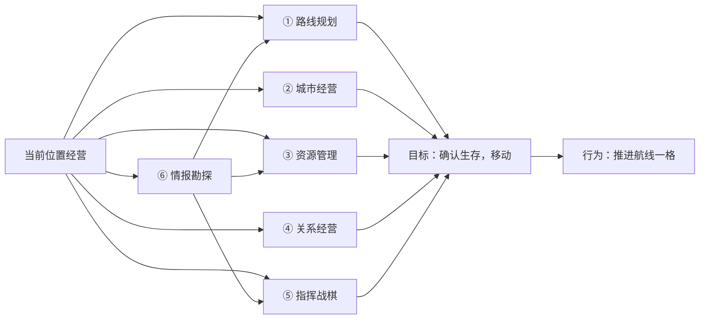
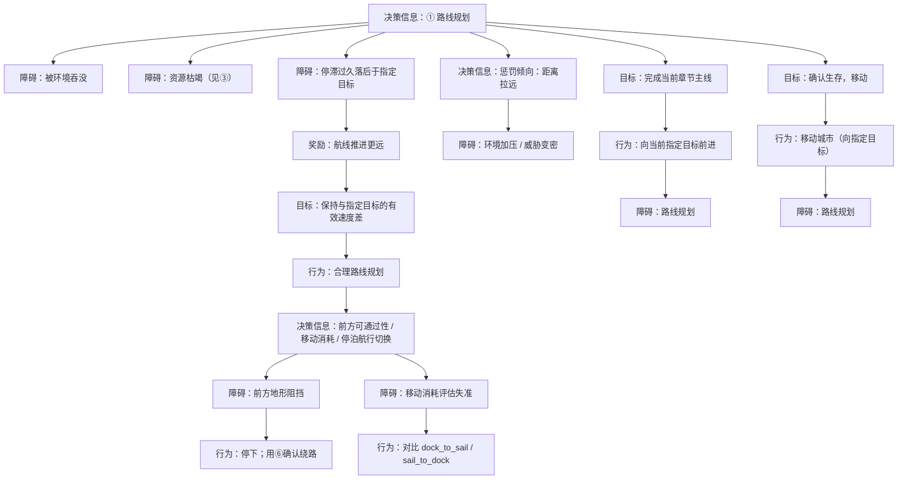
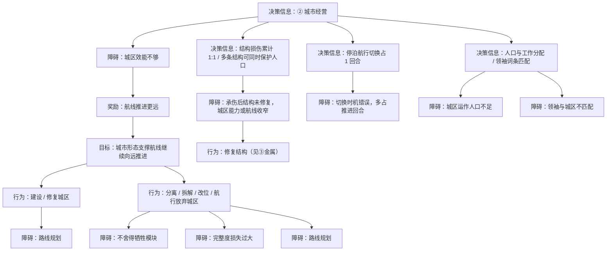
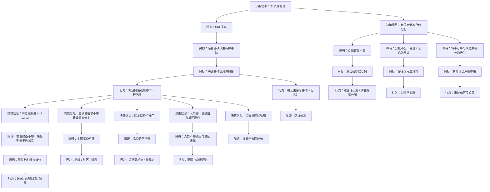
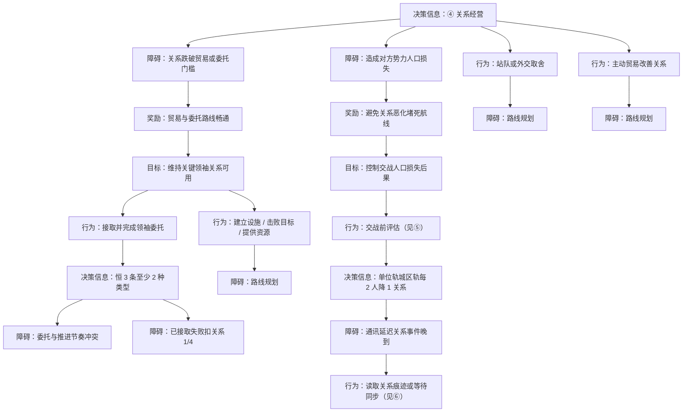
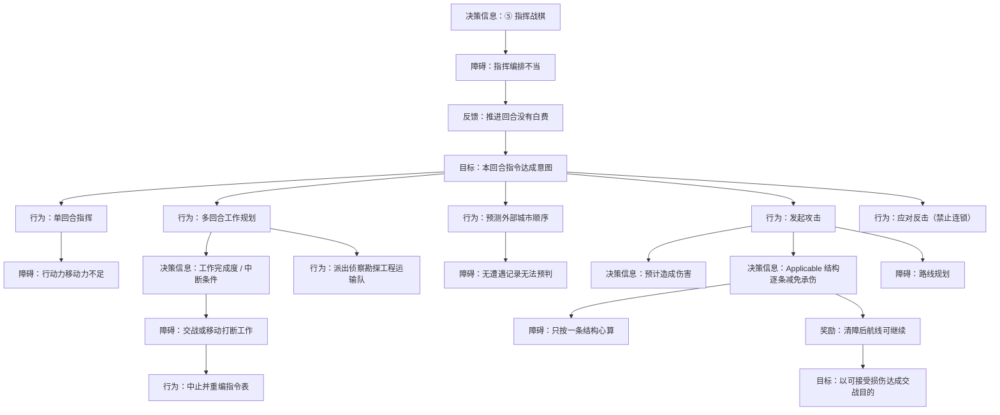
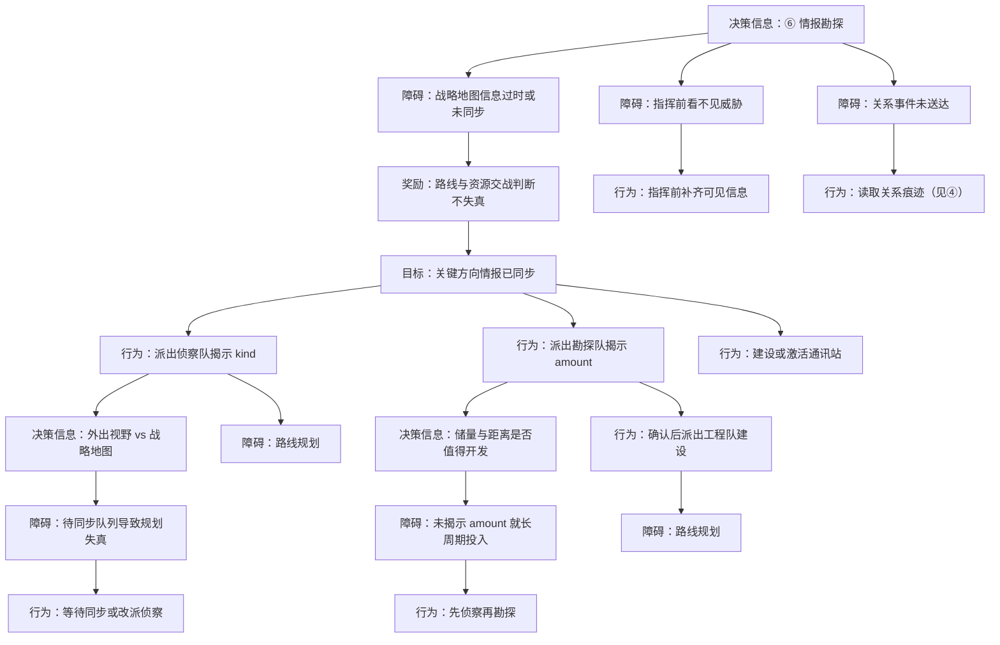

← [草稿](./README.md)

**校验状态**：待校验  
**最后更新**：2026-07-10  
**性质**：**《循光之城》玩家交互链（全篇）**（对标 [交互链参考-杀戮尖塔](./交互链参考-杀戮尖塔.md) 写法）；描述玩家心智中的目标 / 行为 / 障碍 / 奖励，**不是** [系统响应链](./交互链分析图.md)。  
**章节切片**：[第一、二章 · 指定目标为太阳](./交互链-循光之城-追日一二章.md) · [第三、四章 · 指定目标为渊光](./交互链-循光之城-追渊光三四章.md)  
**依据**：[核心幻想](../02-系统设计/01-核心体验/核心幻想.md)、[胜利条件](../02-系统设计/01-核心体验/胜利条件.md)、[核心循环](../02-系统设计/07-玩法循环/核心循环.md)、[章节划分与故事大纲](../04-设定/05-隐秘真相/章节划分与故事大纲.md)

# 交互链：循光之城

## 核心抽象

### 向指定目标前进（全章不变）

整条交互链**最上位只有一件事**：**向当前章节的指定目标前进**。第一至五章都围着它转；变的只是**指定目标是谁**、**卷轴朝向**，以及①块里挂的**章节里程碑**与**环境规则**（日照带 vs 全局暗渊）。

| 阶段 | 指定目标 | 卷轴方向 | 玩家心智 |
|------|----------|----------|----------|
| 第一、二章 | **太阳** | 向上 | 追日：跟上正在离去的光 |
| 第三、四章 | **渊光** | 向下 | 追渊光：深入暗渊朝指挥塔所在进发 |
| 第五章 | **指挥塔**（渊光城） | 向下 | 同一结构的终局段：向当前指定目标前进 |

**第一、二章追太阳**与**第三、四章追渊光**，在交互链上**没有本质区别**：都是「在当前位置经营 → 确认生存 → 向指定目标移动」。

### 六块（当前位置经营）

指 [核心循环 · 一轮活动循环](../02-系统设计/07-玩法循环/核心循环.md#一轮活动循环) 里这一段：**在当前位置经营 → 确认生存，移动**。城市**停泊**在座落地图格上时，玩家在下列六方面做判断；不是航行途中，也不是移动指令已下达之后。

为向指定目标前进，玩家在每次**当前位置经营**时，反复在六件事之间分配注意力；**不是**六个平行的系统目录，而是为**航线推进**服务的六个经营面：

| 块 | 玩家在判断什么 | 正向结果（默认语义） |
|----|----------------|----------------------|
| **① 路线规划** | 指定目标、停/走、消耗、前方可通过性 | **航线推进更远** |
| **② 城市经营** | 城区形态、模块取舍、运转人口、结构完整度 | **航线因城形态而可延续** |
| **③ 资源管理** | **储备够不够移动**；**仓储有限时，存哪、先给谁、仓库与队伍载荷怎么分**（非「四种资源平衡」） | **储备够且分得开，可以确认生存并移动** |
| **④ 关系经营** | 领袖关系、委托、站队、人口损失后果 | **路线不被关系堵死 / 贸易与委托可用** |
| **⑤ 指挥战棋** | 回合编排、多回合工作、交战发起与承伤心算 | **清障或控损后航线可继续** |
| **⑥ 情报勘探** | 地图揭示、储量、同步状态、威胁可见性 | **路线与资源/交战判断不失真** |

②～⑥块奖励/反馈默认仍指向 **航线推进**（关系块可同时写 **关系改善 / 避免崩盘**）。③块两层：**储备总量**够不够移动；**仓储容量有限**时，[资源存储分配](../02-系统设计/04-资源与人口/城市管理系统.md#资源存储分配)、城市仓库与队伍载荷分池、粮食 L1 L2 L3 等**怎么分**也是挑战。不写「四种资源都要平衡」。

### 战斗在六块之间的串联（已定）

**指挥战棋**发起造成伤害；**城市经营**承受结构承伤与损伤累计；**资源管理**承担修复代价；**关系经营**承接人口损失传导：

```
发起攻击 → 造成伤害（发起方逻辑已定）
  → 遍历每条 Applicable 结构：结构减免 → 结构承伤 → 该结构损伤累计（1:1）
  → 多条结构可同时保护同一人口；全部处理后的剩余伤害 → 人口损失
  → 资源管理：金属等修复；关系经营：单位轨/城区轨人口损失事件
```

玩法终局（指挥塔提速太阳）是第五章的**指定目标落地**，不替代上述抽象。

## 图例（与参考稿一致）

| 类型 | 含义 |
|------|------|
| **目标** | 玩家要达成什么 |
| **行为** | 玩家主动做什么 |
| **障碍** | 卡住、失败或需克服的状态 |
| **奖励** | 资源、情绪收益等较持久的正向结果 |
| **反馈** | 行为后的即时正向结果 |
| **决策信息** | 支撑判断的信息、分支与心算维度 |

> **硬性对照**：黑底语义 = **障碍**；黄底语义 = **行为**；不得互换。  
> **拓扑**：**只向下分散、不向下合并**——同一节点不得被多条上游边汇入；语义相同也各占独立节点。

---

## 全图：向指定目标前进 → 六块决策信息

> **最上层**（全章不变）：奖励 → **目标：向指定目标前进** → **行为：持续推进航线**。其下分出**六块**决策信息；①块展开指定目标与章节里程碑；②～⑥为**当前位置经营**时的六个判断面（拓扑：只分散不合并）。

```mermaid
flowchart TD
  T["循光之城交互链"]
  R["奖励：航线推进更远 / 章节推进 / 终局胜利快感"]
  G["目标：向指定目标前进"]
  A["行为：持续向当前章节目标推进航线"]
  T --> R --> G --> A

  A --> D_route["决策信息：① 路线规划<br/>指定目标 / 卷轴方向 / 与目标距离 / 停走与消耗"]
  A --> D_city["决策信息：② 城市经营<br/>城区形态与能力 / 分离与改位 / 结构完整度"]
  A --> D_res["决策信息：③ 资源管理<br/>四项储备 / 有限仓储与存储分配 / 周总结粮食"]
  A --> D_rel["决策信息：④ 关系经营<br/>领袖关系 / 委托 / 人口损失后果 / 站队"]
  A --> D_cmd["决策信息：⑤ 指挥战棋<br/>指令编排 / 多回合工作 / 交战发起与承伤"]
  A --> D_intel["决策信息：⑥ 情报勘探<br/>揭示等级 / 通讯同步 / 待同步队列"]

  %% ① 路线与指定目标（共用骨架）
  D_route --> O_s1["障碍：被环境吞没（脱离可生存带）"]
  D_route --> O_s2["障碍：资源枯竭"]
  O_s1 --> G_s1["目标：避免脱离可生存带过久"]
  O_s2 --> G_s2["目标：不因资源枯竭而中断航线"]
  D_route --> O_s3["障碍：未完成章节主线"]
  O_s3 --> R_s3["奖励：章节推进 / 解锁后续区域与叙事"]
  R_s3 --> G_s3["目标：完成当前章节主线"]
  G_s3 --> A_s3["行为：向当前指定目标前进"]

  A_s3 --> D_s3core["决策信息：与指定目标的相对距离 / 奖励与惩罚倾向"]
  D_s3core --> O_s3stall["障碍：停滞过久落后于目标"]
  O_s3stall --> R_s3close["奖励：奖励倾向（距离拉近 / 保持可生存带）"]
  R_s3close --> G_s3gap["目标：保持与指定目标的有效速度差"]
  G_s3gap --> A_s3rp1["行为：合理路线规划"]
  A_s3rp1 --> D_s3rp1["决策信息：游戏信息：前方可通过性 / 移动消耗"]
  D_s3rp1 --> O_s3rp1a["障碍：前方地形阻挡"]
  D_s3rp1 --> O_s3rp1b["障碍：移动消耗评估失准"]
  O_s3rp1a --> A_s3rp1a["行为：停下：用情报或勘探确认绕路"]
  O_s3rp1b --> A_s3rp1b["行为：（技巧）对比停泊与航行消耗"]
  D_s3core --> D_s3pen["决策信息：惩罚倾向：与指定目标距离拉远"]
  D_s3pen --> O_s3pen["障碍：环境加压 / 敌人更密集 / 资源更难获取"]
  O_s3pen --> F_s3pen["反馈：压迫感上升"]

  %% ① 指定目标：太阳（第一、二章）
  A_s3 --> D_tgt_sun["决策信息：指定目标：太阳（第一、二章 · 向上）"]
  D_tgt_sun --> D_s3sun["决策信息：游戏信息：光带向上推移 / 速度与太阳的速度差"]
  D_s3sun --> O_s3sun["障碍：第二章起速度差持续拉大"]
  O_s3sun --> F_s3sun["反馈：角速度章名的无力感"]
  D_tgt_sun --> O_ch1["障碍：未完成第一章主线"]
  O_ch1 --> G_ch1["目标：穿越铁门关"]
  G_ch1 --> A_ch1a["行为：突破无敌骄阳会封锁"]
  G_ch1 --> A_ch1b["行为：通过铁门关"]
  A_ch1a --> O_rp_ch1a["障碍：路线规划"]
  A_ch1b --> O_rp_ch1b["障碍：路线规划"]
  D_tgt_sun --> O_ch2["障碍：未完成第二章主线"]
  O_ch2 --> G_ch2["目标：抵达铁巢并获取第二颗骄阳之心"]
  G_ch2 --> A_ch2a["行为：荒地向上跋涉"]
  G_ch2 --> A_ch2k["行为：铁巢终局：对峙或攻城"]
  A_ch2a --> O_rp_ch2a["障碍：路线规划"]
  A_ch2k --> O_rp_ch2k["障碍：路线规划"]
  D_tgt_sun --> D_ch2end["决策信息：章末：指定目标由太阳切换为渊光"]
  D_ch2end --> O_ch2end["障碍：追日策略失效（指定目标即将更换）"]

  %% ① 指定目标：渊光（第三、四章）
  A_s3 --> D_tgt_yg["决策信息：指定目标：渊光（第三、四章 · 向下）"]
  D_tgt_yg --> D_s3yg["决策信息：游戏信息：全局暗渊带 / 太阳移动停用（第三章前期以后）"]
  D_s3yg --> O_s3yg["障碍：无日照梯度，压力来源切换"]
  O_s3yg --> A_s3yg1["行为：（技巧）多次游玩获取章节环境规则"]
  D_tgt_yg --> O_ch3["障碍：未完成第三章主线"]
  O_ch3 --> G_ch3["目标：反向入暗渊并向渊光进发"]
  G_ch3 --> A_ch3["行为：向下穿越荒地 / 铁门关返程段"]
  A_ch3 --> O_rp_ch3["障碍：路线规划"]
  D_tgt_yg --> O_ch4["障碍：未完成第四章主线"]
  O_ch4 --> G_ch4["目标：穿越日生之地回到玩家起点"]
  G_ch4 --> A_ch4a["行为：沿途救援或抉择是否救援濒危城市"]
  G_ch4 --> A_ch4b["行为：道德抉择：分物资 / 接纳 / 直接离开"]
  A_ch4a --> O_rp_ch4a["障碍：路线规划"]
  A_ch4b --> D_ch4b["决策信息：游戏信息：救援负担 vs 人口与资源"]
  D_ch4b --> O_ch4b["障碍：救不了每一座城市的心理负担"]

  %% ① 指定目标：指挥塔（第五章 · 终局）
  A_s3 --> D_tgt_end["决策信息：指定目标：指挥塔（第五章 · 渊光城终局）"]
  D_tgt_end --> G_end["目标：抵达指挥塔，集齐骄阳之心并提速太阳"]
  G_end --> A_end["行为：完成终局仪式"]
  A_end --> O_rp_end["障碍：路线规划"]

  %% ② 城市经营
  D_city --> O_c1["障碍：城市形态规划不合理：模块过多 / 模块过少 / 布局不适配"]
  O_c1 --> R_c1["奖励：航线推进更远 / 模块重组带来的航程余量"]
  R_c1 --> G_c1["目标：城市形态支撑航线继续向远推进"]
  R_c1 --> G_c1 --> A_c1["行为：获得一套能支撑航线继续向远推进的城区组合"]
  A_c1 --> D_cdeck["决策信息：关键城区未建成<br/>负载成本过高<br/>能源账单压垮预算<br/>分离后完整度损失<br/>停泊改位占用多回合"]
  D_cdeck --> O_cdeck["障碍：城区效能不够：关键能力缺失 / 负载过高 / 能源周转不足 / 完整度不足"]
  O_cdeck --> R_cd1["奖励：城区效能上升，航线可推进更远，取舍代价降低"]
  R_cd1 --> G_cd1["目标：补足关键城区能力"]
  O_cdeck --> R_cd2["奖励：航线推进更远（狭窄段通过后可达航程延长）"]
  R_cd2 --> G_cd2["目标：缩小 footprint 以延续航线"]
  O_cdeck --> R_cd3["奖励：能源与金属周转改善，长期运转压力下降"]
  R_cd3 --> G_cd3["目标：降低城区运转账单"]
  O_cdeck --> R_cd4["奖励：模块联动增强（领袖城区 + 特殊城区）"]
  R_cd4 --> G_cd4["目标：获得协同城区组合"]

  G_cd1 --> A_cd1a["行为：建设一般城区设施"]
  G_cd1 --> A_cd1b["行为：修复破损城区"]
  A_cd1a --> D_cd1a1["决策信息：金属 / 人口不够执行建设"]
  D_cd1a1 --> O_cd1a1["障碍：资源不足"]
  O_cd1a1 --> R_cd1a1["奖励：付得起建设代价，航线不因缺料停滞"]
  R_cd1a1 --> G_cd1a1["目标：获得足够金属与人口"]
  G_cd1a1 --> A_cd1a1a["行为：补足资源储备（见③）"]
  G_cd1a1 --> A_cd1a1b["行为：派出勘探确认建设位置（见⑥）"]
  A_cd1a1a --> O_rp_cd1a1a["障碍：路线规划"]
  A_cd1a1b --> O_rp_cd1a1b["障碍：路线规划"]

  G_cd2 --> A_cd2a["行为：分离城区（停泊多回合）"]
  G_cd2 --> A_cd2b["行为：拆解结构回收金属"]
  G_cd2 --> A_cd2c["行为：航行放弃城区（即时执行）"]
  A_cd2a --> D_cd2a["决策信息：分离完整度代价可接受"]
  D_cd2a --> O_cd2a["障碍：不舍得牺牲模块"]
  A_cd2b --> D_cd2b["决策信息：拆解后产能损失可接受"]
  D_cd2b --> O_cd2b["障碍：拆解后短期产能下降"]
  A_cd2c --> D_cd2c["决策信息：放弃城区各减 30% 至 50% 完整度"]
  D_cd2c --> O_cd2c["障碍：完整度损失过大"]
  G_cd2 --> A_cd2d["行为：城区改位（仅停泊，3 至 5 回合地基预占）"]
  A_cd2d --> O_rp_cd2d["障碍：路线规划"]

  G_cd3 --> A_cd3a["行为：切换停泊：关闭高耗能城区能力"]
  G_cd3 --> A_cd3b["行为：优化人口与工作分配"]
  A_cd3a --> O_rp_cd3a["障碍：路线规划"]
  A_cd3b --> O_rp_cd3b["障碍：路线规划"]

  G_cd4 --> A_cd4a["行为：招募领袖并任职城区"]
  G_cd4 --> A_cd4b["行为：连接新城区模块"]
  A_cd4a --> D_cd4a["决策信息：游戏信息：领袖词条与城区匹配"]
  D_cd4a --> O_cd4a["障碍：领袖与城区不匹配"]
  A_cd4b --> O_rp_cd4b["障碍：路线规划"]

  A_c1 --> D_cdock["决策信息：停泊与航行切换占 1 回合 / 航行禁止占格建设"]
  D_cdock --> O_cdock["障碍：切换时机错误：多占推进回合"]
  O_cdock --> A_cdock1["行为：提前规划 dock_to_sail / sail_to_dock"]
  A_c1 --> D_cstruct["决策信息：结构损伤累计（与人口同单位 1:1）/ 承伤后完整度"]
  D_cstruct --> O_cstruct["障碍：结构未修复导致城区能力或航线收窄"]
  O_cstruct --> A_crepair["行为：花费金属等修复结构（见③）"]
  A_c1 --> O_c1luck["障碍：运气不好"]

  %% ③ 资源管理（储备 + 仓储分配）
  D_res --> O_r1["障碍：储备不够（走不了 / 走了会崩）"]
  O_r1 --> R_r1["奖励：储备够确认生存并移动"]
  R_r1 --> G_r1["目标：凑够移动前资源储备"]
  G_r1 --> A_r1["行为：补足储备或攒够下一程消耗"]

  D_res --> D_store["决策信息：有限仓储：资源存储分配 / 城市仓库与队伍载荷"]
  D_store --> O_store1["障碍：仓储容量不够，攒不下"]
  D_store --> O_store2["障碍：总量够但分配不当：错仓取不到 / 充饥优先级配错"]
  D_store --> O_store3["障碍：城市仓库与队伍载荷分池取舍失当"]
  O_store1 --> G_store1["目标：腾出或扩建仓储"]
  G_store1 --> A_store1["行为：建仓储设施 / 调整资源存储分配"]
  O_store2 --> G_store2["目标：存储职责与当下用途对齐"]
  G_store2 --> A_store2["行为：运输队调拨 / 装货卸货"]
  O_store3 --> G_store3["目标：远征载荷与主城仓库各够用"]
  G_store3 --> A_store3["行为：重分载荷与仓库分池"]
  A_store1 --> O_rp_store1["障碍：路线规划"]
  A_store2 --> O_rp_store2["障碍：路线规划"]
  A_store3 --> O_rp_store3["障碍：路线规划"]

  A_r1 --> D_food["决策信息：周总结前粮食库存 / L1 L2 L3 分配预期"]
  D_food --> O_food["障碍：粮食储备不够：未分到者半数减员"]
  O_food --> R_food["奖励：人口稳定 / 航线可继续"]
  R_food --> G_food["目标：周总结时粮食够分"]
  G_food --> A_food1["行为：停泊后建设果园 / 矿区 / 能源站"]
  G_food --> A_food2["行为：运输队补给回流主城"]
  G_food --> A_food3["行为：前往据点贸易（见④关系门槛）"]
  A_food1 --> O_rp_food1["障碍：路线规划"]
  A_food2 --> O_rp_food2["障碍：路线规划"]
  A_food3 --> O_rp_food3["障碍：路线规划"]
  A_food3 --> D_food3["决策信息：贸易门槛与领袖关系（见④）"]
  D_food3 --> O_food3["障碍：关系不足无法贸易"]
  O_food3 --> O_rp_food3b["障碍：路线规划"]

  A_r1 --> D_metal["决策信息：金属够不够建设 / 分离 / 修复结构"]
  D_metal --> O_metal["障碍：金属储备不够"]
  O_metal --> A_metal1["行为：拆解回收 / 矿区开发 / 贸易"]
  A_metal1 --> O_rp_metal1["障碍：路线规划"]

  A_r1 --> D_energy["决策信息：能源账单能否支撑城区能力与设施"]
  D_energy --> O_energy["障碍：能源储备不够"]
  O_energy --> A_energy1["行为：关闭高耗能能力 / 建设能源站"]
  A_energy1 --> O_rp_energy1["障碍：路线规划"]

  A_r1 --> D_pop["决策信息：人口够不够编组 / 城区运作 / 减员后工作停摆"]
  D_pop --> O_pop["障碍：人口不够编组与城区运作"]
  O_pop --> A_pop1["行为：征兵办 / 据点招募 / 接纳（见④关系代价）"]
  A_pop1 --> O_rp_pop1["障碍：路线规划"]

  A_r1 --> D_wild["决策信息：荒野设施投资能否在离开前回收"]
  D_wild --> O_wild["障碍：设施带不走：投资回收期过长"]
  O_wild --> A_wild1["行为：缩短开发周期或放弃占格建设"]
  A_wild1 --> O_rp_wild1["障碍：路线规划"]

  A_r1 --> D_move["决策信息：确认生存后移动"]
  D_move --> G_move["目标：确认生存，移动"]
  G_move --> A_move["行为：移动城市至新位置（向当前指定目标）"]
  A_move --> O_rp_move["障碍：路线规划"]

  %% ④ 关系经营
  D_rel --> O_rel1["障碍：领袖关系跌破贸易或委托门槛"]
  O_rel1 --> R_rel1["奖励：委托与贸易路线保持畅通"]
  R_rel1 --> G_rel1["目标：维持关键领袖关系可用"]
  G_rel1 --> A_rel1["行为：接取并完成领袖委托"]
  A_rel1 --> D_rel1a["决策信息：恒 3 条委托至少 2 种类型 / 奖励 +10～+20"]
  D_rel1a --> O_rel1a["障碍：委托与当前推进节奏冲突"]
  D_rel1a --> O_rel1b["障碍：已接取失败扣关系（奖励量 1/4）"]

  D_rel --> O_rel2["障碍：造成对方势力人口损失"]
  O_rel2 --> R_rel2["奖励：避免关系恶化导致的航线收窄"]
  R_rel2 --> G_rel2["目标：控制交战人口损失后果"]
  G_rel2 --> A_rel2["行为：交战前评估关系代价（见⑤承伤链）"]
  A_rel2 --> D_rel2a["决策信息：单位轨 / 城区轨分轨累计（每 2 人降 1 关系）"]
  D_rel2a --> O_rel2a["障碍：通讯延迟导致关系事件晚到"]

  D_rel --> A_rel3["行为：站队或外交取舍（章节切片展开）"]
  A_rel3 --> O_rp_rel3["障碍：路线规划"]

  %% ⑤ 指挥战棋
  D_cmd --> O_cmd1["障碍：指挥编排不当：行动表顺序 / 移动力浪费"]
  O_cmd1 --> F_cmd1["反馈：工作效率更高 / 伤亡更可控 / 推进回合没有白费"]
  F_cmd1 --> G_cmd1["目标：本回合指令达成意图"]
  G_cmd1 --> A_cmd1["行为：单回合指挥：编辑指令表与行动表"]
  G_cmd1 --> A_cmd2["行为：多回合工作规划"]
  G_cmd1 --> A_cmd3["行为：预测外部城市行动顺序（game_seed）"]

  A_cmd1 --> G_cmd1b["目标：想做的事情不让做"]
  G_cmd1b --> O_cmd1b["障碍：行动力 / 移动力不足"]

  A_cmd2 --> D_cmd2b["决策信息：任务中断：意外打断 / 行动打断 / 交战打断"]
  D_cmd2b --> O_cmd2b["障碍：跨回合工作被交战或移动打断"]
  O_cmd2b --> A_cmd2c["行为：主动中止并重编指令表"]

  G_cmd1 --> A_cmd4["行为：发起攻击"]
  A_cmd4 --> D_cmd4a["决策信息：预计造成伤害（发起方逻辑）"]
  D_cmd4a --> O_cmd4a["障碍：算不清造成伤害与承伤结果"]
  A_cmd4 --> D_cmd4b["决策信息：Applicable 结构有几条 / 逐条减免与承伤后剩余伤害"]
  D_cmd4b --> D_cmd4c["决策信息：多条结构可同时保护人口；各结构损伤累计 1:1"]
  D_cmd4c --> O_cmd4d["障碍：只按一条结构心算承伤"]
  D_cmd4c --> R_cmd4["奖励：清障后航线可继续推进"]
  R_cmd4 --> G_cmd4["目标：以可接受损伤达成交战目的"]
  G_cmd4 --> O_rp_cmd4["障碍：路线规划"]

  A_cmd2 --> D_cmd2a["决策信息：工作完成度 / 工作效率 Attribute"]
  D_cmd2a --> O_cmd2a["障碍：跨回合工作进度判断失准"]
  O_cmd2a --> A_cmd2e["行为：派出工程队 / 运输队执行多回合工作"]

  A_cmd3 --> D_cmd3a["决策信息：外部城市本回合行动顺序（game_seed）"]
  D_cmd3a --> O_cmd3a["障碍：无遭遇记录，无法预判 AI 行动"]
  O_cmd3a --> A_cmd3b["行为：（技巧）同种子复现记忆顺序"]

  G_cmd1 --> A_cmd5["行为：应对反击（禁止连锁）"]
  A_cmd5 --> D_cmd5a["决策信息：反击同样走造成伤害 → 受到伤害"]
  D_cmd5a --> O_rp_cmd5["障碍：路线规划"]

  %% ⑥ 情报勘探
  D_intel --> O_intel1["障碍：战略地图信息过时或未同步"]
  O_intel1 --> R_intel1["奖励：路线与资源/交战判断不失真"]
  R_intel1 --> G_intel1["目标：关键方向情报已同步"]
  G_intel1 --> A_intel1["行为：派出侦察队（揭示种类 kind）"]
  G_intel1 --> A_intel2["行为：派出勘探队（揭示储量 amount）"]
  G_intel1 --> A_intel3["行为：建设通讯站（触发式视野）"]

  A_intel1 --> D_intel1a["决策信息：外出视野 vs 主城战略地图"]
  D_intel1a --> O_intel1a["障碍：待同步队列：基于旧信息规划路线"]
  O_intel1a --> A_intel1a["行为：等待同步或改派侦察"]

  A_intel2 --> D_intel2a["决策信息：资源点储量与距离是否值得开发"]
  D_intel2a --> O_intel2a["障碍：未揭示储量就投入建设"]
  O_intel2a --> O_rp_intel2a["障碍：路线规划"]

  D_intel --> O_intel2["障碍：单回合指挥看不见威胁或目标"]
  O_intel2 --> A_intel4["行为：在指挥前补齐本回合可见信息"]

  A_intel3 --> D_intel3a["决策信息：通讯站覆盖 / 触发式主动视野"]
  D_intel3a --> O_intel3a["障碍：未建通讯站，关系事件与情报延迟"]
  O_intel3a --> A_intel3b["行为：激活通讯站城区能力"]

  D_intel --> O_intel3["障碍：关系事件在待同步队列未送达"]
  O_intel3 --> A_intel5["行为：读取关系痕迹或等待同步（见④）"]

  A_intel2 --> A_intel2b["行为：派出工程队建设（储量确认后）"]
  A_intel2b --> O_rp_intel2b["障碍：路线规划"]

  D_intel --> D_intel6a["决策信息：揭示等级 kind 与 amount 分工"]
  D_intel6a --> O_intel6a["障碍：只有 kind 没有 amount 就投入长周期开发"]
  O_intel6a --> A_intel6a["行为：先侦察再勘探"]
```



---

## 六大板块详图

> 下列六节与全图 mermaid **同构但更完整**；每节可单独阅读。拓扑仍为 **只分散不合并**。

### 当前位置经营：六块如何闭合



| 输入 | 六块分工 |
|------|----------|
| **⑥ → ①** | 情报同步后才知道往哪走、能否通过 |
| **⑥ → ③** | 揭示储量后才值得付建设代价 |
| **⑥ → ⑤** | 指挥前看见威胁与目标 |
| **② → ③** | 建设 / 修复消耗金属与能源 |
| **⑤ → ②③④** | 交战承伤 → 修复 / 关系后果 |
| **③ → ①** | 储备够且分得开，才能确认生存并移动 |

---

### ① 路线规划

**玩家在判断**：指定目标是谁、停还是走、本段消耗、前方是否可通过、是否落后于目标。

| 决策信息（一块） | 停走与消耗 / 与目标距离 / 环境奖惩 / 章节里程碑 |
|------------------|--------------------------------------------------|



章节里程碑（太阳 / 渊光 / 指挥塔）见全图 mermaid ① 块分支；切片见 [追日一二章](./交互链-循光之城-追日一二章.md)、[追渊光三四章](./交互链-循光之城-追渊光三四章.md)。

---

### ② 城市经营

**玩家在判断**：城区形态能否支撑下一程、舍不舍得牺牲模块、结构损伤后还能不能走、运转人口够不够。

| 决策信息（一块） | 关键城区 / 负载成本 / 能源账单 / 分离与改位 / 结构承伤 |
|------------------|--------------------------------------------------------|



---

### ③ 资源管理

**玩家在判断**（两层，缺一不可）：

1. **储备总量**：粮食、金属、能源、人口**加起来够不够**撑到「确认生存，移动」，哪一项会先不够。  
2. **仓储分配**：容量有限时，**存哪座仓、先给谁吃、远征队载荷与主城仓库怎么分**——总量够也可能因分得不对而用不上（见 [城市管理系统 · 资源存储分配](../02-系统设计/04-资源与人口/城市管理系统.md#资源存储分配)）。

**不是**四项要一样多；是**储备 + 分配**两道关。

| 决策信息（一块） | 四项储备 / 仓储容量 / 存储分配 / L1 L2 L3 / 队伍载荷分池 |
|------------------|--------------------------------------------------------|



---

### ④ 关系经营

**玩家在判断**：委托接不接、贸易门槛、开战人口损失后果、站队取舍。

| 决策信息（一块） | 委托池 / 人口损失分轨 / 贸易 / 站队 / 关系痕迹 |
|------------------|-----------------------------------------------|



---

### ⑤ 指挥战棋

**玩家在判断**：本回合行动顺序、多回合工作会不会被打断、造成伤害与多结构承伤后还剩多少人口。

| 决策信息（一块） | 指令表 / 行动表 / 工作完成度 / 交战承伤 / 外部城市顺序 |
|------------------|------------------------------------------------------|



交战程序口径：[交战系统 · 造成伤害 / 受到伤害](../02-系统设计/06-单位与交战/交战系统.md#战斗结算当前版本)。

---

### ⑥ 情报勘探

**玩家在判断**：战略地图是否过时、kind / amount 是否够做决策、通讯是否覆盖、指挥前能否看见威胁。

| 决策信息（一块） | 侦察 kind / 勘探 amount / 通讯站 / 待同步队列 / 关系痕迹 |
|------------------|-----------------------------------------------------------|



系统依据：[单位类型与视野](../02-系统设计/06-单位与交战/单位类型与视野.md)、[通讯与视野系统](../02-系统设计/06-单位与交战/通讯与视野系统.md)。

---


### 六块决策信息（附属于「持续向当前章节目标推进航线」）

| 顺序 | 块 | 玩家在判断什么 | 拼接下游（摘要） |
|------|-----|----------------|------------------|
| ① | **路线规划** | 指定目标、停走、消耗、章节里程碑 | 共用骨架 → 太阳 / 渊光 / 指挥塔三路 |
| ② | **城市经营** | 形态、模块取舍、结构完整度 | 城区效能 → 航线可延续；承伤与修复 |
| ③ | **资源管理** | **储备 + 仓储分配** | 总量 / 存储分配 / 载荷分池 → 确认生存，移动 |
| ④ | **关系经营** | 委托、人口损失、站队 | 关系门槛 → 交战后果 |
| ⑤ | **指挥战棋** | 回合编排、工作、交战 | 发起伤害 → 结构承伤 → 清障 |
| ⑥ | **情报勘探** | 揭示、同步、可见性 | 侦察 / 勘探 / 通讯站 / 待同步队列 |

### 各区段摘要

| 区段 | 摘要 |
|------|------|
| **最上层** | **向指定目标前进** → **持续推进航线** → 分出**六块** |
| **①** | 指定目标与章节里程碑（太阳 / 渊光 / 指挥塔） |
| **②～⑥** | 当前位置经营六面；全章同构；奖励默认指向航线更远 |
| **⑤↔②③④** | 交战：造成伤害 → 结构承伤/人口 → 修复/关系 |
| **⑥→①③⑤** | 情报为路线、资源、指挥提供决策输入 |
| **拓扑** | `O_rp_*` 各支独立，不向下合并 |

### 章节切片

| 切片 | 指定目标 | 文档 |
|------|----------|------|
| 第一、二章 | 太阳 | [交互链-循光之城-追日一二章](./交互链-循光之城-追日一二章.md) |
| 第三、四章 | 渊光 | [交互链-循光之城-追渊光三四章](./交互链-循光之城-追渊光三四章.md) |

---

## 与参考稿、系统链的对照

| 杀戮尖塔（参考） | 循光之城（本作） |
|------------------|------------------|
| 击败最后 BOSS | 向指定目标前进 → 推进航线 |
| 构筑与地图知识 | ① 路线规划 + ⑥ 情报勘探 |
| 打牌技巧 | ⑤ 指挥战棋（含交战承伤链） |
| 牌组构筑 | ② 城市经营 |
| 血量 / 遗物 | ③ 资源管理（储备 + 仓储分配） |
| （事件房间外交） | ④ 关系经营 |

| 文档 | 用途 |
|------|------|
| [交互链参考-杀戮尖塔](./交互链参考-杀戮尖塔.md) | 竞品参考：图例与拓扑写法 |
| 本文 | **本作玩家交互链（全篇 · 向指定目标前进 + 六块）** |
| [交互链-循光之城-追日一二章](./交互链-循光之城-追日一二章.md) | 切片：指定目标 = 太阳 |
| [交互链-循光之城-追渊光三四章](./交互链-循光之城-追渊光三四章.md) | 切片：指定目标 = 渊光 |
| [交互链分析图](./交互链分析图.md) | 系统响应链 |
| [游戏流程详情图](./游戏流程详情图.md) | 机制分解 |

## 待补

- [x] 六大板块详图（主文档 `## 六大板块详图`）
- [ ] 章节切片 ②～⑥ 独立 mermaid（当前以引用全篇详图 + 章节特异表为主）
- [ ] 骄阳之心收集子链
- [ ] 移动前资源储备阈值数值化（对齐核心循环 D-38）
- [ ] 交战承伤公式与交互链节点一一对照（见 [交战系统 · 受到伤害](../02-系统设计/06-单位与交战/交战系统.md#受到伤害遭受方-已定)）
- [ ] 非交战结构损伤是否并入同一累计池（待设计裁定）
