← [草稿](./README.md)

**校验状态**：待校验  
**最后更新**：2026-07-09  
**性质**：**《循光之城》玩家交互链（全篇）**（对标 [交互链参考-杀戮尖塔](./交互链参考-杀戮尖塔.md) 写法）；描述玩家心智中的目标 / 行为 / 障碍 / 奖励，**不是** [系统响应链](./交互链分析图.md)。  
**章节切片**：[第一、二章 · 指定目标为太阳](./交互链-循光之城-追日一二章.md) · [第三、四章 · 指定目标为渊光](./交互链-循光之城-追渊光三四章.md)  
**依据**：[核心幻想](../02-系统设计/01-核心体验/核心幻想.md)、[胜利条件](../02-系统设计/01-核心体验/胜利条件.md)、[核心循环](../02-系统设计/07-玩法循环/核心循环.md)、[章节划分与故事大纲](../04-设定/05-隐秘真相/章节划分与故事大纲.md)

# 交互链：循光之城

## 核心抽象

交互链**最远的目的**只有一个：**向指定目标前进**。

| 阶段 | 指定目标 | 卷轴方向 | 玩家心智 |
|------|----------|----------|----------|
| 第一、二章 | **太阳** | 向上 | 追日：跟上正在离去的光 |
| 第三、四章 | **渊光** | 向下 | 追渊光：深入暗渊朝指挥塔所在进发 |
| 第五章 | **指挥塔**（渊光城） | 向下 | 同一结构的终局段：向当前指定目标前进 |

**第一、二章追太阳**与**第三、四章追渊光**，在交互链上**没有本质区别**：都是「在当前位置经营 → 确认生存 → 向指定目标移动」；变化的只是**指定目标是谁**、**卷轴朝向**、以及①块里挂载的**章节里程碑**与**环境规则口径**（日照带 vs 全局暗渊）。②城市取舍、③资源生存、④指挥规划四块**全章共用**。

玩法终局（指挥塔提速太阳）是第五章的**指定目标落地**，不替代上述抽象。

## 图例（与参考稿一致）

| 类型 | 含义 |
|------|------|
| **目标** | 玩家要达成什么 |
| **行为** | 玩家主动做什么 |
| **障碍** | 卡住、失败或需克服的状态 |
| **奖励** | 资源、情绪收益等较持久的正向结果 |
| **反馈** | 行为后的即时正向结果 |
| **决策信息** | 支撑判断的信息、分支与心算维度 |

> **硬性对照**：黑底语义 = **障碍**；黄底语义 = **行为**；不得互换。  
> **拓扑**：**只向下分散、不向下合并**——同一节点不得被多条上游边汇入；语义相同也各占独立节点。

---

## 全图：向指定目标前进 → 四块决策信息

> 末级 **行为** `持续向当前章节目标前进` 下挂四块决策信息；①块先展开**共用骨架**，再分出**指定目标：太阳 / 渊光**两路章节差异（不向下合并）。

```mermaid
flowchart TD
  T["循光之城交互链"]
  R["奖励：靠近指定目标时的从容感 / 章节推进 / 终局胜利快感"]
  G["目标：向指定目标前进"]
  A["行为：持续向当前章节目标前进"]
  T --> R --> G --> A

  A --> D_route["决策信息：当前章节指定目标是谁 / 沿卷轴方向前进<br/>与目标的相对距离影响奖惩 / 停滞会落后"]
  A --> D_city["决策信息：城市形态能通过前方地形 / 舍得牺牲模块<br/>停泊与航行切换时机正确"]
  A --> D_res["决策信息：四种资源平衡 / 周总结粮食够分<br/>移动前生存线达标"]
  A --> D_cmd["决策信息：多回合工作能按时完成 / 情报同步及时<br/>委托与危机可并行处理"]

  %% ① 路线与指定目标（共用骨架）
  D_route --> O_s1["障碍：被环境吞没（脱离可生存带）"]
  D_route --> O_s2["障碍：资源枯竭"]
  O_s1 --> G_s1["目标：避免脱离可生存带过久"]
  O_s2 --> G_s2["目标：维持四种资源不枯竭"]
  D_route --> O_s3["障碍：未完成章节主线"]
  O_s3 --> R_s3["奖励：章节推进 / 解锁后续区域与叙事"]
  R_s3 --> G_s3["目标：完成当前章节主线"]
  G_s3 --> A_s3["行为：向当前指定目标前进"]

  A_s3 --> D_s3core["决策信息：与指定目标的相对距离 / 奖励与惩罚倾向"]
  D_s3core --> O_s3stall["障碍：停滞过久落后于目标"]
  O_s3stall --> R_s3close["奖励：奖励倾向（距离拉近 / 保持可生存带）"]
  R_s3close --> G_s3gap["目标：保持与指定目标的有效速度差"]
  G_s3gap --> A_s3rp1["行为：合理路线规划"]
  A_s3rp1 --> D_s3rp1["决策信息：游戏信息：前方可通过性 / 移动消耗"]
  D_s3rp1 --> O_s3rp1a["障碍：前方地形阻挡"]
  D_s3rp1 --> O_s3rp1b["障碍：移动消耗评估失准"]
  O_s3rp1a --> A_s3rp1a["行为：停下交互：勘探绕路"]
  O_s3rp1b --> A_s3rp1b["行为：（技巧）对比停泊与航行消耗"]
  D_s3core --> D_s3pen["决策信息：惩罚倾向：与指定目标距离拉远"]
  D_s3pen --> O_s3pen["障碍：环境加压 / 敌人更密集 / 资源更难获取"]
  O_s3pen --> F_s3pen["反馈：压迫感上升"]

  %% ① 指定目标：太阳（第一、二章）
  A_s3 --> D_tgt_sun["决策信息：指定目标：太阳（第一、二章 · 向上）"]
  D_tgt_sun --> D_s3sun["决策信息：游戏信息：光带向上推移 / 速度与太阳的速度差"]
  D_s3sun --> O_s3sun["障碍：第二章起速度差持续拉大"]
  O_s3sun --> F_s3sun["反馈：角速度章名的无力感"]
  D_tgt_sun --> O_ch1["障碍：未完成第一章主线"]
  O_ch1 --> G_ch1["目标：穿越铁门关"]
  G_ch1 --> A_ch1a["行为：突破无敌骄阳会封锁"]
  G_ch1 --> A_ch1b["行为：通过铁门关"]
  A_ch1a --> O_rp_ch1a["障碍：路线规划"]
  A_ch1b --> O_rp_ch1b["障碍：路线规划"]
  D_tgt_sun --> O_ch2["障碍：未完成第二章主线"]
  O_ch2 --> G_ch2["目标：抵达铁巢并获取第二颗骄阳之心"]
  G_ch2 --> A_ch2a["行为：荒地向上跋涉"]
  G_ch2 --> A_ch2k["行为：铁巢终局：对峙或攻城"]
  A_ch2a --> O_rp_ch2a["障碍：路线规划"]
  A_ch2k --> O_rp_ch2k["障碍：路线规划"]
  D_tgt_sun --> D_ch2end["决策信息：章末：指定目标由太阳切换为渊光"]
  D_ch2end --> O_ch2end["障碍：追日策略失效（指定目标即将更换）"]

  %% ① 指定目标：渊光（第三、四章）
  A_s3 --> D_tgt_yg["决策信息：指定目标：渊光（第三、四章 · 向下）"]
  D_tgt_yg --> D_s3yg["决策信息：游戏信息：全局暗渊带 / 太阳移动停用（第三章前期以后）"]
  D_s3yg --> O_s3yg["障碍：无日照梯度，压力来源切换"]
  O_s3yg --> A_s3yg1["行为：（技巧）多次游玩获取章节环境规则"]
  D_tgt_yg --> O_ch3["障碍：未完成第三章主线"]
  O_ch3 --> G_ch3["目标：反向入暗渊并向渊光进发"]
  G_ch3 --> A_ch3["行为：向下穿越荒地 / 铁门关返程段"]
  A_ch3 --> O_rp_ch3["障碍：路线规划"]
  D_tgt_yg --> O_ch4["障碍：未完成第四章主线"]
  O_ch4 --> G_ch4["目标：穿越日生之地回到玩家起点"]
  G_ch4 --> A_ch4a["行为：沿途救援或抉择是否救援濒危城市"]
  G_ch4 --> A_ch4b["行为：道德抉择：分物资 / 接纳 / 直接离开"]
  A_ch4a --> O_rp_ch4a["障碍：路线规划"]
  A_ch4b --> D_ch4b["决策信息：游戏信息：救援负担 vs 人口与资源"]
  D_ch4b --> O_ch4b["障碍：救不了每一座城市的心理负担"]

  %% ① 指定目标：指挥塔（第五章 · 终局）
  A_s3 --> D_tgt_end["决策信息：指定目标：指挥塔（第五章 · 渊光城终局）"]
  D_tgt_end --> G_end["目标：抵达指挥塔，集齐骄阳之心并提速太阳"]
  G_end --> A_end["行为：完成终局仪式"]
  A_end --> O_rp_end["障碍：路线规划"]

  %% ② 城市形态与取舍
  D_city --> O_c1["障碍：城市形态规划不合理：模块过多 / 模块过少 / 布局不适配"]
  O_c1 --> R_c1["奖励：通过地形的成就感 / 模块重组后的新能力"]
  R_c1 --> G_c1["目标：城市 footprint 适配前方地形"]
  R_c1 --> G_c1 --> A_c1["行为：获得一套能通过当前地形的城区组合"]
  A_c1 --> D_cdeck["决策信息：关键城区未建成<br/>负载成本过高<br/>能源账单压垮预算<br/>分离后完整度损失<br/>停泊改位占用多回合"]
  D_cdeck --> O_cdeck["障碍：城区效能不够：关键能力缺失 / 负载过高 / 能源周转不足 / 完整度不足"]
  O_cdeck --> R_cd1["奖励：城区效能上升，行进更顺畅，取舍代价降低"]
  R_cd1 --> G_cd1["目标：补足关键城区能力"]
  O_cdeck --> R_cd2["奖励：通过狭窄地形，解锁新路线"]
  R_cd2 --> G_cd2["目标：缩小 footprint 或通过窄道"]
  O_cdeck --> R_cd3["奖励：能源与金属周转改善，长期运转压力下降"]
  R_cd3 --> G_cd3["目标：降低城区运转账单"]
  O_cdeck --> R_cd4["奖励：模块联动增强（领袖城区 + 特殊城区）"]
  R_cd4 --> G_cd4["目标：获得协同城区组合"]

  G_cd1 --> A_cd1a["行为：建设一般城区设施"]
  G_cd1 --> A_cd1b["行为：修复破损城区"]
  A_cd1a --> D_cd1a1["决策信息：金属 / 人口不够执行建设"]
  D_cd1a1 --> O_cd1a1["障碍：资源不足"]
  O_cd1a1 --> R_cd1a1["奖励：资源充裕 / 行为自由"]
  R_cd1a1 --> G_cd1a1["目标：获得足够金属与人口"]
  G_cd1a1 --> A_cd1a1a["行为：解决资源与补给"]
  G_cd1a1 --> A_cd1a1b["行为：收集情报与线索"]
  A_cd1a1a --> O_rp_cd1a1a["障碍：路线规划"]
  A_cd1a1b --> O_rp_cd1a1b["障碍：路线规划"]

  G_cd2 --> A_cd2a["行为：分离城区（停泊多回合）"]
  G_cd2 --> A_cd2b["行为：拆解结构回收金属"]
  G_cd2 --> A_cd2c["行为：航行放弃城区（即时执行）"]
  A_cd2a --> D_cd2a["决策信息：分离完整度代价可接受"]
  D_cd2a --> O_cd2a["障碍：不舍得牺牲模块"]
  A_cd2b --> D_cd2b["决策信息：拆解后产能损失可接受"]
  D_cd2b --> O_cd2b["障碍：拆解后短期产能下降"]
  A_cd2c --> D_cd2c["决策信息：放弃城区各减 30% 至 50% 完整度"]
  D_cd2c --> O_cd2c["障碍：完整度损失过大"]
  G_cd2 --> A_cd2d["行为：城区改位（仅停泊，3 至 5 回合地基预占）"]
  A_cd2d --> O_rp_cd2d["障碍：路线规划"]

  G_cd3 --> A_cd3a["行为：切换停泊：关闭高耗能城区能力"]
  G_cd3 --> A_cd3b["行为：优化人口与工作分配"]
  A_cd3a --> O_rp_cd3a["障碍：路线规划"]
  A_cd3b --> O_rp_cd3b["障碍：路线规划"]

  G_cd4 --> A_cd4a["行为：招募领袖并任职城区"]
  G_cd4 --> A_cd4b["行为：连接新城区模块"]
  A_cd4a --> D_cd4a["决策信息：游戏信息：领袖词条与城区匹配"]
  D_cd4a --> O_cd4a["障碍：领袖与城区不匹配"]
  A_cd4b --> O_rp_cd4b["障碍：路线规划"]

  A_c1 --> D_cdock["决策信息：停泊与航行切换占 1 回合 / 航行禁止占格建设"]
  D_cdock --> O_cdock["障碍：切换时机错误：错过建设窗口或被迫停滞"]
  O_cdock --> A_cdock1["行为：（技巧）提前规划 dock_to_sail / sail_to_dock"]
  A_c1 --> O_c1luck["障碍：运气不好"]

  %% ③ 资源与生存
  D_res --> O_r1["障碍：四种资源失衡"]
  O_r1 --> R_r1["奖励：资源充裕时的从容感 / 扩张行为自由"]
  R_r1 --> G_r1["目标：维持四种资源充足"]
  R_r1 --> G_r1 --> A_r1["行为：获得一套能支撑一轮活动循环的资源储备"]
  A_r1 --> D_ract["决策信息：任务与委托 / 解决敌人与危机<br/>解决资源与补给 / 收集情报与线索"]
  D_ract --> O_ract["障碍：本轮四类活动未达最低生存线"]
  O_ract --> G_ract["目标：完成一轮活动并确认生存"]
  G_ract --> A_ract1["行为：任务与领袖委托"]
  G_ract --> A_ract2["行为：解决敌人与危机"]
  G_ract --> A_ract3["行为：解决资源与补给"]
  G_ract --> A_ract4["行为：收集情报与线索"]
  A_ract1 --> D_ract1["决策信息：游戏信息：委托类型与奖励（恒 3 条至少 2 种）"]
  D_ract1 --> O_ract1a["障碍：委托与当前资源需求冲突"]
  D_ract1 --> O_ract1b["障碍：已接取委托失败扣关系"]
  A_ract2 --> D_ract2["决策信息：游戏信息：威胁与交战信息"]
  D_ract2 --> O_ract2["障碍：交战伤亡导致人口损失"]
  A_ract3 --> D_ract3["决策信息：游戏信息：资源点储量与距离"]
  D_ract3 --> O_ract3["障碍：荒野设施带不走：投资回收期过长"]
  A_ract4 --> D_ract4["决策信息：游戏信息：通讯同步状态"]
  D_ract4 --> O_ract4["障碍：情报未同步导致补给判断失准"]

  A_r1 --> D_food["决策信息：周总结前粮食库存 / L1 L2 L3 分配预期"]
  D_food --> O_food["障碍：粮食不足：未分到者半数减员"]
  O_food --> R_food["奖励：人口稳定 / 队伍编制完整 / 继续游戏的机会"]
  R_food --> G_food["目标：周总结时粮食够分"]
  G_food --> A_food1["行为：停泊后建设果园 / 矿区 / 能源站"]
  G_food --> A_food2["行为：运输队补给回流主城"]
  G_food --> A_food3["行为：前往村镇或城市据点贸易"]
  A_food1 --> O_rp_food1["障碍：路线规划"]
  A_food2 --> O_rp_food2["障碍：路线规划"]
  A_food3 --> O_rp_food3["障碍：路线规划"]
  A_food3 --> D_food3["决策信息：游戏信息：领袖关系与贸易门槛"]
  D_food3 --> O_food3["障碍：关系不足无法贸易"]

  A_r1 --> D_move["决策信息：确认生存后移动：发展与维持五方向"]
  D_move --> G_move["目标：确认生存，移动"]
  G_move --> A_move["行为：移动城市至新位置（向当前指定目标）"]
  A_move --> O_rp_move["障碍：路线规划"]
  A_r1 --> O_r1luck["障碍：运气不好"]
  O_r1luck --> F_r1luck["反馈：感觉自己命好"]

  %% ④ 指挥与多回合规划
  D_cmd --> O_cmd1["障碍：指挥技巧 — 正确指令编排（技巧）"]
  O_cmd1 --> F_cmd1["反馈：更高工作效率 / 更少伤亡 / 更远的前进距离"]
  F_cmd1 --> G_cmd1["目标：指令编排"]
  G_cmd1 --> A_cmd1["行为：单回合指挥"]
  G_cmd1 --> A_cmd2["行为：多回合工作规划"]
  G_cmd1 --> A_cmd3["行为：预测外部城市行动"]

  A_cmd1 --> D_cmd1a["决策信息：大脑算不过来（无时间限制，慢慢算），辅助计算信息"]
  D_cmd1a --> O_cmd1a["障碍：算力不够"]
  O_cmd1a --> A_cmd1a["行为：（练习）练习算力"]
  O_cmd1a --> A_cmd1b["行为：（技巧）减少计算压力：查攻略"]
  A_cmd1 --> G_cmd1b["目标：想做的事情不让做"]
  G_cmd1b --> O_cmd1b["障碍：行动力 / 移动力不足"]
  A_cmd1 --> D_cmd1c["决策信息：游戏信息：综合游戏信息"]
  D_cmd1c --> O_cmd1c["障碍：游戏信息获取不完整"]
  O_cmd1c --> A_cmd1c["行为：（技巧）多次游玩获取信息"]
  O_cmd1c --> A_cmd1d["行为：（技巧）查询信息"]
  A_cmd1 --> D_cmd1d["决策信息：游戏信息：单位状态 / 行动表顺序"]
  D_cmd1d --> O_cmd1d["障碍：单回合指挥信息获取不完整"]
  O_cmd1d --> A_cmd1e["行为：（BUG 技巧）S/L"]
  O_cmd1d --> A_cmd1f["行为：赌！"]

  A_cmd2 --> D_cmd2a["决策信息：游戏信息：工作完成度 / 工作效率 Attribute"]
  D_cmd2a --> O_cmd2a["障碍：跨回合工作信息获取不完整"]
  O_cmd2a --> A_cmd2a["行为：（技巧）多次游玩获取信息"]
  O_cmd2a --> A_cmd2b["行为：（技巧）查询信息"]
  A_cmd2 --> D_cmd2b["决策信息：游戏信息：任务中断条件"]
  D_cmd2b --> O_cmd2b["障碍：意外打断 / 行动打断"]
  O_cmd2b --> A_cmd2c["行为：主动中止并重编指令表"]
  A_cmd2 --> D_cmd2c["决策信息：精细规划结果不同"]
  D_cmd2c --> O_cmd2c["障碍：人口与工作分配不合理"]
  O_cmd2c --> A_cmd2d["行为：（练习）练习算力"]
  A_cmd2 --> D_cmd2d["决策信息：游戏信息：停泊勘探子循环"]
  D_cmd2d --> O_cmd2d["障碍：勘探与开发节奏失控"]
  O_cmd2d --> A_cmd2e["行为：派出侦察队 / 勘探队 / 工程队 / 运输队"]

  A_cmd3 --> D_cmd3a["决策信息：游戏信息：外部城市行动顺序（game_seed）"]
  D_cmd3a --> O_cmd3a["障碍：无信息（未遭遇过该势力）"]
  O_cmd3a --> A_cmd3b["行为：（技巧）多次游玩获取信息"]
  O_cmd3a --> A_cmd3c["行为：（技巧）查询信息"]
  A_cmd3 --> D_cmd3b["决策信息：游戏信息：通讯站视野与待同步队列"]
  D_cmd3b --> O_cmd3b["障碍：情报延迟：基于旧信息下达指令"]
  O_cmd3b --> A_cmd3d["行为：建设通讯站触发式视野"]

  A_cmd1 --> D_cmdluck["决策信息：运气"]
  D_cmdluck --> R_cmdl1["奖励：掌控命运！"]
  R_cmdl1 --> A_cmdl1["行为：掌控运气"]
  D_cmdluck --> A_cmdl2["行为：消耗气运"]
  A_cmdl2 --> D_cmdl5["决策信息：赌"]
  D_cmdl5 --> F_cmdl1["反馈：增加的博弈反馈"]
  D_cmdl5 --> O_cmdl1["障碍：命不好"]
  D_cmdluck --> R_cmdl2["奖励：额外的机会"]
  R_cmdl2 --> G_cmdl1["目标：再来一把"]
  R_cmdl2 --> G_cmdl1 --> A_cmdl3["行为：重开"]
  A_cmdl3 --> F_cmdl0["反馈：增加了复玩度"]
  A_cmdl3 --> D_cmdl6["决策信息：综合游戏信息"]
  D_cmdl6 --> O_cmdl2["障碍：放弃这一局的心理负担 / 无难度"]
  O_cmdl2 --> F_cmdl2["反馈：SL BUG 给玩家多次机会"]
  O_cmdl2 --> F_cmdl3["反馈：局外成长（待定）"]
```

### 四块决策信息（附属于「持续向当前章节目标前进」）

| 顺序 | 块 | 决策信息（一块） | 拼接下游（摘要） |
|------|-----|------------------|------------------|
| ① | **路线与指定目标** | 指定目标是谁；卷轴方向；与目标相对距离；停滞落后 | **共用骨架**（环境吞没 / 资源 / 章节主线 / 速度差 / 路线规划）→ **太阳**（一二章）/ **渊光**（三四章）/ **指挥塔**（五章）三路里程碑 |
| ② | **城市形态与取舍** | 城市形态能通过前方地形；舍得牺牲模块；停泊与航行切换时机 | 障碍：形态不合理 → 城区效能块 → 建设 / 分离 / 拆解 / 改位 / 领袖四路目标 |
| ③ | **资源与生存** | 四种资源平衡；周总结粮食够分；移动前生存线达标 | 四类并行活动 → 周总结粮食 → 确认生存移动；运气并列 |
| ④ | **指挥与多回合规划** | 多回合工作能按时完成；情报同步及时；委托与危机可并行 | 指挥技巧 → **目标：指令编排** → 单回合 / 多回合 / 预测外部城市；运气 / 重开支 |

### 各区段摘要

| 区段 | 摘要 |
|------|------|
| **顶栏** | 循光之城交互链 → 奖励 → **目标：向指定目标前进** → **行为：持续向当前章节目标前进** → 四块 |
| **① 共用** | 脱离可生存带 / 资源枯竭 → 章节主线 → **向当前指定目标前进** → 速度差 / 路线规划（全章同构） |
| **① 太阳** | 指定目标=太阳：光带 / 速度差 → 铁门关 → 铁巢 / 骄阳之心 → 章末切换为渊光 |
| **① 渊光** | 指定目标=渊光：全局暗渊 → 入暗渊 → 返程救援与道德抉择 |
| **① 终局** | 指定目标=指挥塔：集齐骄阳之心并提速太阳 |
| **②～④** | 全章共用，不随指定目标更换而换结构 |
| **拓扑** | 各支末端 **路线规划** 节点独立（`O_rp_*`），不向下合并 |

### 章节切片

| 切片 | 指定目标 | 文档 |
|------|----------|------|
| 第一、二章 | 太阳 | [交互链-循光之城-追日一二章](./交互链-循光之城-追日一二章.md) |
| 第三、四章 | 渊光 | [交互链-循光之城-追渊光三四章](./交互链-循光之城-追渊光三四章.md) |

---

## 与参考稿、系统链的对照

| 杀戮尖塔（参考） | 循光之城（本作） |
|------------------|------------------|
| 击败最后 BOSS | 向指定目标前进（五章落地为指挥塔终局） |
| 构筑与地图知识 | 路线与指定目标（太阳 / 渊光 / 指挥塔） |
| 打牌技巧 / 卡牌使用 | 指挥技巧 / 指令编排 |
| 牌组构筑 / 牌组效能 | 城市形态 / 城区效能 |
| 血量 / 遗物 | 四种资源 / 周总结粮食 / 领袖委托 |
| 路线规划（各支独立） | 路线规划（各支独立） |
| 运气 / 重开 | 运气 / 重开（④ 指挥块内） |

| 文档 | 用途 |
|------|------|
| [交互链参考-杀戮尖塔](./交互链参考-杀戮尖塔.md) | 竞品参考：图例与拓扑写法 |
| 本文 | **本作玩家交互链（全篇 · 统一抽象）** |
| [交互链-循光之城-追日一二章](./交互链-循光之城-追日一二章.md) | 切片：指定目标 = 太阳 |
| [交互链-循光之城-追渊光三四章](./交互链-循光之城-追渊光三四章.md) | 切片：指定目标 = 渊光 |
| [交互链分析图](./交互链分析图.md) | 系统响应链（操作 → 指令/行动 → 结算） |
| [游戏流程详情图](./游戏流程详情图.md) | 核心循环与回合流程（机制分解） |

---

## 待补

- [ ] 骄阳之心收集路径细化为独立子链（对标参考稿「集齐三把钥匙」）
- [ ] 第三、四章切片展开程度与一二章对齐
- [ ] 数值化后的「确认生存」阈值写入决策信息块
- [ ] 局外成长是否存在：若否，从重开支路移除对应反馈节点
