← [草稿](./README.md)

**校验状态**：待校验  
**最后更新**：2026-06-30  
**来源**：基于 [02-系统设计/](../02-系统设计/) 已收束内容生成；未覆盖待细化开放项与未同步草稿。  
**同步**：2026-06-30 粮食与周总结（周总结 Orchestrator、常驻粮食 UI、优先用于充饥）；2026-06-29 GAS-lite 执行链、城区能力 GA/GE 激活、学院切换式 GE 测试。

# 导出

```mermaid
flowchart TD
  n0["交互链"]

  subgraph sgInput ["输入与观察"]
    n1["输入与观察"]
    n2["鼠标点击"]
    n3["射线命中格点"]
    n4["射线命中单位"]
    n5["射线命中 UI"]
    n6["UI 命中屏蔽 3D 射线"]
    n7["相机观察"]
    n8["pivot 平移"]
    n9["俯仰 0 至 90 度"]
    n10["默认向阳 35 度"]
    n11["仅一套世界地图"]
    n12["无场景切换"]
    n1 --> n2
    n2 --> n3
    n2 --> n4
    n2 --> n5
    n5 --> n6
    n1 --> n7
    n7 --> n8
    n7 --> n9
    n7 --> n10
    n1 --> n11
    n11 --> n12
  end

  subgraph sgCmdUI ["格周悬浮指挥 UI"]
    n13["格周悬浮指挥 UI"]
    n14["左键点格"]
    n15["悬浮 UI 激活"]
    n16["左侧可选目标列表"]
    n17["右侧可用命令列表"]
    n18["多目标展开目标列表"]
    n19["写入指令表"]
    n20["添加到指令表"]
    n21["重写指令表"]
    n22["选中单位"]
    n23["点下达命令进入指挥模式"]
    n24["空格移动到此格"]
    n25["棋盘可视化路径"]
    n26["本回合可抵达范围"]
    n27["状态栏显示执行事项"]
    n28["工作进度与预计回合数"]
    n29["右键逐级回退"]
    n30["收起目标列表"]
    n31["退出指挥模式"]
    n32["折叠 UI"]
    n13 --> n14
    n14 --> n15
    n15 --> n16
    n15 --> n17
    n17 --> n18
    n17 --> n19
    n19 --> n20
    n19 --> n21
    n13 --> n22
    n22 --> n23
    n22 --> n24
    n22 --> n25
    n22 --> n26
    n22 --> n27
    n27 --> n28
    n13 --> n29
    n29 --> n30
    n29 --> n31
    n29 --> n32
  end

  subgraph sgTables ["指挥阶段双表协作"]
    n33["指挥阶段双表协作"]
    n34["指令表"]
    n35["跨回合任务规划做什么"]
    n36["行动表"]
    n37["本回合行动顺序谁先动"]
    n38["有指令进入行动表"]
    n39["清空指令移出行动表"]
    n40["逐条顺序提交修改"]
    n41["默认尾部插入"]
    n42["支持插队"]
    n33 --> n34
    n34 --> n35
    n33 --> n36
    n36 --> n37
    n33 --> n38
    n33 --> n39
    n33 --> n40
    n33 --> n41
    n33 --> n42
  end

  subgraph sgExec ["行动阶段执行链"]
    n43["行动阶段执行链"]
    n44["行动表取下一主体"]
    n45["读取指令表 current_index"]
    n46["单位自主推进路径与遇敌"]
    n47["GAS-lite 能力管线"]
    n126["GameplayAbility 校验 Tag"]
    n48["移动"]
    n49["侦察"]
    n50["建造"]
    n51["攻击"]
    n52["工作"]
    n127["读取 ASC work_efficiency"]
    n128["GE 贡献快照锁定时长"]
    n53["工作进度推进"]
    n54["响应检测管道"]
    n55["触发意外打断"]
    n56["触发战斗响应"]
    n43 --> n44
    n44 --> n45
    n45 --> n46
    n46 --> n47
    n47 --> n126
    n126 --> n48
    n126 --> n49
    n126 --> n50
    n126 --> n51
    n126 --> n52
    n52 --> n127
    n127 --> n128
    n128 --> n53
    n46 --> n54
    n54 --> n55
    n54 --> n56
  end

  subgraph sgCity ["城内经营交互"]
    n57["城内经营交互"]
    n58["点选城区"]
    n59["打开管理面板"]
    n60["资源存储分配"]
    n61["人口住房分配"]
    n62["城区运作人力分配"]
    n63["指挥阶段修改不占行动表位"]
    n137["优先用于充饥仓库勾选"]
    n138["常驻粮食充足性显示"]
    n133["城区能力激活"]
    n134["切换式施加持续 GE"]
    n135["一次性瞬时 GE 加 executor"]
    n136["学院切换式 GE 测试"]
    n57 --> n58
    n58 --> n59
    n59 --> n60
    n59 --> n61
    n59 --> n62
    n57 --> n63
    n59 --> n137
    n59 --> n138
    n57 --> n133
    n133 --> n134
    n133 --> n135
    n134 --> n136
  end

  subgraph sgMobile ["移动城市状态切换"]
    n64["移动城市状态切换"]
    n65["停泊态"]
    n66["占格"]
    n67["队伍进出"]
    n68["占格建设"]
    n69["禁用整城移动"]
    n70["航行态"]
    n71["不占格"]
    n72["远程通讯"]
    n73["禁止进出与占格建设"]
    n74["核心区 dock_to_sail"]
    n75["2 回合工作"]
    n76["核心区 sail_to_dock"]
    n77["2 回合工作"]
    n64 --> n65
    n65 --> n66
    n65 --> n67
    n65 --> n68
    n65 --> n69
    n64 --> n70
    n70 --> n71
    n70 --> n72
    n70 --> n73
    n64 --> n74
    n74 --> n75
    n64 --> n76
    n76 --> n77
  end

  subgraph sgInfo ["信息延迟链"]
    n78["信息延迟链"]
    n79["外出单位所见"]
    n80["不等于玩家立即知晓"]
    n81["即时通讯"]
    n82["覆盖内实时同步"]
    n83["飞信"]
    n84["延迟批次同步"]
    n85["占位级细则待定"]
    n86["队伍阵亡与清理"]
    n87["逻辑已死亡"]
    n88["UI 保留至视野点亮"]
    n89["关系事件延迟回传"]
    n90["经 home_city_ref 传导"]
    n78 --> n79
    n79 --> n80
    n78 --> n81
    n81 --> n82
    n78 --> n83
    n83 --> n84
    n83 --> n85
    n78 --> n86
    n86 --> n87
    n86 --> n88
    n78 --> n89
    n89 --> n90
  end

  subgraph sgWeekly ["周总结执行链"]
    n139["周总结执行链"]
    n140["环境行动结束 turn%7==0"]
    n141["WeeklySummaryOrchestrator.Run"]
    n142["FoodWarehouseDrawdown 仓库扣减"]
    n143["L1 城区 L2 归属 L3 同比例"]
    n144["领袖 Override 优先一轮"]
    n145["未分到 floor n x 50% 减员"]
    n146["ApplyWorkHeadcountChange"]
    n147["buff 与地图 Catalog 子步骤"]
    n139 --> n140
    n140 --> n141
    n141 --> n142
    n141 --> n147
    n142 --> n143
    n143 --> n144
    n143 --> n145
    n145 --> n146
  end

  subgraph sgTrigger ["系统间触发关系"]
    n91["系统间触发关系"]
    n92["探索链"]
    n93["队伍行动揭示资源"]
    n94["建设采集设施"]
    n95["资源回流城市"]
    n148["周总结粮食结算"]
    n149["减员影响城区运作"]
    n96["势力链"]
    n97["队伍行动影响关系"]
    n98["外部城市 AI 响应"]
    n99["环境链"]
    n100["太阳与光带推移"]
    n101["格修正"]
    n102["动态难度调整"]
    n91 --> n92
    n92 --> n93
    n93 --> n94
    n94 --> n95
    n95 --> n148
    n148 --> n149
    n91 --> n96
    n96 --> n97
    n97 --> n98
    n91 --> n99
    n99 --> n100
    n100 --> n101
    n101 --> n102
  end

  subgraph sgAI ["AI 与环境交互"]
    n103["AI 与环境交互"]
    n104["AI 行动链"]
    n105["探测玩家与周边"]
    n106["判断威胁"]
    n107["调整行动逻辑"]
    n108["执行移动或攻击"]
    n109["环境行动链"]
    n110["非玩家非城市机制结算"]
    n111["太阳光带"]
    n112["格级环境效果"]
    n103 --> n104
    n104 --> n105
    n104 --> n106
    n104 --> n107
    n104 --> n108
    n103 --> n109
    n109 --> n110
    n109 --> n111
    n109 --> n112
  end

  subgraph sgReveal ["资源揭示交互"]
    n113["资源揭示交互"]
    n114["侦察队揭示 kind"]
    n115["勘探队揭示 amount"]
    n116["信息进入同步或待同步队列"]
    n117["玩家基于旧信息下达指令"]
    n118["承担判断失准风险"]
    n113 --> n114
    n113 --> n115
    n113 --> n116
    n116 --> n117
    n117 --> n118
  end

  subgraph sgCombat ["交战交互链"]
    n119["交战交互链"]
    n120["主动攻击"]
    n121["设施响应检测"]
    n122["被动卷入"]
    n123["城市遭袭"]
    n124["打断工作与行动"]
    n125["减员或损伤或耐久损失"]
    n119 --> n120
    n119 --> n121
    n119 --> n122
    n119 --> n123
    n119 --> n124
    n124 --> n125
  end

  n0 --> n1
  n0 --> n13
  n0 --> n33
  n0 --> n43
  n0 --> n57
  n0 --> n64
  n0 --> n78
  n0 --> n91
  n0 --> n103
  n0 --> n113
  n0 --> n119
  n0 --> n139
  n19 --> n34
  n44 --> n36
  n46 --> n92
  n97 --> n96
  n100 --> n99
  n100 --> n140
  n116 --> n78
  n146 --> n57
```

