← [草稿](./README.md)

**校验状态**：待校验  
**最后更新**：2026-07-09  
**性质**：**参考图复刻稿**（竞品《杀戮尖塔》玩家交互链）；用于指导《循光之城》玩家交互链写法，**不是**本作机制定案。  
**复刻进度**：四块及下游已并入全图；拓扑为**只分散不合并**。

# 交互链参考：杀戮尖塔

## 图例（文字代替颜色）

参考原图用颜色区分节点类型；本稿统一写作 **`类型：内容`**，Mermaid 节点标签亦采用此格式。

| 类型 | 原图颜色（对照） | 含义 |
|------|------------------|------|
| **目标** | 蓝底白字 | 玩家要达成什么 |
| **行为** | **黄底黑字** | 玩家主动做什么 |
| **障碍** | **黑底白字** | 卡住、失败或需克服的状态 |
| **奖励** | 浅绿底黑字 | 资源、情绪收益等较持久的正向结果 |
| **反馈** | 浅绿底黑字 | 行为后的即时正向结果（与奖励同色，按语境区分） |
| **决策信息** | 灰底、白底黑框或白底蓝框 | 支撑判断的信息、分支与心算维度 |

> **硬性对照**：**黑底白字 = 障碍**，**黄底黑字 = 行为**；不得互换。若节点为黑底，本稿一律标 **障碍**。

> **拓扑**：参考图**只向下分散、不向下合并**——同一节点不得被多条上游边汇入；语义相同（如多处「路线规划」）也各占独立节点。

---

## 全图拼接：终局链 → 四块决策信息（已确认）

> **同一张参考图**。末级 **行为** `击败最后 BOSS` 下挂四块决策信息；各块下游及 **获得遗物**（自遗物回血接入）均在下列单一 mermaid 中连续展开。

```mermaid
flowchart TD
  T["杀戮尖塔交互链"]
  R["奖励：分数结算 / 结局动画 / 胜利快感"]
  G["目标：击败最后 BOSS"]
  A["行为：击败最后 BOSS"]
  T --> R --> G --> A

  A --> D_map["决策信息：玩家可以组成通过前三阶段的牌组<br/>知道有隐藏房间的存在"]
  A --> D_ctrl["决策信息：算血失败 / SL 能赢 / 掌控力弱"]
  A --> D_luck["决策信息：运气"]
  A --> D_battle["决策信息：敌人多回合以后的新意图<br/>战斗时血量够就扛得住 / 血量够也扛不住<br/>在敌人变强前击败他 / 在敌人变强后也打得过他<br/>一定回合内防不住敌人攻击<br/>一定回合内打不死敌人"]

  %% ① 构筑与地图知识
  D_map --> O_m["障碍：进入心脏房间"]
  O_m --> R_m["奖励：见到最终（有牌面）的 BOSS"]
  R_m --> G_m["目标：进入最后 BOSS（心脏）房间"]
  R_m --> G_m --> A_m["行为：进入 BOSS（心脏）房间"]
  A_m --> D_die["决策信息：死于途中"]
  D_die --> O_die["障碍：没有通过前面的房间（三个阶段）"]
  O_die --> R_hide["奖励：隐藏关卡 / 构筑验证"]
  A_m --> D_key["决策信息：提示信息"]
  D_key --> O_key["障碍：没有集齐三把钥匙"]
  O_key --> G_key["目标：获得打开最终挑战的资格"]
  R_hide --> G_stage["目标：通过前面（三个阶段）的房间"]
  G_stage --> A_s1["行为：合理路线规划"]
  G_stage --> A_s2["行为：通过战斗房间：击败敌人"]
  G_stage --> A_s3["行为：通过其他房间"]
  A_s1 --> D_s1["决策信息：游戏信息：综合信息获取"]
  D_s1 --> O_s1a["障碍：阶段终点信息：不知道 BOSS 考验信息"]
  D_s1 --> D_s1b["决策信息：游戏信息"]
  D_s1 --> D_s1c["决策信息：算力"]
  A_s2 --> D_s2["决策信息：敌人信息、打牌效能信息"]
  A_s3 --> D_s3["决策信息：游戏信息：事件结果信息"]
  D_s3 --> O_s3["障碍：游戏的事件信息"]
  G_key --> G_keys["目标：集齐三把钥匙"]
  G_keys --> A_k1["行为：合理路线规划"]
  A_k1 --> D_k1a["决策信息：游戏信息：事件结果信息"]
  D_k1a --> O_k1a["障碍：游戏的事件信息"]
  A_k1 --> D_k1b["决策信息：游戏信息：综合信息"]
  D_k1b --> O_k1b["障碍：动态资源管理"]
  G_keys --> A_k2["行为：获得战斗房间钥匙：击败特殊精英敌人"]
  A_k2 --> D_k2["决策信息：游戏信息：敌人信息"]
  D_k2 --> O_k2["障碍：特殊精英敌人太强"]
  G_keys --> A_k3["行为：获得休息事件钥匙：减少一次休息事件"]
  A_k3 --> D_k3["决策信息：游戏信息：敌人信息/扣血事件信息"]
  D_k3 --> O_k3["障碍：血量不足"]
  G_keys --> A_k4["行为：获得宝藏事件钥匙：减少一次宝藏获得"]
  A_k4 --> D_k4["决策信息：游戏信息：遗物信息"]
  D_k4 --> O_k4["障碍：不舍得遗物"]

  %% ② 掌控感
  D_ctrl --> O_c["障碍：打牌技巧 — 正确卡牌使用（技巧）"]
  O_c --> F_c["反馈：更高的伤害 / 更少的损血 / 更远的终点"]
  F_c --> G_c["目标：卡牌使用"]
  G_c --> A_c1["行为：单回合计算"]
  G_c --> A_c2["行为：多回合计算"]
  G_c --> A_c3["行为：预测敌人意图"]
  A_c1 --> D_c1a["决策信息：大脑算不过来了（无时间限制，慢慢算），辅助计算信息"]
  D_c1a --> O_c1a["障碍：算力不够"]
  O_c1a --> A_c1a["行为：（练习）练习算力"]
  O_c1a --> A_c1b["行为：（技巧）减少计算压力：查攻略"]
  A_c1 --> G_c1b["目标：想做的事情不让做"]
  G_c1b --> O_c1b["障碍：资源不足"]
  A_c1 --> D_c1c["决策信息：游戏信息：综合游戏信息"]
  D_c1c --> O_c1c["障碍：游戏信息获取不完整"]
  O_c1c --> A_c1c["行为：（技巧）多次游玩获取信息"]
  O_c1c --> A_c1d["行为：（技巧）查询信息"]
  A_c1 --> D_c1d["决策信息：游戏信息：敌人信息/排序信息"]
  D_c1d --> O_c1d["障碍：单回合战斗信息获取不完整"]
  O_c1d --> A_c1e["行为：（BUG 技巧）S/L"]
  O_c1d --> A_c1f["行为：赌！"]
  A_c2 --> D_c2a["决策信息：游戏信息：综合游戏信息"]
  D_c2a --> O_c2a["障碍：游戏信息获取不完整"]
  O_c2a --> A_c2a["行为：（技巧）多次游玩获取信息"]
  O_c2a --> A_c2b["行为：（技巧）查询信息"]
  A_c2 --> D_c2b["决策信息：游戏信息：敌人信息/排序信息"]
  D_c2b --> O_c2b["障碍：多回合战斗信息获取不完整"]
  O_c2b --> A_c2c["行为：（BUG 技巧）S/L"]
  O_c2b --> A_c2f["行为：赌！"]
  O_c2b --> D_c2d["决策信息：综合游戏信息"]
  A_c2 --> D_c2e["决策信息：游戏信息：排序信息"]
  D_c2e --> O_c2e["障碍：过牌控制不合理"]
  O_c2e --> A_c2d["行为：（技巧）合理打牌：控制过牌数"]
  A_c2 --> D_c2f2["决策信息：精细计算结果不同"]
  D_c2f2 --> O_c2f["障碍：能量和资源的分配不合理"]
  O_c2f --> A_c2e["行为：（练习）练习算力"]
  A_c2 --> D_c2g["决策信息：游戏信息：排序信息/增减益带来的战斗结果不同"]
  D_c2g --> O_c2g["障碍：增益/减益的管理"]
  O_c2g --> A_c2g2["行为：（练习）练习算力"]
  A_c3 --> D_c3a["决策信息：游戏信息：敌人信息"]
  D_c3a --> O_c3a["障碍：无信息（没见过）"]
  O_c3a --> A_c3b["行为：（技巧）多次游玩获取信息"]
  O_c3a --> A_c3c["行为：（技巧）查询信息"]

  %% ③ 运气
  D_luck --> R_l1["奖励：掌控命运！"]
  R_l1 --> A_l1["行为：掌控运气"]
  D_luck --> A_l2["行为：消耗气运"]
  A_l2 --> D_l5["决策信息：赌"]
  D_l5 --> F_l1["反馈：增加的博弈反馈"]
  D_l5 --> O_l1["障碍：命不好"]
  D_luck --> R_l2["奖励：额外的机会"]
  R_l2 --> G_l1["目标：再来一把"]
  R_l2 --> G_l1 --> A_l3["行为：重开"]
  A_l3 --> F_l0["反馈：增加了复玩度"]
  A_l3 --> D_l6["决策信息：综合游戏信息"]
  D_l6 --> O_l2["障碍：放弃这一局的心理负担 / 无难度"]
  O_l2 --> F_l2["反馈：SL BUG 给玩家多次机会"]
  O_l2 --> F_l3["反馈：局外成长"]
  O_l2 --> F_l4["反馈：开局优势"]

  %% ④ 战斗心算
  D_battle --> O_b["障碍：牌组构筑不合理：攻击力不够/防御力不够"]
  O_b --> R_b["奖励：构筑成功的战斗快乐 / 战斗胜利的奖励（资源）"]
  R_b --> G_b["目标：获得足够的攻击数值 / 血量不归零"]
  R_b --> G_b --> A_b["行为：获得一套攻击力足够/阻止我在 BOSS 回合被减少当前血量的牌组"]
  A_b --> D_deck["决策信息：卡手（有牌打不出）<br/>好的牌摸不到<br/>抽上来的时机不对<br/>启动慢（前期准备门槛高）<br/>联动牌数值高/行为多"]
  D_deck --> O_deck["障碍：牌组效能值不够：启动慢/高性能牌获得率低/牌的综合性能不足/牌之间联动弱"]
  O_deck --> R_d1["奖励：牌组效能值上升，战斗爽快感增加，战斗难度降低"]
  R_d1 --> G_d1["目标：减少低效能/无联动牌"]
  O_deck --> R_d2["奖励：更多的选牌机会，套路成型几率增加，战斗难度降低"]
  R_d2 --> G_d2["目标：增加摸牌次数"]
  O_deck --> R_d3["奖励：获得 KEY 牌/高效能值概率增加，有效增加牌组强度，战斗难度降低"]
  R_d3 --> G_d3["目标：提高摸高级牌的概率"]
  O_deck --> R_d4["奖励：牌组效能值上升，战斗爽快感增加，战斗难度降低"]
  R_d4 --> G_d4["目标：获得联动遗物"]

  G_d1 --> A_d1a["行为：删除牌"]
  G_d1 --> A_d1b["行为：跳过拿牌（不污染牌库）"]
  G_d1 --> A_d1c["行为：变化牌"]
  A_d1a --> D_d1a1["决策信息：钱不够执行我的行为"]
  D_d1a1 --> O_d1a1["障碍：资源不足"]
  O_d1a1 --> R_d1a1["奖励：富有/行为自由"]
  R_d1a1 --> G_d1a1["目标：获得足够的资源"]
  G_d1a1 --> A_d1a1a["行为：去战斗房间"]
  G_d1a1 --> A_d1a1b["行为：去事件房间"]
  A_d1a1a --> O_rp_d1a1a["障碍：路线规划"]
  A_d1a1b --> O_rp_d1a1b["障碍：路线规划"]
  A_d1a --> D_d1a2["决策信息：路线中能执行此行为的节点有限"]
  D_d1a2 --> O_d1a2["障碍：删除牌的次数有限"]
  O_d1a2 --> R_d1a2["奖励：行为自由"]
  R_d1a2 --> G_d1a2["目标：获得更多次数"]
  G_d1a2 --> A_d1a2a["行为：去商店房间"]
  G_d1a2 --> A_d1a2b["行为：去事件房间"]
  A_d1a2a --> O_rp_d1a2a["障碍：路线规划"]
  A_d1a2b --> O_rp_d1a2b["障碍：路线规划"]
  A_d1a --> D_d1a3["决策信息：没有可以执行此行为的节点"]
  D_d1a3 --> O_d1a3["障碍：路线上无此行为"]
  O_d1a3 --> R_d1a3["奖励：容错率高/预判成真（赌！）"]
  R_d1a3 --> G_d1a3["目标：寻找合适的路线"]
  G_d1a3 --> A_d1a3a["行为：走合适的路线"]
  A_d1a3a --> O_rp_d1a3a["障碍：路线规划"]
  A_d1b --> D_d1b1["决策信息：战士失败增多/卡手/摸到高性能牌机会下降"]
  D_d1b1 --> O_d1b1["障碍：克制自己！"]
  O_d1b1 --> R_d1b1["奖励：牌组强度变高"]
  A_d1c --> D_d1c1["决策信息：构筑预期未达成"]
  D_d1c1 --> O_d1c1["障碍：运气不好（没有获得相应的遗物和事件）"]

  G_d2 --> A_d2a["行为：去战斗房间"]
  G_d2 --> A_d2b["行为：去商店房间"]
  G_d2 --> A_d2c["行为：去事件房间"]
  G_d2 --> A_d2d["行为：去可获得牌（当部分遗物获得后）的房间"]
  A_d2a --> D_d2a["决策信息：房间奖励信息/房间挑战信息"]
  D_d2a --> O_rp_d2a["障碍：路线规划"]
  A_d2b --> O_rp_d2b["障碍：路线规划"]
  A_d2c --> O_rp_d2c["障碍：路线规划"]
  A_d2d --> O_rp_d2d["障碍：路线规划"]

  G_d3 --> A_d3a["行为：去精英战斗房间"]
  A_d3a --> O_rp_d3a["障碍：路线规划"]

  G_d4 --> A_d4a["行为：去精英战斗房间"]
  G_d4 --> A_d4b["行为：去商店房间"]
  G_d4 --> A_d4c["行为：去事件房间"]
  A_d4a --> O_rp_d4a["障碍：路线规划"]
  A_d4b --> O_rp_d4b["障碍：路线规划"]
  A_d4c --> O_rp_d4c["障碍：路线规划"]
  A_b --> D_hp0["决策信息：进入 BOSS 关卡时，血量低/前面的战斗扣血多"]
  A_b --> O_b1["障碍：运气不好"]
  O_b1 --> F_b1["反馈：感觉自己命好"]
  D_hp0 --> O_hp["障碍：当前血量不足（能够战斗回合数不足）"]
  O_hp --> R_hp["奖励：活着/额外的构筑行为（升级）/下一场战斗的容错/通关游戏的机会增加"]
  R_hp --> G_hp["目标：维持血量充足"]
  G_hp --> A_heal["行为：回复血量"]
  G_hp --> A_reduce["行为：减少损血"]
  A_heal --> D_h1["决策信息：没有常驻回血手段<br/>有前提条件回血手段"]
  D_h1 --> O_h1["障碍：无法回血"]
  O_h1 --> R_h1["奖励：核心资源的获得/抵消前面损耗"]
  R_h1 --> G_h1["目标：获得回血行为"]
  G_h1 --> A_h1["行为：去休息房间"]
  A_h1 --> O_h1a["障碍：路线规划"]
  G_h1 --> A_h2["行为：战斗中用牌回血"]
  A_h2 --> D_h2["决策信息：游戏经验：获得过回血的牌"]
  D_h2 --> O_h2a["障碍：算力"]
  D_h2 --> O_h2b["障碍：获得回血牌"]
  G_h1 --> A_h3["行为：战斗中用药水回血"]
  A_h3 --> D_h3["决策信息：游戏经验：获得过回血类药水"]
  D_h3 --> O_h3["障碍：没有药水"]
  G_h1 --> A_h4["行为：遗物回血"]
  A_h4 --> D_h4["决策信息：游戏经验：获得过回血遗物"]
  D_h4 --> O_h4["障碍：没有遗物"]
  O_h4 --> R_h4["奖励：路线规划行为升级/战斗行为升级"]
  R_h4 --> G_relic["目标：获得遗物"]
  G_relic --> A_rel1["行为：打赢精英房间战斗"]
  A_rel1 --> O_rel1a["障碍：算力"]
  A_rel1 --> D_rel1b["决策信息：游戏经验：打出过高效能组合"]
  D_rel1b --> O_rel1b2["障碍：牌组效能"]
  A_rel1 --> O_rel1c["障碍：运气"]
  A_rel1 --> D_rel1d["决策信息：游戏经验：因为精算而获得了优秀的战斗结果"]
  D_rel1d --> O_rel1d2["障碍：打牌技巧：正确卡牌使用（技巧）"]
  G_relic --> A_rel2["行为：去事件房间"]
  A_rel2 --> O_rel2a["障碍：路线规划"]
  A_rel2 --> O_rel2b["障碍：运气"]
  A_reduce --> D_r1["决策信息：游戏经验：成功抵消过伤害值"]
  D_r1 --> O_r1["障碍：打牌技巧：正确卡牌使用（技巧）"]
```

### 四块决策信息（附属于「击败最后 BOSS」）

> 下列四块均为 **行为：击败最后 BOSS** 的并列附属；每块后方拼接内容见全图 mermaid（①～④）。

| 顺序 | 块 | 决策信息（一块） | 拼接下游（摘要） |
|------|-----|------------------|------------------|
| ① | **构筑与地图知识** | 玩家可以组成通过前三阶段的牌组；知道有隐藏房间的存在 | 障碍：进入心脏房间 → … → 三阶段房间 / 集齐钥匙 |
| ② | **掌控感** | 算血失败 / SL 能赢 / 掌控力弱 | 障碍：打牌技巧 → 反馈 → **目标：卡牌使用** → 行为：单回合 / 多回合 / 预测意图 |
| ③ | **运气** | 运气 | 掌控命运 / 消耗气运·赌 / 再来一把·重开 → 心理负担下游 |
| ④ | **战斗心算** | 敌人多回合…；血量扛得住…；变强前击败…；防不住…；打不死… | 障碍：牌组构筑不合理 → … → 牌组运转块 / 血量块 / 运气不好 |

### 各区段摘要

| 区段 | 摘要 |
|------|------|
| **顶栏** | 杀戮尖塔交互链 → 奖励 → 目标：击败最后 BOSS → **行为：击败最后 BOSS** → 分出上表四块 |
| **① 构筑与地图** | 进入心脏房间 → 死于途中 → **目标：通过三阶段房间**（路线/战斗/其他房间）→ **目标：集齐三把钥匙**（四钥匙路径） |
| **② 掌控感** | 打牌技巧 → 反馈 → **目标：卡牌使用** → 行为：单回合计算 / 多回合计算 / 预测敌人意图 → 各支决策信息·障碍·行为（含练习 / 技巧 / BUG 技巧标注） |
| **③ 运气** | 掌控运气 / 赌·命不好 / 重开 → 心理负担 → SL BUG / 局外成长 / 开局优势 |
| **④ 战斗心算** | 牌组构筑不合理 → 合格牌组 → 牌组运转 / 血量 / 运气 |
| **④ 牌组效能** | 牌组运转块 → 牌组效能不够 → 四路目标及下游；各支末端独立 **路线规划** 节点（不合并） |
| **④ 血量状态** | 血量低块 → … → **目标：维持血量充足** → 回复/减损；回复四路径含 **遗物回血** → 没有遗物 → 行为升级 → **目标：获得遗物** |
| **运气并列** | ③ `决策信息：运气` 与 ④ `障碍：运气不好` 主题相关，参考图**不向下合并**，保持分叉 |
| **遗物对照** | ① **宝藏钥匙**「不舍得遗物」（舍弃）↔ ④ **遗物回血** → **目标：获得遗物** → 精英战斗 / 事件房间（见全图） |

### 获得遗物（已并入全图）

> 自 **遗物回血**支路：`没有遗物` → 奖励：行为升级 → **目标：获得遗物** → 精英战斗 / 事件房间双路径（与 ① **宝藏钥匙**「不舍得遗物」对照）。下文不再重复 mermaid。

| 支路 | 类型：内容 |
|------|------------|
| **精英战斗** | 行为：打赢精英房间战斗 → 障碍：算力；决策信息：游戏经验：打出过高效能组合 → 障碍：牌组效能；障碍：运气；决策信息：游戏经验：因为精算而获得了优秀的战斗结果 → 障碍：打牌技巧：正确卡牌使用（→ ②） |
| **事件房间** | 行为：去事件房间 → 障碍：路线规划；障碍：运气 |

---

## 与本作草稿的关系

| 文档 | 用途 |
|------|------|
| 本文 | **竞品参考**：玩家交互链写法与图例 |
| [交互链-循光之城](./交互链-循光之城.md) | **本作玩家交互链**（对标本文写法） |
| [交互链分析图](./交互链分析图.md) | **本作系统链**（操作 → 指令/行动 → 系统响应） |
| [游戏流程详情图](./游戏流程详情图.md) | 本作核心循环与回合流程 |

---

## 待补（下一段参考图）

- [x] 全图拼接：顶栏 + 四块（均附属于击败最后 BOSS）及各自下游
- [x] 牌组效能四路目标及下游（减低效牌·摸牌·高级牌·联动遗物）
- [x] 拓扑：只向下分散、不向下合并（路线规划等各支独立节点）
- [x] 《循光之城》对标交互链 → [交互链-循光之城](./交互链-循光之城.md)
