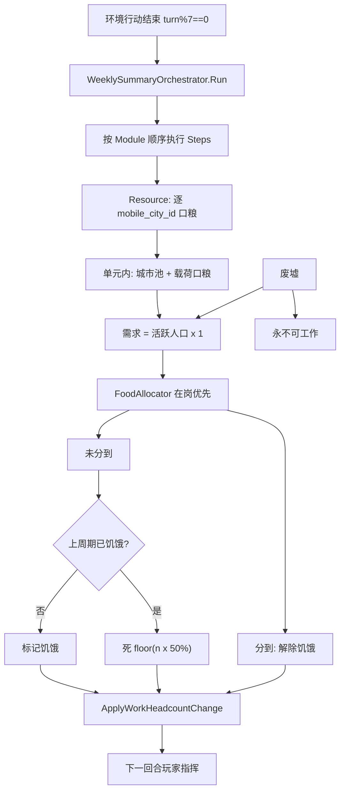
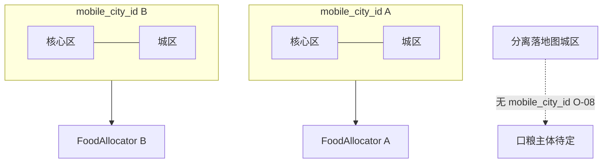
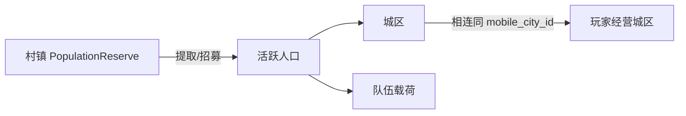
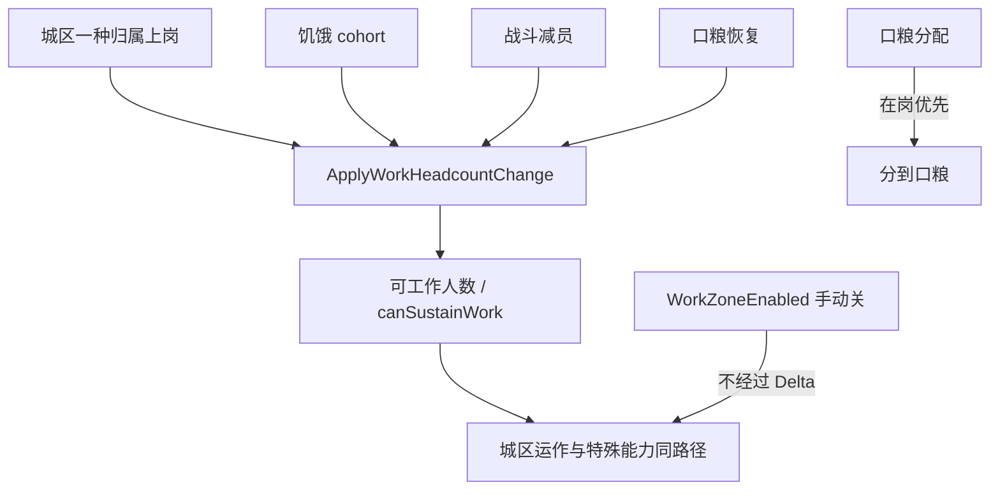
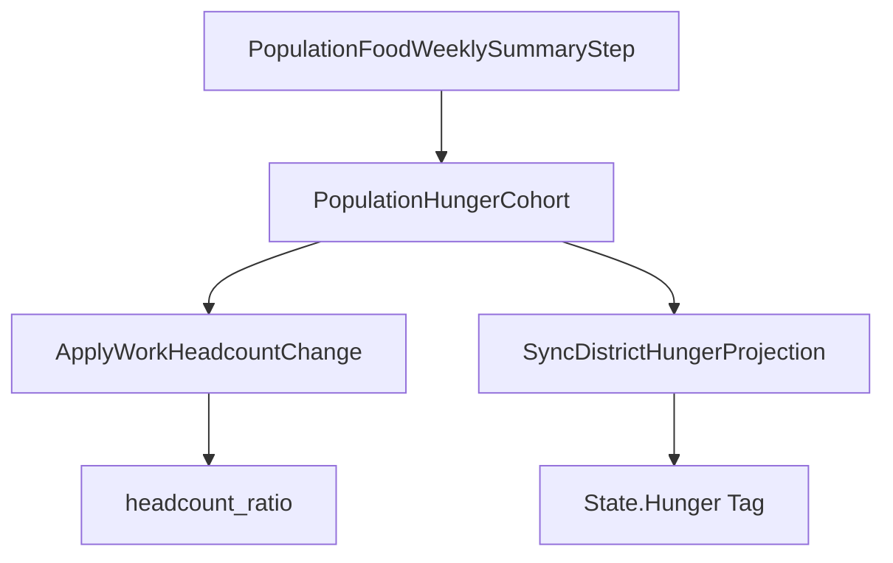

← [口粮与周总结](./README.md)

**状态**：草稿  
**校验状态**：待校验  
**最后更新**：2026-06-30  
**来源**：口粮周总结设计计划（2026-06-29 迭代）  
**与正式文档关系**：待同步至 [02-系统设计](../../02-系统设计/) 等（详见 [程序落地](./口粮与周总结-程序落地.md) §5.1 清单）

# 口粮与周总结 · 流程与待决

← [总览](./口粮与周总结-总览.md) · [已定案详述](./口粮与周总结-已定案详述.md) · [程序落地](./口粮与周总结-程序落地.md)

---

## 3. 流程图

### 3.1 周总结总流程

### 3.2 移动城市与口粮分区

### 3.3 村镇储量 → 活跃人口

### 3.4 工作人数变化（城区）

### 3.5 人口与 GAS 数据流

---

## 4. 待决事项（按优先级）

> 处理建议：先 **P0**（阻塞伪代码/实现），再 **P1**（首版体验），**P2** 可并行数值建模或文档。

### P0 — 阻塞实现

| ID       | 问题                                | 说明 / 建议                                                                                                                           |
| -------- | --------------------------------- | --------------------------------------------------------------------------------------------------------------------------------- |
| **O-01** | ~~周总结子步骤顺序~~                      | **已定**：按 `WeeklySummaryModule` 排序 + Catalog 可调；见 §2.1b 首版 5 步                                                                     |
| **O-02** | ~~在岗 × 归属 外层顺序~~                  | **已定**：`WorkFirst` / `AffiliationFirst` 两 `**IFoodShortageAllocator`**；默认 **WorkFirst**；`FoodAllocationConfig` + Modifier；§2.4a/b |
| **O-03** | **整数取整与 SortKey**                 | 两算法共用 `AllocationSortKey`；Fed / 解除饥饿 / 致死 **同一顺序**                                                                                |
| **O-04** | `**ApplyWorkHeadcountChange` 规格** | 输入输出、`canSustainWork` 门槛、与 OPEN-032（进行中工作=完成）衔接                                                                                   |
| **O-05** | **队伍等价方法**                        | `ApplyTeamWorkHeadcountChange` 或共用接口；饥饿后指令暂停/降效/撤回（OPEN-008）                                                                      |
| **O-06** | **载荷口粮扣减实现**                      | 先扣载荷再扣城市池 vs 先汇总再按容器扣（对外规则一致，实现二选一）                                                                                               |

### P1 — 首版体验 / 边界

| ID       | 问题                              | 说明                                                             |
| -------- | ------------------------------- | -------------------------------------------------------------- |
| **O-07** | 载荷 **迁徙人口** 是否算队伍「在岗」           | 影响在岗优先与 `GetWorkableTeamHeadcount`                             |
| **O-08** | **已分离落地图城区** 口粮结算主体             | 无 `mobile_city_id` 时谁跑 `FoodAllocator`                         |
| **O-09** | **仅占领、领袖未转化** 的 AI 口粮账          | 原领袖 vs 占领方                                                     |
| **O-10** | **相邻** 是否允许同分区内迁移               | 若 **相连** 已足够，可能仅相连即可                                           |
| **O-11** | cohort 与 **招募 / 归属转化 / 减员** 守恒  | 跨周人口变动时饥饿数如何裁剪                                                 |
| **O-12** | 奇数饥饿 **四舍五入** vs 向下取整           | 默认定案向下取整，可显式确认                                                 |
| **O-13** | 玩家与 AI **同一 turn_number** 同步周总结 | 建议 **是**                                                       |
| **O-14** | AI **默认口粮策略**                   | **已定默认 `WorkFirst`**；与玩家同 `FoodAllocationConfig` + Modifier 管线 |
| **O-15** | 多移动城市 UI                        | 分区标识；按 **城区 × 上岗归属** 展示可工作/需求人数；**第 6 回合** 饥饿/致死预告（按分区）        |
| **O-16** | 跨分区口粮 **运输/贸易** 细则              | 周总结不串池后的补给路径                                                   |

### P2 — 数值 / 工具 / 扩展

| ID       | 问题                    | 说明                              |
| -------- | --------------------- | ------------------------------- |
| **O-17** | 7 回合批量 vs 生产节奏        | 7×回合产出 vs 1×人口消费是否匹配（`04-数值框架`） |
| **O-18** | 1:1 无调节口              | 儿童/老人、领袖减免、模块 buff 等后期扩展        |
| **O-19** | 读档/跳回合 **跳过周总结**      | 调试工具向                           |
| **O-20** | 归属优先 + 单归属上岗 **救急困境** | 低优先级归属整批饥饿时的 UI 与策略反馈           |
| **O-21** | 节点级口粮库存 vs 分区内虚拟池     | 首版建议分区内汇总；物理仓分散展示               |

### OPEN 条目对照

| OPEN         | 状态           | 本方案                             |
| ------------ | ------------ | ------------------------------- |
| **OPEN-005** | 待对齐          | 食物与人口维持（本方案替代「公式待定」的衰减表述）       |
| **OPEN-016** | 口粮子项 **闭合**  | 按 `mobile_city_id` 独立分配；并行任务等待定 |
| **OPEN-042** | **废止** 每回合另扣 | 并入周总结；公式 = 1:1 + cohort         |
| **OPEN-033** | 待补           | 村镇提取量、迁移完整规则                    |
| **OPEN-032** | 交叉 O-04      | 人数变化后进行中工作                      |
| **OPEN-008** | 交叉 O-05      | 队伍饥饿后行为                         |
| **OPEN-046** | 待改           | 占领权限、存储 UI；对齐领袖入阵营              |
