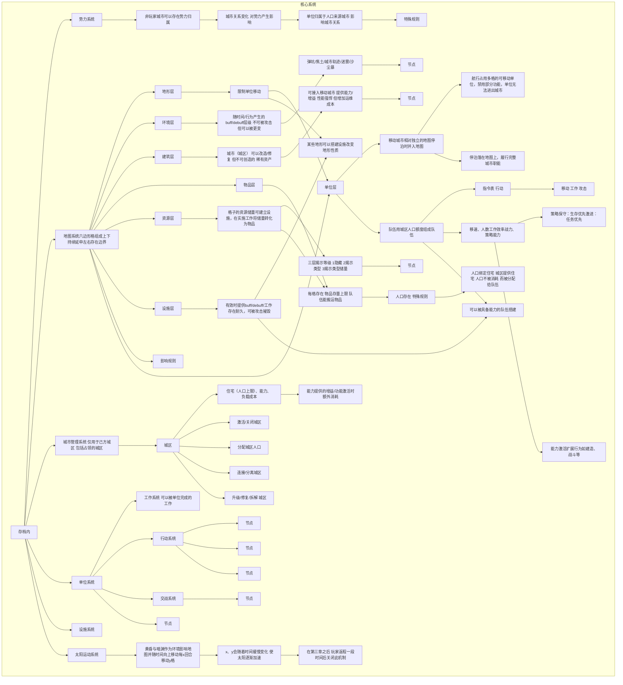

# 导出

```mermaid
flowchart TD
  subgraph n0 ["核心系统"]
    n1["环境层"]
    n2["单位层"]
    n3["有效时提供buff/debuff/工作 存在耐久，可被攻击摧毁"]
    n4["格子的资源储量可建立设施，在实施工作将储量转化为物品"]
    n5["停泊落在地图上，履行完整城市职能"]
    n6["弹坑/焦土/城市轨迹/迷雾/沙尘暴"]
    n7["工作系统 可以被单位完成的工作"]
    n8["在第三章之后 玩家返程一段时间后关闭此机制"]
    n9["太阳运动系统"]
    n10["黄昏与暗渊作为环境影响地图并随时间向上移动每x回合移动y格"]
    n11["激活/关闭城区"]
    n12["每格存在 物品存量上限 队伍能搬运物品"]
    n13["城市关系变化 对势力产生影响"]
    n14["物品层"]
    n15["地图系统六边形格组成上下持续延申左右存在边界"]
    n16["可以被具备能力的队伍搭建"]
    n17["节点"]
    n18["能力提供的增益/功能激活时额外消耗"]
    n19["资源层"]
    n20["节点"]
    n21["节点"]
    n22["设施层"]
    n23["可接入移动城市 提供能力/增益 性能强悍 但增加运维成本"]
    n24["地形层"]
    n25["节点"]
    n26["航行占用多格的可移动单位，禁用部分功能，单位无法进出城市"]
    n27["限制单位移动"]
    n28["存档内"]
    n29["人口绑定住宅 城区提供住宅 人口不被消耗 而被分配给队伍"]
    n30["城市管理系统 仅用于己方城区 包括占领的城区"]
    n31["移速、人数工作效率战力、策略能力"]
    n32["单位系统"]
    n33["人口存在 特殊规则"]
    n34["随时间/行为产生的 buff/debuff层级 不可被攻击 但可以被更变"]
    n35["行动系统"]
    n36["单位归属于人口来源城市 影响城市关系"]
    n37["节点"]
    n38["连接/分离城区"]
    n39["特殊规则"]
    n40["节点"]
    n41["队伍用城区人口额度组成队伍"]
    n42["交战系统"]
    n43["三层揭示等级 1隐藏 2揭示类型 3揭示类型储量"]
    n44["移动城市相对独立的地图停泊时并入地图"]
    n45["势力系统"]
    n46["节点"]
    n47["x、y会随着时间缓慢变化 使太阳逐渐加速"]
    n48["非玩家城市可以存在势力归属"]
    n49["住宅（人口上限）、能力、 负载成本"]
    n50["影响规则"]
    n51["移动 工作 攻击"]
    n52["升级/修复/拆解 城区"]
    n53["城区"]
    n54["策略保守：生存优先激进：任务优先"]
    n55["某些地形可以搭建设施改变地形性质"]
    n56["节点"]
    n57["能力激活扩展行为如建造、战斗等"]
    n58["分配城区人口"]
    n59["建筑层"]
    n60["指令表 行动"]
    n61["设施系统"]
    n62["城市（城区） 可以改造/修复 但不可创造的 稀有资产"]
  end
  n59 --> n62
  n28 --> n45
  n28 --> n15
  n28 --> n30
  n15 --> n24
  n24 --> n27
  n4 --> n43
  n23 --> n25
  n3 --> n55
  n2 --> n44
  n22 --> n3
  n44 --> n26
  n2 --> n41
  n32 --> n7
  n10 --> n47
  n27 --> n2
  n47 --> n8
  n53 --> n49
  n35 --> n20
  n34 --> n6
  n6 --> n46
  n15 --> n1
  n42 --> n21
  n49 --> n18
  n14 --> n12
  n44 --> n5
  n43 --> n40
  n15 --> n59
  n62 --> n23
  n60 --> n51
  n35 --> n56
  n9 --> n10
  n31 --> n54
  n32 --> n35
  n32 --> n42
  n41 --> n60
  n15 --> n14
  n13 --> n36
  n28 --> n32
  n53 --> n11
  n15 --> n19
  n33 --> n29
  n35 --> n37
  n4 --> n12
  n28 --> n61
  n45 --> n48
  n15 --> n22
  n3 --> n16
  n53 --> n58
  n12 --> n33
  n36 --> n39
  n32 --> n17
  n19 --> n4
  n53 --> n38
  n30 --> n53
  n48 --> n13
  n27 --> n55
  n41 --> n31
  n15 --> n50
  n1 --> n34
  n41 --> n16
  n28 --> n9
  n53 --> n52
  n15 --> n2
  n31 --> n57
```