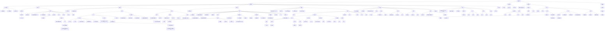

# 导出

```mermaid
flowchart TD
  n0["核心系统"]
  n1["地图系统"]
  n2["瓦片与层级"]
  n3["六边形格组成"]
  n4["上下持续延伸"]
  n5["左右存在边界"]
  n6["单位层"]
  n7["特殊单位"]
  n8["移动城市"]
  n9["main player"]
  n10["队伍"]
  n11["从城区组织"]
  n12["组织队伍需占用城区人口"]
  n13["人口归属影响队伍"]
  n14["人数"]
  n15["队伍类型"]
  n16["能力"]
  n17["基础能力"]
  n18["队伍能力"]
  n19["按队伍类型的独特能力"]
  n20["buff"]
  n21["工程队"]
  n22["步兵团"]
  n23["省略"]
  n24["物品层"]
  n25["存量与上限"]
  n26["队伍能搬运物品"]
  n27["资产"]
  n28["人口"]
  n29["人口归属"]
  n30["各个势力"]
  n31["佣兵之城安德雷亚"]
  n32["组织军队队伍时战力提升20%"]
  n33["工匠之城赫菲斯提亚"]
  n34["组织工程队时工作效率提升30%"]
  n35["无归属"]
  n36["人口清空则势力消亡"]
  n37["城市需有辨识度"]
  n38["玩家能认出废墟"]
  n39["人口转化"]
  n40["势力主城区提供人口转化能力"]
  n41["人口能力"]
  n42["各势力独特文化"]
  n43["人口在某些方面具备特长"]
  n44["队伍资产"]
  n45["用来组建队伍的资产"]
  n46["以队伍为单位"]
  n47["例军火组建军队"]
  n48["例勘探设备组建勘探队"]
  n49["材料"]
  n50["金属"]
  n51["城区设施建造修补升级"]
  n52["资产生产"]
  n53["能源"]
  n54["激活维持城区能力"]
  n55["资产生产"]
  n56["食物"]
  n57["维持人口"]
  n58["供应不足导致人口衰减"]
  n59["队伍运作是否消耗资源"]
  n60["策略深度与地图规模"]
  n61["建筑层"]
  n62["城区与废墟"]
  n63["城区"]
  n64["可改造修复"]
  n65["不可创造的稀有资产"]
  n66["物资储量上限"]
  n67["结构损伤"]
  n68["状态"]
  n69["废墟"]
  n70["可修复"]
  n71["可回收资源"]
  n72["资源储量"]
  n73["修复成本"]
  n74["无法承载人口"]
  n75["特殊城区"]
  n76["NPC城市主城区"]
  n77["人口转化效率"]
  n78["势力主城区能转化人口归属"]
  n79["城区能力"]
  n80["普通城区"]
  n81["城建设施"]
  n82["修复的废墟"]
  n83["NPC城市的城区"]
  n84["拆解结构"]
  n85["累计损伤换取资源"]
  n86["修复损伤"]
  n87["人口"]
  n88["分配人口"]
  n89["在城区之间调配人口"]
  n90["设施层"]
  n91["有效时提供 buff 与 debuff"]
  n92["提供工作"]
  n93["存在耐久可被摧毁"]
  n94["荒野有地形限制"]
  n95["可建立在普通城区"]
  n96["设施"]
  n97["耐久"]
  n98["占位设施"]
  n99["仓库"]
  n100["屋舍"]
  n101["人口仓库"]
  n102["待命名"]
  n103["燃料仓库"]
  n104["待命名"]
  n105["建材仓库"]
  n106["粮仓"]
  n107["食物仓库"]
  n108["生产设施"]
  n109["用于生产资产"]
  n110["军工区"]
  n111["地形设施"]
  n112["建立于可改造地形"]
  n113["桥梁"]
  n114["采集设施"]
  n115["建立于资源点"]
  n116["征兵办"]
  n117["矿区"]
  n118["果园"]
  n119["辅助设施"]
  n120["例城墙"]
  n121["例哨塔"]
  n122["能力"]
  n123["建设"]
  n124["运转"]
  n125["修复"]
  n126["资源层"]
  n127["格子的资源储量"]
  n128["可建立设施"]
  n129["工作将储量转化为物品"]
  n130["储量"]
  n131["村镇"]
  n132["无归属"]
  n133["产出基础人口"]
  n134["征兵办"]
  n135["矿藏"]
  n136["裸露金属结构"]
  n137["产出金属"]
  n138["矿区"]
  n139["果地"]
  n140["野生果林"]
  n141["产出食物"]
  n142["果园"]
  n143["遗迹"]
  n144["设施形态"]
  n145["颇具辨识度的遗迹结构"]
  n146["产出能源"]
  n147["建设设施"]
  n148["环境"]
  n149["随时间或行为产生 buff 与 debuff"]
  n150["层级不可被攻击"]
  n151["可以被变更"]
  n152["存续时间"]
  n153["可为长期"]
  n154["天气"]
  n155["沙暴"]
  n156["暴雨"]
  n157["迷雾"]
  n158["地面"]
  n159["焦土"]
  n160["树林"]
  n161["效果"]
  n162["能力"]
  n163["地形层"]
  n164["待完善"]
  n165["自然地形"]
  n166["山地"]
  n167["平原"]
  n168["河流"]
  n169["丘陵"]
  n170["势力系统"]
  n171["待完善"]
  n172["势力关系"]
  n173["城市关系"]
  n174["单位系统"]
  n175["棋盘上的棋子如何行动"]
  n176["单位类型"]
  n177["队伍"]
  n178["建筑"]
  n179["设施"]
  n180["行为"]
  n181["实施者"]
  n182["目标"]
  n183["战斗"]
  n184["绑定实施者"]
  n185["选取目标"]
  n186["目标受到伤害"]
  n187["队伍损失人口"]
  n188["建筑累计损伤"]
  n189["设施损失耐久"]
  n190["工作"]
  n191["绑定目标"]
  n192["不绑定实施者"]
  n193["增长完成度"]
  n194["完成度满则结算工作"]
  n195["响应"]
  n196["绑定实施者"]
  n197["选取目标"]
  n198["结算响应效果"]
  n199["指挥系统"]
  n200["发出命令"]
  n201["结束回合"]
  n202["命令生效"]
  n0 --> n1
  n1 --> n2
  n2 --> n3
  n2 --> n4
  n2 --> n5
  n1 --> n6
  n6 --> n7
  n7 --> n8
  n8 --> n9
  n6 --> n10
  n10 --> n11
  n10 --> n12
  n10 --> n13
  n10 --> n14
  n10 --> n15
  n10 --> n16
  n16 --> n17
  n16 --> n18
  n18 --> n19
  n18 --> n20
  n10 --> n21
  n10 --> n22
  n10 --> n23
  n1 --> n24
  n24 --> n25
  n24 --> n26
  n24 --> n27
  n27 --> n28
  n28 --> n29
  n29 --> n30
  n30 --> n31
  n31 --> n32
  n30 --> n33
  n33 --> n34
  n29 --> n35
  n29 --> n36
  n29 --> n37
  n29 --> n38
  n28 --> n39
  n39 --> n40
  n28 --> n41
  n41 --> n42
  n41 --> n43
  n27 --> n44
  n44 --> n45
  n44 --> n46
  n44 --> n47
  n44 --> n48
  n24 --> n49
  n49 --> n50
  n50 --> n51
  n50 --> n52
  n49 --> n53
  n53 --> n54
  n53 --> n55
  n49 --> n56
  n56 --> n57
  n56 --> n58
  n56 --> n59
  n56 --> n60
  n1 --> n61
  n61 --> n62
  n61 --> n63
  n63 --> n64
  n63 --> n65
  n63 --> n66
  n63 --> n67
  n63 --> n68
  n68 --> n69
  n69 --> n70
  n69 --> n71
  n69 --> n72
  n69 --> n73
  n69 --> n74
  n63 --> n75
  n75 --> n76
  n75 --> n77
  n77 --> n78
  n75 --> n79
  n63 --> n80
  n80 --> n81
  n80 --> n82
  n80 --> n83
  n63 --> n84
  n84 --> n85
  n63 --> n86
  n63 --> n87
  n63 --> n88
  n88 --> n89
  n1 --> n90
  n90 --> n91
  n90 --> n92
  n90 --> n93
  n90 --> n94
  n90 --> n95
  n90 --> n96
  n96 --> n97
  n96 --> n98
  n98 --> n99
  n99 --> n100
  n100 --> n101
  n99 --> n102
  n102 --> n103
  n99 --> n104
  n104 --> n105
  n99 --> n106
  n106 --> n107
  n98 --> n108
  n108 --> n109
  n108 --> n110
  n98 --> n111
  n111 --> n112
  n111 --> n113
  n98 --> n114
  n114 --> n115
  n114 --> n116
  n114 --> n117
  n114 --> n118
  n96 --> n119
  n119 --> n120
  n119 --> n121
  n96 --> n122
  n96 --> n123
  n96 --> n124
  n96 --> n125
  n1 --> n126
  n126 --> n127
  n126 --> n128
  n126 --> n129
  n126 --> n130
  n126 --> n131
  n131 --> n132
  n131 --> n133
  n131 --> n134
  n126 --> n135
  n135 --> n136
  n135 --> n137
  n135 --> n138
  n126 --> n139
  n139 --> n140
  n139 --> n141
  n139 --> n142
  n126 --> n143
  n143 --> n144
  n143 --> n145
  n143 --> n146
  n126 --> n147
  n1 --> n148
  n148 --> n149
  n148 --> n150
  n148 --> n151
  n148 --> n152
  n152 --> n153
  n148 --> n154
  n154 --> n155
  n154 --> n156
  n154 --> n157
  n148 --> n158
  n158 --> n159
  n158 --> n160
  n148 --> n161
  n161 --> n162
  n1 --> n163
  n163 --> n164
  n163 --> n165
  n165 --> n166
  n165 --> n167
  n165 --> n168
  n165 --> n169
  n0 --> n170
  n170 --> n171
  n170 --> n172
  n170 --> n173
  n0 --> n174
  n174 --> n175
  n174 --> n176
  n176 --> n177
  n176 --> n178
  n176 --> n179
  n174 --> n180
  n180 --> n181
  n180 --> n182
  n180 --> n183
  n183 --> n184
  n183 --> n185
  n183 --> n186
  n186 --> n187
  n186 --> n188
  n186 --> n189
  n180 --> n190
  n190 --> n191
  n190 --> n192
  n190 --> n193
  n190 --> n194
  n180 --> n195
  n195 --> n196
  n195 --> n197
  n195 --> n198
  n0 --> n199
  n199 --> n200
  n200 --> n201
  n201 --> n202
```
