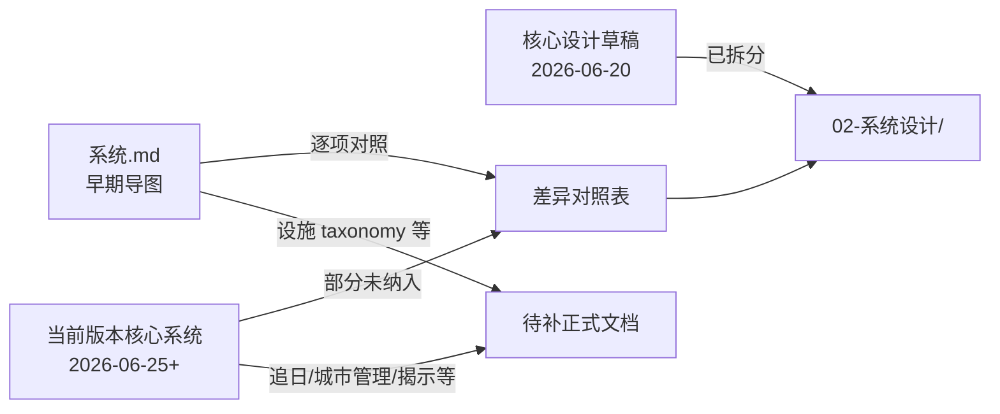

> 类型：草稿 · 综合索引
> 状态：**已归档**（迁入 `01-草稿/归档/`；勿再作工作正文修改）
> 校验状态：待校验
> 最后更新：2026-06-27

← [草稿](../README.md)

# 草稿综合与同步状况

本文汇总 [01-草稿/](../README.md) 内四份机制相关草稿的**内容去向**与**同步状况**，供收敛与补写正式文档时对照。详细条目级差异见 [系统与正式设计差异对照](./系统与正式设计差异对照.md)。

## 来源文档

| 文档 | 形态 | 大致时间 | 角色 |
|------|------|----------|------|
| [核心设计草稿](../核心设计草稿.md) | 文字索引 | 2026-06-20 | 脑暴整理后的**归档指针**；正文已拆入正式库 |
| [系统.md](../系统.md) | 思维导图 Mermaid | 较早 | **早期完整机制图**：地图分层、资源、人口、设施 taxonomy、行为三分 |
| [当前版本核心系统（不完善）](./当前版本核心系统（不完善）.md) | 思维导图 Mermaid | 2026-06-25 前后 | **较新机制图**：追日/光带、城市管理系统、揭示等级、指令表等 |
| [系统与正式设计差异对照](./系统与正式设计差异对照.md) | 对照表 | 2026-06-27 | [系统.md](../系统.md) ↔ [02-系统设计/](../../02-系统设计/) 的逐项差异与裁定记录 |

## 状态图例

| 状态 | 含义 | 处置建议 |
|------|------|----------|
| **已同步** | 草稿口径与 [02-系统设计/](../../02-系统设计/) 一致，或已裁定并以正式文档为准 | 草稿节点可保留作索引，不必重开讨论 |
| **待同步** | 方向已定，但正式文档未写全、仅有占位，或细则仍开放（见 [待细化追踪](../../00-规范/待细化追踪.md)） | 优先在正式文档补全，再回写草稿或标记归档 |
| **有差异** | 两份草稿之间，或草稿与正式文档之间**不可同时成立** | 须人工裁定后，改正式文档或废弃草稿说法 |
| **已废弃** | 被新裁定取代、明确不落地，或仅作历史存档 | 勿再向正式库回写；可在草稿保留说明 |
| **延后** | 口径或目录已预留，但有意不在当前阶段补全 | 依赖前置工作完成后再开；勿列入「待同步」优先级 |

---

## 1. 顶层架构与核心体验

| 内容 | 核心设计草稿 | 系统.md | 当前版本核心系统 | 正式设计 | 状况 |
|------|:---:|:---:|:---:|:---:|------|
| 核心循环（移动—勘探—建设—再移动） | ✓ | 隐含 | 隐含 | [核心循环](../../02-系统设计/07-玩法循环/核心循环.md) | **已同步** |
| 胜利条件（抵达太阳、追日压力） | ✓ | — | 隐含（太阳运动） | [胜利条件](../../02-系统设计/01-核心体验/胜利条件.md) | **已同步**（运动学已定；v₀/a **待同步** OPEN-006） |
| 核心幻想 / 美术情绪 | ✓ | — | — | [核心幻想](../../02-系统设计/01-核心体验/核心幻想.md) | **已同步** |
| 世界观母本 | ✓ | — | — | [核心世界观](../../04-设定/01-世界观/核心世界观.md) | **已同步** |
| 顶层模块划分 | — | 地图 / 势力 / 单位 / **指挥** 并列 | 存档内 + 多子系统 | 目标 / 世界 / 城市 / 资源 / 单位 / 势力；指挥归入玩法循环 | **已同步**（指挥不再与地图同级） |
| 探索闭环（停泊→勘探→建设→补给） | ✓ | 隐含 | 隐含 | [探索与扩张](../../02-系统设计/07-玩法循环/探索与扩张.md) | **已同步** |
| 通讯与飞信 | — | — | — | [通讯与视野系统](../../02-系统设计/06-单位与交战/通讯与视野系统.md) + [通讯与飞信（草稿）](../通讯与飞信.md) | **待同步**（OPEN-013） |
| 平台与操作（PC、3D 俯视） | — | — | — | [平台与操作](../../02-系统设计/01-核心体验/平台与操作.md) | **已同步** |

---

## 2. 地图、图层与环境

| 内容 | 系统.md | 当前版本核心系统 | 正式设计 | 状况 |
|------|:---:|:---:|:---:|------|
| 六边形卷轴；上下延伸；横向有界 | ✓ | ✓ | [地图与移动](../../02-系统设计/02-地图与世界/地图与移动.md) | **已同步** |
| 图层栈：地形→环境→资源→建筑→设施→物品→单位 | ✓ | ✓ | [地图图层](../../02-系统设计/03-图层与地点/地图图层.md) | **已同步** |
| 地形 = 地面形状；环境 = 表层 + 天气 | 部分 | 部分 | 已裁定 | **已同步** |
| 地形类型清单（平原、丘陵、山地、河流、沼泽、裂隙） | 部分 | — | [地图图层 · 地形类型清单](../../02-系统设计/03-图层与地点/地图图层.md#地形类型清单) | **已同步**（2026-06-27） |
| 环境：焦土、树林、弹坑、沙暴、暴雨、迷雾、城市轨迹 | ✓ | ✓（弹坑/焦土/轨迹/迷雾/沙尘暴） | [地图图层](../../02-系统设计/03-图层与地点/地图图层.md) | **已同步**（暴雨等待细化清单） |
| 影响规则须绑优先级 | — | — | 正式更严 | **已同步**（正式已覆盖） |
| 响应（检测器 → 行为 + 作用） | ✓ | — | [地图图层](../../02-系统设计/03-图层与地点/地图图层.md#响应检测与行为触发) | **已同步**（`trigger_behavior` + `on_resolve`；清单 OPEN-015） |
| 视野触发动态生成 | — | — | [地图与移动](../../02-系统设计/02-地图与世界/地图与移动.md) | **已同步**（正式独有，草稿未反对） |
| 停泊与航行；切换为工作（**被工作对象 = 核心区**） | — | ✓ | [地图与移动 · 停泊与航行](../../02-系统设计/02-地图与世界/地图与移动.md)、[连接与多核心 · 停泊与航行切换](../../02-系统设计/03-图层与地点/建筑层/连接与多核心.md#停泊与航行切换核心区工作) | **已同步** |
| 航行：不占世界地图格、单位无法进出城、禁用物理接触类功能 | — | ✓ | [地图与移动 · OPEN-041](../../02-系统设计/02-地图与世界/地图与移动.md#航行态占格单位边界与禁用功能-open-041) | **已同步**（框架已定；子项 **OPEN-041**） |
| **太阳运动系统** | — | ✓ | [地图与移动 · 运动学](../../02-系统设计/02-地图与世界/地图与移动.md#程序口径open-006-部分已定) | **已同步**（v(t)=v₀+a·t；v₀/a 数值 OPEN-006） |
| **黄昏带 / 暗渊带**随时间向上移动 | — | ✓ | 同上 + [胜利条件](../../02-系统设计/01-核心体验/胜利条件.md) | **已同步**（执行层 xy；带宽等待定） |
| **x、y 随时间变化（加速）** | — | ✓ | 恒定加速度导出 x/y | **已同步**（2026-06-27） |
| **第三章后关闭某机制**（导图指工作系统） | — | ✓ | [章节生命周期 · 太阳移动停用](../../02-系统设计/02-地图与世界/地图与移动.md#章节生命周期与太阳移动停用) | **已同步**（停用的是**太阳移动/光带**，非工作系统；工作系统仍运行） |
| 资源三级揭示（隐藏 / 种类 / 储量） | — | ✓ | [单位类型与视野 · 资源点揭示等级](../../02-系统设计/06-单位与交战/单位类型与视野.md#资源点揭示等级) | **已同步**（`hidden`/`kind`/`amount`；同步时机 OPEN-014） |

---

## 3. 资源与物品

| 内容 | 系统.md | 当前版本核心系统 | 正式设计 | 状况 |
|------|:---:|:---:|:---:|------|
| 四类资源：金属、能源、食物、人口 | ✓ | ✓ | [四种核心资源](../../02-系统设计/04-资源与人口/四种核心资源.md) | **已同步** |
| 金属：建造修补升级、资产生产 | ✓ | ✓ | 同上 | **已同步** |
| 能源：城区能力、部分设施运行、资产生产 | ✓ | ✓ | 同上 | **已同步** |
| 食物：维持人口；供应不足衰减 | ✓ | ✓ | 同上 | **已同步**（公式 **待同步**） |
| **队伍运作是否消耗食物**（策略开关） | ✓ | — | [四种核心资源](../../02-系统设计/04-资源与人口/四种核心资源.md)、[队伍系统](../../02-系统设计/06-单位与交战/队伍系统.md) | **已同步**（默认启用，存档设置可关闭；消耗公式 **待同步**） |
| 物品层：存量上限、队伍搬运 | ✓ | ✓ | [地图图层](../../02-系统设计/03-图层与地点/地图图层.md) | **已同步** |
| 资源点：村镇、矿藏、果地、遗迹 | ✓ | ✓ | [荒野地点](../../02-系统设计/04-资源与人口/荒野地点.md) | **已同步** |
| 自然形态→设施（征兵办/矿区/果园/能源站） | ✓ | ✓ | 同上 | **已同步** |
| 储量 + 工作转化为物品 | ✓ | ✓ | [工作](../../02-系统设计/07-玩法循环/工作.md) | **已同步** |
| 遗迹（不可重建）vs 废墟（可重建） | ✓ | ✓ | 同上 | **已同步** |
| 数值框架（产出/消耗/库存） | — | — | [04-数值框架/](../../02-系统设计/04-数值框架/) 待建 | **延后** · **配置模板（SO 等）搭建完成后**再开设计 |

---

## 4. 人口、势力与领袖

| 内容 | 系统.md | 当前版本核心系统 | 正式设计 | 状况 |
|------|:---:|:---:|:---:|------|
| 组织队伍占用城区人口 / 编制 | ✓ | ✓ | [人口与迁移](../../02-系统设计/04-资源与人口/人口与迁移.md) | **已同步** |
| 人口不被消耗式编制；食物不足衰减 | ✓ | ✓（人口绑定住宅） | 同上 | **已同步** |
| **人口清空则势力消亡** | ✓ | — | 改为**领袖 + 人口池**锚点 | **已废弃**（口径已迁移） |
| 人口归属：各势力 / 无归属 | ✓ | ✓ | [领袖与势力](../../02-系统设计/05-城市与领袖/领袖与势力.md) | **已同步**（绑定**城市领袖**） |
| 安德雷亚 +20% 战力；赫菲斯提亚 +30% 工程 | ✓ | — | 落实为**领袖能力** | **已同步**（载体已改） |
| 势力主城区：人口归属转化 | ✓ | — | **领袖**承担转化 | **已同步** |
| 城区人口 = 居民；工作人口分轨 | 部分 | ✓（分配城区人口） | [人口与迁移](../../02-系统设计/04-资源与人口/人口与迁移.md) | **已同步** |
| 玩家城区：规定哪类人口完成工作 | — | ✓ | 同上 | **已同步** |
| 非玩家：单领袖统管，不做城区级分配 | — | — | [领袖与势力](../../02-系统设计/05-城市与领袖/领袖与势力.md) | **已同步**（正式独有简化） |
| 单位归属来源城市 → 影响城市关系 | — | ✓ | [势力系统](../../02-系统设计/05-城市与领袖/势力系统.md)、[通讯与视野系统](../../02-系统设计/06-单位与交战/通讯与视野系统.md) | **已同步**（延迟/即时两套路径；痕迹 **待定** OPEN-043） |
| 势力 / 城市关系；组织间接传导 | 待完善 | ✓ | [势力系统](../../02-系统设计/05-城市与领袖/势力系统.md) | **已同步**（骨架 + 事件传导已定；数值 **延后**） |
| 外部城市 AI 行动顺序 | — | — | `game_seed` 伪随机 | **已同步** |

---

## 5. 队伍与单位

| 内容 | 系统.md | 当前版本核心系统 | 正式设计 | 状况 |
|------|:---:|:---:|:---:|------|
| 默认队伍类型 | **工程队、步兵团** | — | **侦察、勘探、运输、工程、飞信** | **已同步** · 以正式五类为准；步兵团 **已废弃** |
| 移动城市（玩家主城） | ✓ | ✓ | [地图与移动](../../02-系统设计/02-地图与世界/地图与移动.md) | **已同步** |
| **main player** 特殊单位 | ✓ | — | 无对应实体 | **已废弃** · 待澄清是否指「玩家可指挥性」而非单位 |
| 能力模型（基础 / 类型 / Buff） | ✓ | ✓ | 能力化 SO 配置 | **已同步** |
| **队伍资产**（组建门槛） | ✓ | — | [队伍系统](../../02-系统设计/06-单位与交战/队伍系统.md#队伍资产与组建门槛) | **已同步**（框架已定；清单 OPEN-044） |
| 人数 → 视野、效率、战力（**不含移速**） | — | ✓ | [队伍系统](../../02-系统设计/06-单位与交战/队伍系统.md#默认编制与人数影响)、[单位类型与视野](../../02-系统设计/06-单位与交战/单位类型与视野.md#默认编制与人数衰减影响) | **已同步**（四通道框架已定；数值 OPEN-008） |
| 策略：保守 / 激进 | — | ✓ | `ai_strategy` | **已同步** |
| 运输队搬运 | ✓ | ✓ | [单位类型与视野](../../02-系统设计/06-单位与交战/单位类型与视野.md) | **已同步** |
| 遇敌默认行为 | — | — | 已定案 | **已同步** |
| 士气、交战公式 | — | ✓（交战系统） | [交战系统 · 已废弃机制](../../02-系统设计/06-单位与交战/交战系统.md#已废弃士气与逆风保护) | **已废弃** |
| **逆风保护** | — | — | 同上 | **已废弃**（OPEN-012） |

---

## 6. 城市、城区与模块化

| 内容 | 系统.md | 当前版本核心系统 | 正式设计 | 状况 |
|------|:---:|:---:|:---:|------|
| 建筑层 = 城区 | 混写 | ✓ | [城区总览](../../02-系统设计/03-图层与地点/建筑层/城区总览.md) | **已同步** |
| 城区：特殊 / 一般；正常 / 废墟 | ✓ | ✓ | 同上 | **已同步** |
| 城区不可创造、可改造修复（稀有资产） | ✓ | ✓ | [城市模块化](../../02-系统设计/03-图层与地点/建筑层/README.md) | **已同步** |
| 结构完整度低于 20% → 废墟 | ✓ | — | 已定 | **已同步** |
| 分离城区 vs 拆解结构 | 部分 | ✓ | [分离与拆解](../../02-系统设计/03-图层与地点/建筑层/分离与拆解.md) | **已同步** |
| 连接 / 分离城区 | — | ✓ | [分离与拆解](../../02-系统设计/03-图层与地点/建筑层/分离与拆解.md#玩家操作连接与分离)、[连接与多核心](../../02-系统设计/03-图层与地点/建筑层/连接与多核心.md) | **已同步**（随时可操作；停泊=工作、航行=−15%/次；OPEN-034 余项） |
| **激活 / 关闭城区**（= **工作区启闭**） | — | ✓ | [运作与居民 · 工作区启用与关闭](../../02-系统设计/03-图层与地点/建筑层/运作与居民.md#工作区启用与关闭) | **已同步**（非连接/分离；OPEN-045 余项） |
| **城市管理系统**（己方 + 占领城区） | — | ✓ | [城市管理系统](../../02-系统设计/04-资源与人口/城市管理系统.md) | **已同步**（三类分配框架已定；UI / 存储策略 OPEN-046） |
| 核心区、骄阳之心 | — | — | [连接与多核心](../../02-系统设计/03-图层与地点/建筑层/连接与多核心.md) | **已同步**（正式独有，草稿未反对） |
| 住宅（人口上限） | — | ✓ | [城区总览 · 居民承载](../../02-系统设计/03-图层与地点/建筑层/城区总览.md#居民承载)、[设施层 · 屋舍](../../02-系统设计/03-图层与地点/设施层.md#屋舍) | **已同步**（基础承载 + 屋舍叠加；数值 SO **待定**） |
| 城区能力（可激活） | — | ✓ | [运作与居民 · 城区能力激活](../../02-系统设计/03-图层与地点/建筑层/运作与居民.md#城区能力激活) | **已同步**（规则已定；清单 OPEN-048） |
| **负载成本** | — | ✓ | [城区总览 · 负载成本](../../02-系统设计/03-图层与地点/建筑层/城区总览.md#负载成本) | **已同步**（每 x 格 / y 修复资源；SO 配置） |
| 移动城市停泊时并入地图 | — | ✓ | [地图与移动](../../02-系统设计/02-地图与世界/地图与移动.md) | **已同步** |
| 设施可接入移动城市；设施运维独立于城区消耗 | — | ✓ | [设施层 · 接入移动城市](../../02-系统设计/03-图层与地点/设施层.md#接入移动城市一般城区)、[运作与居民 · 消耗分轨](../../02-系统设计/03-图层与地点/建筑层/运作与居民.md#城区消耗与设施消耗) | **已同步**（一般城区无城区能力；OPEN-045 设施启闭余项） |
| 能力激活额外消耗 | — | ✓ | [运作与居民 · 城区能力激活](../../02-系统设计/03-图层与地点/建筑层/运作与居民.md#城区能力激活)、[四种核心资源](../../02-系统设计/04-资源与人口/四种核心资源.md) | **已同步**（切换式/一次性规则已定；清单 OPEN-048） |
| 升级 / 修复 / 拆解城区 | — | ✓ | [分离与拆解 · 修复/拆解](../../02-系统设计/03-图层与地点/建筑层/分离与拆解.md)、[城区总览 · 玩家操作分轨](../../02-系统设计/03-图层与地点/建筑层/城区总览.md#玩家可执行的城区操作分轨) | **已同步**（框架已定；`work_type` OPEN-045） |

---

## 7. 设施

| 内容 | 系统.md | 当前版本核心系统 | 正式设计 | 状况 |
|------|:---:|:---:|:---:|------|
| 有效时 Buff/Debuff；提供工作；耐久可毁 | ✓ | ✓ | [设施层](../../02-系统设计/03-图层与地点/设施层.md)、[地图图层](../../02-系统设计/03-图层与地点/地图图层.md) | **已同步** |
| 建设、运转、修复 | ✓ | ✓ | [工作](../../02-系统设计/07-玩法循环/工作.md) | **已同步** |
| **占格类** / **辅助类** taxonomy | ✓ | — | [设施层 · 设施分类](../../02-系统设计/03-图层与地点/设施层.md#设施分类占格类--辅助类) | **已同步**（框架已定；名单 OPEN-047） |
| 占格 · **仓储类**（建材仓、粮仓、燃料库等） | ✓ | — | 同上 · 仓储类 | **已同步**（细则 OPEN-046/047） |
| 占格 · **生产类** · 物品转化（军工区等） | ✓ | — | 同上 · 生产类 | **已同步**（配方 OPEN-044/047） |
| 占格 · **生产类** · 储量转化（征兵办/矿区/果园/能源站） | ✓ | ✓ | [荒野地点](../../02-系统设计/04-资源与人口/荒野地点.md) | **已同步** |
| 占格 · **地形类**（桥梁；隧道待定） | ✓ | ✓ | [设施层](../../02-系统设计/03-图层与地点/设施层.md) | **已同步**（建造条件 OPEN-028） |
| **辅助类**（哨塔、陷阱、**城墙**；驿站待定） | ✓ | — | 同上 · 辅助类、[城墙](../../02-系统设计/03-图层与地点/设施层.md#城墙) | **已同步**（城墙规则已定；减免数值 OPEN-047） |
| 可建位置约束 | ✓ | ✓ | 图层规则共同约束 | **已同步** |

---

## 8. 行为系统（战斗 / 工作 / 响应检测）

| 内容 | 系统.md | 当前版本核心系统 | 正式设计 | 状况 |
|------|:---:|:---:|:---:|------|
| 行为通道：战斗、工作、即时能力 | ✓ | ✓ | [地图图层 · 行为通道](../../02-系统设计/03-图层与地点/地图图层.md#行为通道) | **已同步** |
| 响应 = 条件检测器 → 触发行为 | ✓（草稿误与战斗/工作并列） | — | [响应检测与行为触发](../../02-系统设计/03-图层与地点/地图图层.md#响应检测与行为触发) | **已同步**（2026-06-27 裁定） |
| 战斗：绑定实施者 + 目标 | ✓ | ✓ | 多路径（主动/检测器触发战斗/卷入/遭袭） | **已同步**（正式更细） |
| 战斗结算：减员、建筑损伤、设施耐久 | ✓ | ✓ | [交战系统 · 战斗结算](../../02-系统设计/06-单位与交战/交战系统.md#战斗结算当前版本) | **已同步**（三轨框架已定；数值 OPEN-035） |
| **工作不绑定实施者** vs 正式必有执行者 | ✓ | — | [工作 · 可暂停与中断](../../02-系统设计/07-玩法循环/工作.md#工作对象可暂停与中断已定) | **已同步** · 已裁定：类型不绑执行者；可暂停可换队 |
| **可暂停 / 不可暂停**；中断 **待重试 / 已结束** | — | — | 同上、[回合与行动表 · 工作中断](../../02-系统设计/07-玩法循环/回合与行动表.md#工作中断与恢复) | **已同步** |
| **阶段性成果** 可重置 / 不可重置 | 部分 | — | [工作 · 阶段性成果](../../02-系统设计/07-玩法循环/工作.md#阶段性成果与重置策略) | **已同步**（勘探、破译示例） |
| 工作进度 + 阈值成果；勘探 50% 初级揭示 | 部分 | ✓ | [工作](../../02-系统设计/07-玩法循环/工作.md) | **已同步** |
| 进行中不重算时长 | — | — | 已定 | **已同步** |
| 交战可打断工作 | — | — | [回合与行动表 · 工作中断](../../02-系统设计/07-玩法循环/回合与行动表.md#工作中断与恢复) | **已同步**（可暂停保留进度；不可暂停归零） |
| 行为主体：队伍、设施、城市（含移动城市） | ✓（含建筑） | ✓ | 正式用「城市」 | **已同步**（术语已对齐城区/城市） |

---

## 9. 指挥、回合与行动

| 内容 | 系统.md | 当前版本核心系统 | 正式设计 | 状况 |
|------|:---:|:---:|:---:|------|
| 发出命令 → 结束回合 → 生效 | ✓ | ✓（指令表 + 行动） | 四阶段回合 | **已同步**（正式更细） |
| **指令表**（跨回合）+ **行动表**（本回合顺序） | — | ✓ | [回合与行动表](../../02-系统设计/07-玩法循环/回合与行动表.md) | **已同步** |
| 行动主体清单 | — | ✓ | 移动城市、队伍、外部城市、部分设施 | **已同步** |
| 未知死亡与延迟宣告 | — | — | **已废止**（2026-07-07） | 见 [回合与行动表 · 队伍阵亡与清理](../../02-系统设计/07-玩法循环/回合与行动表.md#队伍阵亡与清理) |
| 工作效率与数值通道 | — | — | 已定框架 | **待同步**（OPEN-031） |

---

## 10. 四份草稿之间的关系

| 关系 | 说明 |
|------|------|
| 核心设计草稿 → 正式库 | **已完成**一次性拆分；后续只改正式文档 |
| 系统.md → 差异对照 | **已覆盖**大部分节点；对照表以本文档 §2–§9 为准 |
| 当前版本核心系统 → 差异对照 | **未完全纳入**；本文 §2、§6 补录追日、城市管理、第三章机制关闭等 |
| 系统.md vs 当前版本 | 后者更偏**运行时架构**（太阳、指令表、城市管理系统）；前者更偏**内容 taxonomy**（设施族、资源点、人口文化） |
| 通讯与飞信 | 独立草稿 [通讯与飞信.md](../通讯与飞信.md)，**待同步**至正式（OPEN-013） |

---

## 11. 汇总：按状态计数与优先动作

### 已同步（可归档讨论）

- 六边形卷轴、多图层叠放、四类资源与用途分工
- 遗迹 / 废墟区分；资源点与采集设施对应关系
- 建筑层 = 城区；正常 / 废墟；分离 vs 拆解
- 人口编制非消耗；领袖框架；居民 vs 工作人口
- 停泊 / 航行；切换为工作；四阶段回合
- 行为通道与响应检测器模型；`ai_strategy`；探索闭环；胜利条件方向
- 核心设计草稿所列各专题的**主文档已存在**

### 待同步（建议写入正式文档）

| 优先级 | 项 | 追踪 |
|--------|-----|------|
| P0 | ~~工作「不绑定实施者」语义裁定~~ | **已裁定** · 见 [工作](../../02-系统设计/07-玩法循环/工作.md) |
| P1 | 太阳 / 光带：**v₀、a** 数值、带宽、格级 debuff | OPEN-006 |
| P1 | 第三章后机制关闭（若仍有效） | 对齐 [章节划分](../../04-设定/05-隐秘真相/章节划分与故事大纲.md) |
| P1 | 三级资源揭示与同步时机 | OPEN-014 |
| P1 | 通讯与飞信细则 | OPEN-013 |
| P2 | ~~队伍资产门槛~~（框架已同步，清单 OPEN-044）；~~队伍运作消耗食物开关~~（已同步，公式见 OPEN-042） | 队伍系统 |
| P2 | 设施 taxonomy（隧道、驿站、城墙数值） | OPEN-028 / OPEN-047 |
| P1 | 航行态：在途队伍、入港汇合、占格释放、禁用清单 | OPEN-041 |
| P3 | 地图影响规则完整清单 | OPEN-015 |

### 有差异（须裁定）

| 项 | 冲突方 | 备注 |
|----|--------|------|
| 工作执行者绑定 | 系统.md「不绑定」vs 正式「必有执行者」 | **已裁定** · 类型不绑执行者；可暂停可换队 |
| 太阳 x/y 加速 | 当前版本 vs 正式 | **已裁定**：恒定加速度 v(t)=v₀+a·t |
| 辅助设施：城墙 | 系统.md 有 vs 正式无 | **已同步**（辅助类；格内人口减损） |
| 人口消亡锚点 | 系统.md「清空消亡」vs 领袖框架 | **已按正式裁定**，草稿侧视为废弃 |

### 已废弃（勿回写正式库）

| 项 | 原因 |
|----|------|
| [核心设计草稿](../核心设计草稿.md) 作为工作正文 | 已拆分；仅历史指针 |
| **main player** 实体 | 正式以「移动城市 + 可指挥性」表达 |
| **步兵团** | 首版默认以侦察/勘探/运输/工程/飞信五类为准；武装由能力 SO 配置 |
| **人口清空则势力消亡** | 改为领袖 + 人口池 |
| **指挥系统**与地图并列的顶层划分 | 归入玩法循环 |
| **密林**作为地形层 | 已移入环境层 |
| **战斗士气** | 早期正式稿曾写士气结算 | **已废弃** · 不实现 |
| **逆风保护** | OPEN-012 | **已废弃** · 不实现 |
| 环境层「不可被攻击」表述 | 正式已删除 |

---

## 12. 建议维护方式（归档前记录）

> 本文已迁入 `01-草稿/归档/`，下列流程**不再适用**于本文件；活跃草稿见 [../README.md](../README.md)。

1. **新机制决策**：直接写 [02-系统设计/](../../02-系统设计/)，勿再扩写四份旧导图。
2. **导图收敛**：以 [当前版本核心系统（不完善）](./当前版本核心系统（不完善）.md) 为「待同步清单」来源，[系统.md](../系统.md) 为 taxonomy 补充；裁定后更新本文与 [差异对照](./系统与正式设计差异对照.md)。
3. **开放项闭环**：裁定结论写入正式文档 → [待细化追踪](../../00-规范/待细化追踪.md) 关闭 → 本文对应行改为 **已同步**。
4. **程序阻塞**：与 [设计缺口清单](../../03-程序设计/设计缺口清单.md) 交叉引用，避免重复开项。

---

## 修订记录

| 日期 | 说明 |
|------|------|
| 2026-06-27 | 初稿：综合四份草稿，按主题域标注已同步 / 待同步 / 有差异 / 已废弃 |
| 2026-06-27 | 地形类型清单改为已同步；响应改为检测器模型已同步 |
| 2026-06-27 | 补充行为 vs 作用（`on_resolve`）；打断非行为通道 |
| 2026-06-27 | 太阳运动：恒定加速度 v(t)=v₀+a·t，xy 为执行层 |
| 2026-06-27 | 第三章前期以后停用太阳移动；全局暗渊带 |
| 2026-06-27 | OPEN-041 航行态；草稿航行项改为已同步 |
| 2026-06-27 | 三级资源揭示同步至正式；OPEN-014 收窄为同步/保留 |
| 2026-06-27 | 队伍运作消耗食物开关同步至正式；OPEN-042 |
| 2026-06-27 | 数值框架标记为延后：配置模板搭建后再设计 |
| 2026-06-27 | 单位归属来源城市与关系事件传导（延迟/即时、痕迹） |
| 2026-06-27 | 默认队伍类型以正式五类为准；步兵团废弃 |
| 2026-06-27 | 队伍资产框架、人数比四通道同步至正式 |
| 2026-06-27 | 修正：人数不改变移速 |
| 2026-06-27 | 连接/分离：随时可操作；停泊工作无惩罚、航行 −15%/次 |
| 2026-06-27 | 工作区启闭、修复/拆解写入正文；四类城区操作分轨 |
| 2026-06-27 | 停泊/航行切换归属**核心区**（`core_district`） |
| 2026-06-27 | **城市管理系统**正式文档；框架已同步 |
| 2026-06-27 | 一般城区：无城区能力；设施接入移动城市；消耗分轨 |
| 2026-06-27 | 设施 taxonomy：占格类（地形/生产/仓储）与辅助类 |
| 2026-06-27 | 城区能力：切换式/一次性激活；规则已定 OPEN-048 |
| 2026-06-27 | **负载成本**：每 x 格 / y 修复资源；SO 配置 |
| 2026-06-27 | **居民承载**：城区基础 + 屋舍叠加 |
| 2026-06-27 | **城墙**：辅助类；格内受击人口减损 |
| 2026-06-27 | **战斗结算**：移除士气；减员 / 建筑损伤 / 设施耐久三轨 |
| 2026-06-27 | **战斗士气**与**逆风保护**正式废弃 |
| 2026-06-27 | **工作**：可暂停/不可暂停、中断处置、阶段性成果重置；P0 裁定 |
