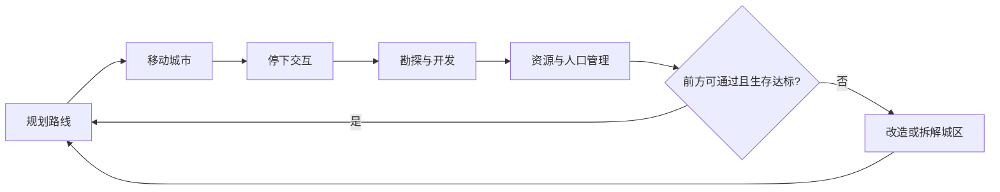

> 状态：草稿  
> 校验状态：不适用  
> 类型：策划案 / 对内 pitch  
> 受众：团队内部、合作方快速对齐  

← [草稿目录](./README.md)

# 《循光之城》策划案

| 字段 | 内容 |
|------|------|
| 游戏名 | **《循光之城》** |
| 项目代码名 | **延续** |
| 文档性质 | 对内策划案（pitch + 机制索引）；细则以 [02-系统设计](../02-系统设计/) 与 [04-设定](../04-设定/) 为准 |
| 对外展示 | [游戏介绍.md](../游戏介绍.md) |
| 平台 | PC · 3D 俯视 · 鼠标点击为主（见 [平台与操作](../02-系统设计/01-核心体验/平台与操作.md)） |

---

## 主题

**延续**——**延续传承、延续文明**。

玩家驾驶世上唯一的模块化移动城邦，在太阳开始远去的奇异世界里，把人、城、记忆与制度带下去。主题落在两层：

| 层 | 含义 | 玩法落点 |
|----|------|----------|
| **延续传承** | 城主身份、势力记忆、章节真相逐步揭开 | 关系经营、剧情事件、隐秘真相（见 [04-设定](../04-设定/)） |
| **延续文明** | 日生文明不被暗渊吞没；城市仍能前进 | 追日 / 入暗渊、资源与城区取舍、终局归塔提速太阳 |

---

## 一句话

在《循光之城》中，你将成为末日废土上唯一移动城邦的城主。驾驶这座可拼接、可拆解的模块化城市，在太阳原本固定不动的奇异世界，追逐那轮本该荣光永驻、却不知为何而远去的太阳。

你需要不断对**资源调度、部队派遣、城市管理与路线规划**做出决策，并承受对应的奖励与后果；同时周旋于各方势力，在交易与交锋中寻得一条前路，为你钟爱的文明争得一线生机。

追逐太阳、免于被黑暗吞噬，是日生文明唯一的生路，也是你揭开世界真相的道途。

> **对外精简版**见 [游戏介绍 · 一句话](../游戏介绍.md#这是什么游戏)。  
> **机制一句话**见 [核心幻想](../02-系统设计/01-核心体验/核心幻想.md)。

---

## 核心体验

三条体验并行，贯穿整局；不是三个互斥模式。

### 1. 夹缝中求生的经营体验

玩家要指挥城市逃离不断逼近、吞噬生存空间、且速度越来越快的暗渊；同时随时可能面临资源不足与其他势力纠缠，在严酷环境中夹缝求生。

| 压力来源 | 玩家在做什么 | 权威入口 |
|----------|--------------|----------|
| **暗渊与日照带** | 第一、二章同向追日；距离拉近偏奖励、拉远偏惩罚；第二章起速度差拉大 | [胜利条件 · 动态难度](../02-系统设计/01-核心体验/胜利条件.md#动态难度) |
| **资源枯竭** | 金属 / 食物 / 能源 / 人口四轨；周粮、负载、日常能源 | [四种核心资源](../02-系统设计/04-资源与人口/四种核心资源.md) |
| **势力纠缠** | 贸易、委托、交战、占领与招募 | [势力系统](../02-系统设计/05-城市与领袖/势力系统.md)、[领袖与势力](../02-系统设计/05-城市与领袖/领袖与势力.md) |
| **第三章后** | 全局暗渊；压力改由常驻环境与章节目标驱动（细则分章待定） | [地图与移动 · 太阳照射与停用](../02-系统设计/02-地图与世界/地图与移动.md#太阳照射区与移动停用) |

### 2. 在建设与自毁之间取舍的体验

拼接更多城区能获得更强能力，更从容地面对资源消耗与势力压力；但更多城区意味着更慢的速度与更大的资源压力。为了不被暗渊追上，玩家必须对城区做出取舍——选择性抛弃自己建过的城区来谋求生存。

| 取舍动作 | 代价感 | 权威入口 |
|----------|--------|----------|
| **拼接 / 建设** | 金属、人口、负载上升；能力变强 | [城区总览](../02-系统设计/03-图层与地点/建筑层/城区总览.md)、[设施层](../02-系统设计/03-图层与地点/设施层.md) |
| **分离 / 占格迁移** | 停泊多回合；完整度与布局代价 | [分离与拆解](../02-系统设计/03-图层与地点/建筑层/分离与拆解.md)、[连接与多核心](../02-系统设计/03-图层与地点/建筑层/连接与多核心.md) |
| **主动拆解** | 完整度 −10% / 回收 10 金属（鼓励修而非拆） | 同上 · 拆解回收 |
| **航行放弃** | 即时执行；完整度 **−40%**；**不**回收金属 | 同上 |
| **被动损伤**（负载 / 交战） | 完整度下降；**不**回收金属 | [城区总览 · 负载成本](../02-系统设计/03-图层与地点/建筑层/城区总览.md#负载成本)、[交战系统](../02-系统设计/06-单位与交战/交战系统.md) |

情感落点对齐《冰汽时代》式道德压力，但载体是**城市拓扑与完整度**，不是温度条。

### 3. 参与剧情的沉浸式体验

在追逐「太阳」的旅途中，玩家会遇到形形色色的事件与势力；借此逐步理解世界观，并对城主身份产生认同，获得亲自参与剧情的沉浸感。

| 节拍 | 玩家心智 | 入口 |
|------|----------|------|
| **第一、二章** | 指定目标为太阳；向上追日；铁门关 / 铁巢等里程碑 | [核心循环](../02-系统设计/07-玩法循环/核心循环.md)、[章节大纲](../04-设定/05-隐秘真相/章节划分与故事大纲.md) |
| **第三、四章** | 指定目标为渊光；向下入暗渊 | 同上 |
| **第五章** | 指挥塔终局；提速太阳 | [胜利条件](../02-系统设计/01-核心体验/胜利条件.md) |
| **身份与真相** | 对外追日是掩护；城主动机为守誓与补救（设定层） | [城主的真实身份](../04-设定/05-隐秘真相/城主的真实身份.md) |

玩家交互心智（目标 / 行为 / 障碍 / 奖励）见草稿 [交互链-循光之城](./交互链-循光之城.md)。

---

## 核心玩法

**标签**：城市建设 · 回合制策略 · 模拟经营 · 资源管理 · 移动规划 · 外交与势力 · 生存压力抉择 · 剧情探索

| 维度 | 玩家主要在做什么 | 入口 |
|------|------------------|------|
| **城市建设** | 拼接城区、建采集设施与屋舍、启闭工作区、修复与拆解 | [建筑层](../02-系统设计/03-图层与地点/建筑层/README.md)、[设施层](../02-系统设计/03-图层与地点/设施层.md) |
| **回合制策略** | 编辑指令表与行动表；玩家城市每回合率先行动，再外部城市与环境 | [回合与行动表](../02-系统设计/07-玩法循环/回合与行动表.md) |
| **模拟经营** | 城区运作、人口安置与编制、城市管理系统三向分配 | [城市管理系统](../02-系统设计/04-资源与人口/城市管理系统.md)、[人口与迁移](../02-系统设计/04-资源与人口/人口与迁移.md) |
| **资源管理** | 四类资源产出 / 消耗；共用仓储空间分配；周总结粮食 | [四种核心资源](../02-系统设计/04-资源与人口/四种核心资源.md) |
| **移动规划** | 停泊 / 航行切换、路线与消耗、前方可通过性、城区占格迁移 | [地图与移动](../02-系统设计/02-地图与世界/地图与移动.md) |
| **部队派遣** | 编组队伍勘探、交战、运输；人数影响视野 / 效率 / 战力 | [队伍系统](../02-系统设计/06-单位与交战/队伍系统.md) |
| **外交与势力** | 领袖关系（当场结算）、委托、贸易、招募 / 效忠 / 占领 | [领袖与势力](../02-系统设计/05-城市与领袖/领袖与势力.md) |
| **生存压力抉择** | 是否扩建、是否抛弃城区、是否开战、是否救援 | 核心体验 §1～§2 |
| **剧情探索** | 章节里程碑、荒野地点、情报揭示 | [探索与扩张](../02-系统设计/07-玩法循环/探索与扩张.md)、[08-关卡与叙事](../02-系统设计/08-关卡与叙事/) |

---

## 关于资源：四种核心资源

| 资源 | 主要用途 | 典型来源 |
|------|----------|----------|
| **金属** | 设施与城区建造、修补、升级；资产生产 | 矿区、主动拆解回收、外部城市 |
| **食物** | 维持人口；队伍载荷补给 | 果园 → 后期温室；周总结结算 |
| **能源** | 城区日常运转、能力激活、温室转化 | 能源站（遗迹储量） |
| **人口** | 居民承载、运作劳动力、编组队伍 | 征兵办（村镇储量）、外部城市 |

**首版数值锚（摘要）**——细则见 [四种核心资源](../02-系统设计/04-资源与人口/四种核心资源.md)：

| 主题 | 已定要点 |
|------|----------|
| **节拍** | 产出 / 日常能源 / 负载相关结算对齐 **3 回合**；工作量 **30** ≈ 满编工程队一拍 |
| **产出** | 果园 25 食物 · 矿区 25 金属 · 能源站 40 能源 · 征兵办 15 人；温室 150 食物（耗 50 能源） |
| **建造金属** | 采集类 / 征兵办 **30**；温室 **80**；屋舍 **20** |
| **消耗** | 核心区日常 15 能源 / 3 回合等；负载每 3 格 −2%/区；修复 +10% / 20 金属 |
| **仓储** | 金属 + 食物 + 能源**共用**容量（1:1）；人口不占仓；队伍载荷分池；统一 **仓库** 设施扩容 |
| **粮食** | 每 7 回合周总结；未分到 → 半数减员；**无**饥饿中间态 |

---

## 大地图

**形态**：六边形纵向卷轴；上下持续延伸，左右有界。移动城市以多格 footprint 占格；停泊时并入世界地图，航行时不占世界格。

| 要素 | 说明 | 入口 |
|------|------|------|
| **图层栈** | 地形 → 环境 → 资源 → 建筑 → 设施 → 物品 → 单位 | [地图图层](../02-系统设计/03-图层与地点/地图图层.md) |
| **停泊 / 航行** | 切换各占 **1** 回合；停泊可进出与建设；航行禁进出与占格建设 | [地图与移动](../02-系统设计/02-地图与世界/地图与移动.md) |
| **日照与暗渊** | 黄昏带 / 暗渊带随时间向上推移；相对太阳距离驱动动态难度 | [胜利条件 · 动态难度](../02-系统设计/01-核心体验/胜利条件.md#动态难度) |
| **荒野点** | 果地 / 矿藏 / 遗迹 / 村镇 → 对应采集设施 | [荒野地点](../02-系统设计/04-资源与人口/荒野地点.md) |

> **示意图**：旧版策划案大地图截图可放入 [`情绪板/`](./情绪板/)（子目录待建）。机制示意见 [游戏流程详情图](./游戏流程详情图.md)、[系统设计详情图](./系统设计详情图.md)。

---

## 核心循环

**正式文档**：[核心循环](../02-系统设计/07-玩法循环/核心循环.md)  
**草稿图示**：[游戏流程详情图](./游戏流程详情图.md)（仅参考）  
**飞书历史**：[循光之城：核心循环](https://mcne6pdc31k2.feishu.cn/docx/Ebn3d1aqko3J3rxSWhZcLSXxn3e)

### 行为层：三个时间尺度

| 尺度 | 玩家在做什么 |
|------|----------------|
| **分钟级** | 指挥阶段、资源观察、编制调整、即时事件 |
| **小时级** | 跨回合指令、探索与开发 |
| **长期** | 追日 / 入暗渊、扩张、章节叙事推进 |

### 一轮活动循环

在当前位置经营 → 确认生存 → 移动至新位置 → 进入下一轮。

| 环节 | 玩家在权衡什么 |
|------|----------------|
| **停下开发** | 建果园 / 矿区 / 能源站 / 征兵办；是否值得付建造金属与回合 |
| **资源管理** | 周粮、负载损伤、日常能源；共用仓里囤什么 |
| **确认生存** | 粮是否够撑到下一站；完整度与修复金属；仓是否还能装回运 |
| **改造拆解** | 仅主动拆解回收金属；航行放弃 −40%；被动损伤不回收 |
| **当前位置经营六面** | 路线 · 城市 · 资源 · 关系 · 指挥 · 情报（见 [交互链](./交互链-循光之城.md)） |

### 每回合四阶段（机制层摘要）

玩家指挥 → 玩家行动（主城最先）→ 外部城市 AI → 环境结算（含第 7 回合周总结）。详见 [回合与行动表](../02-系统设计/07-玩法循环/回合与行动表.md)。

---

## 核心系统

旧版「系统 2 改」思维导图已收敛为 [02-系统设计](../02-系统设计/) 七域。  
**草稿总览（仅参考）**：[系统设计详情图](./系统设计详情图.md)

| 模块 | 回答的问题 | 入口 |
|------|------------|------|
| **01 核心体验** | 卖点、胜利条件、动态难度、平台 | [01-核心体验/](../02-系统设计/01-核心体验/) |
| **02 地图与世界** | 六边形地图、停泊与航行、太阳运动 | [02-地图与世界/](../02-系统设计/02-地图与世界/) |
| **03 图层与地点** | 图层栈；城区负载 / 修复 / 拆解；设施 | [03-图层与地点/](../02-系统设计/03-图层与地点/) |
| **04 资源与人口** | 四类资源、产出消耗锚、共用仓、CMS、荒野点 | [04-资源与人口/](../02-系统设计/04-资源与人口/) |
| **05 城市与领袖** | 势力、领袖关系、招募 / 效忠 / 占领 | [05-城市与领袖/](../02-系统设计/05-城市与领袖/) |
| **06 单位与交战** | 队伍、视野、通讯站、交战承伤 | [06-单位与交战/](../02-系统设计/06-单位与交战/) |
| **07 玩法循环** | 回合、工作、探索、核心循环 | [07-玩法循环/](../02-系统设计/07-玩法循环/) |
| **08 关卡与叙事** | 章节关卡与叙事投放（与设定交叉） | [08-关卡与叙事/](../02-系统设计/08-关卡与叙事/) |

**已定口径速查（避免旧稿回潮）**

| 主题 | 现行 |
|------|------|
| 通讯 | **无**飞信时间差；地图情报即时；通讯站 = 势力级视野增益 |
| 关系事件 | **当场结算**（无待同步队列） |
| 仓储 | **共用仓**；废止分种类粮仓 / 建材仓 / 燃料库 |
| 金属回收 | **仅主动拆解**；负载 / 交战 / 放弃不回收 |
| 航行放弃 | 完整度 **−40%** |

玩家心智链：[交互链-循光之城](./交互链-循光之城.md)  
系统响应链（非玩家交互链）：[交互链分析图](./交互链分析图.md)

---

## 世界观

完整条文见 [04-设定](../04-设定/)。策划案层只保留 pitch 骨架：

| 要点 | 说明 |
|------|------|
| **世界曾有固定太阳** | 有日照为白昼，照不到为暗渊；太阳本该荣光永驻 |
| **太阳开始移动** | 向关外远去；后面的区域逐渐失去日照，变成暗渊 |
| **唯一移动巨城** | [循烬城](../04-设定/03-地点与场景/循烬城.md)——世上第一座且唯一可整城迁徙的城市 |
| **日生文明的生路** | 跟着太阳走，免于被黑暗吞噬；停太久则生存压力上升 |
| **叙事分层** | 民众所知：[核心世界观](../04-设定/01-世界观/核心世界观.md)；隐秘真相：[05-隐秘真相/](../04-设定/05-隐秘真相/) |
| **终局** | 抵达渊光 / 指挥塔，集齐骄阳之心并为太阳提速（玩法通关） |

速览：[世界概述](../04-设定/01-世界观/世界概述.md) · [章节划分与故事大纲](../04-设定/05-隐秘真相/章节划分与故事大纲.md)

---

## 乐趣

### 沉浸感（对齐《IXION》）

在场景推进与剧情节拍中，看见自己的经营成果——**城区形态、路线选择、资源结余与势力关系**——逐渐塑造一座仍在前进的城市。建设不是装饰，而是叙事可见的「这座城还活着、还在走」的证据。

### 本作特有张力

| 张力 | 说明 | 参考感 |
|------|------|--------|
| **太阳朋克 vs 后启示录** | 艳阳、巨城、金色光带，对照正在被吞没的废土 | 视觉与基调见 [核心世界观](../04-设定/01-世界观/核心世界观.md#世界风格与基调) |
| **亲手拆掉自己建的东西** | 模块化城市迫使玩家为速度与通过性牺牲城区 | 对齐《冰汽时代》道德压力；载体是城市拓扑 |
| **长期规划感** | 回合策略下的区域扩张、据点开发、跨章目标 | 对齐《文明》式时间尺度 |

情绪曲线草案：[核心幻想 · 情绪曲线](../02-系统设计/01-核心体验/核心幻想.md#情绪曲线)

---

## 设计参考

> 旧版截图可归档至 [`情绪板/`](./情绪板/)（子目录待建）。与 [核心幻想 · 参考作品](../02-系统设计/01-核心体验/核心幻想.md#参考作品) 对齐。

| 作品 | 可借鉴点 | 在本作中的落点 |
|------|----------|----------------|
| **《文明六》** | **回合制规则**、区域扩张、长期规划 | [回合与行动表](../02-系统设计/07-玩法循环/回合与行动表.md)、探索与据点开发 |
| **《IXION》** | 方舟叙事、经营成果在剧情推进中可见 | 移动城市作为「方舟」、沉浸感 |
| **《冰汽时代》** | 末日城市经营、道德与资源取舍 | 粮食周总结、城区牺牲与分离、人口压力 |
| **《无光之海》** | 探索未知、叙事驱动、绝望氛围 | 荒野勘探、暗渊压力、章节叙事节奏 |

---

## 与旧版策划案差异（摘要）

| 旧版表述 | 现行口径 |
|----------|----------|
| 核心系统「系统 2 改」 | 收敛为 [02-系统设计](../02-系统设计/) 七域 + 图层栈 |
| 仅强调「追逐太阳」 | 补充区域变暗渊、动态难度、终局渊光 / 骄阳之心 |
| 即时通讯 / 飞信 | **已废止**；情报即时同步 |
| 分种类粮仓 / 建材仓 / 燃料库 | **共用仓**；统一仓库设施 |
| 被动损伤换金属 | **仅主动拆解**回收 |
| 航行放弃 30%～50% | **−40%** |

未关闭项见 [待细化追踪](../00-规范/README.md#待细化追踪)。本策划案**不**替代正式设计文档。

---

## 修订记录

| 日期 | 版本 | 说明 |
|------|------|------|
| （旧版） | — | 飞书 / 早期 pitch：主题、一句话、参考图 |
| 2026-07-11 | 1.2.0 | 按对内大纲扩写：主题双层、完整一句话、三条核心体验、玩法表、资源/大地图/循环/系统/乐趣加细 |
| 2026-07-11 | 1.1.0 | 核心循环 / 核心系统对齐产出消耗锚、共用仓、拆解与通讯已定 |
| 2026-07-11 | 1.0.3 | 全文改策划口吻；去掉史诗腔、口号式表头 |
| 2026-07-11 | 1.0.0 | 迁入 `01-草稿/`；对齐游戏介绍与系统设计索引 |
