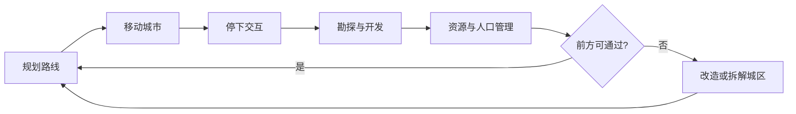

> 状态：草稿  
> 校验状态：不适用  
> 类型：策划案 / 对内 pitch  
> 受众：团队内部、合作方快速对齐  

← [草稿目录](./README.md)

# 《循光之城》策划案

| 字段 | 内容 |
|------|------|
| 游戏名 | **《循光之城》** |
| 项目代码名 | **延续** |
| 文档性质 | 旧版策划案**更新稿**；机制细则以 [02-系统设计](../02-系统设计/) 与 [04-设定](../04-设定/) 为准 |
| 对外展示演进 | [游戏介绍.md](../游戏介绍.md) |

---

## 主题

**延续**——延续传承、延续文明。

玩家驾驶世上唯一的模块化移动城市，在太阳离去、暗渊吞没世界的末日中不停前进：收集资源、经营城市、应对势力与荒野，在取舍与牺牲中把文明带向远方。

---

## 一句话

驾驶可拆解、重组的移动城市，在荒野中收集资源补给城市，抵御敌对势力袭扰，穿越整个世界追逐太阳，在前进中延续文明。

（精简对外版见 [游戏介绍 · 一句话](../游戏介绍.md#这是什么游戏)。）

---

## 核心体验

| 体验 | 说明 |
|------|------|
| **规划与取舍** | 扩建、分离、加速、改道——每次决策都权衡当下生存与未来风险 |
| **承受牺牲** | 城市可切割、牺牲、重组；地形与资源压力迫使玩家付出情感代价 |
| **持续加压** | 离太阳越远环境越严酷；停滞或落入暗渊带过久，生存难度不断加大 |

详见 [胜利条件 · 核心体验](../02-系统设计/01-核心体验/胜利条件.md#核心体验)、[核心幻想](../02-系统设计/01-核心体验/核心幻想.md)。

---

## 核心玩法

回合制策略 · 模拟经营 · 资源管理 · 探索与扩张 · 路线规划 · 外交与势力 · 生存压力

| 维度 | 玩家主要在做什么 |
|------|------------------|
| **回合策略** | 编辑指令表与行动表；玩家城市每回合率先行动，随后外部城市与环境结算 |
| **模拟经营** | 城区运作、人口与四种核心资源、城市管理系统三向分配 |
| **探索扩张** | 队伍侦察 / 勘探、点亮荒野、建站与采集设施、重组城区通过地形 |
| **路线规划** | 六边形卷轴地图上选择停泊与航行、评估前方可通过性与移动消耗 |
| **外交势力** | 外部城市领袖关系、贸易、效忠与占领、组织传导 |
| **生存压力** | 太阳照射带、暗渊、粮食周总结、动态难度与终局时限感 |

---

## 核心循环

**行为层总览**（分钟 / 小时 / 长期）与**一轮完整推进**（当前位置经营 → 确认生存 → 移动至新位置）见：

- [核心循环](../02-系统设计/07-玩法循环/核心循环.md)（正式文档）
- [游戏流程详情图](./游戏流程详情图.md)（草稿图示）
- 飞书来源：[循光之城：核心循环](https://mcne6pdc31k2.feishu.cn/docx/Ebn3d1aqko3J3rxSWhZcLSXxn3e)（历史画板）

---

## 核心系统

旧版「系统 2 改」思维导图已收敛为 [02-系统设计](../02-系统设计/) 目录结构。速览如下：

| 模块 | 回答的问题 | 入口 |
|------|------------|------|
| **核心体验** | 卖点、胜利条件、平台与操作 | [01-核心体验/](../02-系统设计/01-核心体验/) |
| **地图与世界** | 六边形地图、移动、停泊与航行 | [02-地图与世界/](../02-系统设计/02-地图与世界/) |
| **图层与地点** | 地形→环境→资源→建筑→设施→物品→单位 | [03-图层与地点/](../02-系统设计/03-图层与地点/) |
| **资源与人口** | 金属 / 食物 / 能源 / 人口、荒野地点 | [04-资源与人口/](../02-系统设计/04-资源与人口/) |
| **城市与领袖** | 城区模块化、势力、领袖关系 | [05-城市与领袖/](../02-系统设计/05-城市与领袖/) |
| **单位与交战** | 队伍、视野、通讯、交战 | [06-单位与交战/](../02-系统设计/06-单位与交战/) |
| **玩法循环** | 回合、工作、探索、核心循环 | [07-玩法循环/](../02-系统设计/07-玩法循环/) |

全局分解树（草稿）：[系统设计详情图](./系统设计详情图.md)  
玩家交互链（草稿）：[交互链-循光之城](./交互链-循光之城.md)

---

## 世界观

设定经多轮收敛，完整条文见 [04-设定](../04-设定/)。策划案层只保留 pitch 所需骨架：

| 要点 | 说明 |
|------|------|
| **亘古秩序崩解** | 太阳曾长期固定，划分白昼与暗渊；如今太阳离去，身后失照之处被黑暗吞没 |
| **唯一移动巨城** | [循烬城](../04-设定/03-地点与场景/循烬城.md)——世上第一座且唯一可整城迁徙的城市 |
| **追光即追生** | 停滞即严寒与暗渊；领袖抉择塑造城市与文明去向 |
| **叙事分层** | 民众所知见 [核心世界观](../04-设定/01-世界观/核心世界观.md)；隐秘真相见 [05-隐秘真相/](../04-设定/05-隐秘真相/) |

速览：[世界概述](../04-设定/01-世界观/世界概述.md)

---

## 乐趣

类似 **《IXION》**：在场景推进与剧情节拍中，看见自己的经营成果——城区形态、路线选择、资源结余与势力关系——逐渐塑造一座仍在前进的城市。

叠加本作特有张力：

- **太阳朋克**视觉下的后启示录流亡（艳阳、巨城、金色光带 vs 正在被吞没的废土）
- **模块化城市**带来的「亲手拆掉自己建的东西」的悲壮感（对齐《冰汽时代》式道德压力，但载体是城市拓扑而非温度条）
- **回合策略**的长期规划感（对齐《文明》式区域扩张与时间尺度）

情绪曲线草案见 [核心幻想 · 情绪曲线](../02-系统设计/01-核心体验/核心幻想.md#情绪曲线)。

---

## 设计参考

> 旧版策划案中的参考截图可归档至 [`情绪板/`](./情绪板/)（子目录待建）。下表为文字摘要；与 [核心幻想 · 参考作品](../02-系统设计/01-核心体验/核心幻想.md#参考作品) 对齐并补全 IXION。

| 作品 | 可借鉴点 | 在本作中的落点 |
|------|----------|----------------|
| **《文明六》** | 回合制规则、区域扩张、长期规划 | [回合与行动表](../02-系统设计/07-玩法循环/回合与行动表.md)、探索与据点开发 |
| **《无光之海》** | 探索未知、叙事驱动、绝望氛围 | 荒野勘探、暗渊压力、章节叙事节奏 |
| **《冰汽时代》** | 末日城市经营、道德与资源取舍 | 粮食周总结、城区牺牲与分离、人口压力 |
| **《IXION》** | 太空方舟式叙事体验、经营成果可见 | 移动城市作为「方舟」、场景推进中的建设反馈 |

---

## 与旧版策划案差异（摘要）

| 旧版表述 | 现行口径 |
|----------|----------|
| 核心系统「系统 2 改」 | 收敛为 [02-系统设计](../02-系统设计/) 七域 + 图层栈 |
| 仅强调「追逐太阳」 | 补充**暗渊吞没**、**动态难度**、终局**渊光 / 骄阳之心**（见 [胜利条件](../02-系统设计/01-核心体验/胜利条件.md)） |
| 即时通讯 / 飞信（若旧讨论稿仍有） | **已废止**；地图情报**即时同步**，见 [通讯与视野系统](../02-系统设计/06-单位与交战/通讯与视野系统.md) |
| 纯 2D 或平台未定 | **PC · 3D 俯视 · 鼠标点击**，见 [平台与操作](../02-系统设计/01-核心体验/平台与操作.md) |

未关闭的规则与实现项见 [待细化追踪](../00-规范/README.md#待细化追踪)；本策划案**不**替代正式设计文档。

---

## 修订记录

| 日期 | 版本 | 说明 |
|------|------|------|
| （旧版） | — | 飞书 / 早期 pitch：主题、一句话、参考图 |
| 2026-07-11 | 1.0.0 | 迁入 `01-草稿/`；对齐 [游戏介绍](../游戏介绍.md)、[核心幻想](../02-系统设计/01-核心体验/核心幻想.md)、[02-系统设计](../02-系统设计/README.md)；补 mermaid 核心循环、系统索引、旧版差异表 |
