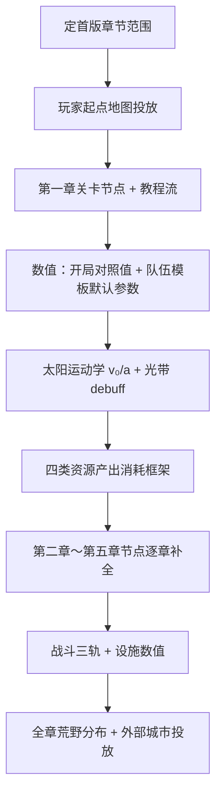

> 状态：草稿（非正式）
> 校验状态：不适用
> 最后更新：2026-07-04

← [草稿](./README.md)

# 数值与关卡设计待办清单

本文汇总当前项目中**数值设计**与**关卡设计**的**已定部分**与**待补缺口**，供后续讨论与收敛。机制规则以 [02-系统设计](../02-系统设计/) 为准；叙事地理以 [章节划分与故事大纲](../04-设定/05-隐秘真相/章节划分与故事大纲.md) 为准。定案后迁入正式目录，并在 [待细化追踪](../00-规范/README.md#待细化追踪) 闭环。

---

## 现状摘要

| 领域 | 已定（机制/结构） | 仍缺（数值/投放/细则） |
|------|-------------------|------------------------|
| **数值** | 四类资源、粮食周总结规则、工作量积累与进度公式、负载成本框架、战斗三轨框架、队伍编制与人数比通道 | `04-数值框架/` 未建；具体速率/上限/系数大量待定 |
| **关卡** | 五章大纲、纵向地理链、各章路径与揭示层级、核心循环与章节对应 | `08-关卡与叙事/` 几乎为空；无格级投放、任务流程、分章玩法阈值 |

**前置依赖**（[待细化追踪 · OPEN-005](../00-规范/README.md#待细化追踪)）：数值框架总表延后至 [03-程序设计](../03-程序设计/) 侧配置模板（SO 等）搭建完成后再开。下列待办中标注 **【可先行】** 的项不依赖完整数值框架。

---

## 零、已定部分（仍属本范畴）

下列条目机制或结构**已定**，但具体数值、地图投放或专篇文档**尚未补全**——故仍列入本文范畴，与下文待办对照阅读。

### 0.1 数值 · 资源与经济

| 主题 | 已定内容 | 权威文档 |
|------|----------|----------|
| **四类资源** | **金属、食物、能源、人口**；用途与典型来源已分型 | [四种核心资源](../02-系统设计/04-资源与人口/四种核心资源.md) |
| **粮食周期** | 每 **7** 回合环境行动后 **[周总结]**；`turn % 7 == 0` | [粮食与周总结 · 总览](./粮食与周总结/粮食与周总结-总览.md) |
| **粮食需求** | 活跃人口每周期 **1** 食物/人（周总结口径 = **1** 粮食/人/周；城区驻留 + 队伍编制 + **随行人员**）；村镇储量提取前**不计**；队伍**载荷**设计目标：默认可维持约 **3** 周期；长期外派须**运输队**输送物资 | 同上 |
| **粮食不足** | 未分到者 **⌊n/2⌋ 减员**；**无**饥饿中间态、**无**跨周 cohort | 同上 |
| **分配层级** | **L1** 城区驻留占比 → **L2** 城区内归属占比 → **L3** 归属内同比例；领袖 **Override** 可破例 | [粮食与周总结 · 已定案详述](./粮食与周总结/粮食与周总结-已定案详述.md) |
| **结算单元** | 按 **`mobile_city_id`**（相连分区）独立；城市仓库与队伍载荷**分池** | 同上 |
| **废止** | 队伍**每回合**扣粮（OPEN-042）；饥饿 cohort；全局 WorkFirst/AffiliationFirst | 同上 |
| **金属 / 能源分轨** | 金属→结构建造修复；能源→城区运转与设施运行；与航行**负载成本**、**即时**移动消耗分轨 | [四种核心资源](../02-系统设计/04-资源与人口/四种核心资源.md) |
| **废墟粮食** | 废墟城区**计**粮食需求、**永远不能工作** | 粮食草稿 §2.3 |

### 0.2 数值 · 地图、环境与移动

| 主题 | 已定内容 | 权威文档 |
|------|----------|----------|
| **地图宽度** | 横向 **20～30 格**（具体默认与章节差异仍待定） | [地图与移动](../02-系统设计/02-地图与世界/地图与移动.md) |
| **太阳运动学** | **v(t) = v₀ + a·t**；xy 格修正工具为执行层；光带**向上**推移 | 同上、[胜利条件](../02-系统设计/01-核心体验/胜利条件.md) |
| **全图暗渊后** | **`sun_motion_enabled=false`**；不再推移照射区 | [地图与移动 · 太阳照射与停用](../02-系统设计/02-地图与世界/地图与移动.md#太阳照射区与移动停用) |
| **动态难度框架** | 第一～二章：追日、速度差、日照带位置驱动奖惩倾向；第三～五章：压力来自暗渊常驻环境等（细则待定） | [胜利条件 · 动态难度](../02-系统设计/01-核心体验/胜利条件.md#动态难度) |
| **负载成本** | **航行**中每移动 **x** 格，各连接城区累积须 **y** 资源修复的结构损伤；**停泊**不触发 | [城区总览 · 负载成本](../02-系统设计/03-图层与地点/建筑层/城区总览.md#负载成本) |
| **停泊 / 航行切换** | 对照时长各 **1** 回合；被工作对象 = **核心区**城区 | [回合与行动表 · 工作中状态](../02-系统设计/07-玩法循环/回合与行动表.md#工作中状态) |
| **城区占格迁移** | **仅停泊**；对照 **3～5** 回合；开始时目标格**地基占位** | 同上、[分离与拆解](../02-系统设计/03-图层与地点/建筑层/分离与拆解.md#城区占格迁移) |
| **航行分离损伤** | 放弃城区时参与城区完整度一次性下降 **30%～50%**（具体取值待定） | [地图与移动](../02-系统设计/02-地图与世界/地图与移动.md)、[分离与拆解](../02-系统设计/03-图层与地点/建筑层/分离与拆解.md) |
| **废墟阈值** | 结构完整度 **低于 20%** 强制转废墟 | [城区总览](../02-系统设计/03-图层与地点/建筑层/城区总览.md) |

### 0.3 数值 · 队伍、工作与战斗

| 主题 | 已定内容 | 权威文档 |
|------|----------|----------|
| **默认队伍类型** | 作业类侦察 / 勘探 / 运输 / 工程；武装类民兵 / 步兵 / 弓手已定 | [队伍系统](../02-系统设计/06-单位与交战/队伍系统.md) |
| **创队 / 补员** | 先下指令者预占用；商队与玩家无优先权 | [编组 · 人口预占用](../02-系统设计/04-资源与人口/人口与迁移.md#编组--人口预占用已定) |
| **人数比通道** | 影响视野、负载、工作效率、攻击/战力；**不影响**移速 | 同上 |
| **工作效率公式** | 积累**工作量**至所需额度；每回合增量 = 参与人数 × 工作效率（无需人员参与时人数默认为 **1**）；展示 **已累计工作量 / 所需工作量** 与预计回合数 | [回合与行动表 · 工作效率与工作量](../02-系统设计/07-玩法循环/回合与行动表.md#工作效率与工作量) |
| **对照工作时长** | 停泊↔航行 **1**；资源点建造 / 运维 **3**；装货 / 卸货 **1**；勘探 **50% / 100%** 揭示节点 | [回合与行动表 · 工作中状态](../02-系统设计/07-玩法循环/回合与行动表.md#工作中状态) |
| **工作暂停规则** | **可暂停**保留进度可换队续作；**不可暂停**中断归零；`on_interrupt_disposition`：**待重试** / **已结束** | [工作 · 可暂停与中断](../02-系统设计/07-玩法循环/工作.md#工作对象可暂停与中断已定) |
| **资源点揭示** | 三级 **`hidden` / `kind` / `amount`**；合并取最高不降级 | [单位类型与视野 · 资源点揭示等级](../02-系统设计/06-单位与交战/单位类型与视野.md#资源点揭示等级) |
| **战斗三轨** | **减员** / **建筑损伤** / **设施耐久**；**不含**战斗士气与逆风保护 | [交战系统 · 战斗结算](../02-系统设计/06-单位与交战/交战系统.md#战斗结算当前版本) |
| **战斗结算顺序** | 判定目标 → 攻击 → 战力（能力×人数系数）→ 传递 → 按目标类型结算 → 单次反击 | 同上 |
| **城墙** | **辅助类**设施；减免**本格**受击单位**人口损失**（比例待定） | [设施层 · 城墙](../02-系统设计/03-图层与地点/设施层.md#城墙) |
| **设施分类** | **占格类**（地形 / 生产 / 仓储）+ **辅助类**；**屋舍**叠加居民承载 | [设施层 · 设施分类](../02-系统设计/03-图层与地点/设施层.md#设施分类占格类--辅助类) |
| **资源点建造默认** | **3** 回合（工程队） | [单位类型与视野 · 工程队](../02-系统设计/06-单位与交战/单位类型与视野.md#4-工程队模板) |
| **队伍资产框架** | 模板级组建门槛；以队伍为单位消耗/占用 | [队伍系统 · 队伍资产](../02-系统设计/06-单位与交战/队伍系统.md#队伍资产与组建门槛) |

### 0.4 数值 · 城市与城区

| 主题 | 已定内容 | 权威文档 |
|------|----------|----------|
| **城区能力** | **仅特殊城区**；切换式 = 持续 GE，触发式 = 可选被动 + 主动（瞬时 GE + executor，或本回合限时 GE）；停泊/航行可双形态 | [运作与居民 · 城区能力激活](../02-系统设计/03-图层与地点/建筑层/运作与居民.md#城区能力激活) |
| **消耗分轨** | 一般城区**无**城区能力；**设施消耗不计入**城区账单 | [运作与居民 · 消耗分轨](../02-系统设计/03-图层与地点/建筑层/运作与居民.md#城区消耗与设施消耗) |
| **工作区启闭** | **启用/关闭** = 城区自身维护与能力停摆（非连接/分离） | [运作与居民](../02-系统设计/03-图层与地点/建筑层/运作与居民.md) |
| **修复 / 拆解** | 修复 = 废墟→正常；拆解 = 完整度换资源 | [分离与拆解](../02-系统设计/03-图层与地点/建筑层/分离与拆解.md) |
| **连接 / 分离** | 随时可操作；停泊分离**无**结构惩罚；航行放弃城区有 **30%～50%** 损伤 | 同上 |
| **城市管理三类分配** | **资源存储** / **住房** / **城区能力人力**；地图点选 + 管理面板 | [城市管理系统](../02-系统设计/04-资源与人口/城市管理系统.md) |
| **粮食仓库策略** | 「**优先用于充饥**」+ **常驻粮食充足性 UI** | 粮食草稿 §2.8～2.9 |

### 0.5 数值 · 荒野地点

| 主题 | 已定内容 | 权威文档 |
|------|----------|----------|
| **遗迹 vs 废墟** | **遗迹** = 前文明、不可重建资源点；**废墟** = 城市残骸、可重建 | [荒野地点](../02-系统设计/04-资源与人口/荒野地点.md) |
| **村镇** | 默认**无归属**；人口为可提取储量，提取前不计粮食 | [村镇](../02-系统设计/04-资源与人口/荒野地点/村镇.md) |
| **勘探流程** | 侦察揭示种类 → 勘探 **50% / 100%** 揭示储量 | [荒野地点](../02-系统设计/04-资源与人口/荒野地点.md) |

### 0.6 关卡 · 宏观结构

| 主题 | 已定内容 | 权威文档 |
|------|----------|----------|
| **五章结构** | 初速度 → 角速度 → 离心力 → 摩擦力 → 向心力；借物理隐喻命名 | [章节划分与故事大纲](../04-设定/05-隐秘真相/章节划分与故事大纲.md) |
| **纵向地理链** | 渊光（底）→ … → 铁巢（顶），共 **10** 段命名地区 | [地点与场景 · 地图地理关系](../04-设定/03-地点与场景/README.md#地图地理关系) |
| **行进与日照** | 第一～二章向上有日照；第三～五章向下无日照（地名与日照分离） | 同上、[章节总览](../04-设定/05-隐秘真相/章节划分与故事大纲.md#章节总览) |
| **各章地理路径** | 每章有明确途经地点与结束锚点（铁门关、铁巢、玩家起点、渊光城等） | [章节划分与故事大纲](../04-设定/05-隐秘真相/章节划分与故事大纲.md) |
| **玩法终局** | 抵达渊光/指挥塔，集齐骄阳之心并为太阳提速 | [胜利条件](../02-系统设计/01-核心体验/胜利条件.md) |
| **核心循环** | 移动 → 停下 → 勘探开发 → 资源管理 → 改造地形 → 再移动 | [核心循环](../02-系统设计/07-玩法循环/核心循环.md) |
| **章节玩法侧重** | 各章循环重点与相对太阳关系（追日 / 速度差 / 入暗 / 救援 / 终局） | [核心循环 · 与章节的对应](../02-系统设计/07-玩法循环/核心循环.md#与章节的对应) |
| **一轮活动四类** | 任务与委托 / 敌人与危机 / 资源与补给 / 情报与线索 | [核心循环 · 一轮活动循环](../02-系统设计/07-玩法循环/核心循环.md#一轮活动循环) |

### 0.7 关卡 · 分章叙事与机制锚点

| 章节 | 已定（叙事 / 结构） | 权威文档 |
|------|---------------------|----------|
| **第一章** | 循烬城开拔追日；突破骄阳会封锁；骄阳之子通讯与铁巢伏笔；结束于穿越铁门关 | [第一章：初速度](../04-设定/05-隐秘真相/章节划分与故事大纲.md#第一章初速度) |
| **第二章** | 荒地站队（猎壳人 vs 铁壳）；太阳加速、追日失效；铁巢废墟 L1 揭示；铁巢终局获第二颗骄阳之心；章末转向暗渊 | [第二章：角速度](../04-设定/05-隐秘真相/章节划分与故事大纲.md#第二章角速度) |
| **第三章** | 背离太阳入暗；`sun_motion_enabled` 停用对齐；指挥塔权限暗示城主身份 | [第三章：离心力](../04-设定/05-隐秘真相/章节划分与故事大纲.md#第三章离心力) |
| **第四章** | 返程救援与道德抉择；「救不了一座城市」主题 | [第四章：摩擦力](../04-设定/05-隐秘真相/章节划分与故事大纲.md#第四章摩擦力) |
| **第五章** | 指挥塔供能、四颗骄阳之心、太阳提速；是否公开真相影响氛围不分通关 | [第五章：向心力](../04-设定/05-隐秘真相/章节划分与故事大纲.md#第五章向心力) |

**第二章站队分支（已定表）**

| 路径 | 收益 | 代价 |
|------|------|------|
| 协助猎壳人 | 金属、能源可观；猎壳人营地开放 | 铁壳会反击 |
| 与铁壳交好 | 单次少但铁壳到处都有 | 骄阳会视为亵渎 |

**揭示层级与身份层**：各章 L0～L4 揭示内容与身份层首次触碰表已定，见 [章节划分 · 揭示层级汇总](../04-设定/05-隐秘真相/章节划分与故事大纲.md#揭示层级汇总)、[身份层首次触碰](../04-设定/05-隐秘真相/章节划分与故事大纲.md#身份层首次触碰)。

### 0.8 关卡 · 玩家起点与地点角色

| 主题 | 已定内容 | 权威文档 |
|------|----------|----------|
| **玩家起点** | 纵向主线开局区段；第一、二章有日照边缘；第四章终点；第五章向下赴渊光 | [玩家起点](../04-设定/03-地点与场景/玩家起点.md) |
| **循烬城** | 世上唯一可整城迁徙的前文明载具；于此建立并首次拔营 | [章节划分 · 循烬城名称](../04-设定/05-隐秘真相/章节划分与故事大纲.md#循烬城名称) |
| **各地点设定** | 渊光、渊光城、暗渊、荒地、铁门关、铁巢、日生之地、太阳城等均有专篇 | [地点与场景索引](../04-设定/03-地点与场景/README.md) |

### 零-B、衍生问题（已定规则推出、尚未写入）

下列问题由 §零 已定规则**逻辑推出**，但在正式文档、待办或追踪中**尚未闭合**；含**文档矛盾**（须优先对齐）与**设计空白**（须补决策或数值）。

#### B.1 文档矛盾与口径冲突（P0）

| ID | 来源已定规则 | 矛盾 / 缺口 | 建议对齐处 |
|----|--------------|-------------|------------|
| **D-01** | §0.2 航行分离损伤 **30%～50%** | [工作.md](../02-系统设计/07-玩法循环/工作.md) 仍写航行分离 **−15%** | 统一为 30%～50%；修正工作.md |
| **D-01b** | §0.3 工作量积累公式 | 已与 [回合与行动表](../02-系统设计/07-玩法循环/回合与行动表.md)、[工作.md](../02-系统设计/07-玩法循环/工作.md) 对齐 | — |
| **D-02** | 四颗骄阳之心已定（专名与分布） | 第三颗 **Aethon** 是否须玩家取得或远程协作；终局供能玩法表现（插入 / 充能 / 同步）待定 | [骄阳之心](../04-设定/05-隐秘真相/骄阳之心.md)、[指挥塔的真相](../04-设定/05-隐秘真相/指挥塔的真相.md) |
| **D-03** | §0.1 占领 **≠** 玩家经营（粮食定案） | [城市管理系统](../02-系统设计/04-资源与人口/城市管理系统.md) 仍有「占领后可纳入经营」表述 | 以粮食定案为准，统一占领权限与 UI（sy-23） |
| **D-04** | §0.2 停泊分离经**多回合工作**、无损伤 | 同条规则下航行分离为**即时**还是仍占回合 **待定**（[分离与拆解](../02-系统设计/03-图层与地点/建筑层/分离与拆解.md) sy-15） | 补连接/分离 `work_type` 与航行即时性 |

#### B.2 粮食周总结 → 数值与关卡

| ID | 已定前提 | 衍生问题 | 追踪 |
|----|----------|----------|------|
| **D-05** | 每 **7** 回合周总结、**1** 粮食/人/周 | **第 7 回合**才首次结算 → 开局粮储须覆盖 **6** 个完整行动回合 + 教程；「确认生存再移动」阈值如何与首周对齐 | 开局对照值（§1.1）、第一章教程 |
| **D-06** | 未分到 **⌊50%⌋** 减员；**无**饥饿态 | **连续多周**断粮的复合减员曲线（是否指数萎缩）；是否设人口下限 / 游戏结束 | 数值框架、失败条件（§2.4） |
| **D-07** | 废墟 **计**粮食、**不可工作** | 废墟城区成为纯消耗容器；玩家是否被引导迁出、拆解或修复；与 **20%** 废墟阈值联动 | 人口迁移（sy-14）、关卡教学 |
| **D-08** | 队伍编制 **不计**城区驻留；载荷 **分池**；载荷目标约 **3** 周期 | 工程队 **10** 人编制周粮需求；长期外派须**运输队**补给链路；默认载荷容量与补给节拍 | 队伍载荷上限、sy-21 |
| **D-09** | `mobile_city_id` **独立**结算 | 多核心 / 分体城 **不能**自动匀粮；跨分区补给须运输或贸易（**O-16**） | 粮食草稿 O-16、sy-08 |
| **D-10** | 分离城区 **脱离** `mobile_city_id` | 落地图城区粮食账主体 **谁结算**（**O-08**） | 粮食草稿 §4.2 |
| **D-11** | 仅领袖入阵营 = 玩家经营 | **未效忠**外部城：**玩家粮优先**、无法则**封存回退**（§2.2.1）；**效忠后** **城市消解**、粮食并入玩家 `mobile_city_id`（§2.2.2）；**仅占领、领袖未转化** 仍 **O-09** | 领袖与势力、sy-30 |
| **D-12** | 周总结后 **`ApplyWorkHeadcountChange`** | 粮食 / 战斗减员后 `canSustainWork`：进行中工作是否停摆、编制变化如何反馈效率（**O-04**） | sy-13、粮食草稿 |
| **D-13** | L1→L3 比例分配 | **SortKey**  tie-break、整数粮食均分余数 | 粮食草稿 §4.2 |
| **D-14** | 废止每回合扣粮 | **7 回合**生产节奏 vs 设施产出周期是否对齐（**O-17**）；果地/矿区产出按回合还是按周 | 数值框架 |
| **D-15** | 玩家与 AI **同一**周总结规则（倾向 **是**） | 外部城市粮储与减员抽象模型；否则关系与难度失真 | 势力系统、sy-33 |

#### B.3 地图、环境与章节节奏

| ID | 已定前提 | 衍生问题 | 追踪 |
|----|----------|----------|------|
| **D-16** | 第一～二章 **追日**；第三～五章 **无日照** | **相对太阳距离**如何度量（格数 / 光带带位 / 章节阶段）；奖励惩罚表依赖此指标 | sy-01、核心循环待确认 |
| **D-17** | 照射区**完全移出**地图 → **全图暗渊** → 停用太阳移动（已定规则） | 关卡叙事演出与几何停用的**对齐**；前期过渡光带与全图暗渊 debuff **是否同一套数值** | sy-01、第三章关卡 |
| **D-18** | **航行**不占格、禁物理接触建设 | 追日章节长途 **航行**期间无法占格勘探 / 建设 → 关卡须设计 **停泊窗口**（补给、教程、Boss） | sy-19、第一～二章 pacing |
| **D-19** | 停泊↔航行各 **1** 回合工作 | 切换进行中能否移动 / 分离 / 遭袭；边界锁定（sy-19） | sy-19 |
| **D-20** | 离港释放占格（MVP 已实现） | **城外队伍**在航行动作：继续任务 / 强制召回 / 冻结（sy-19）；入港占格对齐 | sy-19 |
| **D-21** | 第三章后压力**不再**来自光带追赶 | 须单独列出暗渊 **常驻**压力清单（能源？视野？维修？叙事倒计时？）替代动态难度 | 胜利条件、第三～五章 |
| **D-22** | 负载成本 + 分离损伤 + 战斗损伤 + 拆解 **共用**完整度 | **同一回合**多来源损伤的结算顺序与是否 cap 于 20% 废墟线 | 数值框架、交战 sy-16 |

#### B.4 队伍、工作与战斗

| ID | 已定前提 | 衍生问题 | 追踪 |
|----|----------|----------|------|
| **D-23** | 武装类模板已定（民兵 / 步兵 / 弓手） | 第一～二章遭遇战默认武装配比、各模板战力数值 | 关卡 encounter、sy-21 数值 |
| **D-24** | 勘探 **50% / 100%** 成果已定 | 勘探 **对照时长未定** → 无法排章节「揭示储量」节拍 | sy-13、回合与行动表 |
| **D-25** | 停泊城市可作交战目标；航行 **不占格** | 航行中城市是否可被**远程打击**；与停泊遭袭差异 | sy-16、sy-19 |
| **D-26** | 城墙减 **本格**人口损失 | 多格 footprint 城市遭袭时，城墙覆盖范围与城区损伤如何分轨 | sy-16、sy-24 |
| **D-27** | 人数比影响战力；减员在周总结 | 周内战斗减员是否即时影响战力；周末 `ApplyWorkHeadcountChange` 与战斗减员顺序 | O-04、交战系统 |

#### B.5 城市、设施与设定交叉

| ID | 已定前提 | 衍生问题 | 追踪 |
|----|----------|----------|------|
| **D-28** | 城区 **不可常规建造** | 章节中新城区的**唯一**获取途径清单（事件 / 废墟修复 / 剧情城接入）与节奏 | sy-14、关卡投放 |
| **D-29** | 骄阳之心母本：拔营耗**催化剂**非主能源 | 与 sy-02「航行**即时**能源消耗」是否冲突；玩家可见「燃料」与四类资源 **能源** 如何映射 | 四种核心资源、胜利条件叙事 |
| **D-30** | 领袖能力 + 城区能力 **双通道** | 同一效果是否允许叠加；粮食 **Override** 与城区 GE 优先级 | 领袖与势力、sy-25 |
| **D-31** | 设施消耗 **独立账单** | 设施能源/金属是否与粮食周总结同一回合扣减；关闭工作区后设施是否仍扣 | sy-22、四种核心资源 |
| **D-32** | **随行人员**须来源处预先规划住宅 | 征兵办 / 村镇接纳关卡的 **住房校验**与失败反馈 | sy-14、sy-21 |
| **D-33** | 安德雷亚 / 赫菲斯提亚 **接入**循烬城（第一章叙事已定） | 接入后是同一 `mobile_city_id` 还是独立分区；对粮食与城市管理的影响 | 第一章关卡、sy-08 |

#### B.6 关卡与叙事机制化

| ID | 已定前提 | 衍生问题 | 追踪 |
|----|----------|----------|------|
| **D-34** | 第二章站队表（猎壳人 / 铁壳） | 关系数值、任务线、**骄阳会亵渎**触发条件与可逆性 | 势力系统、第二章 |
| **D-35** | 铁巢第二颗 **Eos**（友好赠送 / 敌对攻城） | 分支的**通关条件**、失败重试、是否与追日失效判定绑定 | 第二章 Boss |
| **D-36** | L0～L4 揭示表已定 | 各揭示对应的**玩法触发器**（废墟阅读 / 通讯 / 权限门）与失败可补发 | §2.4 揭示触发器 |
| **D-37** | 终局太阳提速；公开真相仅影响氛围 | **Aethon** 是否在第五章前须取得或协商；**Phlegon** 发现与插入流程 | D-02、第五章 |
| **D-38** | 核心循环「确认生存再移动」 | 最低生存线具体项（粮食周数、能源、完整度、人口）未定 → 无法做章节 QA | 核心循环待确认 |
| **D-39** | 无全局失败条件文档 | 人口归零？核心区废墟？错过章节节点？与 D-06、D-07、D-22 叠加 | §2.4 失败条件 |

#### B.7 建议处理顺序

1. **D-01～D-04**（矛盾对齐）→ 避免实现与文档分叉。  
2. **D-02 / D-37**（四颗心终局）→ 阻塞第五关与资源线。  
3. **D-05 / D-08 / D-14**（粮食与经济节奏）→ 阻塞开局与第一章数值。  
4. **D-16～D-18 / D-21**（追日 vs 入暗）→ 阻塞章节 pacing。  
5. **D-23～D-25**（战斗与航行）→ 阻塞遭遇战与 Boss 设计。

---

## 一、数值设计待办

### 1.1 框架与资源经济（P0）

- [ ] **新建** [02-系统设计/04-数值框架/](../02-系统设计/04-数值框架/) 目录与 README 索引
- [ ] 四种资源：**产出速率**、**消耗速率**、**库存上限**、**转换比例**总表（金属 / 食物 / 能源 / 人口）
- [ ] **开局对照值**：须覆盖 **第 1～6 回合**无周总结期 + 首周 7 回合粮食（衍生 **D-05**）
- [ ] **周总结粮食**数值补全：每人口每周期 1 食物（§0.1）；待补仓库容量、队伍载荷默认上限（目标约 **3** 周期）、外派运输队补给规则（链 [粮食与周总结](./粮食与周总结/README.md)）
- [ ] 哪些设施持续消耗能源 vs 仅消耗金属建造/修复（链 [四种核心资源](../02-系统设计/04-资源与人口/四种核心资源.md)）

### 1.2 地图与环境（P1）

- [ ] 太阳运动学参数：**v₀**、**a** 默认值及章节内是否分段调整（运动学模型已定，见 §0.2；sy-01）
- [ ] 照射区离图 / 全图暗渊的叙事演出与 debuff 表是否统一（衍生 **D-17**；几何停用规则已定，见 §0.2）
- [ ] **黄昏带 / 暗渊带**格级 debuff 清单与数值（光带推移框架已定，见 §0.2）
- [ ] **动态难度**奖励/惩罚的具体数值表（定性框架已定，见 §0.2）
- [ ] 城市移动**速度公式**与**即时**能源/其他消耗（负载成本规则已定，见 §0.2；sy-02）
- [ ] 负载成本字段：**每 x 格 / y 修复资源**的 x、y 及资源类型（规则已定，见 §0.2）
- [ ] 地图图层完整影响清单与各层数值修正（sy-07）

### 1.3 队伍与单位（P1，部分【可先行】）

- [ ] 各模板 SO 默认参数：满编视野格数、满编负载、满编战力（首版人数比系数=人数比；编制与编组工作流已定，见 §0.3；sy-03）
- [ ] 各模板默认参数【可先行】（编制人数已定，见 §0.3）：
  - [ ] 各模板 `base_move_speed`、满编视野格数（编组工作流已定）
  - [ ] 人数比影响系数首版全线性（系数=人数比；满编参数待定）
- [ ] **运输队**：载重公式与超载惩罚分段；默认载荷须覆盖约 **3** 周期粮食；长期外派补给链路（衍生 **D-08**；sy-21）
- [ ] **工程队**：各设施类型的建造资源消耗与建造速度系数（sy-10）
- [ ] **武装类**模板满编战力、移速等 SO 默认参数（模板与资产已定，见 §0.3；数值 **待定**）
- [ ] **作业类**队伍资产清单：各模板 `team_asset_requirement_json`、生产来源、解散返还（武装类已定，sy-21）
- [ ] **通讯站**主动触发资源消耗具体数值（sy-25；视野规则已定，见 sy-05）

### 1.4 战斗与设施（P1）

- [ ] 交战三轨数值（结算管线已定，见 §0.3；sy-16）：
  - [ ] **减员**公式（人数比、地形、城墙等修正）
  - [ ] **建筑损伤**（城区完整度扣减）
  - [ ] **设施耐久**扣减与修复成本
- [ ] **城墙**减免本格受击人口损失的具体比例（辅助类定位已定，见 §0.3；sy-24）
- [ ] **航行中**城市遭袭的特殊结算规则（与 sy-19 交叉）
- [ ] 各设施类型二级清单的建造条件完整规则（sy-10）

### 1.5 城市与城区（P1～P2）

- [ ] **城区能力**模块名单与各模块 GE/GA 数值（sy-25；停泊/航行双形态参数）
- [ ] **工作效率**修正来源完整 GE 清单（城模块、地形、状态等；sy-12）；与 §0.3 工作量积累公式对齐
- [ ] 各 **work_type** 对照时长补全：采集资源、破译、连接/分离等（停泊/航行/建造/运维/装卸已定，见 §0.3；sy-13、sy-15、sy-22）
- [ ] **勘探**对照时长（50% / 100% 节点已定，时长未定；衍生 **D-24**）
- [ ] **`ApplyWorkHeadcountChange`** 规格：周总结减员 / 战斗减员后进行中工作是否停摆（衍生 **D-12**；O-04）
- [ ] 结构完整度**多来源损伤**结算顺序（负载 + 分离 + 战斗 + 拆解；衍生 **D-22**）
- [ ] 跨 `mobile_city_id` **粮食运输**规则（衍生 **D-09**；O-16）
- [ ] 分离落地图城区粮食结算主体（衍生 **D-10**；O-08）
- [ ] 连续多周断粮的复合减员与人口下限（衍生 **D-06**）
- [ ] 航行分离时城区 **30%～50%** 完整度损伤的具体取值（区间已定，见 §0.2）
- [ ] 人口迁移、城区稀有获取途径的数值门槛（sy-14）
- [ ] 城市管理系统：人力类型**正式**名单、各类型默认编制上限（sy-23；占位表已定）

### 1.6 荒野与据点（P2）

- [ ] 各类荒野地点（矿藏、果地、遗迹、村镇、征兵办等）的**储量/产出**默认值
- [ ] 资源点揭示同步时机 `vision_sync_pending` 过期规则（三级揭示已定，见 §0.3；sy-06）
- [ ] 外部城市贸易价表与关系修正（sy-04 / sy-28）；村镇**无**贸易入口（已定）
- [ ] 关系事件：侵害累计阈值、痕迹发现/过期（sy-20）

---

## 二、关卡设计待办

### 2.1 框架文档（P0）

- [ ] **新建** [08-关卡与叙事/](../02-系统设计/08-关卡与叙事/) 正文（当前仅 README 占位）
- [ ] **关卡设计总纲**：关卡粒度（章节 / 区段 / 节点）、与回合制的关系、失败与回档策略
- [ ] **任务类型 taxonomy**：主线 / 章节节点 / 委托 / 关系事件 / 可选探索
- [ ] **玩家旅程图**：从苏醒到指挥塔终局的阶段目标与能力解锁曲线
- [ ] 与 [核心循环 · 与章节的对应](../02-系统设计/07-玩法循环/核心循环.md#与章节的对应) 互链对齐

### 2.2 世界地图投放（P0～P1）

- [x] **地形类型细则（部分）**：平原 / 丘陵 / 山地 / 裂谷的路径等效格数、设施建造与改造 → [地图图层 · 地形类型清单](../02-系统设计/03-图层与地点/地图图层.md#地形类型清单)
- [x] **河流**地形细则 → [地图图层 · 地形类型清单](../02-系统设计/03-图层与地点/地图图层.md#地形类型清单)
- [x] **沼泽**地形细则：路径等效 **3**、禁止一切设施 → [地图图层 · 地形类型清单](../02-系统设计/03-图层与地点/地图图层.md#地形类型清单)
- [ ] **玩家起点**开局格位、默认地形与资源分布（链 [玩家起点](../04-设定/03-地点与场景/玩家起点.md)）
- [ ] 各章节**区段边界**与地标锚点（叙事路径已定，见 §0.6～0.7；格轴位置待定）
- [ ] **荒野地点类型**在章节中的分布规则（地点类型已定，见 §0.5；章节投放规则 sy-09）
- [ ] 第二章**站队分支**玩法化（分支表已定，见 §0.7；地图营地与事件区待定）
- [ ] 外部城市（太阳城、安德雷亚、赫菲斯提亚等）的**生成位置**、势力范围与初始关系

### 2.3 分章关卡细则

#### 第一章：初速度

- [ ] 「黄昏离去前」的**时间压力**机制：是否有硬 deadline、软惩罚或纯叙事
- [ ] 教程流：苏醒 → 建城 → 首次停泊 → 首次派出队伍 → 首次航行
- [ ] 突破无敌骄阳会封锁的**玩法节点**（安德雷亚、赫菲斯提亚接入时机）
- [ ] 骄阳之子通讯事件的**触发条件**与可选回应
- [ ] 铁门关通行判定与守军交互

#### 第二章：角速度

- [ ] **太阳加速曲线**与**追日失效判定**玩法化（叙事已有，缺机制阈值）
- [ ] 荒地遭遇战密度、猎壳人/铁壳营地布局
- [ ] 铁巢废墟**探索节点**（方舟结构揭示 L1）
- [ ] **铁巢终局**：攻城/谈判/关系分支的关卡结构与胜利条件（叙事锚点已定，见 §0.7）
- [ ] 章末**转向暗渊**的玩家操作与确认流程（叙事已定，见 §0.7）

#### 第三章：离心力

- [ ] **太阳移动停用**与全局暗渊带的关卡切换演出/提示（规则已定，见 §0.2；演出待定）
- [ ] 无日照下的**环境惩罚**具体玩法（照明、能源、视野？）
- [ ] 暗渊行进路线上的资源稀缺与补给节奏
- [ ] 指挥塔准入权限相关的**信任危机**事件（不含已废弃的战斗士气）

#### 第四章：摩擦力

- [ ] **救援玩法**：濒危城市的发现、资源分配界面、接纳/拒绝/离开三分支
- [ ] 沿途城市名单、危机类型与道德抉择脚本要点
- [ ] 与骄阳之子**冲突任务**（若有）的触发与结算
- [ ] 返程至玩家起点的**情感节拍**与机制收束

#### 第五章：向心力

- [ ] 渊光城 / 暗渊最深处的**地图结构**
- [ ] **指挥塔**解谜或激活流程（四颗骄阳之心供能；第三颗协作、插入玩法待定）
- [ ] **多重结局分支**：是否公开真相、各结局的前置条件
- [ ] 终局**太阳提速**的玩法演出与通关判定

### 2.4 叙事与玩法衔接（P1～P2）

- [ ] 各章**揭示层级**（L0～L4）对应的玩法触发器（层级表已定，见 §0.7）
- [ ] 主线任务与 [势力系统](../02-系统设计/05-城市与领袖/势力系统.md) 关系事件的编排
- [ ] **骄阳之子**、**巢主**、**渊光教团**（st-01）等关键 NPC 的关卡出场表
- [ ] 可选支线与全收集内容的章节归属
- [ ] **相对太阳距离**度量方式与奖惩映射表（衍生 **D-16**）
- [ ] 第三章**太阳停用**叙事与全图暗渊 debuff 是否同表（衍生 **D-17**；程序以照射区离图判定）
- [ ] 追日章节**停泊窗口**设计（航行禁占格建设；衍生 **D-18**）
- [ ] **四颗骄阳之心**终局插入规则：槽位数、Aethon 是否须取得（衍生 **D-02 / D-37**）
- [ ] 失败条件正式定义（人口 / 废墟 / 章节节点；衍生 **D-39**）
- [ ] 「确认生存再移动」最低生存阈值（衍生 **D-38**）

### 2.5 首版范围裁剪（建议尽早定）

- [ ] 首版可玩章节：**仅第一章** / **第一～二章** / **全五章**？
- [ ] 首版必做关卡节点 vs 可占位节点清单
- [ ] 首版是否包含铁巢终局、指挥塔终局，或仅做到章节过渡

---

## 三、建议推进顺序

| 阶段 | 优先事项 | 理由 |
|------|----------|------|
| **1** | 首版范围裁剪、08-关卡与叙事总纲、玩家起点投放 | 无地图与节点则无法做垂直切片 |
| **2** | 第一章教程 + 时间压力机制、开局数值对照值 | 可最早跑通「苏醒→开拔」 |
| **3** | 太阳 v₀/a、动态难度数值、队伍模板默认参数 | 支撑第一～二章追日体验 |
| **4** | 04-数值框架目录、资源经济总表、粮食周总结定稿 | 依赖 SO 模板，但阻塞长期平衡 |
| **5** | 铁巢/指挥塔等章节 Boss 关卡、战斗三轨数值 | 章节高潮玩法 |
| **6** | 第三～五章暗渊关卡、救援与终局分支 | 可在首版范围确认后并行 |

---

## 四、关联追踪索引

| 主题 | 待细化追踪 | 程序设计缺口 |
|------|------------|--------------|
| 数值框架整体 | OPEN-005 | [设计缺口清单 · P1 地图/城市/资源](../03-程序设计/设计缺口清单.md) |
| 太阳与环境 | sy-01 | 同上 |
| 城市移动消耗 | sy-02 | 同上 |
| 队伍数值 | sy-03 | [设计缺口清单 · 队伍与单位](../03-程序设计/设计缺口清单.md) |
| 战斗数值 | sy-16 | 同上 |
| 荒野分布 | sy-09 | 同上 |
| 衍生问题索引 | — | 本文 §零-B（D-01～D-39） |

---

## 修订记录

| 日期 | 版本 | 说明 |
|------|------|------|
| 2026-07-04 | 0.0.1 | 初稿：汇总数值与关卡设计缺口与建议顺序 |
| 2026-07-04 | 0.0.2 | 新增 §零：已定部分（资源、地图、队伍、城市、荒野、关卡宏观与分章锚点）；待办项与已定交叉引用 |
| 2026-07-04 | 0.0.3 | 新增 §零-B：衍生问题 D-01～D-39；待办与追踪索引补充 |
| 2026-07-04 | 0.0.4 | 按飞书批注：步兵尚未设计、飞信废弃、粮食载荷 3 周期与外派运输、工作量积累公式 |
| 2026-07-04 | 0.0.5 | 四项改动回写至 02-系统设计 / 粮食定案 / 待细化追踪 |
| 2026-07-06 | 0.0.6 | §2.2：地形类型细则（平原 / 丘陵 / 山地 / 裂谷）已迁入地图图层 |
