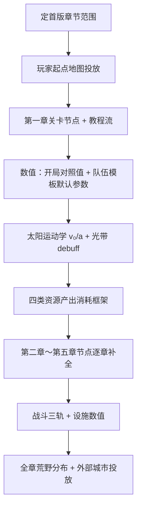

> 状态：草稿（非正式）
> 校验状态：不适用
> 最后更新：2026-07-04

← [草稿](./README.md)

# 数值与关卡设计待办清单

本文汇总当前项目中**数值设计**与**关卡设计**的缺口，供后续讨论与收敛。机制规则以 [02-系统设计](../02-系统设计/) 为准；叙事地理以 [章节划分与故事大纲](../04-设定/05-隐秘真相/章节划分与故事大纲.md) 为准。定案后迁入正式目录，并在 [待细化追踪](../00-规范/待细化追踪.md) 闭环。

---

## 现状摘要

| 领域 | 已有 | 缺失 |
|------|------|------|
| **数值** | 四类资源定义、口粮周总结机制（草稿）、工作对照时长、负载成本规则、战斗三轨框架 | `04-数值框架/` 目录未建；大量 SO 字段仅有占位 |
| **关卡** | 五章故事大纲、各地点设定、核心循环与章节对应表 | `08-关卡与叙事/` 几乎为空；无任务流程、无地图投放、无章节玩法细则 |

**前置依赖**（[待细化追踪 · OPEN-005](../00-规范/待细化追踪.md)）：数值框架整体延后至 [03-程序设计](../03-程序设计/) 侧配置模板（SO 等）搭建完成后再开。下列数值项中标注 **【可先行】** 的，不依赖完整数值框架，可先填各模板默认参数。

---

## 一、数值设计待办

### 1.1 框架与资源经济（P0）

- [ ] **新建** [02-系统设计/04-数值框架/](../02-系统设计/04-数值框架/) 目录与 README 索引
- [ ] 四种资源：**产出速率**、**消耗速率**、**库存上限**、**转换比例**总表（金属 / 食物 / 能源 / 人口）
- [ ] **开局对照值**：玩家起点区段首周四类资源初始量与周净变化目标区间
- [ ] **周总结口粮**数值：每人口每周口粮需求、仓库扣减顺序、队伍载荷容器容量（链 [口粮与周总结](./口粮与周总结/README.md)）
- [ ] 哪些设施持续消耗能源 vs 仅消耗金属建造/修复（链 [四种核心资源](../02-系统设计/04-资源与人口/四种核心资源.md)）

### 1.2 地图与环境（P1）

- [ ] 太阳运动学参数：**v₀**、**a** 默认值及章节内是否分段调整（OPEN-006）
- [ ] **第三章前期结束**的叙事/玩法停用节点（`sun_motion_enabled=false` 触发时机）
- [ ] **黄昏带 / 暗渊带**格级 debuff 清单与数值（产出修正、灾害概率、人口压力等）
- [ ] **动态难度**奖励/惩罚的具体数值表（距离拉近 vs 拉远：资源、威胁、状态修正）
- [ ] 城市移动**速度公式**与**即时**能源/其他消耗（负载成本已定，补其余项；OPEN-007）
- [ ] 负载成本字段：**每 x 格 / y 修复资源**的 x、y 及资源类型（`move_grids_per_load_step` / `repair_resource_cost`）
- [ ] 地图图层完整影响清单与各层数值修正（OPEN-015）

### 1.3 队伍与单位（P1，部分【可先行】）

- [ ] 队伍**总上限**与跨模板**人员分配**规则（OPEN-008）
- [ ] 各模板默认参数【可先行】：
  - [ ] `max_headcount` / `min_headcount` 及低于阈值时的解散/撤回行为
  - [ ] **移动速度倍率**（与人数无关）
  - [ ] **视野格子数**
  - [ ] `headcount_factor_curve` 默认形状（视野 / 负载 / 工作效率 / 攻击战力四通道）
- [ ] **运输队**：载重公式与超载惩罚曲线
- [ ] **工程队**：各设施类型的建造资源消耗与建造速度系数（OPEN-028）
- [ ] **队伍资产**清单：各模板 `team_asset_requirement_json`、生产来源、解散返还（OPEN-044）
- [ ] 通讯相关数值（OPEN-013）：信号覆盖半径/公式、即时通讯维持成本、飞信间隔/速度/搜索半径

### 1.4 战斗与设施（P1）

- [ ] 交战三轨数值（OPEN-035）：
  - [ ] **减员**公式（人数比、地形、城墙等修正）
  - [ ] **建筑损伤**（城区完整度扣减）
  - [ ] **设施耐久**扣减与修复成本
- [ ] **城墙**减免本格受击人口损失的具体比例（OPEN-047）
- [ ] **航行中**城市遭袭的特殊结算规则（与 OPEN-041 交叉）
- [ ] 各设施类型二级清单的建造条件完整规则（OPEN-028）

### 1.5 城市与城区（P1～P2）

- [ ] **城区能力**模块名单与各模块 GE/GA 数值（OPEN-048；停泊/航行双形态参数）
- [ ] **工作效率**修正来源完整 GE 清单（城模块、地形、状态等；OPEN-031）
- [ ] 各 **work_type** 对照时长默认值补全：采集资源、破译、连接/分离、城区改位等（OPEN-032、OPEN-034、OPEN-045）
- [ ] 航行分离时城区 **30%～50%** 完整度损伤的具体取值规则
- [ ] 人口迁移、城区稀有获取途径的数值门槛（OPEN-033）
- [ ] 城市管理系统：人力类型名单、各类型默认编制上限（OPEN-046）

### 1.6 荒野与据点（P2）

- [ ] 各类荒野地点（矿藏、果地、遗迹、村镇、征兵办等）的**储量/产出**默认值
- [ ] 资源点揭示同步时机 `vision_sync_pending` 过期规则（OPEN-014）
- [ ] 村镇/城市交互的贸易价表与关系修正（OPEN-011）
- [ ] 关系事件：侵害累计阈值、痕迹发现/过期（OPEN-043）

---

## 二、关卡设计待办

### 2.1 框架文档（P0）

- [ ] **新建** [08-关卡与叙事/](../02-系统设计/08-关卡与叙事/) 正文（当前仅 README 占位）
- [ ] **关卡设计总纲**：关卡粒度（章节 / 区段 / 节点）、与回合制的关系、失败与回档策略
- [ ] **任务类型 taxonomy**：主线 / 章节节点 / 委托 / 关系事件 / 可选探索
- [ ] **玩家旅程图**：从苏醒到指挥塔终局的阶段目标与能力解锁曲线
- [ ] 与 [核心循环 · 与章节的对应](../02-系统设计/07-玩法循环/核心循环.md#与章节的对应) 互链对齐

### 2.2 世界地图投放（P0～P1）

- [ ] **卷轴地图规格**：宽 20～30 格已定；补全**纵向总长**、各章节占格比例
- [ ] **玩家起点**开局格位、默认地形与资源分布（链 [玩家起点](../04-设定/03-地点与场景/玩家起点.md)）
- [ ] 各章节**区段边界**与地标锚点（铁门关、铁巢、日生之地、渊光城等）在格轴上的位置
- [ ] **荒野地点类型**在章节中的分布规则与可见对象约束（OPEN-017）
- [ ] 外部城市（太阳城、安德雷亚、赫菲斯提亚等）的**生成位置**、势力范围与初始关系
- [ ] 第二章**站队分支**（猎壳人 / 铁壳）在地图上的营地与事件触发区

### 2.3 分章关卡细则

#### 第一章：初速度

- [ ] 「黄昏离去前」的**时间压力**机制：是否有硬 deadline、软惩罚或纯叙事
- [ ] 教程流：苏醒 → 建城 → 首次停泊 → 首次派出队伍 → 首次航行
- [ ] 突破无敌骄阳会封锁的**玩法节点**（安德雷亚、赫菲斯提亚接入时机）
- [ ] 骄阳之子通讯事件的**触发条件**与可选回应
- [ ] 铁门关通行判定与守军交互

#### 第二章：角速度

- [ ] **太阳加速曲线**与**追日失效判定**玩法化（叙事已有，缺机制阈值）
- [ ] 荒地遭遇战密度、猎壳人/铁壳营地布局
- [ ] 铁巢废墟**探索节点**（方舟结构揭示 L1）
- [ ] **铁巢终局**：攻城/谈判/关系分支的关卡结构与胜利条件
- [ ] 章末**转向暗渊**的玩家操作与确认流程

#### 第三章：离心力

- [ ] **太阳移动停用**与全局暗渊带的关卡切换演出/提示
- [ ] 无日照下的**环境惩罚**具体玩法（照明、能源、视野？）
- [ ] 暗渊行进路线上的资源稀缺与补给节奏
- [ ] 指挥塔准入权限相关的**信任危机**事件（不含已废弃的战斗士气）

#### 第四章：摩擦力

- [ ] **救援玩法**：濒危城市的发现、资源分配界面、接纳/拒绝/离开三分支
- [ ] 沿途城市名单、危机类型与道德抉择脚本要点
- [ ] 与骄阳之子**冲突任务**（若有）的触发与结算
- [ ] 返程至玩家起点的**情感节拍**与机制收束

#### 第五章：向心力

- [ ] 渊光城 / 暗渊最深处的**地图结构**
- [ ] **指挥塔**解谜或激活流程（三颗骄阳之心插入顺序与交互）
- [ ] **多重结局分支**：是否公开真相、各结局的前置条件
- [ ] 终局**太阳提速**的玩法演出与通关判定

### 2.4 叙事与玩法衔接（P1～P2）

- [ ] 各章**揭示层级**（L0～L4）对应的玩法触发器与信息投放渠道
- [ ] 主线任务与 [势力系统](../02-系统设计/05-城市与领袖/势力系统.md) 关系事件的编排
- [ ] **骄阳之子**、**巢主**、**渊光教团**（OPEN-049）等关键 NPC 的关卡出场表
- [ ] 可选支线与全收集内容的章节归属
- [ ] 失败条件与**游戏结束**场景（城市解体？人口归零？错过关键节点？）

### 2.5 首版范围裁剪（建议尽早定）

- [ ] 首版可玩章节：**仅第一章** / **第一～二章** / **全五章**？
- [ ] 首版必做关卡节点 vs 可占位节点清单
- [ ] 首版是否包含铁巢终局、指挥塔终局，或仅做到章节过渡

---

## 三、建议推进顺序

| 阶段 | 优先事项 | 理由 |
|------|----------|------|
| **1** | 首版范围裁剪、08-关卡与叙事总纲、玩家起点投放 | 无地图与节点则无法做垂直切片 |
| **2** | 第一章教程 + 时间压力机制、开局数值对照值 | 可最早跑通「苏醒→开拔」 |
| **3** | 太阳 v₀/a、动态难度数值、队伍模板默认参数 | 支撑第一～二章追日体验 |
| **4** | 04-数值框架目录、资源经济总表、口粮周总结定稿 | 依赖 SO 模板，但阻塞长期平衡 |
| **5** | 铁巢/指挥塔等章节 Boss 关卡、战斗三轨数值 | 章节高潮玩法 |
| **6** | 第三～五章暗渊关卡、救援与终局分支 | 可在首版范围确认后并行 |

---

## 四、关联追踪索引

| 主题 | 待细化追踪 | 程序设计缺口 |
|------|------------|--------------|
| 数值框架整体 | OPEN-005 | [设计缺口清单 · P1 地图/城市/资源](../03-程序设计/设计缺口清单.md) |
| 太阳与环境 | OPEN-006 | 同上 |
| 城市移动消耗 | OPEN-007 | 同上 |
| 队伍数值 | OPEN-008 | [设计缺口清单 · 队伍与单位](../03-程序设计/设计缺口清单.md) |
| 战斗数值 | OPEN-035 | 同上 |
| 荒野分布 | OPEN-017 | 同上 |
| 关卡叙事待定 | — | [章节划分 · 待确认事项](../04-设定/05-隐秘真相/章节划分与故事大纲.md#待确认事项) |

---

## 修订记录

| 日期 | 版本 | 说明 |
|------|------|------|
| 2026-07-04 | 0.0.1 | 初稿：汇总数值与关卡设计缺口与建议顺序 |
