← [草稿](./README.md)

**校验状态**：待校验  
**最后更新**：2026-06-30  
**来源**：基于 [02-系统设计/](../02-系统设计/) 已收束内容生成；未覆盖待细化开放项与未同步草稿。  
**同步**：2026-06-30 口粮与周总结（每 7 回合、环境行动后 Orchestrator；废止饥饿与每回合扣粮）；2026-06-29 GAS-lite 执行链、连接分离代价模型。

# 导出

```mermaid
flowchart TD
  n0["游戏流程"]

  subgraph sgTime ["三级时间尺度"]
    n1["三级时间尺度"]
    n2["分钟级"]
    n3["指挥阶段"]
    n4["资源观察"]
    n5["编制调整"]
    n6["即时事件"]
    n7["小时级"]
    n8["跨回合指令"]
    n9["探索与开发"]
    n10["长期"]
    n11["追日与入暗渊"]
    n12["扩张"]
    n13["章节叙事推进"]
    n1 --> n2
    n2 --> n3
    n2 --> n4
    n2 --> n5
    n2 --> n6
    n1 --> n7
    n7 --> n8
    n7 --> n9
    n1 --> n10
    n10 --> n11
    n10 --> n12
    n10 --> n13
  end

  subgraph sgRound ["一轮活动循环"]
    n14["一轮活动循环"]
    n15["轮次开始"]
    n16["任务与委托"]
    n17["解决敌人与危机"]
    n18["解决资源与补给"]
    n19["收集情报与线索"]
    n20["四类活动可并行"]
    n21["本轮结果汇总"]
    n22["发展与维持"]
    n23["确认生存"]
    n24["移动"]
    n25["进入新位置"]
    n26["轮次开始闭合"]
    n14 --> n15
    n15 --> n16
    n15 --> n17
    n15 --> n18
    n15 --> n19
    n16 --> n20
    n17 --> n20
    n18 --> n20
    n19 --> n20
    n20 --> n21
    n21 --> n22
    n22 --> n23
    n23 --> n24
    n24 --> n25
    n25 --> n26
    n26 --> n15
  end

  subgraph sgTurn ["每回合四阶段"]
    n27["每回合四阶段"]
    n28["玩家指挥"]
    n29["编辑指令表"]
    n30["调整行动表"]
    n31["城市管理系统配置"]
    n32["不执行单位能力"]
    n33["指挥结束锁定输入"]
    n34["玩家行动"]
    n35["按行动表顺序"]
    n36["移动城市及己方单位"]
    n37["外部城市不参与"]
    n100["队伍注册生成 ASC"]
    n101["执行前 GA 校验 Tag"]
    n38["AI 行动"]
    n39["外部城市按 game_seed 伪随机顺序"]
    n40["每城各行动一次"]
    n41["环境行动"]
    n42["太阳与光带推移"]
    n43["环境效果结算"]
    n109["周总结钩子 turn%7==0"]
    n110["WeeklySummaryOrchestrator"]
    n111["口粮仓库扣减与 L1 L2 L3 分配"]
    n112["未分到半数减员"]
    n113["ApplyWorkHeadcountChange"]
    n44["进入下一回合"]
    n27 --> n28
    n28 --> n29
    n28 --> n30
    n28 --> n31
    n28 --> n32
    n28 --> n33
    n27 --> n34
    n34 --> n100
    n100 --> n101
    n101 --> n35
    n34 --> n36
    n34 --> n37
    n27 --> n38
    n38 --> n39
    n38 --> n40
    n27 --> n41
    n41 --> n42
    n41 --> n43
    n41 --> n109
    n109 --> n110
    n110 --> n111
    n111 --> n112
    n112 --> n113
    n113 --> n44
    n109 --> n44
    n44 --> n28
  end

  subgraph sgMicro ["每回合微观步骤"]
    n45["每回合微观步骤"]
    n46["生成资源与状态"]
    n47["玩家操作与移动"]
    n48["生成路线"]
    n49["AI 行动"]
    n50["结算与清理"]
    n45 --> n46
    n45 --> n47
    n45 --> n48
    n45 --> n49
    n45 --> n50
    n46 --> n28
    n47 --> n34
    n49 --> n38
    n50 --> n41
  end

  subgraph sgMove ["移动触发并行更新"]
    n51["移动触发并行更新"]
    n52["玩家是否移动"]
    n53["更新时速与消耗"]
    n54["更新敌人框架"]
    n55["更新资源框架"]
    n56["更新基建与交互框架"]
    n57["相对太阳距离判定"]
    n58["奖励倾向"]
    n59["惩罚倾向"]
    n60["确认最后位置"]
    n51 --> n52
    n52 --> n53
    n52 --> n54
    n52 --> n55
    n52 --> n56
    n53 --> n57
    n54 --> n57
    n55 --> n57
    n56 --> n57
    n57 --> n58
    n57 --> n59
    n58 --> n60
    n59 --> n60
    n60 --> n52
  end

  subgraph sgExplore ["停泊后探索子循环"]
    n61["停泊后探索子循环"]
    n62["城市停泊"]
    n63["派出队伍"]
    n64["揭示地点与资源"]
    n65["是否值得开发"]
    n66["建设设施"]
    n67["记录信息并调整路线"]
    n68["运输与维护"]
    n69["补给主城"]
    n70["准备再次移动"]
    n61 --> n62
    n62 --> n63
    n63 --> n64
    n64 --> n65
    n65 --> n66
    n65 --> n67
    n66 --> n68
    n68 --> n69
    n67 --> n70
    n69 --> n70
    n70 --> n24
  end

  subgraph sgTask ["跨回合任务流"]
    n71["跨回合任务流"]
    n72["指令表 current_index"]
    n73["跨回合 running"]
    n74["工作完成度推进"]
    n102["读取 work_efficiency Attribute"]
    n103["GE 贡献快照锁定时长"]
    n75["满阈值结算工作成果"]
    n76["任务中断"]
    n77["意外打断"]
    n78["行动打断"]
    n79["主动中止"]
    n80["retry 或 ended"]
    n71 --> n72
    n72 --> n73
    n73 --> n74
    n74 --> n102
    n102 --> n103
    n103 --> n75
    n71 --> n76
    n76 --> n77
    n76 --> n78
    n76 --> n79
    n76 --> n80
  end

  subgraph sgChapter ["章节环境状态"]
    n81["章节环境状态"]
    n82["第一二章"]
    n83["太阳运动开启"]
    n84["黄昏带至暗渊带梯度"]
    n85["第三章前期以后"]
    n86["太阳运动停用"]
    n87["全场暗渊带"]
    n81 --> n82
    n82 --> n83
    n82 --> n84
    n81 --> n85
    n85 --> n86
    n85 --> n87
  end

  subgraph sgWeekly ["周总结子流程"]
    n114["周总结子流程"]
    n115["每 7 回合环境行动后"]
    n116["buff 与地图为 Catalog 子步骤"]
    n117["按 mobile_city_id 分池结算"]
    n118["城市仓库与队伍载荷分池"]
    n119["领袖 Override 优先一轮"]
    n114 --> n115
    n115 --> n116
    n115 --> n117
    n117 --> n118
    n117 --> n119
  end

  subgraph sgWin ["胜利与失败检查"]
    n88["胜利与失败检查"]
    n89["确认生存时检查"]
    n90["环境行动时检查"]
    n91["资源枯竭"]
    n92["被暗渊吞没"]
    n93["抵达太阳"]
    n120["周总结口粮不足半数减员"]
    n88 --> n89
    n88 --> n90
    n89 --> n91
    n89 --> n92
    n90 --> n93
    n110 --> n120
  end

  subgraph sgDock ["停泊与航行切换"]
    n94["停泊与航行切换流"]
    n95["核心区 dock_to_sail"]
    n96["2 回合工作"]
    n97["核心区 sail_to_dock"]
    n98["2 回合工作"]
    n99["切换后占格与交互边界变化"]
    n94 --> n95
    n95 --> n96
    n94 --> n97
    n97 --> n98
    n94 --> n99
  end

  subgraph sgConnect ["连接与分离流"]
    n104["连接与分离流"]
    n105["停泊多回合工作"]
    n106["无完整度惩罚"]
    n107["航行即时执行"]
    n108["参与城区各减15%完整度"]
    n104 --> n105
    n105 --> n106
    n104 --> n107
    n107 --> n108
  end

  n0 --> n1
  n0 --> n14
  n0 --> n27
  n0 --> n45
  n0 --> n51
  n0 --> n61
  n0 --> n71
  n0 --> n81
  n0 --> n88
  n0 --> n94
  n0 --> n104
  n0 --> n114
  n23 --> n88
  n41 --> n88
  n110 --> n114
```

