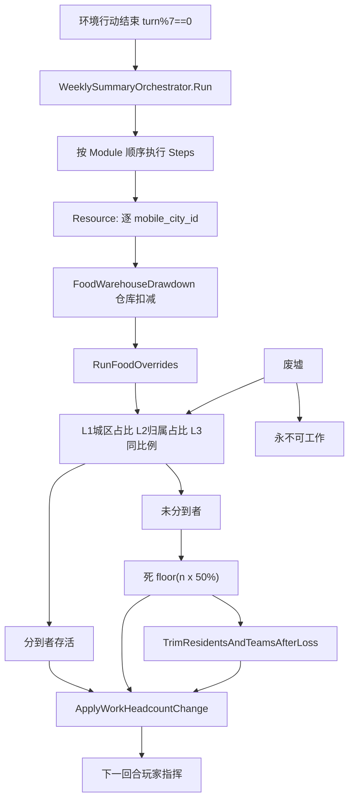
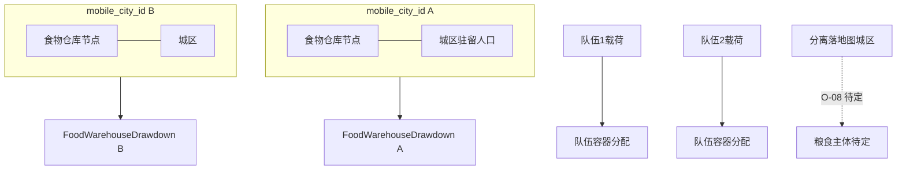
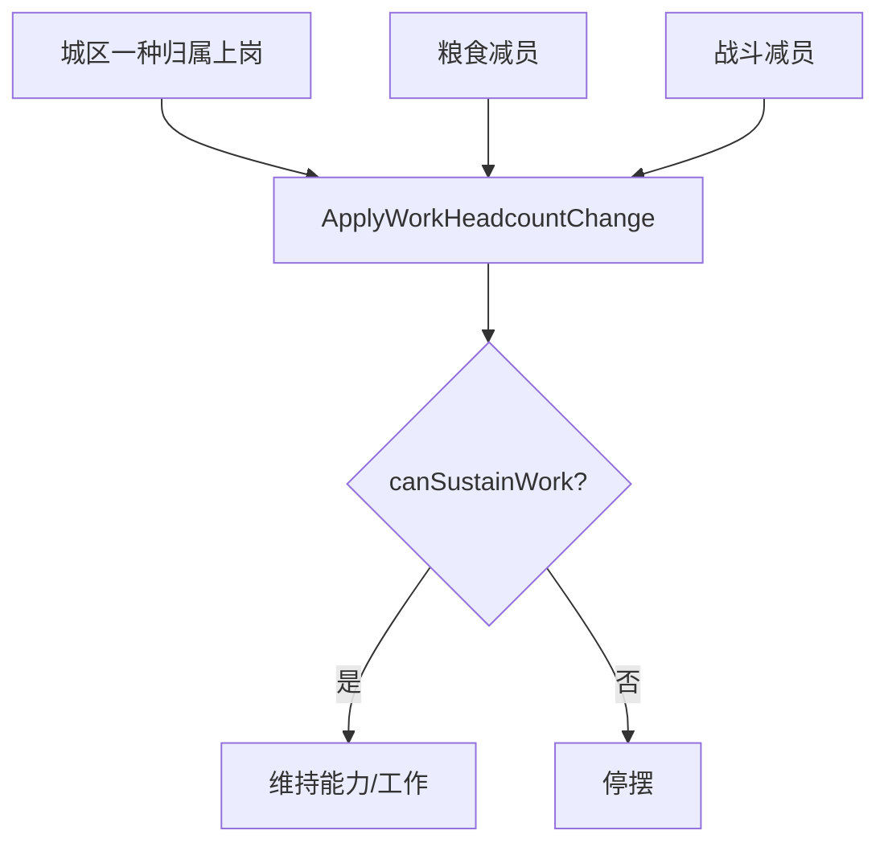

← [粮食与周总结](./README.md)

**状态**：草稿  
**校验状态**：待校验  
**最后更新**：2026-06-30  
**来源**：粮食周总结无饥饿版计划（2026-06-29 迭代 + 2026-06-30 定案）  
**与正式文档关系**：待同步至 [02-系统设计](../../02-系统设计/) 等（详见 [程序落地](./粮食与周总结-程序落地.md) §5.1 清单）

# 粮食与周总结 · 流程与待决

← [总览](./粮食与周总结-总览.md) · [已定案详述](./粮食与周总结-已定案详述.md) · [程序落地](./粮食与周总结-程序落地.md)

---

## 3. 流程图

### 3.1 周总结总流程

### 3.2 移动城市与粮食分区

### 3.3 村镇储量与随行人员

### 3.4 工作人数变化（城区）

---

## 4. 待决与对照

### 4.1 已定（O-N 系列）

| ID | 摘要 | 详述 |
|----|------|------|
| **O-N1** | 队伍占住宅、不计城区驻留人口；载荷分池 | §2.6 |
| **O-N2** | SortKey 离散分配；未分到 ⌊50%⌋ 减员 | §2.4.5、§2.4.6 |
| **O-N3** | 仓库「优先用于充饥」扣减算法 | §2.8 |
| **O-N4** | 废止全局 WorkFirst；工作者优先仅 Override | §2.4.4 |
| **O-N5** | 常驻 UI 每回合充足性 | §2.9 |
| **O-N7** | 废止迁徙人口 → 随行人员 | §2.10 |
| **O-N8** | Override 单管线、无串流 | §2.4.3 |

### 4.2 仍待决（P0）

| ID | 问题 | 说明 |
| ---- | --------------------------------- | --------------------------------------------------------------------------------------------------------------------------------- |
| **O-04** | **`ApplyWorkHeadcountChange` 规格** | 输入输出、`canSustainWork`；OPEN-032 |
| **O-08** | **已分离落地图城区** 粮食结算主体 | 无 `mobile_city_id` 时谁跑结算 |
| **O-09** | **仅占领、领袖未转化** 的 AI 粮食账 | 原领袖 vs 占领方 |
| — | **SortKey 字段** tie-break | 程序定稿 |
| — | **仓库均分余数** | 整数粮食均分细则 |

### 4.3 仍待决（P1 / P2）

| ID | 问题 | 说明 |
| -------- | ------------------------------- | -------------------------------------------------------------- |
| **O-05** | **队伍工作后果** | 粮食减员后指令行为；OPEN-008 |
| **O-10** | **相邻** 是否允许同分区内迁移 | 若相连已足够则可能仅相连即可 |
| **O-13** | 玩家与 AI **同一 turn_number** 同步周总结 | 倾向 **是** |
| **O-16** | 跨分区粮食 **运输/贸易** 细则 | 周总结不串池后的补给路径 |
| **O-17** | 7 回合批量 vs 生产节奏 | 数值框架 |
| **O-18** | 1:1 无调节口 | 儿童/老人等后期扩展 |
| **O-19** | 读档/跳回合 **跳过周总结** | 调试工具 |

### 4.4 已关闭（废止，勿再作待决）

| 旧 ID | 废止原因 |
|-------|----------|
| O-02 | WorkFirst / AffiliationFirst 全局 → O-N4 |
| O-03 | → O-N2 SortKey |
| O-06 | 载荷 vs 城市池汇总 → O-N1 + §2.8 分池 |
| O-07 | 迁徙人口在岗 → §2.10 随行人员 |
| O-11 | 饥饿 cohort 守恒 → 无饥饿 |
| O-12 | 奇数取整 → O-N2b |
| O-14 | AI 默认 WorkFirst → 废止 |
| O-15 | 第 6 回合预告 → §2.9 常驻 UI |
| O-20 | 归属优先救急 → 废止 AffiliationFirst |
| O-21 | 虚拟池 vs 节点 → §2.8 节点实扣 |

### 4.5 OPEN 条目对照

| OPEN | 状态 | 本方案 |
| ------------ | ------------ | ------------------------------- |
| **OPEN-005** | 待对齐 | 周总结结算；未分到 **半数减员** |
| **OPEN-016** | 粮食子项 **闭合** | 按 `mobile_city_id` 独立分配 |
| **OPEN-042** | **废止** 每回合另扣 | 并入周总结；1:1 + 半数减员 |
| **OPEN-033** | 待补 | 随行人员；来源处预先规划住宅 |
| **OPEN-032** | 交叉 O-04 | 人数变化后进行中工作 |
| **OPEN-008** | 交叉 O-05 | 队伍粮食减员后行为 |
| **OPEN-046** | 待改 | 「优先用于充饥」+ 常驻粮食 UI |
| **OPEN-044** | 待补 | 运输载具类 vs 随行人员分轨 |
