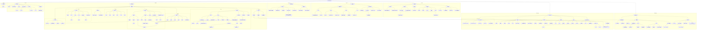

← [草稿](./README.md)

**校验状态**：待校验  
**最后更新**：2026-06-29  
**来源**：基于 [02-系统设计/](../02-系统设计/) 已收束内容生成；未覆盖待细化开放项与未同步草稿。  
**同步**：2026-06-29 GAS-lite（GA/GE/Tag/ASC）、工作区启闭、连接分离代价、设施辅助类细则。

# 导出

```mermaid
flowchart TD
  n0["循光之城 · 系统设计"]

  subgraph sg01 ["01-核心体验"]
    n1["01-核心体验"]
    n2["核心幻想"]
    n3["驾驶模块化移动城市追日"]
    n4["在暗渊吞没世界中延续文明"]
    n5["胜利条件"]
    n6["胜利：抵达太阳"]
    n7["失败：资源枯竭或被吞没"]
    n8["动态难度"]
    n9["相对太阳距离"]
    n10["距离拉近奖励倾向"]
    n11["距离拉远惩罚倾向"]
    n12["五章叙事弧"]
    n13["初速度"]
    n14["角速度"]
    n15["离心力"]
    n16["摩擦力"]
    n17["向心力"]
    n18["平台与操作"]
    n19["PC Windows"]
    n20["3D 策略俯视角"]
    n21["鼠标点击为主"]
    n22["仅一套世界地图观察"]
    n1 --> n2
    n2 --> n3
    n2 --> n4
    n1 --> n5
    n5 --> n6
    n5 --> n7
    n1 --> n8
    n8 --> n9
    n9 --> n10
    n9 --> n11
    n1 --> n12
    n12 --> n13
    n12 --> n14
    n12 --> n15
    n12 --> n16
    n12 --> n17
    n1 --> n18
    n18 --> n19
    n18 --> n20
    n18 --> n21
    n18 --> n22
  end

  subgraph sg02 ["02-地图与世界"]
    n23["02-地图与世界"]
    n24["六边形纵向卷轴"]
    n25["上下持续延伸"]
    n26["左右存在边界"]
    n27["移动城市"]
    n28["多格 footprint"]
    n29["城区模块化占格"]
    n30["停泊"]
    n31["占据世界地图格"]
    n32["队伍可进出"]
    n33["占格建设"]
    n34["禁用整城移动"]
    n35["航行"]
    n36["不占世界地图格"]
    n37["远程通讯"]
    n38["禁止进出与占格建设"]
    n39["核心区切换工作"]
    n40["dock_to_sail 2 回合"]
    n41["sail_to_dock 2 回合"]
    n42["太阳运动"]
    n43["v(t)=v0+a·t"]
    n44["黄昏带向上推移"]
    n45["暗渊带向上推移"]
    n46["第三章后 sun_motion_enabled=false"]
    n23 --> n24
    n24 --> n25
    n24 --> n26
    n23 --> n27
    n27 --> n28
    n27 --> n29
    n27 --> n30
    n30 --> n31
    n30 --> n32
    n30 --> n33
    n30 --> n34
    n27 --> n35
    n35 --> n36
    n35 --> n37
    n35 --> n38
    n27 --> n39
    n39 --> n40
    n39 --> n41
    n23 --> n42
    n42 --> n43
    n42 --> n44
    n42 --> n45
    n42 --> n46
  end

  subgraph sg03 ["03-图层与地点"]
    n47["03-图层与地点"]
    n48["地图系统"]
    n110["响应检测"]
    n111["监听他人行动阶段"]
    n112["满足条件发起行为"]

    subgraph sg03L1 ["L1 地形层"]
      n49["L1 地形层"]
      n50["平原"]
      n51["丘陵"]
      n52["山地"]
      n53["河流"]
      n54["沼泽"]
      n55["裂隙"]
      n49 --> n50
      n49 --> n51
      n49 --> n52
      n49 --> n53
      n49 --> n54
      n49 --> n55
    end

    subgraph sg03L2 ["L2 环境层"]
      n56["L2 环境层"]
      n57["树林"]
      n58["焦土"]
      n59["弹坑"]
      n60["天气"]
      n61["沙暴"]
      n62["暴雨"]
      n63["迷雾"]
      n64["城市轨迹"]
      n65["不可攻击可变更"]
      n56 --> n57
      n56 --> n58
      n56 --> n59
      n56 --> n60
      n60 --> n61
      n60 --> n62
      n60 --> n63
      n56 --> n64
      n56 --> n65
    end

    subgraph sg03L3 ["L3 资源层"]
      n66["L3 资源层"]
      n67["矿藏"]
      n68["果地"]
      n69["遗迹"]
      n70["村镇"]
      n71["储量"]
      n72["可建立采集设施"]
      n66 --> n67
      n66 --> n68
      n66 --> n69
      n66 --> n70
      n66 --> n71
      n66 --> n72
    end

    subgraph sg03L4 ["L4 建筑层"]
      n73["L4 建筑层"]
      n74["城区"]
      n75["特殊城区"]
      n76["一般城区"]
      n77["骄阳之心"]
      n78["核心区"]
      n79["废墟"]
      n80["结构完整度低于20%"]
      n81["可修复"]
      n82["可拆解回收"]
      n83["连接与分离"]
      n84["拆解与重组"]
      n85["负载成本"]
      n195["工作区启用与关闭"]
      n196["关闭节省能源金属运作人口"]
      n197["城区能力激活"]
      n198["切换式持续 GE"]
      n199["一次性瞬时 GE"]
      n200["停泊连接分离多回合工作"]
      n201["航行连接分离减15%完整度"]
      n205["城坞"]
      n206["通讯站"]
      n73 --> n74
      n74 --> n75
      n74 --> n76
      n75 --> n77
      n75 --> n78
      n73 --> n79
      n79 --> n80
      n79 --> n81
      n79 --> n82
      n73 --> n83
      n73 --> n84
      n73 --> n85
      n74 --> n195
      n195 --> n196
      n75 --> n197
      n197 --> n198
      n197 --> n199
      n75 --> n205
      n75 --> n206
      n83 --> n200
      n83 --> n201
    end

    subgraph sg03L5 ["L5 设施层"]
      n86["L5 设施层"]
      n87["占格类"]
      n88["地形类"]
      n89["桥梁"]
      n90["生产类"]
      n91["储量转化"]
      n92["物品转化"]
      n93["仓储类"]
      n94["辅助类"]
      n95["哨塔"]
      n96["城墙"]
      n97["屋舍"]
      n98["提升居民承载"]
      n99["耐久可被摧毁"]
      n100["有效时提供 buff 与 debuff"]
      n202["陷阱"]
      n203["驿站"]
      n204["城墙格内人口减损减免"]
      n86 --> n87
      n87 --> n88
      n88 --> n89
      n87 --> n90
      n90 --> n91
      n90 --> n92
      n87 --> n93
      n86 --> n94
      n94 --> n95
      n94 --> n96
      n94 --> n202
      n94 --> n203
      n96 --> n204
      n86 --> n97
      n97 --> n98
      n86 --> n99
      n86 --> n100
    end

    subgraph sg03L6 ["L6 物品层"]
      n101["L6 物品层"]
      n102["存量与上限"]
      n103["队伍能搬运物品"]
      n104["队伍资产"]
      n105["专篇计划中"]
      n101 --> n102
      n101 --> n103
      n101 --> n104
      n101 --> n105
    end

    subgraph sg03L7 ["L7 单位层"]
      n106["L7 单位层"]
      n107["移动城市"]
      n108["外出队伍"]
      n109["外部城市单位"]
      n106 --> n107
      n106 --> n108
      n106 --> n109
    end

    n47 --> n48
    n48 --> n49
    n48 --> n56
    n48 --> n66
    n48 --> n73
    n48 --> n86
    n48 --> n101
    n48 --> n106
    n48 --> n110
    n110 --> n111
    n110 --> n112
  end

  subgraph sg04 ["04-资源与人口"]
    n113["04-资源与人口"]
    n114["四种核心资源"]
    n115["金属"]
    n116["设施与城区建造修补升级"]
    n117["资产生产"]
    n118["食物"]
    n119["维持人口"]
    n120["远征补给可选开关"]
    n121["供应不足人口衰减"]
    n122["能源"]
    n123["特殊城区能力维持"]
    n124["部分设施运行"]
    n125["人口"]
    n126["居民与工作人口"]
    n127["队伍编制额度"]
    n128["城市管理系统"]
    n129["资源存储分配"]
    n130["人口住房分配"]
    n131["城区运作人力分配"]
    n132["仅己方与占领城区"]
    n113 --> n114
    n114 --> n115
    n115 --> n116
    n115 --> n117
    n114 --> n118
    n118 --> n119
    n118 --> n120
    n118 --> n121
    n114 --> n122
    n122 --> n123
    n122 --> n124
    n114 --> n125
    n125 --> n126
    n125 --> n127
    n113 --> n128
    n128 --> n129
    n128 --> n130
    n128 --> n131
    n128 --> n132
  end

  subgraph sg05 ["05-城市与领袖"]
    n133["05-城市与领袖"]
    n134["势力系统"]
    n135["外部城市不可整体移动"]
    n136["每城独立关系主体"]
    n137["可归属组织"]
    n138["组织内关系传导"]
    n139["间接变化等于直接变化乘四分之一"]
    n140["侵害事件延迟传导"]
    n141["领袖与势力"]
    n142["每城一名城市领袖"]
    n143["每势力一名势力领袖"]
    n133 --> n134
    n134 --> n135
    n134 --> n136
    n134 --> n137
    n134 --> n138
    n138 --> n139
    n134 --> n140
    n133 --> n141
    n141 --> n142
    n141 --> n143
  end

  subgraph sg06 ["06-单位与交战"]
    n144["06-单位与交战"]
    n145["队伍系统"]
    n146["侦察队"]
    n147["勘探队"]
    n148["运输队"]
    n149["工程队"]
    n150["飞信"]
    n151["模板 GA/GE 组合"]
    n152["资源揭示三级"]
    n153["hidden"]
    n154["kind"]
    n155["amount"]
    n156["队伍资产组建门槛"]
    n157["人数比影响能力"]
    n207["人数比写入 work_efficiency GE"]
    n208["执行前 GA 校验 Tag"]
    n158["交战系统"]
    n159["队伍减员"]
    n160["建筑结构损伤"]
    n161["设施耐久损失"]
    n162["数值框架待定"]
    n163["行为通道"]
    n164["战斗"]
    n165["工作"]
    n166["即时能力"]
    n167["响应"]
    n168["意外打断"]
    n169["行动打断"]
    n170["主动中止"]
    n171["通讯与飞讯系统"]
    n172["即时通讯"]
    n173["飞信"]
    n174["占位级细则待定"]

    subgraph sg06GAS ["GAS-lite 能力管线"]
      n189["GAS-lite 能力管线"]
      n190["GameplayEffectConfigSO"]
      n191["GameplayAbilityConfigSO"]
      n192["GameplayTag"]
      n193["AttributeSet"]
      n194["ASC 能力系统组件"]
      n189 --> n190
      n189 --> n191
      n189 --> n192
      n189 --> n193
      n189 --> n194
    end

    n144 --> n145
    n145 --> n146
    n145 --> n147
    n145 --> n148
    n145 --> n149
    n145 --> n150
    n145 --> n151
    n145 --> n207
    n145 --> n208
    n144 --> n189
    n145 --> n152
    n152 --> n153
    n152 --> n154
    n152 --> n155
    n145 --> n156
    n145 --> n157
    n157 --> n207
    n144 --> n158
    n158 --> n159
    n158 --> n160
    n158 --> n161
    n158 --> n162
    n144 --> n163
    n163 --> n164
    n163 --> n165
    n163 --> n166
    n144 --> n167
    n167 --> n168
    n167 --> n169
    n167 --> n170
    n144 --> n171
    n171 --> n172
    n171 --> n173
    n171 --> n174
  end

  subgraph sg07 ["07-玩法循环"]
    n175["07-玩法循环"]
    n176["指令表"]
    n177["跨回合任务规划"]
    n178["行动表"]
    n179["本回合行动顺序"]
    n180["工作状态"]
    n181["pending"]
    n182["running"]
    n183["suspended"]
    n184["done"]
    n185["探索与扩张"]
    n186["停泊后派出队伍"]
    n175 --> n176
    n175 --> n177
    n175 --> n178
    n175 --> n179
    n175 --> n180
    n180 --> n181
    n180 --> n182
    n180 --> n183
    n180 --> n184
    n175 --> n185
    n185 --> n186
  end

  subgraph sg08 ["08-关卡与叙事"]
    n187["08-关卡与叙事"]
    n188["待完善"]
    n187 --> n188
  end

  n0 --> n1
  n0 --> n23
  n0 --> n47
  n0 --> n113
  n0 --> n133
  n0 --> n144
  n0 --> n175
  n0 --> n187
  n67 --> n91
  n68 --> n91
  n69 --> n91
  n70 --> n91
  n91 --> n92
  n93 --> n102
  n108 --> n145
  n107 --> n27
```
