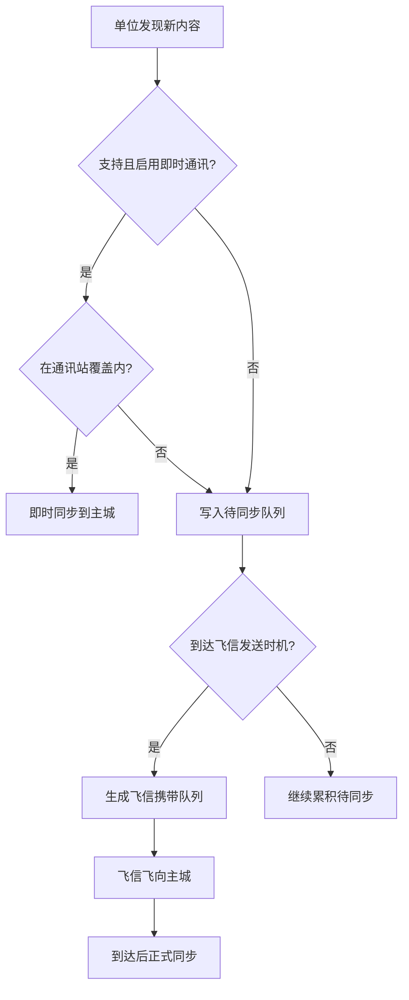

> 来源：脑暴 / 自 [通讯与飞信系统](../02-系统设计/06-单位与交战/通讯与飞讯系统.md) 拆出
> 日期：2026-06-25
> **性质：非正式草稿**
> 是否整理到正式文档：**否**（细则未定，勿当作验收依据）

← [草稿](./README.md)

# 通讯与飞信（非正式草稿）

本文是 **即时通讯** 与 **飞信** 机制的单独书写稿，允许跳跃、待定与反复修改。收敛后应回写 [通讯与飞信系统](../02-系统设计/06-单位与交战/通讯与飞讯系统.md) 并关闭 [OPEN-013](../00-规范/待细化追踪.md) 等开放项。

**关联正式占位**：[通讯与飞信系统](../02-系统设计/06-单位与交战/通讯与飞讯系统.md) · [单位类型与视野 · 飞信](../02-系统设计/06-单位与交战/单位类型与视野.md#5-飞信模板) · [城市模块化 · 通讯站](../02-系统设计/03-图层与地点/建筑层/城区总览.md#特殊城区) · [程序设计 · 通讯与视野同步数据结构](../03-程序设计/03-数据字典/通讯与视野同步数据结构.md)

---

## 模块定位

| 子模块 | 一句话 |
|--------|--------|
| **通讯** | 在信号覆盖内，外出单位与主城**实时**同步视野与状态 |
| **飞信** | 无即时通讯或超出覆盖时，用**一次性传递单位**把积压信息送回主城（有延迟） |

二者解决同一问题：**城市与外出单位之间的信息回流**；玩家据此承担「旧情报」「未知死亡」等策略风险。

---

## 即时通讯

### 何时可用

须**同时**满足：

1. 单位类型**支持**即时通讯（SO 配置）。
2. 单位**已启用**即时通讯（可能有维持成本，待定）。
3. 单位处于**通讯站信号覆盖**范围内。

### 通讯站

- **城内**：为核心区提供基础信号覆盖；主城占格及邻近范围有即时视野（见下节「核心区视野」）。
- **城外**：覆盖范围内的己方外出单位可点亮即时通讯；**超出覆盖则即时同步失败**，改走飞信（若该单位能发飞信）。

覆盖范围计算方式 **待定**（格子半径 / 六边形距离 / 其他）—— OPEN-013。

### 同步失败

- 支持即时通讯但**不在覆盖内** → 本回合不同步，信息进入**待同步队列**。
- 是否自动降级为飞信、是否提示玩家 **待定**。

### 配置项（草案）

| 属性 | 说明 |
|------|------|
| 支持即时通讯 | 单位类型是否具备能力 |
| 默认启用即时通讯 | 创建时是否开启 |
| 即时通讯功耗 | 维持消耗（资源类型待定） |

---

## 飞信

### 何时触发

- 单位**不支持**或未启用即时通讯；或
- 即时通讯**同步失败**（如出覆盖）；且
- 单位具备**发送飞信**能力（SO 配置）。

### 发送节奏

- **定期**：每 X 回合自动汇总待同步队列并发出（X 待定）。
- **地点**：到达特定地点时发送？**待定**。
- **手动**：紧急汇报按钮？**待定**。

### 飞信实体

- **一次性单位**：从队伍位置飞向主城（核心区）。
- **携带内容**：本批待同步的视野记录（资源点、敌人、地形变化等）。
- **飞行时间**：距离 ÷ 飞信速度（速度与队伍移速关系待定）。
- **独立视野**：飞行途中可能发现新格内容，是否并入本批或下批 **待定**。

### 风险（待定）

- 飞行中被拦截 / 丢失？
- 阵亡信息是否随飞信送达（与 OPEN-025 交叉）？

### 配置项（草案）

| 属性 | 说明 |
|------|------|
| 发送飞信能力 | 是否可发飞信 |
| 飞信发送间隔 | 自动发送频率（回合） |
| 飞信速度 | 移动速度 |

---

## 视野与同步流程

### 核心区视野

- 与核心区连接的主城提供**即时视野**：占格及周围一定范围信息实时可见，无需飞信。

### 外出单位视野

- 队伍自有独立视野；发现的内容须经**通讯**或**飞信**回传后，才进入玩家战略地图的「已知」层。

### 流程（草案）

---

## 与停泊 / 航行的关系（草案）

- **停泊**：物理座落地图，队伍可抵近据点；通讯站覆盖与野外设施交互按地图格计算（细则待定）。
- **航行**：城市与外界以**远程**交互为主；外出队伍与主城的通讯 / 飞信规则是否变化 **待定**（见 [地图与移动 · 停泊与航行](../02-系统设计/02-地图与世界/地图与移动.md#停泊与航行)）。

---

## 关系事件（已回写正式文档）

侵害行为如何影响城市关系的**完整口径**已写入正式文档，本草稿不再重复展开：

- [势力系统 · 单位归属来源城市与关系事件](../02-系统设计/05-城市与领袖/势力系统.md#单位归属来源城市与关系事件)
- [通讯与飞讯系统 · 关系事件传导](../02-系统设计/06-单位与交战/通讯与飞讯系统.md#关系事件传导)

摘要：**路径 A** 事件积压在受害单位本地 → 飞信/通讯回传 → 更新 `home_city_ref` 关系；歼灭前未送出则留 **关系痕迹**。**路径 B** 无飞信延迟时当场结算。

---

## 未知死亡与延迟宣告

与 [回合与行动表 · 未知死亡与延迟宣告](../02-系统设计/07-玩法循环/回合与行动表.md#未知死亡与延迟宣告) 联动：

- 逻辑死亡 ≠ 玩家立刻知晓。
- 宣告前 UI 可保留指令表 / 行动表（OPEN-024）。
- 即时通讯、飞信能否触发或提前「死亡宣告」—— **OPEN-025**。

---

## 多核心城市（待定）

- 多个核心区时，视野与待同步队列如何合并？
- 飞信目标飞向哪个核心？**待定**（OPEN-013）。

---

## 开放问题清单

- [ ] 通讯站覆盖：半径、城内/城外是否一致、升级扩建
- [ ] 即时通讯维持成本
- [ ] 飞信：发送频率、速度、手动发送、丢失/拦截
- [ ] 航行中远程交互与通讯的关系
- [ ] 多核心整合
- [ ] 未知死亡经何种通道宣告（OPEN-025）

---

## 修订记录

| 日期 | 说明 |
|------|------|
| 2026-06-25 | 自系统设计拆出；通讯与飞信分节；标为非正式草稿 |
| 2026-06-27 | 关系事件传导回写至势力系统 / 通讯与飞讯系统；本页留摘要链 |
