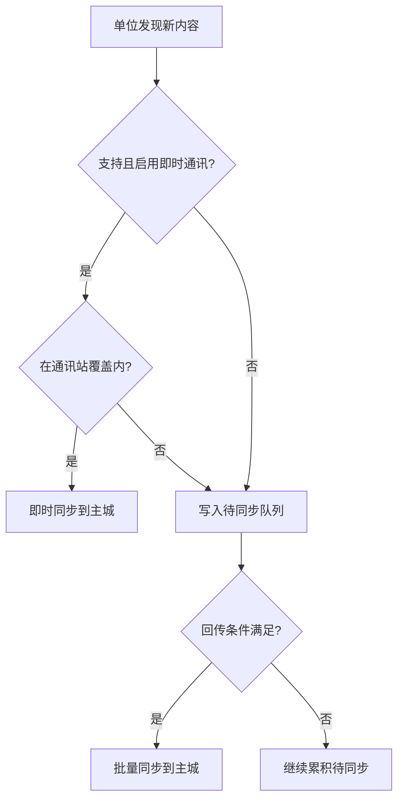

> **飞信机制已废止**（2026-07-05）。下文「飞信」章节仅供历史对照，首版以 **即时通讯 + 待同步队列** 为准；收敛后回写 [通讯与视野系统](../02-系统设计/06-单位与交战/通讯与视野系统.md)。

> 来源：脑暴 / 自 [通讯与视野系统](../02-系统设计/06-单位与交战/通讯与视野系统.md) 拆出
> 日期：2026-06-25
> **性质：非正式草稿**
> 是否整理到正式文档：**否**（细则未定，勿当作验收依据）

← [草稿](./README.md)

# 通讯与飞信（非正式草稿）

本文是 **即时通讯** 机制的单独书写稿（**飞信章节已废止**），允许跳跃、待定与反复修改。收敛后应回写 [通讯与视野系统](../02-系统设计/06-单位与交战/通讯与视野系统.md) 并关闭 [OPEN-013](../00-规范/待细化追踪.md) 等开放项。

**关联正式占位**：[通讯与视野系统](../02-系统设计/06-单位与交战/通讯与视野系统.md) · [城市模块化 · 通讯站](../02-系统设计/03-图层与地点/建筑层/城区总览.md#特殊城区) · [程序设计 · 通讯与视野同步数据结构](../03-程序设计/03-数据字典/通讯与视野同步数据结构.md)

---

## 模块定位

| 子模块 | 一句话 |
|--------|--------|
| **即时通讯** | 在信号覆盖内，外出单位与主城**实时**同步地图情报与关系事件 |
| **待同步队列** | 超出覆盖或未启用即时通讯时，野外发现**积压**，待回传规则定案（OPEN-013） |
| ~~**飞信**~~ | **已废止** |

本系统解决 **城市与外出单位之间的地图情报回流**；玩家据此承担「战略地图上的旧情报」等风险。**不**包含己方队伍阵亡的延迟告知（见 [回合与行动表 · 队伍阵亡与清理](../02-系统设计/07-玩法循环/回合与行动表.md#队伍阵亡与清理)）。

---

## 即时通讯

### 何时可用

须**同时**满足：

1. 单位类型**支持**即时通讯（SO 配置）。
2. 单位**已启用**即时通讯（可能有维持成本，待定）。
3. 单位处于**通讯站信号覆盖**范围内。

### 通讯站

- **城内**：为核心区提供基础信号覆盖；主城占格及邻近范围有即时视野（见下节「核心区视野」）。
- **城外**：覆盖范围内的己方外出单位可即时同步；**超出覆盖则本回合不同步**，写入**待同步队列**。

覆盖范围计算方式 **待定**（格子半径 / 六边形距离 / 其他）—— OPEN-013。

### 同步失败

- 支持即时通讯但**不在覆盖内** → 本回合不同步，信息进入**待同步队列**。
- 积压条目何时批量回传、是否提示玩家 **待定**（OPEN-013）。

### 配置项（草案）

| 属性 | 说明 |
|------|------|
| 支持即时通讯 | 单位类型是否具备能力 |
| 默认启用即时通讯 | 创建时是否开启 |
| 即时通讯功耗 | 维持消耗（资源类型待定） |

---

## 飞信（**已废止**，仅供历史对照）

> 本节机制首版不纳入；超出覆盖时改走 **待同步队列**（OPEN-013）。

（历史草案正文保留于版本库旧版，勿实现。）

---

## 视野与同步流程

### 核心区视野

- 与核心区连接的主城提供**即时视野**：占格及周围一定范围信息实时可见，无需外出单位回传。

### 外出单位视野

- 队伍自有独立视野；发现的**地图情报**须经**即时通讯**或**待同步队列**回传后，才进入玩家战略地图的「已知」层。

### 流程（草案）

---

## 与停泊 / 航行的关系（草案）

- **停泊**：物理座落地图，队伍可抵近据点；通讯站覆盖与野外设施交互按地图格计算（细则待定）。
- **航行**：城市与外界以**远程**交互为主；外出队伍与主城的即时通讯 / 待同步规则是否变化 **待定**（见 [地图与移动 · 停泊与航行](../02-系统设计/02-地图与世界/地图与移动.md#停泊与航行)）。

---

## 关系事件（已回写正式文档）

侵害行为如何影响**领袖关系**的**完整口径**已写入正式文档，本草稿不再重复展开：

- [势力系统 · 人口损失与关系事件传导](../02-系统设计/05-城市与领袖/势力系统.md#人口损失与关系事件传导)
- [通讯与视野系统 · 关系事件传导](../02-系统设计/06-单位与交战/通讯与视野系统.md#关系事件传导)

摘要：**路径 A** 事件积压在受害单位本地 → 即时通讯 / 待同步队列回传 → 更新 `home_city_ref` 关系；歼灭前未送出则留 **关系痕迹**。**路径 B** 覆盖内当场结算。

---

## 多核心城市（待定）

- 多个核心区时，视野与待同步队列如何合并？**待定**（OPEN-016 / OPEN-013）。

---

## 开放问题清单

- [ ] 通讯站覆盖：半径、城内/城外是否一致、升级扩建
- [ ] 即时通讯维持成本
- [ ] 待同步队列：积压回传时机、批量规则、过期与提示
- [ ] 航行中远程交互与通讯的关系
- [ ] 多核心整合

---

## 修订记录

| 日期 | 说明 |
|------|------|
| 2026-06-25 | 自系统设计拆出；通讯与飞信分节；标为非正式草稿 |
| 2026-07-05 | 飞信机制废止；模块定位与关联链接更新 |
| 2026-06-27 | 关系事件传导回写至势力系统 / 通讯与视野系统；本页留摘要链 |
| 2026-07-07 | 移除未知死亡联动；更新同步流程图；情报延迟与己方阵亡分轨 |
