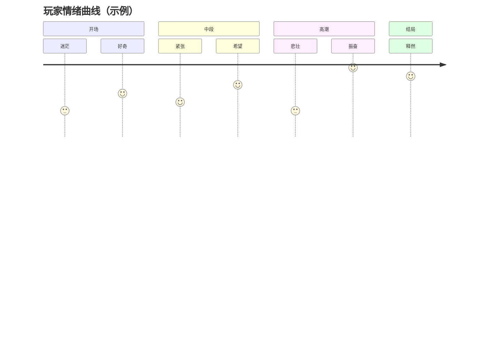

> 状态：草稿
> 程序实现：待补充

# 核心幻想

## 一句话描述

（请用一句话概括《循光之城》的核心理想体验。）

> 示例：在一座濒临熄灭的城市中，玩家扮演追光者，通过收集与传递残存的光源，点亮道路、解开秘密、改变城市命运。

## 关键词

- 光 / 暗
- 城市 / 废墟 / 高空
- 追寻 / 传承 / 牺牲

## 玩家目标

- 短期目标：
- 中期目标：
- 长期目标：

## 情绪曲线

（描述玩家从开始到结局的情绪起伏。）

## 参考作品

| 作品 | 可借鉴点 |
|------|----------|
| | |

## 修订记录

| 日期 | 版本 | 说明 |
|------|------|------|
| 2026-06-20 | 0.1.0 | 初稿 |
