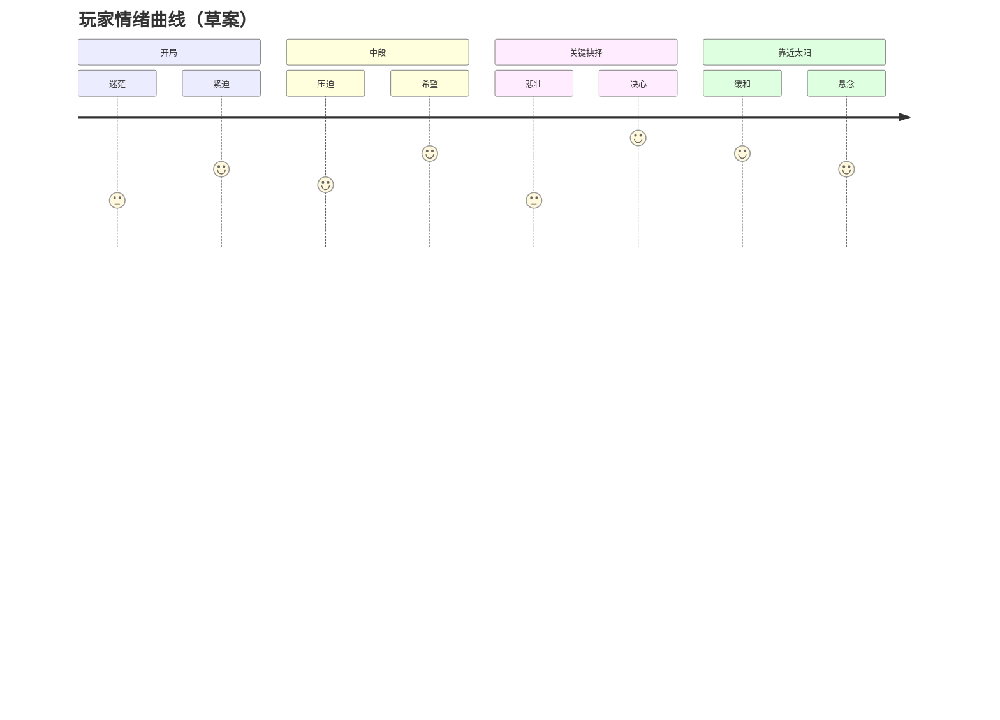

> 状态：草稿
> 程序实现：[03-程序设计/01-架构总览/模块划分.md](../../03-程序设计/01-架构总览/模块划分.md)

← [核心体验](./README.md)

# 核心幻想

| 字段 | 内容 |
|------|------|
| 状态 | 草稿 |
| 校验状态 | 待校验 |
| 日期 | 2026-06-23 |
| 相关设定 | [核心世界观](../../04-设定/01-世界观/核心世界观.md)、[世界概述](../../04-设定/01-世界观/世界概述.md) |
| 相关系统 | [核心体验与胜利条件](../01-核心系统/核心体验与胜利条件.md)、[核心循环](../02-玩法循环/核心循环.md)、[城市模块化](../03-模块与城市/城市模块化.md) |

## 一句话描述

驾驶一座可拆解、重组、改造的[模块化巨城](../03-模块与城市/城市模块化.md)，在世界正在被暗渊逐步吞没的末日中追逐那道正在消逝的光。太阳曾永恒不动，划分了光与暗的疆域；如今它正在离去，身后的白昼逐一熄灭，沦为新的暗渊。这是一场持续的逃亡：追光，即是追生；停滞，即是沦为暗渊的一部分。在资源、危机与牺牲之间做出抉择，于正在被吞没的世界中延续文明的火种。

## 关键词

- 后启示录 / 太阳朋克
- 移动城市 / 模块化 / 取舍
- 追逐太阳 / 前进 / 延续
- 绝望 / 希望 / 牺牲

## 玩家目标

- **短期目标**：维持[四种核心资源](../02-资源循环/四种核心资源.md)平衡，让城市在当前区域生存并补给。
- **中期目标**：通过[探索与扩张](../01-核心系统/探索与扩张.md)点亮荒野、建立采集站与驿站，扩张或重组城区以应对前方地形。
- **长期目标**：驾驶城市抵达太阳所在地，延续文明；揭示世界隐藏设定（长期悬念）。

## 情绪曲线

玩家在持续前进中经历「资源紧缺的压迫 → 探索发现的短暂希望 → 地形或取舍带来的悲壮 → 靠近太阳时的缓和与新的稀缺」循环。整体基调是后启示录的沉重，但视觉上保留太阳朋克式的废墟重生感。

## 参考作品

| 作品 | 可借鉴点 |
|------|----------|
| 《冰汽时代》 | 末日城市经营、道德与资源取舍 |
| 《无光之海》 | 探索未知、叙事驱动、绝望氛围 |
| 《文明6》 | 回合制策略、区域扩张与长期规划 |

## 修订记录

| 日期 | 版本 | 说明 |
|------|------|------|
| 2026-06-20 | 0.0.1 | 初稿 |
| 2026-06-21 | 0.0.2 | 按核心设计收敛内容，补全元数据与交叉链接；正文首次提及加链；对外表述统一为「太阳」 |
| 2026-06-23 | 0.0.3 | 刷新图片 |
| 2026-06-24 | 0.0.4 | 核心幻想改为先建立长期固定不变的太阳，再讲太阳移动的异常事件 |
| 2026-06-24 | 0.0.5 | 用更自然流畅的语言重写 |
| 2026-06-24 | 0.0.6 | 明确世界分为永恒的白昼与永恒的暗渊 |
| 2026-06-24 | 0.0.7 | 用更具史诗感的语言润色核心幻想 |
| 2026-06-24 | 0.0.8 | 强调世界被吞没是正在进行的过程 |
| 2026-06-24 | 0.0.9 | 参考作品改为冰汽时代、无光之海、文明6 |
