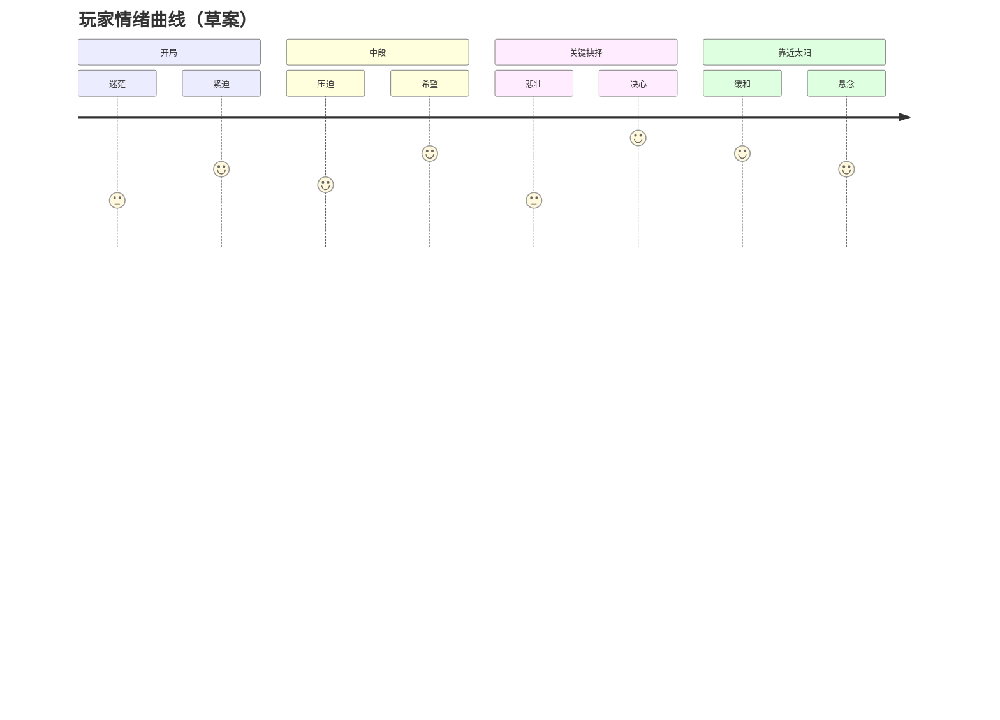

> 状态：草稿
> 程序实现：[03-程序设计/01-架构总览/模块划分.md](../../03-程序设计/01-架构总览/模块划分.md)

# 核心幻想

| 字段 | 内容 |
|------|------|
| 状态 | 草稿 |
| 日期 | 2026-06-21 |
| 相关设定 | [核心世界观](../../04-设定/01-世界观/核心世界观.md)、[世界概述](../../04-设定/01-世界观/世界概述.md) |
| 相关系统 | [核心体验与胜利条件](../01-核心系统/核心体验与胜利条件.md)、[核心循环](../02-玩法循环/核心循环.md)、[城市模块化](../03-模块与城市/城市模块化.md) |

## 一句话描述

驾驶一座可拆解重组的模块化移动城市，在末日废土上追逐移动的人造太阳，在资源、速度与牺牲之间做出艰难抉择，以求文明延续。

## 关键词

- 后启示录 / 太阳朋克
- 移动城市 / 模块化 / 取舍
- 追逐太阳 / 前进 / 延续
- 绝望 / 希望 / 牺牲

## 玩家目标

- **短期目标**：维持四类资源平衡，让城市在当前区域生存并补给。
- **中期目标**：探索荒野、建立采集站与驿站，扩张或重组城区以应对前方地形。
- **长期目标**：驾驶城市抵达人造太阳所在地，延续文明；揭示世界底层真相（远景悬疑）。

## 情绪曲线

玩家在持续前进中经历「资源紧缺的压迫 → 探索发现的短暂希望 → 地形或取舍带来的悲壮 → 靠近太阳时的缓和与新的稀缺」循环。整体基调是后启示录的沉重，但视觉上保留太阳朋克式的废墟重生感。

## 参考作品

| 作品 | 可借鉴点 |
|------|----------|
| 《Frostpunk》 | 末日城市经营、道德与资源取舍 |
| 《Sunless Sea》 | 探索未知、叙事驱动、绝望氛围 |
| 《Airships: Conquer the Skies》 | 模块化建造、可拆分组合载具 |
| 《异星工厂》 | 资源链、生产基地扩张 |

## 修订记录

| 日期 | 版本 | 说明 |
|------|------|------|
| 2026-06-20 | 0.1.0 | 初稿 |
| 2026-06-21 | 0.2.0 | 按核心设计收敛内容，补全元数据与交叉链接 |
