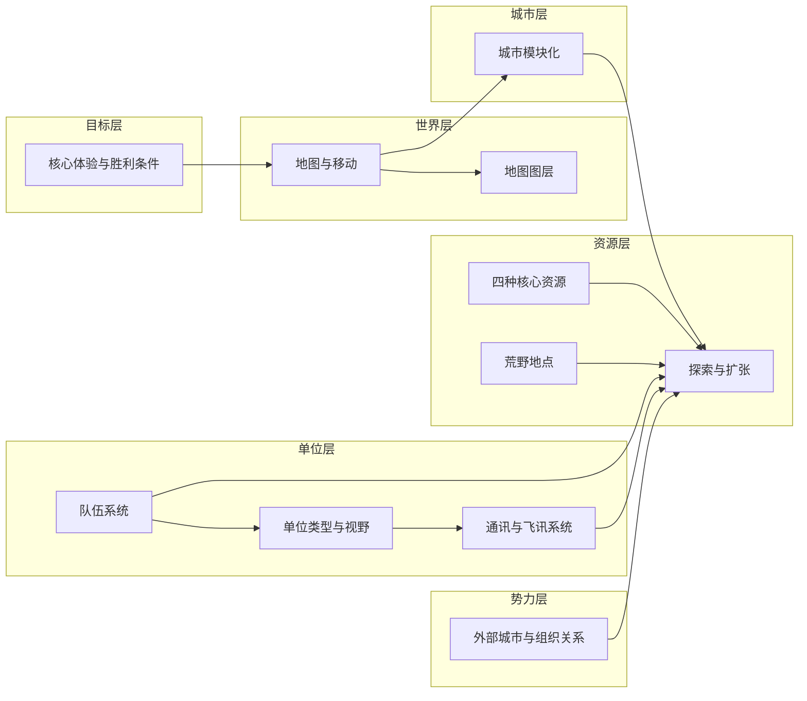

# 核心系统

本目录存放《循光之城》的**核心玩法机制**：地图、移动、队伍、探索、通讯与外部势力等。这些系统由 [02-玩法循环](../02-玩法循环/) 中的回合推进驱动，共同支撑 [核心循环](../02-玩法循环/核心循环.md) 中的三级玩家行为。

核心系统的职责不是重复每回合流程，而是回答玩家在循环中遇到的具体问题：**为什么必须前进、怎样移动城市、停下后能做什么、信息如何回到主城、外部势力如何回应**。

← [系统设计](../README.md)

## 阅读顺序

建议按下列顺序阅读或补文档，避免规则分散：

| 顺序 | 文档 | 先回答的问题 |
|------|------|--------------|
| 1 | [核心体验与胜利条件](./核心体验与胜利条件.md) | 玩家为何必须持续前进，胜利与失败压力从何而来 |
| 2 | [地图与移动](./地图与移动.md) | 世界地图如何承载移动城市，停泊与航行如何切换 |
| 3 | [地图图层](./地图图层.md) | 地形、资源、设施、单位如何在同一格上共同生效 |
| 4 | [城市模块化](../03-模块与城市/城市模块化.md) | 城区如何连接、分离、牺牲与重组 |
| 5 | [队伍系统](./队伍系统.md)、[单位类型与视野](./单位类型与视野.md) | 玩家如何把城市能力带到荒野 |
| 6 | [通讯与飞讯系统](./通讯与飞讯系统.md) | 外出单位的信息如何同步回主城 |
| 7 | [探索与扩张](./探索与扩张.md) | 停下后的勘探、建设、运输与据点交互如何闭合 |
| 8 | [外部城市与组织关系](./外部城市与组织关系.md) | 外部城市如何行动，关系变化如何传导 |

## 系统分层

| 层级 | 回答的问题 | 文档 |
|------|------------|------|
| **目标层** | 玩家为何前进、如何获胜、压力从哪来 | [核心体验与胜利条件](./核心体验与胜利条件.md) |
| **世界层** | 地图如何构成、城市如何移动与停泊 | [地图与移动](./地图与移动.md)、[地图图层](./地图图层.md) |
| **城市层** | 城区如何拆分、连接与重组 | [城市模块化](../03-模块与城市/城市模块化.md) |
| **资源层** | 四类资源如何产出与消耗、荒野有什么 | [四种核心资源](../02-资源循环/四种核心资源.md)、[荒野地点](../02-资源循环/荒野地点.md)、[探索与扩张](./探索与扩张.md) |
| **单位层** | 队伍如何组建、视野如何同步 | [队伍系统](./队伍系统.md)、[单位类型与视野](./单位类型与视野.md)、[通讯与飞讯系统](./通讯与飞讯系统.md) |
| **势力层** | 外部城市如何行动、关系如何传导 | [外部城市与组织关系](./外部城市与组织关系.md) |

## 系统依赖关系

| 系统 | 上游（依赖） | 下游（支撑） |
|------|--------------|--------------|
| [地图与移动](./地图与移动.md) | [城市模块化](../03-模块与城市/城市模块化.md) | [探索与扩张](./探索与扩张.md)、[核心循环](../02-玩法循环/核心循环.md) |
| [地图图层](./地图图层.md) | [地图与移动](./地图与移动.md) | [回合与行动表](../02-玩法循环/回合与行动表.md) |
| [探索与扩张](./探索与扩张.md) | [地图与移动](./地图与移动.md)、[地图图层](./地图图层.md)、[队伍系统](./队伍系统.md)、[单位类型与视野](./单位类型与视野.md)、[通讯与飞讯系统](./通讯与飞讯系统.md)、[荒野地点](../02-资源循环/荒野地点.md) | [四种核心资源](../02-资源循环/四种核心资源.md)、[核心循环](../02-玩法循环/核心循环.md) |
| [队伍系统](./队伍系统.md) | [四种核心资源](../02-资源循环/四种核心资源.md) | [探索与扩张](./探索与扩张.md)、[单位类型与视野](./单位类型与视野.md) |
| [单位类型与视野](./单位类型与视野.md) | [队伍系统](./队伍系统.md) | [通讯与飞讯系统](./通讯与飞讯系统.md) |
| [通讯与飞讯系统](./通讯与飞讯系统.md) | [城市模块化](../03-模块与城市/城市模块化.md)、[单位类型与视野](./单位类型与视野.md) | [回合与行动表](../02-玩法循环/回合与行动表.md) |
| [外部城市与组织关系](./外部城市与组织关系.md) | [荒野地点](../02-资源循环/荒野地点.md) | [回合与行动表](../02-玩法循环/回合与行动表.md) |

## 核心闭环

| 玩家行为 | 规则入口 | 输出到哪里 |
|----------|----------|------------|
| 判断是否必须移动 | [核心体验与胜利条件](./核心体验与胜利条件.md)、[核心循环](../02-玩法循环/核心循环.md) | 路线规划、动态难度、章节推进 |
| 让城市停泊或航行 | [地图与移动](./地图与移动.md)、[回合与行动表](../02-玩法循环/回合与行动表.md) | 燃料消耗、前方通过性、可交互状态 |
| 处理地形与占格限制 | [地图与移动](./地图与移动.md)、[地图图层](./地图图层.md)、[城市模块化](../03-模块与城市/城市模块化.md) | 城区改造、分离、牺牲模块 |
| 派出队伍 | [队伍系统](./队伍系统.md)、[单位类型与视野](./单位类型与视野.md) | 勘探、运输、建设、战斗与遭遇处理 |
| 同步荒野信息 | [通讯与飞讯系统](./通讯与飞讯系统.md)、[单位类型与视野](./单位类型与视野.md) | 地图揭示、资源判断、未知死亡宣告 |
| 开发新区域 | [探索与扩张](./探索与扩张.md)、[荒野地点](../02-资源循环/荒野地点.md)、[四种核心资源](../02-资源循环/四种核心资源.md) | 资源补给、设施网络、下一次移动准备 |
| 处理外部势力 | [外部城市与组织关系](./外部城市与组织关系.md)、[探索与扩张](./探索与扩张.md) | 贸易、冲突、关系变化、章节事件 |

## 本目录索引

| 名称 | 类型 | 说明 |
|------|------|------|
| [核心系统详细图.md](./核心系统详细图.md) | 文件 | 核心系统详尽思维导图，汇总分层、闭环、资源、单位、通讯与势力 |
| [核心体验与胜利条件.md](./核心体验与胜利条件.md) | 文件 | 游戏类型、核心体验、胜利条件、动态难度 |
| [地图与移动.md](./地图与移动.md) | 文件 | 六边形卷轴地图、移动城市占格、停泊与航行 |
| [地图图层.md](./地图图层.md) | 文件 | 地形/环境/资源/建筑/设施/物品/单位多层叠加 |
| [队伍系统.md](./队伍系统.md) | 文件 | 队伍模板概览、能力通道、AI 与战斗规则 |
| [单位类型与视野.md](./单位类型与视野.md) | 文件 | 侦察/勘探/运输/工程/飞讯等单位定义与视野 |
| [通讯与飞讯系统.md](./通讯与飞讯系统.md) | 文件 | 即时通讯、飞讯同步、视野信息延迟 |
| [探索与扩张.md](./探索与扩张.md) | 文件 | 停下后的勘探、设施建设、运输补给、据点交互 |
| [外部城市与组织关系.md](./外部城市与组织关系.md) | 文件 | 外部城市构成、关系系统、组织传导 |

## 与玩法循环的对应

| 核心循环阶段 | 主要涉及的系统 |
|--------------|----------------|
| 规划路线 | [地图与移动](./地图与移动.md)、[核心体验与胜利条件](./核心体验与胜利条件.md) |
| 移动城市 | [地图与移动](./地图与移动.md)、[城市模块化](../03-模块与城市/城市模块化.md)、[四种核心资源](../02-资源循环/四种核心资源.md)（燃料） |
| 停下交互 | [探索与扩张](./探索与扩张.md)、[队伍系统](./队伍系统.md)、[外部城市与组织关系](./外部城市与组织关系.md) |
| 勘探与开发 | [队伍系统](./队伍系统.md)、[单位类型与视野](./单位类型与视野.md)、[荒野地点](../02-资源循环/荒野地点.md) |
| 资源与人口管理 | [四种核心资源](../02-资源循环/四种核心资源.md)、[城市模块化](../03-模块与城市/城市模块化.md) |
| 改造或拆解城区 | [城市模块化](../03-模块与城市/城市模块化.md)、[地图与移动](./地图与移动.md) |

时间推进与指令执行见 [回合与行动表](../02-玩法循环/回合与行动表.md)。

## 设计检查点

新增或修订核心系统时，至少回答下列问题：

| 检查项 | 需要说明 |
|--------|----------|
| 触发时机 | 发生在玩家指挥、玩家行动、AI 行动、环境行动，还是一轮活动循环的移动前后 |
| 行动主体 | 由主城、城区、队伍、外部城市、设施还是环境触发 |
| 消耗与收益 | 影响哪些资源、人口、时间、关系或信息 |
| 信息可见性 | 玩家是即时知道，还是通过飞讯、视野或事件延迟知道 |
| 失败后果 | 失败会阻止移动、损失资源、改变关系、增加压力，还是仅延后完成 |
| 回到循环 | 结果如何影响下一次规划路线、移动城市、停下交互或资源与人口管理 |

## 程序实现索引

| 主题 | 设计文档 | 实现文档 |
|------|----------|----------|
| 队伍与战斗 | [队伍系统](./队伍系统.md)、[单位类型与视野](./单位类型与视野.md) | [队伍与战斗数据结构](../../03-程序设计/03-数据字典/队伍与战斗数据结构.md) |
| 通讯与视野 | [通讯与飞讯系统](./通讯与飞讯系统.md) | [通讯与视野同步数据结构](../../03-程序设计/03-数据字典/通讯与视野同步数据结构.md) |
| 回合与行动 | [回合与行动表](../02-玩法循环/回合与行动表.md) | [回合与行动数据结构](../../03-程序设计/03-数据字典/回合与行动数据结构.md) |

## 修订记录

| 日期 | 版本 | 说明 |
|------|------|------|
| 2026-06-23 | 0.1.0 | 初稿：系统分层、依赖关系、与核心循环对应表 |
| 2026-06-23 | 0.2.0 | 优化核心系统入口：补阅读顺序、核心闭环、设计检查点、核心系统详细图索引，并扩展探索与扩张的依赖关系；刷新图片 |
