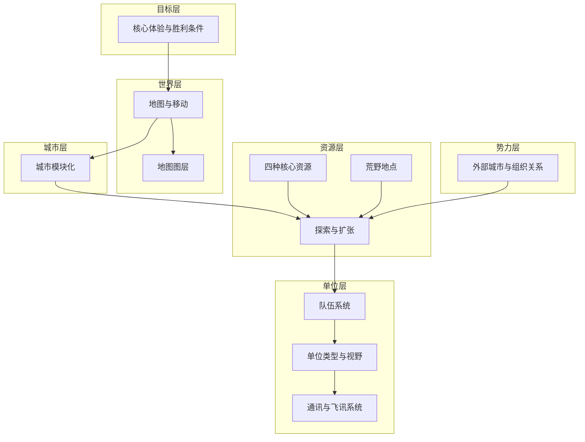

# 核心系统

本目录存放《循光之城》的**核心玩法机制**：地图、移动、队伍、探索、通讯与外部势力等。这些系统由 [02-玩法循环](../02-玩法循环/) 中的回合推进驱动，共同支撑 [核心循环](../02-玩法循环/核心循环.md) 中的三级玩家行为。

← [系统设计](../README.md)

## 系统分层

| 层级 | 回答的问题 | 文档 |
|------|------------|------|
| **目标层** | 玩家为何前进、如何获胜、压力从哪来 | [核心体验与胜利条件](./核心体验与胜利条件.md) |
| **世界层** | 地图如何构成、城市如何移动与停泊 | [地图与移动](./地图与移动.md)、[地图图层](./地图图层.md) |
| **城市层** | 城区如何拆分、连接与重组 | [城市模块化](../03-模块与城市/城市模块化.md) |
| **资源层** | 四类资源如何产出与消耗、荒野有什么 | [四种核心资源](../02-资源循环/四种核心资源.md)、[荒野地点](../02-资源循环/荒野地点.md)、[探索与扩张](./探索与扩张.md) |
| **单位层** | 队伍如何组建、视野如何同步 | [队伍系统](./队伍系统.md)、[单位类型与视野](./单位类型与视野.md)、[通讯与飞讯系统](./通讯与飞讯系统.md) |
| **势力层** | 外部城市如何行动、关系如何传导 | [外部城市与组织关系](./外部城市与组织关系.md) |

## 系统依赖关系

| 系统 | 上游（依赖） | 下游（支撑） |
|------|--------------|--------------|
| [地图与移动](./地图与移动.md) | [城市模块化](../03-模块与城市/城市模块化.md) | [探索与扩张](./探索与扩张.md)、[核心循环](../02-玩法循环/核心循环.md) |
| [地图图层](./地图图层.md) | [地图与移动](./地图与移动.md) | [回合与行动表](../02-玩法循环/回合与行动表.md) |
| [探索与扩张](./探索与扩张.md) | [队伍系统](./队伍系统.md)、[荒野地点](../02-资源循环/荒野地点.md) | [四种核心资源](../02-资源循环/四种核心资源.md) |
| [队伍系统](./队伍系统.md) | [四种核心资源](../02-资源循环/四种核心资源.md) | [探索与扩张](./探索与扩张.md)、[单位类型与视野](./单位类型与视野.md) |
| [单位类型与视野](./单位类型与视野.md) | [队伍系统](./队伍系统.md) | [通讯与飞讯系统](./通讯与飞讯系统.md) |
| [通讯与飞讯系统](./通讯与飞讯系统.md) | [城市模块化](../03-模块与城市/城市模块化.md)、[单位类型与视野](./单位类型与视野.md) | [回合与行动表](../02-玩法循环/回合与行动表.md) |
| [外部城市与组织关系](./外部城市与组织关系.md) | [荒野地点](../02-资源循环/荒野地点.md) | [回合与行动表](../02-玩法循环/回合与行动表.md) |

## 本目录索引

| 名称 | 类型 | 说明 |
|------|------|------|
| [核心体验与胜利条件.md](./核心体验与胜利条件.md) | 文件 | 游戏类型、核心体验、胜利条件、动态难度 |
| [地图与移动.md](./地图与移动.md) | 文件 | 六边形卷轴地图、移动城市占格、停泊与航行 |
| [地图图层.md](./地图图层.md) | 文件 | 地形/环境/资源/建筑/设施/物品/单位多层叠加 |
| [队伍系统.md](./队伍系统.md) | 文件 | 队伍模板概览、能力通道、AI 与战斗规则 |
| [单位类型与视野.md](./单位类型与视野.md) | 文件 | 侦察/勘探/运输/工程/飞讯等单位定义与视野 |
| [通讯与飞讯系统.md](./通讯与飞讯系统.md) | 文件 | 即时通讯、飞讯同步、视野信息延迟 |
| [探索与扩张.md](./探索与扩张.md) | 文件 | 停下后的勘探、设施建设、据点交互 |
| [外部城市与组织关系.md](./外部城市与组织关系.md) | 文件 | 外部城市构成、关系系统、组织传导 |

## 与玩法循环的对应

| 核心循环阶段 | 主要涉及的系统 |
|--------------|----------------|
| 规划路线 | [地图与移动](./地图与移动.md)、[核心体验与胜利条件](./核心体验与胜利条件.md) |
| 移动城市 | [地图与移动](./地图与移动.md)、[城市模块化](../03-模块与城市/城市模块化.md)、[四种核心资源](../02-资源循环/四种核心资源.md)（燃料） |
| 停下交互 | [探索与扩张](./探索与扩张.md)、[队伍系统](./队伍系统.md)、[外部城市与组织关系](./外部城市与组织关系.md) |
| 勘探与开发 | [队伍系统](./队伍系统.md)、[单位类型与视野](./单位类型与视野.md)、[荒野地点](../02-资源循环/荒野地点.md) |
| 资源与人口管理 | [四种核心资源](../02-资源循环/四种核心资源.md)、[城市模块化](../03-模块与城市/城市模块化.md) |
| 改造或拆解城区 | [城市模块化](../03-模块与城市/城市模块化.md)、[地图与移动](./地图与移动.md) |

时间推进与指令执行见 [回合与行动表](../02-玩法循环/回合与行动表.md)。

## 程序实现索引

| 主题 | 设计文档 | 实现文档 |
|------|----------|----------|
| 队伍与战斗 | [队伍系统](./队伍系统.md)、[单位类型与视野](./单位类型与视野.md) | [队伍与战斗数据结构](../../03-程序设计/03-数据字典/队伍与战斗数据结构.md) |
| 通讯与视野 | [通讯与飞讯系统](./通讯与飞讯系统.md) | [通讯与视野同步数据结构](../../03-程序设计/03-数据字典/通讯与视野同步数据结构.md) |
| 回合与行动 | [回合与行动表](../02-玩法循环/回合与行动表.md) | [回合与行动数据结构](../../03-程序设计/03-数据字典/回合与行动数据结构.md) |

## 修订记录

| 日期 | 版本 | 说明 |
|------|------|------|
| 2026-06-23 | 0.1.0 | 初稿：系统分层、依赖关系、与核心循环对应表 |
