> 状态：草稿
> 校验状态：待校验
> 类型：总览图
> 日期：2026-06-23

← [核心系统](./README.md)

# 核心系统总览图

本文用一张思维导图汇总核心系统的分层、系统职责、玩家行为闭环、资源与信息流向，以及当前待细化事项。具体规则仍以各专题文档为准。

```mermaid
mindmap
  核心系统
    目标层
      核心体验与胜利条件
        玩家为何前进
          追逐太阳
          避免停滞
          承受速度差压力
        玩家如何获胜
          驾驶城市抵达太阳所在地
          延续文明
          推进章节结局
        动态难度
          距离拉近
            资源获取更便利
            威胁相对可控
            路线余量更宽
          距离拉远
            资源获取更难
            威胁增强
            燃料压力上升
            负面状态累积
      核心幻想
        驾驶可拆解重组的移动城市
        在前进中延续文明
        在资源速度牺牲之间取舍
    世界层
      地图与移动
        六边形地图
          纵向主链
          横向宽度可配置
          随视野开拓生成
        移动城市
          玩家主城
          多格占据
          整体移动
          停下后交互
        停泊
          占据城区格
          禁用整城移动
          可执行对外交互
        航行
          作为可指挥单位
          启用整城移动
          消耗燃料
        状态切换
          停泊转航行
          航行转停泊
          按工作进度推进
        地形通过
          狭窄地形
          裂隙
          废墟迷宫
          需要改造或拆解城区
      地图图层
        地形层
          平原
          丘陵
          密林
          山脉
          裂隙
        环境层
          迷雾
          沙暴
          移动城市轨迹
        资源层
          矿区
          果地
          废墟
          资源储量
        建筑层
          村镇
          外部城市
          遗迹
        设施层
          采集站
          驿站
          哨塔
          桥梁
          陷阱
        物品层
          可拾取物品
          堆叠上限
        单位层
          玩家队伍
          外部单位
          容纳规则
        影响规则
          每条规则绑定优先级
          按优先级顺序结算
          支持例外条件
        响应
          其他单位行动时触发
          即时结算
          可打断当前行动
    城市层
      城市模块化
        核心区
          主城中枢
          通讯基础
          指令来源
        城区
          生产
          居民区
          功能城区
          防御或工程相关城区
        连接
          城区相邻
          维持整体形态
          影响可通过地形
        分离
          为通过地形让路
          牺牲部分模块
          形成情感代价
        重组
          修复
          扩建
          拆解
          调整城市宽度
      与其它系统关系
        支撑地图占格
        支撑通讯站覆盖
        消耗建材与人口
        影响移动能力
    资源层
      四种核心资源
        建材
          建造城区
          修复城区
          建造设施
        食物
          维持人口
          支撑外出队伍
          应对停留消耗
        燃料
          驱动移动城市
          支撑航行
          决定路线余量
        人口
          分配工作
          组建队伍
          支撑生产与建设
      荒野地点
        资源点
          矿区
          果地
          废墟
        固定据点
          村镇
          外部城市
        危险与事件
          敌对单位
          地形阻挡
          随机事件
      探索与扩张
        系统定位
          承接停泊状态
          把城市能力带到荒野
          为再次移动做准备
        基本流程
          城市停泊
          派出队伍
          揭示地点与资源
          判断是否开发
          建设设施
          运输与维护
          补给主城
          准备再次移动
        勘探
          侦察队揭示种类
          勘探队揭示储量
          信息经通讯同步
        设施建设
          采集站
          驿站
          桥梁
          合法性由图层规则决定
        外部据点交互
          补给
          招募
          贸易
          任务
          关系变化
        结果回流
          资源充足
          路线更清晰
          中继设施成形
          关系改善
          开发失败或信息延迟
    单位层
      队伍系统
        能力化设计
          队伍类型是预设模板
          能力由配置启用
          程序提供执行通道
        指令表
          玩家设定任务目标
          队伍自主执行细节
          遭遇意外后恢复
        默认队伍
          侦察队
          勘探队
          运输队
          工程队
          飞讯
        人数影响
          视野范围下降
          负载上限下降
          工作效率下降
          攻击效果下降
        遇敌策略
          保守
            优先降低损失
            改道或等待
          激进
            优先推进任务
            接受风险通过
        战斗
          敌我关系判定
          战斗身份判定
          攻击结算
          反击限制
      单位类型与视野
        基础属性
          移动速度
          武装状态
          人数规模
          视野范围
          特殊能力
        资源点揭示等级
          不揭示
          揭示种类
          揭示储量
        侦察队
          移动快
          视野广
          揭示资源点种类
        勘探队
          精确勘察
          揭示具体储量
        运输队
          运载物资
          装货与卸货
          负载限制
        工程队
          建造设施
          运维设施
          处理荒野建设
        飞讯
          一次性信息载体
          搜索目标单位
          不提供持续战略视野
      通讯与飞讯系统
        视野来源
          核心区视野
          主城周边视野
          外出单位独立视野
          飞讯独立视野
        即时通讯
          单位支持即时通讯
          单位启用即时通讯
          位于通讯站覆盖范围
          信息立即同步
        飞讯同步
          定期发送
          携带待同步信息
          飞向核心区
          到达后同步
        通讯站
          城内信号基础
          城外覆盖外出单位
          覆盖范围可配置
        信息延迟
          玩家所知与真实状态分离
          未知死亡延迟宣告
          旧信息可能影响指令判断
    势力层
      外部城市与组织关系
        外部城市
          固定据点
          可占据一格或多格
          独立关系主体
        回合内行动
          玩家先行动
          外部城市在 AI 行动阶段行动
          顺序由对局种子生成
        关系系统
          玩家关系
          邻近城市关系
          直接关系变化
          间接关系变化
        组织传导
          同组织城市受间接影响
          间接变化为直接变化四分之一
        与探索关系
          提供贸易
          提供补给
          触发任务
          引发冲突
    玩法循环承接
      每回合
        玩家指挥
          编辑指令表
          安排行动表
          下达移动或工作
        玩家行动
          主城与队伍执行
          工作进度推进
          遭遇与响应结算
        AI 行动
          外部城市轮流行动
          敌对单位行动
        环境行动
          太阳移动
          环境压力
          持续效果
      一轮活动循环
        规划路线
        移动城市
        停下交互
        勘探与开发
        资源与人口管理
        改造或拆解城区
        确认生存后再次移动
      时间尺度
        分钟级
          资源观察
          人口分配
          城区与队伍调整
        小时级
          选择方向
          组织勘探
          开发资源
          前往据点补给
        长期
          追逐太阳
          章节推进
          城市能力成长
          揭示世界隐藏设定
    玩家决策
      路线选择
        追日方向
        绕开障碍
        前往资源点
        前往外部据点
      城市形态选择
        扩建
        收窄
        分离
        牺牲模块
      队伍派遣
        探索未知
        勘探资源
        运输补给
        建设设施
      信息判断
        即时信息
        延迟信息
        风险提示
        旧情报误差
      资源取舍
        食物维持人口
        燃料换取距离
        建材换取设施
        人口换取工作效率
      关系取舍
        贸易
        支援
        冲突
        站队
    待细化事项
      数值
        太阳速度曲线
        燃料消耗公式
        资源产出
        工作效率曲线
        视野范围
      地图
        地形类型清单
        通过条件
        动态生成触发距离
        存档压缩
      设施
        采集站产出
        驿站维护
        桥梁占地
        设施失效
      队伍
        队伍上限
        补给损耗
        失联反馈
        解散阈值
      通讯
        覆盖范围算法
        飞讯频率
        飞讯速度
        拦截或丢失
      外部据点
        交互选项
        邻近判定
        组织外传导
        村镇是否适用组织规则
```

## 使用说明

- 需要查规则细节时，优先跳转到对应专题文档；本文只做总览，不替代正文规则。
- 若新增核心系统，先确认它属于目标层、世界层、城市层、资源层、单位层或势力层，再补进本图与 [核心系统](./README.md) 索引。

## 修订记录

| 日期 | 版本 | 说明 |
|------|------|------|
| 2026-06-23 | 0.1.0 | 初稿：补核心系统详尽思维导图，覆盖分层、闭环、资源、单位、通讯、势力与待细化事项 |
