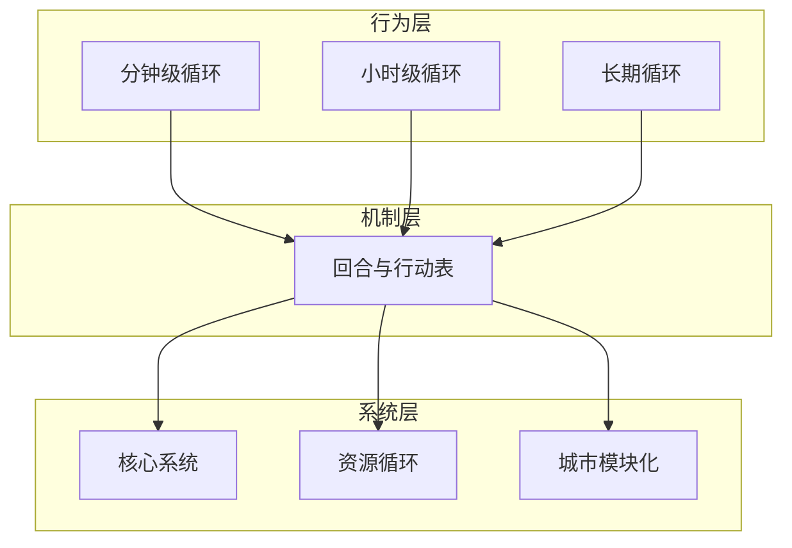

# 玩法循环

本目录定义《循光之城》的**时间尺度与回合推进**：玩家在不同粒度下做什么、每回合如何结算。

← [系统设计](../README.md)

## 两层结构

| 文档 | 职责 |
|------|------|
| [核心循环](./核心循环.md) | **玩家做什么**：分钟级 / 小时级 / 长期三级行为循环 |
| [回合与行动表](./回合与行动表.md) | **时间如何走**：回合阶段、行动主体、行动表、指令表、环境结算 |
| [工作](./工作.md) | **跨系统工作模块**：工作进度、工作成果、多回合任务 |

**核心循环**描述战略节奏；**回合与行动表**是上述节奏在局内的执行引擎。所有 [核心系统](../01-核心系统/) 的具体动作（移动、勘探、建造、战斗等）均通过回合内的指挥与行动阶段落地。

## 时间尺度与回合的对应

| 时间尺度 | 典型跨度 | 玩家在做什么 | 回合机制 |
|----------|----------|--------------|----------|
| **分钟级** | 数回合内 | 观察资源与人口、调整城区与队伍编制；切换停泊/航行；应对即时事件 | [玩家指挥](./回合与行动表.md#玩家指挥阶段的操作) 编辑指令表与行动表；[玩家行动](./回合与行动表.md#回合阶段) 执行本回合任务 |
| **小时级** | 十数回合 | 选前进方向、组织勘探、开发资源地块、规划城市形态、前往据点补给 | [指令表与自主执行](./回合与行动表.md#指令表与自主执行) 跨回合任务；[工作中状态](./回合与行动表.md#工作中状态) 推进建造/装卸/切换 |
| **长期** | 整局 | 持续追逐太阳、扩张城市能力、推进叙事与结局 | [环境行动](./回合与行动表.md#环境结算顺序) 太阳移动与难度加压；章节叙事见 [03-关卡与叙事](../03-关卡与叙事/) |

## 每回合流程（概要）

| 阶段 | 核心系统参与 |
|------|--------------|
| **玩家指挥** | 移动城市、各队伍等行动主体：增删改指令表、调整行动表顺序 |
| **玩家行动** | [地图与移动](../01-核心系统/地图与移动.md) 航行；[队伍系统](../01-核心系统/队伍系统.md) 执行任务；[工作](./工作.md) 推进工作进度、结算工作成果 |
| **AI 行动** | [势力系统](../01-核心系统/势力系统.md) 按种子顺序行动 |
| **环境行动** | 太阳移动、黄昏带/暗渊带推移；驱动 [核心体验与胜利条件](../01-核心系统/核心体验与胜利条件.md) 动态难度 |

## 本目录索引

| 名称 | 类型 | 说明 |
|------|------|------|
| [核心循环.md](./核心循环.md) | 文件 | 每回合步骤、移动并行更新、一轮活动循环、三级时间尺度与总览图 |
| [回合与行动表.md](./回合与行动表.md) | 文件 | 回合阶段、行动主体、行动表、指令表、工作效率、环境结算 |
| [工作.md](./工作.md) | 文件 | 跨队伍、设施、城市的工作机制模块 |

## 相关文档

| 主题 | 文档 |
|------|------|
| 玩家目标与情绪 | [核心幻想](../01-核心体验/核心幻想.md) |
| 机制详解 | [01-核心系统](../01-核心系统/README.md) |
| 资源与城市 | [02-资源循环](../02-资源循环/)、[03-模块与城市](../03-模块与城市/) |
| 对外概述 | [游戏介绍](../../游戏介绍.md) |

## 修订记录

| 日期 | 版本 | 说明 |
|------|------|------|
| 2026-06-23 | 0.0.1 | 核心循环对齐飞书画板：补每回合步骤、移动并行更新、一轮活动循环；刷新图片 |
| 2026-06-25 | 0.0.2 | 新增工作模块索引；行动主体与黄昏带/暗渊带表述对齐 |
