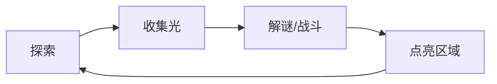

> 状态：草稿
> 程序实现：待补充

# 核心循环

## 分钟级循环

（玩家每几分钟在做什么？）

## 小时级循环

（玩家每次游玩一小时内追求什么？）

## 长期循环

（玩家整个游戏周期追求什么？）

## 循环图

```mermaid
flowchart LR
    A[探索] --> B[收集光]
    B --> C[解谜/战斗]
    C --> D[点亮区域]
    D --> A
```

## 修订记录

| 日期 | 版本 | 说明 |
|------|------|------|
| 2026-06-20 | 0.1.0 | 初稿 |
