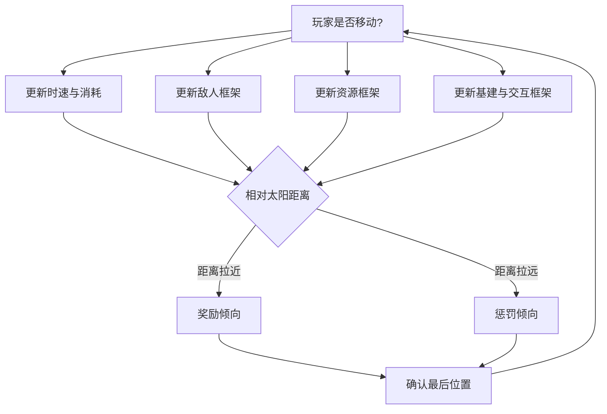
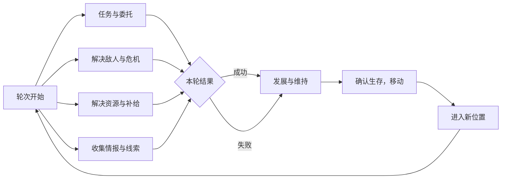
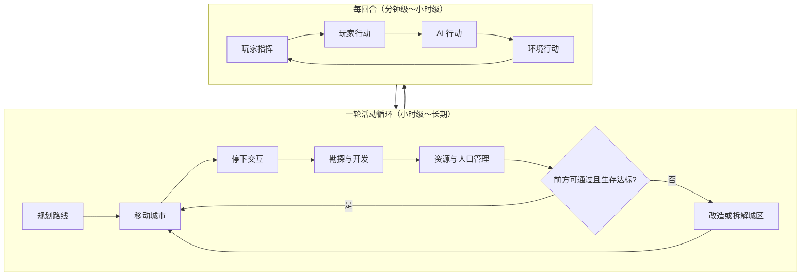

> 状态：草稿
> 程序实现：[03-程序设计/01-架构总览/模块划分.md](../../03-程序设计/01-架构总览/模块划分.md)

← [玩法循环](./README.md)

# 核心循环

| 字段 | 内容 |
|------|------|
| 状态 | 草稿 |
| 校验状态 | 待校验 |
| 日期 | 2026-06-23 |
| 设计来源 | [飞书 · 循光之城：核心循环](https://mcne6pdc31k2.feishu.cn/docx/Ebn3d1aqko3J3rxSWhZcLSXxn3e) |
| 相关设定 | [核心世界观](../../04-设定/01-世界观/核心世界观.md)、[章节划分与故事大纲](../../04-设定/05-隐秘真相/章节划分与故事大纲.md) |
| 相关系统 | [核心体验与胜利条件](../01-核心系统/核心体验与胜利条件.md)、[01-核心系统](../01-核心系统/README.md)、[四种核心资源](../02-资源循环/四种核心资源.md)、[城市模块化](../03-模块与城市/城市模块化.md)、[回合与行动表](./回合与行动表.md) |

## 概述

核心循环描述玩家在不同**时间尺度**下的典型行为，以及**一轮完整推进**（在当前位置经营 → 确认生存 → 移动至新位置）如何闭合。局内时间由 [回合与行动表](./回合与行动表.md) 推进。

| 层级 | 文档 | 职责 |
|------|------|------|
| **行为层** | 本文 | 每回合步骤、移动触发的并行更新、一轮活动循环、分钟级 / 小时级 / 长期行为 |
| **机制层** | [回合与行动表](./回合与行动表.md) | 指挥 → 行动 → AI → 环境：每回合如何结算 |
| **系统层** | [01-核心系统](../01-核心系统/README.md) | 地图、队伍、探索、通讯等具体规则 |

**与太阳的关系**：第一、二章玩家**同向**追日；活动成败与[动态难度](../01-核心系统/核心体验与胜利条件.md#动态难度)均与**相对太阳的距离**挂钩——距离拉近（保持在日照带内）带来奖励倾向，距离拉远带来惩罚倾向。第二章起**速度差拉大**，即使同向移动也可能持续拉远。

---

## 每回合步骤

对齐飞书画板「每回合步骤」；程序阶段划分见 [回合与行动表 · 回合阶段](./回合与行动表.md#回合阶段)。

| 步骤 | 玩家在做什么 | 主要系统 | 对应回合阶段 |
|------|--------------|----------|--------------|
| **生成资源与状态** | 城区产出、人口消耗、持续效果刷新 | [四种核心资源](../02-资源循环/四种核心资源.md)、[城市模块化](../03-模块与城市/城市模块化.md) | 回合开始；部分在 [环境行动](./回合与行动表.md#环境结算顺序) 结算 |
| **玩家操作与移动** | 编辑指令表与行动表；下达移动、勘探、建造、战斗 | [队伍系统](../01-核心系统/队伍系统.md)、[地图与移动](../01-核心系统/地图与移动.md) | [玩家指挥](./回合与行动表.md#玩家指挥阶段的操作) → [玩家行动](./回合与行动表.md#回合阶段) |
| **生成路线** | 确认本回合航行格、燃料消耗与前方可通过性 | [地图与移动](../01-核心系统/地图与移动.md) | 玩家指挥 / 玩家行动 |
| **AI 行动** | 外部城市与敌对单位按威胁与关系行动 | [势力系统](../01-核心系统/势力系统.md) | [AI 行动](./回合与行动表.md#外部城市行动顺序) |
| **结算与清理** | 太阳移动、环境加压、未完成工作推进 | [核心体验与胜利条件](../01-核心系统/核心体验与胜利条件.md) | [环境行动](./回合与行动表.md#环境结算顺序) |

视野与信息延迟贯穿各步，见 [通讯与飞信系统](../01-核心系统/通讯与飞信系统.md)。

---

## 移动触发的并行更新

玩家主城**决定移动**（或本回合实际发生位移）时，下列四条线**并行**推进，再汇入后续的奖励 / 惩罚判定。细则见各系统文档。

| 并行线 | 更新内容 | 主要系统 |
|--------|----------|----------|
| **时速与消耗** | 判定时速、行进距离；消耗 [燃料](../02-资源循环/四种核心资源.md)；评估与太阳的相对距离 | [地图与移动](../01-核心系统/地图与移动.md) |
| **敌人框架** | 刷新荒野威胁、外部城市动向、遭遇与追击 | [荒野地点](../02-资源循环/荒野地点.md)、[势力系统](../01-核心系统/势力系统.md)、[队伍系统](../01-核心系统/队伍系统.md) |
| **资源框架** | 城区生产、采集站产出、补给检查 | [四种核心资源](../02-资源循环/四种核心资源.md)、[城市模块化](../03-模块与城市/城市模块化.md) |
| **基建与交互框架** | 驿站、采集站、任务与支线交互刷新 | [探索与扩张](../01-核心系统/探索与扩张.md)、[03-关卡与叙事](../03-关卡与叙事/) |

### 奖励与惩罚（相对太阳）

与 [核心体验与胜利条件 · 动态难度](../01-核心系统/核心体验与胜利条件.md#动态难度) 一致；**不是**猜测太阳轨迹，而是**速度差**与日照带位置的结果。

| 倾向 | 典型表现（待数值化） |
|------|----------------------|
| **奖励（距离拉近 / 保持日照）** | 资源获取更便利、威胁相对可控、路线与速度余量更宽裕、正面状态更容易维持 |
| **惩罚（距离拉远 / 脱离日照）** | 资源获取更难、敌人更密集或更强、路线受限或燃料压力上升、负面状态累积 |

---

## 一轮活动循环

对齐飞书画板「轮次结束 / 开始」主环：**在当前位置完成足够经营，确认生存后再移动**。下列四类活动可并行推进，共同决定能否进入「确认生存，移动 → 进入新位置」。

| 活动类型 | 典型行为 | 直接收益 | 主要系统 |
|----------|----------|----------|----------|
| **任务与委托** | 接取并完成委托、支线 | 资源、关系、解锁后续内容 | [势力系统](../01-核心系统/势力系统.md)、[03-关卡与叙事](../03-关卡与叙事/) |
| **解决敌人与危机** | 战斗、清障、应对灾害 | 安全行进、掉落、声望与关系 | [队伍系统](../01-核心系统/队伍系统.md)、[荒野地点](../02-资源循环/荒野地点.md) |
| **解决资源与补给** | 采集、贸易、前往村镇 / 城市 | 维持 [四种核心资源](../02-资源循环/四种核心资源.md) 平衡，扩大可行动范围 | [探索与扩张](../01-核心系统/探索与扩张.md)、[荒野地点](../02-资源循环/荒野地点.md) |
| **收集情报与线索** | 勘探、阅读记录、对话 | 解锁区域、推进 [章节划分与故事大纲](../../04-设定/05-隐秘真相/章节划分与故事大纲.md) | [通讯与飞信系统](../01-核心系统/通讯与飞信系统.md)、[单位类型与视野](../01-核心系统/单位类型与视野.md) |

**本轮结果**与相对太阳距离挂钩：成功倾向对应距离拉近或维持，失败倾向对应距离拉远（见上节）。

### 发展与维持（移动前）

进入「确认生存，移动」前，玩家通常需要在下列方向至少满足最低生存线（具体阈值待数值化）：

| 方向 | 内容 | 主要系统 |
|------|------|----------|
| **扩充城区** | 建造、修复、连接或 [分离](../03-模块与城市/城市模块化.md) 模块 | [城市模块化](../03-模块与城市/城市模块化.md) |
| **贸易与装备** | 与商人 / 据点交易，维修或升级 | [势力系统](../01-核心系统/势力系统.md)、[荒野地点](../02-资源循环/荒野地点.md) |
| **人口与队伍** | 招募、编组、技能与编制调整 | [队伍系统](../01-核心系统/队伍系统.md)、人口（见 [四种核心资源](../02-资源循环/四种核心资源.md)） |
| **维持生存** | 食物、燃料、人口消耗与士气 | [四种核心资源](../02-资源循环/四种核心资源.md) |
| **长期目标** | 章节节点、主线与特殊任务 | [章节划分与故事大纲](../../04-设定/05-隐秘真相/章节划分与故事大纲.md) |

---

## 三级时间尺度

在「一轮活动循环」之上，按时间跨度分为三级；与 [玩法循环 · 时间尺度与回合的对应](./README.md#时间尺度与回合的对应) 一致。

### 分钟级循环

- 观察 [四种核心资源](../02-资源循环/四种核心资源.md) 与人口分配，调整城区运转或 [队伍](../01-核心系统/队伍系统.md) 编制。
- 在 [城市移动](../01-核心系统/地图与移动.md) 与停下之间切换：移动时专注路线与燃料；停下后处理 [分离城区](../03-模块与城市/城市模块化.md)、派出队伍、建设设施。
- 应对即时事件（资源短缺、地形阻挡、遭遇战等），决定是否拆解或改造城区以继续前进。

### 小时级循环

- 选择前进方向，向 [太阳](../../04-设定/01-世界观/世界概述.md) **同向**靠近（第一、二章）或沿章节路线推进（第三至五章见下节）。
- 在新区域停下，组织勘探队点亮视野、发现 [荒野地点](../02-资源循环/荒野地点.md)。
- 派遣工程队开发资源地块，运输队串联补给线。
- 根据前方地形规划 [城市形态](../03-模块与城市/城市模块化.md)：扩建、连接新城区，或为通过狭窄地形而牺牲部分模块。
- 评估是否前往村镇或城市据点补充人口与资源；处理 [势力系统](../01-核心系统/势力系统.md)（如第二章猎壳人 / 铁壳站队）。

### 长期循环

- **第一、二章**：持续追日，避免停滞或与太阳的**速度差**过大导致脱离日照带。
- **第二至三章转折**：确认 [追日策略失效](../../04-设定/05-隐秘真相/章节划分与故事大纲.md#第二章角速度) 后，转向暗渊，叙事与日照规则反转（见 [地点与场景 · 章节与行进方向](../../04-设定/03-地点与场景/README.md#章节与行进方向)）。
- 逐步扩张城市能力，积累应对更复杂地形与资源压力的经验。
- 推进叙事与结局：[骄阳之心](../../04-设定/05-隐秘真相/骄阳之心.md)、[指挥塔的真相](../../04-设定/05-隐秘真相/指挥塔的真相.md)、[太阳的真相](../../04-设定/05-隐秘真相/太阳的真相.md)（长期悬念）。

---

## 与章节的对应

长期循环随 [章节划分与故事大纲](../../04-设定/05-隐秘真相/章节划分与故事大纲.md) 变化；机制重点如下。

| 章节 | 名称 | 循环重点 | 相对太阳 |
|------|------|----------|----------|
| 一 | 初速度 | 首次开拔、资源积累、突破封锁、通过铁门关 | 同向追日，建立追日习惯 |
| 二 | 角速度 | 站队（猎壳人 / 铁壳）、荒地 combat 与补给、铁巢终局 | 同向追日，**速度差拉大**，惩罚倾向增强 |
| 三 | 离心力 | 逆向入暗、无日照生存、资源与照明压力 | 背离太阳，距离规则转为暗渊深度 |
| 四 | 摩擦力 | 返程救援、道德抉择、牺牲与延续 | 无日照 |
| 五 | 向心力 | 渊光城终局、真相揭示、太阳提速 | 无日照 → 终局归轨 |

---

## 系统与循环阶段的对应

| 循环阶段 | 分钟级 | 小时级 | 长期 | 主要系统 |
|----------|--------|--------|------|----------|
| 观察与调整 | ● | | | [四种核心资源](../02-资源循环/四种核心资源.md)、[队伍系统](../01-核心系统/队伍系统.md)、[城市模块化](../03-模块与城市/城市模块化.md) |
| 规划路线 | | ● | ● | [地图与移动](../01-核心系统/地图与移动.md)、[核心体验与胜利条件](../01-核心系统/核心体验与胜利条件.md) |
| 移动城市 | ● | ● | ● | [地图与移动](../01-核心系统/地图与移动.md)、[回合与行动表 · 停泊与航行](./回合与行动表.md#移动城市与行动表) |
| 停下交互 | ● | ● | | [探索与扩张](../01-核心系统/探索与扩张.md)、[势力系统](../01-核心系统/势力系统.md) |
| 勘探与开发 | | ● | ● | [队伍系统](../01-核心系统/队伍系统.md)、[单位类型与视野](../01-核心系统/单位类型与视野.md)、[荒野地点](../02-资源循环/荒野地点.md) |
| 资源与人口管理 | ● | ● | ● | [四种核心资源](../02-资源循环/四种核心资源.md) |
| 改造或拆解城区 | ● | ● | ● | [城市模块化](../03-模块与城市/城市模块化.md)、[地图与移动](../01-核心系统/地图与移动.md) |
| 追逐太阳与叙事 | | | ● | [核心体验与胜利条件](../01-核心系统/核心体验与胜利条件.md)、[03-关卡与叙事](../03-关卡与叙事/) |

---

## 总览循环图

每步在局内的执行方式见 [回合与行动表](./回合与行动表.md)；各步涉及的机制见 [01-核心系统](../01-核心系统/README.md#与玩法循环的对应)。

---

## 待确认事项

- [ ] 单次游玩时段的典型时长目标。
- [ ] 「确认生存，移动」的最低资源与生存阈值。
- [ ] 奖励 / 惩罚倾向的具体数值与 [动态难度](../01-核心系统/核心体验与胜利条件.md#动态难度) 的映射表。
- [ ] 飞书画板中「追赶 / 补给」分支是否单独成节，或已并入敌人框架与资源框架（当前采用后者）。

## 修订记录

| 日期 | 版本 | 说明 |
|------|------|------|
| 2026-06-20 | 0.0.1 | 初稿 |
| 2026-06-21 | 0.0.2 | 按移动城市玩法补全三级循环与流程图；时间推进见 [回合与行动表](./回合与行动表.md)；正文首次提及加链 |
| 2026-06-23 | 0.0.3 | 补概述与系统—循环对应表；链至 [01-核心系统](../01-核心系统/README.md) 与 [玩法循环](./README.md) |
| 2026-06-23 | 0.0.4 | 对齐 [飞书 · 核心循环](https://mcne6pdc31k2.feishu.cn/docx/Ebn3d1aqko3J3rxSWhZcLSXxn3e)：每回合步骤、移动并行更新、一轮活动循环、章节对应；统一速度差与日照带表述；刷新图片 |
