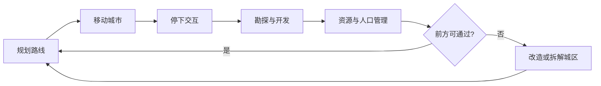

> 状态：草稿
> 程序实现：[03-程序设计/01-架构总览/模块划分.md](../../03-程序设计/01-架构总览/模块划分.md)

← [玩法循环](./README.md)

# 核心循环

| 字段 | 内容 |
|------|------|
| 状态 | 草稿 |
| 校验状态 | 待校验 |
| 日期 | 2026-06-23 |
| 相关设定 | [核心世界观](../../04-设定/01-世界观/核心世界观.md) |
| 相关系统 | [核心体验与胜利条件](../01-核心系统/核心体验与胜利条件.md)、[01-核心系统](../01-核心系统/README.md)、[四种核心资源](../02-资源循环/四种核心资源.md)、[城市模块化](../03-模块与城市/城市模块化.md)、[回合与行动表](./回合与行动表.md) |

## 概述

核心循环描述玩家在不同**时间尺度**下的典型行为；局内时间由 [回合与行动表](./回合与行动表.md) 推进。二者关系：

| 层级 | 文档 | 职责 |
|------|------|------|
| **行为层** | 本文 | 分钟级 / 小时级 / 长期：玩家在做什么 |
| **机制层** | [回合与行动表](./回合与行动表.md) | 指挥 → 行动 → AI → 环境：每回合如何结算 |
| **系统层** | [01-核心系统](../01-核心系统/README.md) | 地图、队伍、探索、通讯等具体规则 |

## 系统与循环阶段的对应

| 循环阶段 | 分钟级 | 小时级 | 长期 | 主要系统 |
|----------|--------|--------|------|----------|
| 观察与调整 | ● | | | [四种核心资源](../02-资源循环/四种核心资源.md)、[队伍系统](../01-核心系统/队伍系统.md)、[城市模块化](../03-模块与城市/城市模块化.md) |
| 规划路线 | | ● | ● | [地图与移动](../01-核心系统/地图与移动.md)、[核心体验与胜利条件](../01-核心系统/核心体验与胜利条件.md) |
| 移动城市 | ● | ● | ● | [地图与移动](../01-核心系统/地图与移动.md)、[回合与行动表 · 停泊与航行](./回合与行动表.md#移动城市与行动表) |
| 停下交互 | ● | ● | | [探索与扩张](../01-核心系统/探索与扩张.md)、[外部城市与组织关系](../01-核心系统/外部城市与组织关系.md) |
| 勘探与开发 | | ● | ● | [队伍系统](../01-核心系统/队伍系统.md)、[单位类型与视野](../01-核心系统/单位类型与视野.md)、[荒野地点](../02-资源循环/荒野地点.md) |
| 资源与人口管理 | ● | ● | ● | [四种核心资源](../02-资源循环/四种核心资源.md) |
| 改造或拆解城区 | ● | ● | ● | [城市模块化](../03-模块与城市/城市模块化.md)、[地图与移动](../01-核心系统/地图与移动.md) |
| 追逐太阳与叙事 | | | ● | [核心体验与胜利条件](../01-核心系统/核心体验与胜利条件.md)、[03-关卡与叙事](../03-关卡与叙事/) |

视野与信息延迟贯穿各阶段，见 [通讯与飞讯系统](../01-核心系统/通讯与飞讯系统.md)。

## 分钟级循环

- 观察[四种核心资源](../02-资源循环/四种核心资源.md)与人口分配，调整城区运转或[队伍](../01-核心系统/队伍系统.md)编制。
- 在[城市移动](../01-核心系统/地图与移动.md)与停下之间切换：移动时专注路线与燃料；停下后处理[分离城区](../03-模块与城市/城市模块化.md)、派出队伍、建设设施等操作。
- 应对即时事件（资源短缺、地形阻挡、灾害等），决定是否拆解或改造城区以继续前进。

## 小时级循环

- 选择一个前进方向，向[太阳](../../04-设定/01-世界观/世界概述.md)靠近。
- 在新区域停下，组织勘探队点亮视野、发现[荒野地点](../02-资源循环/荒野地点.md)。
- 派遣工程队开发资源地块，运输队串联补给线。
- 根据前方地形规划[城市形态](../03-模块与城市/城市模块化.md)：扩建、连接新城区，或为通过狭窄地形而牺牲部分模块。
- 评估是否前往村镇或城市据点补充人口与资源。

## 长期循环

- 持续追逐太阳，避免停滞或过远导致生存难度上升。
- 逐步扩张城市能力，积累应对更复杂地形与资源压力的经验。
- 推进叙事与结局：抵达太阳、揭示世界隐藏设定（长期悬念）。

## 循环图

每步在局内的执行方式见 [回合与行动表](./回合与行动表.md)；各步涉及的机制见 [01-核心系统](../01-核心系统/README.md#与玩法循环的对应)。

## 待确认事项

- [ ] 单次游玩时段的典型时长目标。

## 修订记录

| 日期 | 版本 | 说明 |
|------|------|------|
| 2026-06-20 | 0.1.0 | 初稿 |
| 2026-06-21 | 0.2.0 | 按移动城市玩法补全三级循环与流程图；时间推进见 [回合与行动表](./回合与行动表.md)；正文首次提及加链 |
| 2026-06-23 | 0.3.0 | 补概述与系统—循环对应表；链至 [01-核心系统](../01-核心系统/README.md) 与 [玩法循环](./README.md) |
