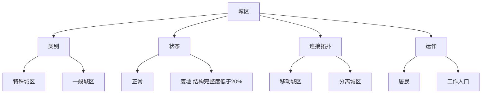

> 状态：评审中
> 校验状态：已对照

← [图层与地点](../README.md)

# 建筑层

**建筑层**存储的内容就是**城区**——与「城区」划等号，不再另设平行的「建筑类型」。

本目录存放建筑层的详细设计文档，对应草稿 `系统.md` 的「建筑层」「城区与废墟」节点。

## 文档索引

| 文档 | 内容 | 原文件锚点 |
|------|------|------------|
| [`城区总览.md`](城区总览.md) | 术语、城区定义、类别（特殊/一般）、状态（正常/废墟）、废墟规则 | `#术语` `#城区定义与资产定位` `#类别` `#状态正常与废墟` |
| [`连接与多核心.md`](连接与多核心.md) | 核心区、骄阳之心、连接拓扑、多核心城市 | `#核心区与骄阳之心` `#连接拓扑` `#多核心城市` |
| [`分离与拆解.md`](分离与拆解.md) | **分离城区** vs **拆解结构**分轨 | `#分离城区` `#拆解结构` |
| [`运作与居民.md`](运作与居民.md) | 城区供能、居民vs工作人口、城区词条、能力分工 | `#城区运作与居民人口` `#城区词条` `#城区能力与领袖能力` |

## 快速参考

---
*本文档由 [`城市模块化-原.md`](../城市模块化-原.md) 拆分而来，重构日期：2026-06-27*
