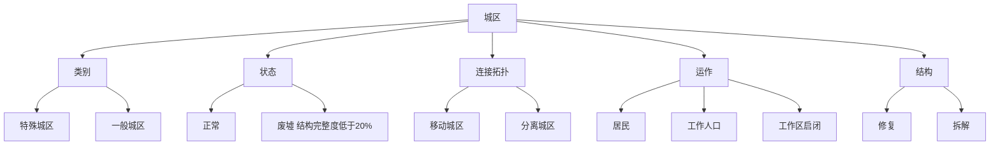

> 状态：评审中
> 校验状态：已对照

← [图层与地点](../README.md)

# 建筑层

**建筑层**存储的内容就是**城区**——与「城区」划等号，不再另设平行的「建筑类型」。

本目录存放建筑层的详细设计文档，对应草稿 `系统.md` 的「建筑层」「城区与废墟」节点。

## 文档索引

| 文档 | 内容 | 原文件锚点 |
|------|------|------------|
| [`城区总览.md`](城区总览.md) | 术语、城区定义、**居民承载**、**负载成本**、类别、状态 | `#居民承载` `#负载成本` |
| [`连接与多核心.md`](连接与多核心.md) | 核心区、骄阳之心、连接拓扑、多核心城市 | `#核心区与骄阳之心` `#连接拓扑` `#多核心城市` |
| [`运作与居民.md`](运作与居民.md) | 城区供能、**工作区**（特殊城区模块 / 一般城区设施）、**城区能力（被动 / 主动）**、居民 vs 工作人口、**城区/设施消耗分轨** | `#城区能力被动--主动` `#工作区特殊城区模块--一般城区设施` |
| [`分离与拆解.md`](分离与拆解.md) | **分离** vs **拆解** vs **修复**；连接/分离玩家操作 | `#分离城区` `#修复城区` `#拆解结构` |

## 快速参考

---
*本文档由 [`建筑层/README.md`](../建筑层/README.md) 拆分而来，重构日期：2026-06-27*
