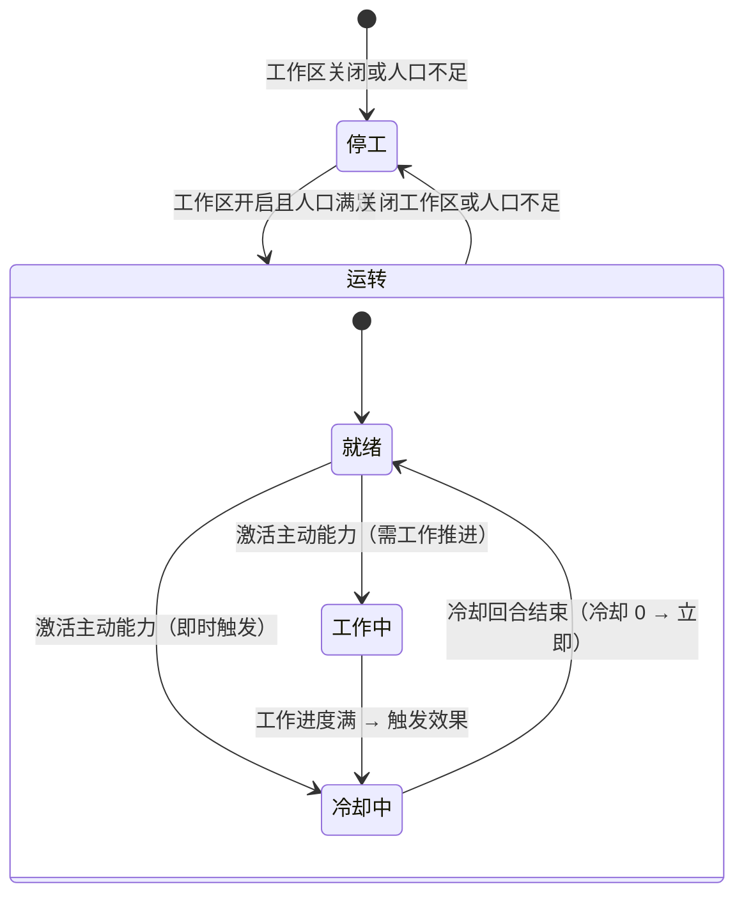

> 状态：评审中
> 校验状态：已对照

← [建筑层](README.md) ← [图层与地点](../README.md)

# 运作与居民

## 城区运作与居民人口

状态为**正常**的城区须有人口参与**城区运作**，以维持**城区本体**运转（**不是**城区自动常驻生效，也**不是**一般城区上各**设施**的运行）。

| 类别 | 城区运作所维持的对象 |
|------|----------------------|
| **特殊城区** | **工作区**（模块供能）→ [城区能力](#城区能力被动--主动)；另含城区本体基础项 **待定** |
| **一般城区** | **无**城区级运作条目；运转全部由 [设施即工作区](#一般城区--设施即工作区) 承担 |

| 概念 | 说明 |
|------|------|
| **城区人口**（显示在城区上） | 只表示**居民**——在该城区居住、占用承载上限的人口；**不**表示已指派上岗的**工作人口** |
| **城区运作** | 维持**城区自身**供能与运转所需的劳动；在玩家城市由 [城市管理系统](../../04-资源与人口/城市管理系统.md) 配置**哪一类人口**承担（见 [人口与迁移 · 玩家：城区工作分配](../../04-资源与人口/人口与迁移.md#玩家城区工作分配)） |
| **废墟** | **无法工作**；城区运作与供能**停止**；**不可迁入**居民，已有居民**仅可迁出**；**仍计**粮食需求（周总结），未分到同样半数减员 |

- **非玩家势力**的外部城市：每城仅 **1 名城市领袖**，城区运作与人口调度由领袖**统管抽象**，不向玩家暴露城区级工作分配界面（见 [领袖与势力 · 非玩家城市](../../05-城市与领袖/领袖与势力.md#非玩家城市与人口调度)）。
- **玩家移动城市**：通过 [城市管理系统](../../04-资源与人口/城市管理系统.md) 配置**工作区**——**特殊城区**为模块行；**一般城区**为各**设施**行（同一套 UI）。

## 工作区（特殊城区模块 / 一般城区设施）

**工作区**是玩家**启用或关闭**某段城区**可运转功能**的单元，也是 [城市管理系统](../../04-资源与人口/城市管理系统.md) 里**配运作人力、结算消耗**的锚点。**不是** [连接与分离](分离与拆解.md#玩家操作连接与分离)（拓扑），**也不是** [废墟](城区总览.md#废墟)（结构不可用）。

| 城区类型 | 工作区指什么 | 玩家操作入口 |
|----------|--------------|--------------|
| **特殊城区** | 模块**工作区**：配置运作人口是否上岗；上岗后承载**被动** / 允许**主动** | 城市管理 · **工作区**开关 |
| **一般城区** | **没有**城区级工作区；**每座设施实例即一座工作区** | 城市管理 · **同一套**工作区 UI，按**设施**列出启停与人力 |
| **核心区** | 特殊城区；工作区**永久开启、不可关闭**（骄阳之心 / 停泊·航行） | 无「关闭」入口 |

**共用 UI 与工作逻辑（已定）**：特殊城区模块与一般城区设施在管理面板走**同一套**工作区界面——启用 / 关闭、运作人力类型、消耗与停摆规则**同构**；程序上可共用 `WorkZoneState`（或等价结构），`subject_kind` 区分 `district_module` / `facility_instance`。

### 特殊城区 · 工作区启停

工作区开关决定：已配置的**运作人口**是否**上岗工作**。上岗后按模块配置支付**日常开销**（若有），**被动能力**生效，并**允许**下达**主动能力**。

| 工作区 | 运作人口 | **日常开销** | **被动**能力 | **主动**能力 |
|--------|----------|--------------|--------------|--------------|
| **开启** | **占用**已配置类型的运作人口上岗 | **支付**（按模块 `routine_cost`；**留空**视为无开销） | **生效**（若配置） | **允许**下达（见 [§主动能力](#主动能力)） |
| **关闭** | **不占用** | **停止**（**无**空载费） | **停用** | **不可用** |

**数值参数（特殊城区 · 已定）**

每个**特殊城区**类型在配置中须预留两项开销字段（程序占位见 [L4_district_defs · routine_cost / activation_cost](../../../03-程序设计/03-数据字典/地图图层配置数据结构.md#l4_district_defscsv)）：

| 参数 | 结算时机 | 与能力的关系 | 留空 |
|------|----------|--------------|------|
| **日常开销** | 工作区**开启**且人口满足期间，**每 3 回合**结算一次（与采集 / 温室周期对齐） | 对应模块**被动能力**运转时的资源账单；**无被动**时可**留空** → **视为无开销** | 空 = 上岗期间**不**扣此项资源 |
| **激活开销** | 玩家**激活主动能力**时扣减（当回合） | 对应**主动能力**的一次性消耗；**无主动能力**时可**留空** → **视为无开销** | 空 = **激活**不另扣此项资源 |

- 两项**分轨**：日常开销**不**并入激活结算；**主动能力**不替代工作区开关。
- **仅主动能力、无被动**（如巨炮）：日常开销可留空；激活开销填巨炮开火消耗。
- **仅被动、无主动能力**（如学院）：激活开销可留空；日常开销填维持被动的周期账单。
- **被动 + 主动能力**（如城坞——被动 10%/回合相连城区均分 + 主动 20 金属 + 10 能源立即维修）：两项均可分别配置。

**首版日常 / 激活数值（已定）** — 总表见 [金属与能源消耗基准](../../04-资源与人口/四种核心资源.md#金属与能源消耗基准已定)：

| 模块 | 日常（每 3 回合） | 激活（单次） |
|------|-------------------|--------------|
| 核心区 | **15** 能源 | —（无主动或另配） |
| 学院 | **8** 能源 | 留空 |
| 城坞 | **10** 能源 | 留空 |
| 巨炮 | 留空 | **80** 能源 + **40** 金属 |

**开启 gate（已定）**

- 玩家切换为**开启**时，须校验该模块要求的运作人口**已配置且人数满足**最低需求；**不足则拒绝开启**，UI 说明缺员类型与缺口。
- 工作区**已开启**后若因迁出、伤亡等导致人口**低于**最低需求：模块**停摆**（被动失效、主动能力不可用）；是否自动关工作区 **待定**（sy-25）。

- **与连接/分离**：**不断开**拓扑。
- **与废墟**：废墟**无法**开启；须 [修复](分离与拆解.md#修复城区) 为**正常**。
- **核心区**：**不可关闭**。

**设计意图**：用工作区控制「配置好的人口是否上岗」；**主动能力**仍须玩家另行下达，且**依赖**工作区已开启。

- 工作区启停于**指挥阶段**经城市管理系统下达（是否即时生效 **待定**）。

### 一般城区 · 设施即工作区

- **一般城区**无城区级模块；**每座设施实例 = 一座工作区**，启停规则与特殊城区模块**相同**（运作人口 gate、日常消耗、被动 / 主动分轨）。
- 设施可仅配**被动**、仅配**主动**，或**两者皆有**（由 `facility_type_config` 决定）。
- 经 [城市管理系统](../../04-资源与人口/城市管理系统.md)**同一套**工作区 UI 逐座管理。
- 消耗走**设施账单**（见 [§城区消耗与设施消耗](#城区消耗与设施消耗)）。

## 城区词条

首版城区词条池 **5 个**；每个城区携带 **0～2 个**词条（不重复）。词条提供**数值修正**（可叠加，叠加规则 **待定**），并参与领袖任职匹配。

### 首版五词条（已定）

| 词条 | 效果（相对无词条对照） |
|------|------------------------|
| **奢华** | **居民承载** **-20%**；**人口归属转化效率** **+30%** |
| **工业** | **居民承载** **-30%**；**工作效率** **+30%** |
| **贫困** | **居民承载** **+50%**；**人口归属转化效率** **-20%**；**工作效率** **-20%** |
| **教会** | **人口归属转化效率** **+20%** |
| **农业** | **粮食**生产效率 **+30%** |

- **居民承载**：修正该城区 [居民承载上限](./城区总览.md#居民承载)（基础上限 + 屋舍加成后的合计；基础默认 **50**）。
- **人口归属转化效率**：修正 [领袖与势力 · 人口归属转化](../../05-城市与领袖/领袖与势力.md#人口归属转化独立功能--已定框架) 的转化速率（**待定** 是否与领袖倍率叠乘）。
- **工作效率**：修正该城区内队伍 / 工作的 `work_efficiency`（见 [工作](../../07-玩法循环/工作.md)）。
- **粮食生产效率**：修正**归属本城**的 [果园](../../04-资源与人口/荒野地点/果园.md) / [温室](../../04-资源与人口/温室.md) 产出（对 `output_per_work_completion` **×1.3**）；温室能源消耗**不**因本词条减免。
- 与**特殊城区**类型「学院」模块**分轨**：本表的 **教会** 词条只修正转化**效率**；**学院**城区能力只放宽可转化**目标范围**；**人口归属转化**本身是领袖 / 人口独立功能，**不是**城区能力。三者可同时存在，效果是否叠加 **待定**。

### 一般城区与一般特殊城区（已定）

| 项 | 口径 |
|----|------|
| **数量** | **0～2 个**词条 |
| **来源** | 城区实例生成时，从五词条池中**随机**抽取（不重复）；**0 个**表示无词条 |
| **对局内** | 抽取结果**固定**，不因领袖调任而改变（除非另有改造玩法 **待定**） |

### 势力主城区（特殊城区 · 已定）

外部城市首都 / **势力主城区**的词条**非随机**，由配置**定死**，须与所属势力的**势力领袖**特质词条**相契合**（通常与势力领袖共享同一组 0～2 个词条；具体各势力配置 **待定**）。

- **城市领袖**默认任职于此；外部势力未合并时**默认满足**任职词条要求。
- 玩家改造或更换任职城区后，领袖仍须满足目标城区词条（领袖特质 ⊇ 城区词条，或按配置表判定 **待定**）。

### 领袖任职

- **城市领袖**携带**特质词条**子集；任职某城区时须满足该城区词条要求（匹配规则见 [领袖与势力 · 城区词条与领袖特质](../../05-城市与领袖/领袖与势力.md#城区词条与领袖特质)）。

## 城区消耗与设施消耗

**城区账单**与**设施账单**分轨结算，**不要**合并为一项「城区运维成本」。

| 账单 | 适用对象 | 决定因素 | 与另一类关系 |
|------|----------|----------|--------------|
| **城区自身消耗** | **特殊城区**模块（工作区启停） | [日常开销](#特殊城区--工作区启停)、模块类别与状态 | **一般城区无此项**；设施走设施账单 |
| **设施消耗** | [设施层](../设施层.md) 设施实例（= 一般城区工作区） | 设施类型：运行 / 运维、耐久、是否启用等 | **不计入**特殊城区模块账单 |

- **特殊城区**：城区自身消耗 = 工作区**开启**且人口上岗期间的 **日常开销**（配置留空则无此项）；**激活开销**在**激活主动能力**时另计，**不**并入日常账单。
- **一般城区**：**无**城区自身消耗项；**设施即工作区**，消耗均在设施账单。
- 草稿「设施性能强悍但增加运维成本」指**设施侧**的独立运维，**不是**向一般城区叠加额外城区消耗。

## 城区能力（被动 / 主动）

> **废止**旧分类「**切换式**」「**触发式**」「一次性激活」——统一为 **被动能力** 与 **主动能力**；程序迁移见 [Effect 与能力解析](../../../03-程序设计/02-运行时逻辑/Effect与能力解析.md)。

任一**特殊城区模块**或**一般城区设施**均可配置 **被动能力**、**主动能力**，或**仅其一**（由配置决定，**不**按城区类型硬编码）。

| 能力 | 说明 | 与工作区 | 玩家操作 |
|------|------|----------|----------|
| **被动能力** | 工作区开启且人口满足时**自动**生效的常驻效果 | 随工作区开/关 | **无**额外指令 |
| **主动能力** | 玩家**主动下达**的效果（瞬时、本回合限时、或可持续至玩家关闭等，由配置决定） | **前提**：工作区已开启且人口满足；**未开启则不可用** | 指挥阶段在城区 / 设施能力 UI 下达 |

**与工作区的关系（已定）**

```text
配置运作人口 → 工作区开启（人口够）→ 被动生效 + 允许激活主动能力
              → 工作区关闭 / 人口不足 → 被动停 + 主动能力不可用
```

- **工作区**管：配置人口是否**上岗**、日常消耗、**被动**开关。
- **主动能力**管：玩家在能力 UI **另行发动**的效果；**不**替代工作区开关。

### 模块 / 设施示例

| 对象 | 被动 | 主动 | 备注 |
|------|------|------|------|
| **巨炮** | **无** | 远程重击 | 仅主动 |
| **学院** | 工作区开启时：本城区归属转化目标放宽为已解锁任意归属 | **待定** 是否另设主动 | 被动已定方向；数值 sy-25 |
| **简易工坊**（设施） | **无** | 开工前在**详情面板**选定本次工作（简陋兵甲 / 弓具），选定后经 [工作](../07-玩法循环/工作.md) 驱动 | 设施工作区；仅主动 |
| **侦察塔**（设施） | 所在格己方单位视野 **+3 格**（地形修正器叠加：密林−1 / 丘陵+1 / 山地+2）；不受工作效率影响 | **无** | 战略设施；见 [视野系统 · 侦察塔视野](../../06-单位与交战/视野系统.md#侦察塔视野已定) |

程序配置：`GameplayAbilityConfigSO` + `GameplayEffectConfigSO`；被动多为工作区开启时的持续 GE；主动为 GA + executor 或限时 GE（sy-25 补清单与数值）。



- **学院**（被动）：工作区开启期间放宽本城区 [人口归属转化](../../05-城市与领袖/领袖与势力.md#人口归属转化独立功能--已定框架) **目标范围**；**不**等同于转化功能本身。
- **巨炮**（主动）：目标、射程、伤害与 [交战系统](../../06-单位与交战/交战系统.md) 衔接 **待定**（sy-25）。
- **侦察塔**：势力级视野增益，见 [视野系统 · 侦察塔视野](../../06-单位与交战/视野系统.md#侦察塔视野已定)。

### 主动能力

玩家在**指挥阶段**从城区 / 设施能力入口下达。**gate**：工作区**已开启**、状态**正常**、运作人口**仍满足**模块/设施最低需求；否则 **拒绝**并提示。

扣费：先过 gate，再校验并扣减该模块 **激活开销**（配置留空则**视为无开销**）；资源不足则**拒绝激活**。冷却、持续方式由模块配置。

### 主动能力统一状态模型（已定）

所有工作区（含特殊城区模块与一般城区设施）的**主动能力**共享同一套状态流转规则：

```text
激活主动能力（玩家下达指令）
│
├─ 即时触发？
│   ├─ 是 ──→ 触发效果 ──→ 进入冷却（冷却剩余 > 0）
│   └─ 否 ──→ 开始"工作"（作为标准工作进度推进）
│               │
│               ├─ 工作阶段性完成 → 可能产生中间成果
│               └─ 工作最终完成 → 触发效果 → 进入冷却
│
└─ 冷却可为 0 → 无冷却，可立即再次下达同一主动能力
```

- **即时触发**：效果在当回合立即生效，不走工作进度积攒（如城坞主动修复）。
- **需工作推进**：与一般工作同规则——工作进度积累、完成时触发效果、可被中断（如设施生产转化）。
- **冷却**：从效果触发当回合结束时开始计，冷却剩余回合归零后回到「就绪」状态；冷却 0 表示无间隔。
- **自动延续循环（已定）**：部分非即时主动能力在完成一个完整工作周期后**自动无冷却进入下一周期**，不须玩家重新下达指令——如矿区采集、温室生产等。玩家可随时主动中断（暂停工作区或下达其它指令）。自动延续不视为被动能力，仍走主动能力状态机。

**自动延续循环的中断行为（已定）**

| 产出类型 | 示例设施 | 中断后 |
|----------|----------|--------|
| **非食物类**（金属、能源等） | 矿区、能源站 | **可暂停不重置**——进度保留，恢复后从暂停处继续 |
| **食物类**（食物） | 温室、果园 | **中断即从头开始**——不可从暂停进度继续 |

> 设计意图：食物生产涉及生物过程，不能简单"暂停"，体现了资源类型的差异。非食物类（金属/能源）为物理采集，可随时停摆。这与 [四种核心资源 · 粮食产量阶段](../../04-资源与人口/四种核心资源.md#粮食产量阶段已定) 中食物为短期消耗品、须持续稳定供应的定位一致。
- **程序统一**：工作区与设施共用同一条 `ActiveAbilityStateMachine`（`is_instant`、`work_amount`、`cooldown_turns`、`auto_cycle` 均在配置声明），不在代码中按类型区分。

### 本地人口直接参与工作区工作（已定）

城区上的设施与城区的修复等**工作区驱动任务**，可**直接占用该城区本地居民人口**完成，**不须**具备运维能力的队伍到场：

- 满足该工作区最低运作人口 + 城区本地人口 ≥ 工作所需 → 即可启动。
- 城区**无人但状态仍有效**（未变废墟）、且有具备运维能力的队伍停留在该城区格 → 队伍可触发该城区工作区**被动**，并可代为下达**主动**能力；**不须满编**，但**人数影响工作效率**（人数比 = 当前/满编，见 [队伍系统 · 人数比系数](../../06-单位与交战/队伍系统.md#默认编制与人数影响)）。

**工作效率影响规则（已定）**

| 能力类型 | 工作效率影响什么 | 不影响什么 |
|----------|-----------------|-----------|
| **被动与即时主动** | **成果**乘以效率（如 10 人 × 1.0 → 1.0×，20 人 × 1.5 → 1.5×） | 部分被动固化为定值、不受效率影响（如侦察塔 +3 格视野，配置声明 `ignore_efficiency` 即可豁免） |
| **非即时主动**（需工作推进） | **每回合积攒的工作量**（= 回合数随效率变化） | **最终效果**固定（如修复始终 +10% 完整度，不因效率高或低而增减） |

> 效率豁免由配置标记（`ignore_efficiency`），程序不按能力类别硬编码。
>
> **向下取整规则（已定）**：一切因人数变化而改变工作效率的场合，计算结果**一律向下取整**（如 15 人 × 效率 1.3 = 19.5 → 取 19，非四舍五入）。
- 城区**无人且无运维队伍停留**时，工作区被动与主动能力均为不可用。

### 停泊与航行的双形态能力（已定框架）

部分特殊城区的 **城区能力** 随移动城市 **停泊 / 航行** 状态呈现**双形态**——可理解为同一城区模块在两种城态下各有一套可激活能力配置：

| 项 | 规则 |
|----|------|
| **配置** | 每城区可按 `dock_state` 分别配置能力列表（程序字段 **待定**） |
| **技能相同** | 两形态均可注册**同名**能力，数值或消耗可不同 |
| **技能不同** | 一形态独有、另一形态无对应项 **允许** |
| **一边为空** | 某形态**无任何**城区能力 **允许**（如停泊专精维修、航行专精机动等） |
| **激活** | 仍须 [工作区开启](#特殊城区--工作区启停) 且人口满足；**主动能力**另须玩家下达；**切换城态**时进行中的主动效果是否自动结束 **待定**（sy-25） |
| **程序** | 建议 `GameplayAbilityConfigSO` 按 `required_tags` 或形态字段区分（如 `CityState.Docked` / `CityState.Sailing`）；见 [Effect 与能力解析](../../../03-程序设计/02-运行时逻辑/Effect与能力解析.md) |

**废止**旧口径「巨炮航行态是否可用 **待定**（sy-19 交叉）」——改为**双形态配置**显式声明，不再用单一全局开关含糊处理。

### 与工作区、设施、回合的关系

| 概念 | 与能力 / 设施的关系 |
|------|---------------------|
| [工作区](#工作区特殊城区模块--一般城区设施) | **特殊城区**：关闭或人口不足 → 被动停、主动能力不可用；**一般城区**：按**设施**逐座启停（设施 = 工作区） |
| **设施效果** | 一般城区设施经工作区启停与 [工作](../07-玩法循环/工作.md) 生效；被动 / 主动配置规则与特殊城区**同构** |
| [回合与行动表](../../07-玩法循环/回合与行动表.md) | 工作区启停、主动能力在**指挥阶段**下达 |

- **领袖能力**：为领袖名下人口提供消耗减免、战斗或生产强化等——见 [领袖与势力 · 能力：领袖与城区](../../05-城市与领袖/领袖与势力.md#能力领袖与城区)。与城区**被动 / 主动**、设施效果**作用范围不同**；叠加规则 **待定**。

## 功能模块（城坞等）

### 特殊城区示例补充

| 类型 | 定位 | 相关系统 |
|------|------|----------|
| **城坞** | 城区修复中心；被动（相连城区均分恢复 **10% 完整度/回合**）+ 主动（**20 金属 + 10 能源**立刻完成一次维修，冷却 **5 回合**） | 分离与拆解、工作 |

> **城坞**是**特殊城区**，建造规则与设施不同——城区级建筑经城区布局 / 扩建系统完成，不适用设施建造金属价目表。旧「重叠城区」特殊规则已废止，城坞规则完全以 [分离与拆解 · 修复城区](分离与拆解.md#修复城区) 为准。

## 待确认事项

- [ ] **城区能力**具体清单与各模块参数（sy-25，**内容优先级低**）；被动 / 主动规则见 [§城区能力（被动 / 主动）](#城区能力被动--主动)（**已定**）。
- [ ] 城区能力程序配置统一走 `GameplayAbilityConfigSO` / `GameplayEffectConfigSO`；Tag、Attribute 与 executor 见 [Effect 与能力解析](../../../03-程序设计/02-运行时逻辑/Effect与能力解析.md)。
- [ ] 工作区**已开启**后人口跌破最低需求：是否自动关工作区（sy-25）；停摆时点与资源结算 **待定**。
- [x] **侦察塔**：已从特殊城区模块统一为野外战略设施（所在格己方单位视野 +3、无主动、不受工作效率影响；地形修正：密林−1 / 丘陵+1 / 山地+2）→ [视野系统 · 侦察塔视野](../../06-单位与交战/视野系统.md#侦察塔视野已定)。激活开销已废止（无主动能力）。
- [x] 城区**自身**供能日常数值（见 [消耗基准](../../04-资源与人口/四种核心资源.md#金属与能源消耗基准已定)）；与工作区联动。
- [x] **已定**：一般城区**设施即工作区**、设施消耗独立账单；**核心区不可关闭**；工作区关闭**无**空载费、**无**日常消耗。
- [ ] 居民人口上限配置表程序落地（规则已定：基础 **50**、屋舍 **+15** 可累加）。
- [ ] 运作所需劳动力与玩家指定人口类型的匹配规则（不足时惩罚 **待定**）。
- [ ] 各势力**势力主城区**定死词条与**势力领袖**特质对照表。
- [ ] 一般城区随机抽取权重、改造是否可改词条。
- [x] **城坞**被动/主动修复能力已定（每回合向相连城区均分恢复价值 20 金属 = 10% 完整度；主动 20 金属 + 10 能源立即维修一次，冷却 5 回合）；三途径均为城区工作操作，同一时刻仅一种、不可并行；城坞被动不分配正在自主/工程队修复的城区。**城坞被动受工作效率修正**——取决于工作区实际上岗人数（向下取整）。**城坞是特殊城区**，建造不适用设施价目表。旧「重叠城区」规则废止 → [分离与拆解 · 修复城区](分离与拆解.md#修复城区)；sy-11 闭合。
- [x] **工作区主动能力统一状态模型已定**：即时触发 → 效果 → 冷却；或工作推进 → 完成 → 效果 → 冷却；冷却可为 0。工作区与设施共享同一套规则。
- [x] **本地人口直接参与工作区工作**：城区设施与修复等可占用本地居民人口，不须运维队伍到场；城区无人但有运维队伍停留时队伍可触发被动并可代为下达主动能力。
- [x] **工作效率影响规则已定**：被动/即时主动 → 成果乘效率（允许配置豁免）；非即时主动 → 效率影响回合数、效果固定。侦察塔被动固化 +3，豁免效率影响。
- [ ] 特殊功能模块的解锁时机（第一章即可？还是需要特定条件？）。

## 修订记录

| 日期 | 版本 | 说明 |
|------|------|------|
| 2026-06-27 | 0.1.0 | 自 [`建筑层/README.md`](../建筑层/README.md) 拆分；运作、居民、词条、能力分工 |
| 2026-07-11 | 0.1.16 | 能力分类统一为被动/主动能力；废止误写的「出动」 |
| 2026-07-11 | 0.2.0 | 日常/激活开销首版数值；结算周期每 3 回合 |
| 2026-06-27 | 0.1.1 | 工作区启停（非连接/分离） |
| 2026-06-27 | 0.1.2 | 城区消耗与设施消耗分轨；一般城区无城区能力 |
| 2026-06-27 | 0.1.3 | 城区能力激活：切换式 / 一次性；规则已定、清单 sy-25 |
| 2026-06-29 | 0.1.4 | 城区能力程序配置统一改为 GA/GE：切换式持续 GE、一次性瞬时 GE |
| 2026-06-30 | 0.1.5 | 停泊/航行**双形态**城区能力框架（sy-25） |
| 2026-07-09 | 0.1.7 | 五词条定案及数值效果；口粮改称粮食（交叉链） |
| 2026-07-09 | 0.1.8 | 城区词条「学院」更名为「教会」 |
| 2026-07-09 | 0.1.9 | 新增**触发式**激活；**侦察塔**：被动城市视野 +2 格、主动本回合己方单位视野 +50% |
| 2026-07-09 | 0.1.10 | 废止「一次性激活」旧称；巨炮并入**触发式**（瞬时主动） |
| 2026-07-09 | 0.1.11 | 学院改为放宽转化目标；人口归属转化非城区能力 |
| 2026-07-19 | 0.1.12 | **城坞被动/主动修复已定**：被动 5%/回合·相连城区均分；主动 20 金属 + 10 能源；sy-11 闭合 |
| 2026-07-19 | 0.1.13 | **修复规则裁定**：修复达 100% 自动终止（不可超过）、金属不足该轮自动终止、每回合独立触发阶段性成果 |
| 2026-07-19 | 0.1.14 | **简易工坊已定**：仅主动、无被动，开工前在详情面板选定本次工作（简陋兵甲/弓具） |
| 2026-07-19 | 0.2.0 | **主动能力统一状态模型已定**：即时触发 → 冷却 vs 工作推进 → 完成 → 冷却；冷却可为 0。**本地人口直接参与工作区**：不须运维队伍到场；城区无人时运维队伍停留可代触发被动与主动。工作区与设施共享同套规则 |
| 2026-07-19 | 0.2.1 | **废止城坞旧「重叠修复」复杂规则**——完全由新被动/主动规则替代。**城坞是特殊城区**，建造不走设施价目表；**侦察塔（哨塔）是普通设施**，30 金属 / 3 回合（写入 `L5_facility_defs.csv`）。运维队伍停留不须满编，人数影响效率 |
| 2026-07-19 | 0.3.0 | **侦察塔统一为单一野外设施版本**：被动 = 所在格己方单位视野 +3（不受工作效率影响；地形修正：密林−1 / 丘陵+1 / 山地+2）；无主动能力。从特殊城区模块中移除，不再有日常/激活开销。**工作效率影响规则最终定案**：被动/即时主动 → 成果乘效率（允许豁免）；非即时主动 → 效率影响回合数、效果固定 |
