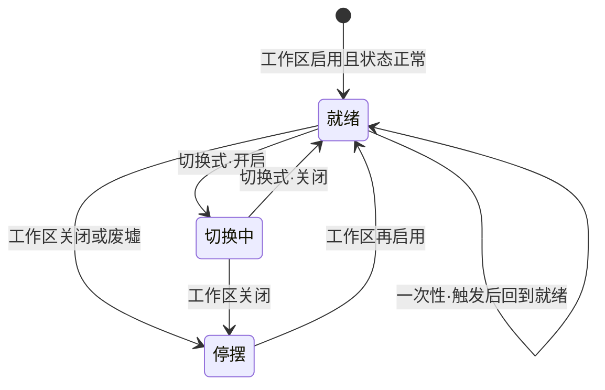

> 状态：评审中
> 校验状态：已对照

← [建筑层](README.md) ← [图层与地点](../README.md)

# 运作与居民

## 城区运作与居民人口

状态为**正常**的城区须有人口参与**城区运作**，以维持**城区本体**运转（**不是**城区自动常驻生效，也**不是**一般城区上各**设施**的运行）。

| 类别 | 城区运作所维持的对象 |
|------|----------------------|
| **特殊城区** | **城区能力**（模块技能、宏观生产、模块功能等）及城区本体供能 |
| **一般城区** | **仅城区本体**（承载、连接、基础维护等 **待定** 项）；**不**包含其上架设设施的运转 |

| 概念 | 说明 |
|------|------|
| **城区人口**（显示在城区上） | 只表示**居民**——在该城区居住、占用承载上限的人口；**不**表示已指派上岗的**工作人口** |
| **城区运作** | 维持**城区自身**供能与运转所需的劳动；在玩家城市由 [城市管理系统](../../04-资源与人口/城市管理系统.md) 配置**哪一类人口**承担（见 [人口与迁移 · 玩家：城区工作分配](../../04-资源与人口/人口与迁移.md#玩家城区工作分配)） |
| **废墟** | **无法工作**；城区运作与供能**停止**；**不可迁入**居民，已有居民**仅可迁出** |

- **非玩家势力**的外部城市：每城仅 **1 名城市领袖**，城区运作与人口调度由领袖**统管抽象**，不向玩家暴露城区级工作分配界面（见 [领袖与势力 · 非玩家城市](../../05-城市与领袖/领袖与势力.md#非玩家城市与人口调度)）。
- **玩家移动城市**：须通过 [城市管理系统](../../04-资源与人口/城市管理系统.md) 为各城区配置**人力分配**——对**特殊城区**侧重维持**城区能力**；对**一般城区**侧重维持**城区本体**（**不**替代设施自身的人力 / 消耗规则，见 [§城区消耗与设施消耗](#城区消耗与设施消耗)）。

## 工作区启用与关闭

草稿「**激活 / 关闭城区**」在正式文档中指 **工作区启用与关闭**——**不是** [连接与分离](分离与拆解.md#玩家操作连接与分离)（拓扑断连），**也不是** [废墟](城区总览.md#废墟)（结构不可用）。

| 概念 | 说明 |
|------|------|
| **启用**（默认） | 状态**正常**且玩家未关闭时：城区**本体**维持运转；**特殊城区**的模块**就绪**，玩家可 [激活城区能力](#城区能力激活)（**一般城区**仅维持本体）。须支付该城区**自身**配置的 [能源](../../04-资源与人口/四种核心资源.md)、**金属**及 [城区运作](#城区运作与居民人口) 人口（具体项由城区自身条件决定，**待定**） |
| **关闭** | 玩家主动**关闭工作区**：该城区**自身**维护停摆；**不可** [激活城区能力](#城区能力激活)（**特殊城区**模块停用；**一般城区**本体维护停止）；**不再**支付该城区的**城区自身**能源 / 金属 / 运作人口。**不**自动等同于关闭其上架设的全部**设施**（设施启闭与消耗见 [§城区消耗与设施消耗](#城区消耗与设施消耗)） |
| **与连接/分离** | 关闭工作区**不断开**与核心区的拓扑连接；城区仍可随移动城市移动（若仍属移动城区） |
| **与废墟** | **废墟**城区**无法**启用工作区；须 [修复](分离与拆解.md#修复城区) 为**正常**后方可再启用 |
| **核心区** | 核心区 / 骄阳之心是否允许关闭 **待定**（OPEN-045） |

**设计意图**：在资源紧张时，用**关闭工作区**换取 **能源、金属与运作人口** 的节省，以**能力停摆**为代价。

- 玩家可在**指挥阶段**对己方**状态正常**的城区切换启用 / 关闭（是否即时生效、切换冷却 **待定**）。
- 关闭期间是否仍消耗「空载」维护费 **待定**（OPEN-045）。

## 城区词条

- 每个城区携带 **1～3 个词条**，描述其文化、设施与人口气质（具体词条表 **待定**）。
- **城市领袖**携带与之对应的**特质词条**；领袖须任职于词条要求得到满足的城区（匹配规则见 [领袖与势力 · 城区词条与领袖特质](../../05-城市与领袖/领袖与势力.md#城区词条与领袖特质)）。
- 外部城市的**特殊城区**（势力主城区）在领袖未被招募前，**默认满足**该领袖的词条要求；玩家改造或更换任职城区后须主动对齐词条。

## 城区消耗与设施消耗

**城区账单**与**设施账单**分轨结算，**不要**合并为一项「城区运维成本」。

| 账单 | 适用对象 | 决定因素 | 与另一类关系 |
|------|----------|----------|--------------|
| **城区自身消耗** | 城区实例（特殊 / 一般均可） | 城区**类别、状态、词条、承载**等配置；[工作区启闭](#工作区启用与关闭) | **一般城区上建了哪些设施，不改变**本项数值 |
| **设施消耗** | [设施层](../设施层.md) 上的设施实例 | 设施类型：建造 / 运行 / [运维](../../07-玩法循环/工作.md)、耐久、是否激活等 | **不计入**所在一般城区的城区账单 |

- **特殊城区**：城区自身消耗主要对应**模块就绪**与 [城区能力激活](#城区能力激活) 的**维持**项（切换式开启期间的周期消耗 **待定**）；**一次性**激活的瞬时消耗**另计**，不并入城区本体账单项 **待定**（OPEN-048）。
- **一般城区**：城区自身消耗对应**城区本体**（**不提供城区能力**）；其上的仓库、生产等设施各自按设施配置消耗资源，**不**推高城区自身消耗项。
- 草稿「设施性能强悍但增加运维成本」指**设施侧**的独立运维，**不是**向一般城区叠加额外城区消耗。

## 城区能力与设施效果

| 来源 | 是否 **城区能力** | 说明 |
|------|-------------------|------|
| **特殊城区** | **是** | 模块级功能均为 **[可激活](#城区能力激活)** 能力（**切换式**或**一次性**）；具体模块名单 **延后**补全（OPEN-048，内容优先级低） |
| **一般城区** | **否** | 仅提供设施建造位与城区本体；**不**因设施存在而获得城区能力 |
| **一般城区上的设施** | **否**（属**设施效果**） | 占格类 / 辅助类设施；走设施层规则与**设施消耗** |

- **领袖能力**：为领袖名下人口提供消耗减免、战斗或生产强化等——见 [领袖与势力 · 能力：领袖与城区](../../05-城市与领袖/领袖与势力.md#能力领袖与城区)。
- 领袖能力、**城区能力**（仅特殊城区）、**设施效果**（一般城区及荒野）**作用范围不同**；同一效果是否可叠加 **待定**。

## 城区能力激活

**规则已定**；各特殊城区的**具体能力条目**（巨炮、学院、城坞等完整清单）可 **后续** 在配置中追加，**内容实现优先级低**（OPEN-048）。

**仅特殊城区**拥有 **城区能力**。**全部**城区功能均须玩家**主动激活**才生效——**不存在**「模块常驻自动生效、无需激活」的城区能力口径（与 [工作区启用与关闭](#工作区启用与关闭) 的「就绪 / 停摆」不同：工作区**启用**只表示**可以激活**；**关闭**则**禁止激活**）。

| 激活方式 | 说明 | 资源消耗（典型） | 示例 |
|----------|------|------------------|------|
| **切换式激活** | 玩家在指挥阶段 **开启 / 关闭**；**开启期间**按规则**持续**生效（如**每回合**结算一次） | **开启期间**每回合（或每环境行动等 **待定**）支付维持消耗；关闭后停止 | **学院**：开启后，**每回合**将**该城区当地**居民转化为玩家指定的**人口归属**；归属类型须在**已招募的城市领袖**对应人口池中选取 |
| **一次性激活** | 玩家**单次**下达指令；立即结算效果，**不**保持开启状态 | **单次**大量消耗（如 **能源** + **金属**）；与切换式的周期维持分开记账 | **巨炮**：**远程**造成大量伤害；一次性消耗大量 **能源** 与 **金属** |

- **切换式**与**一次性**由 `GameplayAbilityConfigSO` + `GameplayEffectConfigSO` 区分：切换式开启时施加持续 GE，关闭时移除；一次性激活时施加瞬时 GE 并调用 executor。同一特殊城区**仅**采用一种方式（**待定**：是否存在复合模块）。
- **学院**类转化：目标人口类型 = 玩家从**已招募领袖**名单中选择其一所代表的归属 / 文化类别；转化速率、上限、是否与 [人口与迁移 · 人口归属](../../04-资源与人口/人口与迁移.md#人口归属) 冲突 **待定**（OPEN-048）。
- **巨炮**类打击：目标选取、射程、伤害与 [交战系统](../../06-单位与交战/交战系统.md) 的衔接 **待定**（OPEN-048）；**航行态**是否可用 **待定**（OPEN-041 交叉）。
- **核心区**等特殊模块的具体激活方式（切换式 / 一次性）列入 OPEN-048 内容清单，**不**在本节预设例外。

### 与工作区、设施、回合的关系

| 概念 | 与能力激活的关系 |
|------|------------------|
| [工作区启用与关闭](#工作区启用与关闭) | **关闭** → **不可**激活城区能力；**启用** → 允许激活（**不**等于默认已开启切换式能力） |
| [设施效果](#城区能力与设施效果) | 一般城区设施**不走**本激活规则；设施自有启闭 / 消耗 |
| [回合与行动表](../../07-玩法循环/回合与行动表.md) | 激活指令在**玩家指挥阶段**下达；切换式效果的周期结算阶段 **待定**（OPEN-048） |

## 功能模块（城坞、通讯站等）

### 特殊城区示例补充

| 类型 | 定位 | 相关系统 |
|------|------|----------|
| **城坞** | 城区修复中心；高效修复、允许重叠修复未连接城区的特殊规则 | 设施层、工作 |
| **通讯站** | 即时通讯中枢；为离城单位提供信号覆盖 | 通讯与飞信 |

> **城坞特殊规则**：一般情况下城市不允许重叠，但城坞属于额外条件——允许修复与自身重叠但未连接在同一城市的城区。

> **通讯站特殊规则**：即时通讯需要信号覆盖。离开城市的单位能否使用即时通讯取决于是否有通讯站支持。

## 待确认事项

- [ ] **城区能力**具体清单与各模块参数（OPEN-048，**内容优先级低**）；激活规则见 [§城区能力激活](#城区能力激活)（**已定**）。
- [ ] 城区能力程序配置统一走 `GameplayAbilityConfigSO` / `GameplayEffectConfigSO`；Tag、Attribute 与 executor 见 [Effect 与能力解析](../../../03-程序设计/02-运行时逻辑/Effect与能力解析.md)。
- [ ] 城区**自身**供能与 [能源](../../04-资源与人口/四种核心资源.md) 的衔接（按类别配置表）；与 [工作区启用与关闭](#工作区启用与关闭) 联动。
- [ ] **工作区关闭**时：设施是否独立启闭、是否保留空载费用、核心区可否关闭（OPEN-045）；**已定**：一般城区设施消耗**不计入**城区账单。
- [ ] 居民人口上限：`base_resident_cap` 与屋舍 `extra_resident_cap` 配置表（规则已定，见 [居民承载](#居民承载)）。
- [ ] 运作所需劳动力与玩家指定人口类型的匹配规则（不足时惩罚 **待定**）。
- [ ] 城区词条完整名单及与领袖特质的配置表。
- [ ] **城坞**的具体修复效率（相对于直接修复的倍数？）。
- [ ] 城坞修复重叠城区的具体判定规则（重叠范围？连接判定？）。
- [ ] **通讯站**的信号覆盖范围（以格子计算？以距离计算？）。
- [ ] 通讯站为离开城市的单位提供即时通讯的具体机制（是否有距离限制？）。
- [ ] 城坞与通讯站的建造成本、维护成本。
- [ ] 特殊功能模块的解锁时机（第一章即可？还是需要特定条件？）。

## 修订记录

| 日期 | 版本 | 说明 |
|------|------|------|
| 2026-06-27 | 0.1.0 | 自 [`建筑层/README.md`](../建筑层/README.md) 拆分；运作、居民、词条、能力分工 |
| 2026-06-27 | 0.1.1 | 工作区启用与关闭（非连接/分离）；关闭节省能源/金属/运作人口 |
| 2026-06-27 | 0.1.2 | 城区消耗与设施消耗分轨；一般城区无城区能力 |
| 2026-06-27 | 0.1.3 | 城区能力激活：切换式 / 一次性；规则已定、清单 OPEN-048 |
| 2026-06-29 | 0.1.4 | 城区能力程序配置统一改为 GA/GE：切换式持续 GE、一次性瞬时 GE |
