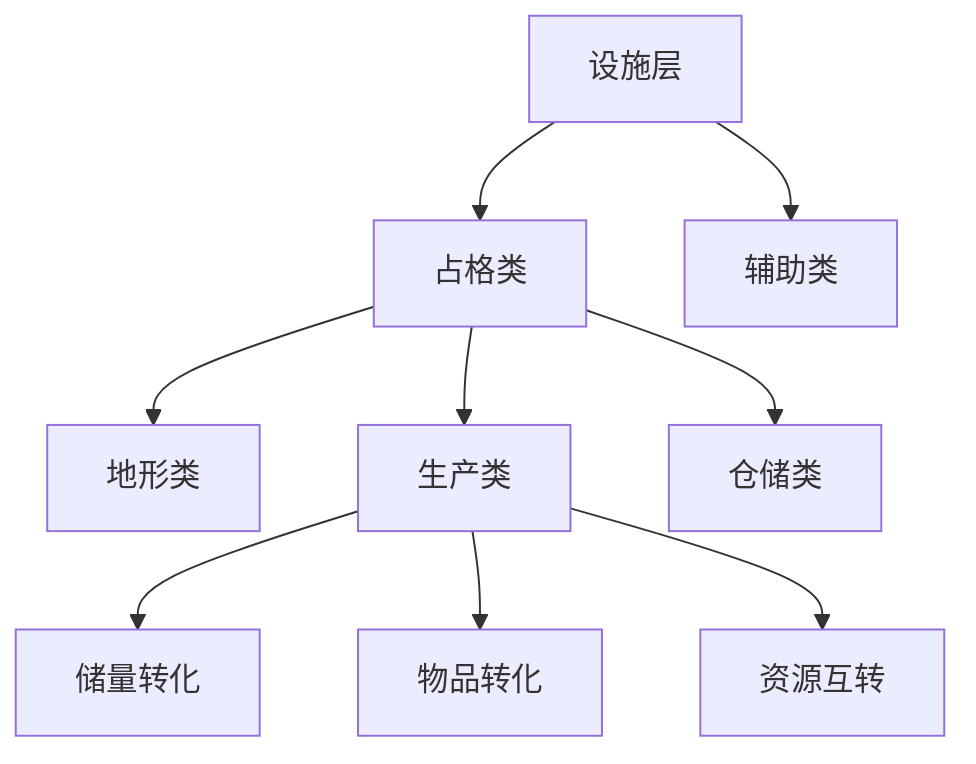

> 状态：草稿
> 校验状态：待校验
> 最后更新：2026-07-19

← [图层与地点](README.md)

# 设施层

## 定位

**设施层**位于地图图层栈的第五层（地形→环境→资源→**建筑**→**设施**→物品→单位），容纳**功能设施**：采集站、桥梁、哨塔、仓库等。

与 [资源层](资源层与荒野.md)（储量与资源点类型）、[建筑层](建筑层/)（城区模块）**正交**：
- **占格类**设施：占用地格或一般城区**设施建造位**，提供该格（或该位）上的主功能
- **辅助类**设施：以 Buff/Debuff、响应检测、警戒等**辅助**效果为主（见 [§设施分类](#设施分类占格类--辅助类)）

## 设施分类（占格类 / 辅助类）

设施按玩法职责分为**占格类**与**辅助类**（与草稿 `系统.md` §7 对齐；旧称「占位 / 仓库族」等并入下表，**不再**单独作为与占格类并列的大类名）。

| 大类 | 职责 | 典型效果 |
|------|------|----------|
| **占格类** | 占用合法建造位（世界地图格上的设施层槽位，或一般城区**设施建造位**），承担该位置上的**主功能** | 见下节三类细分 |
| **辅助类** | **不**以占格主功能为主；提供视野、陷阱、警戒、格内防守加成等**辅助**能力；常经 [响应检测器](地图图层.md#响应检测与行为触发) 触发行为，或以**有效时 Buff** 修正交战结算 | 哨塔、陷阱、**城墙**等 |

### 同格共存规则（已定）

| 规则 | 说明 |
|------|------|
| 占格类互斥 | 一格至多一个**占格类**设施（含在建工地） |
| 占格 + 辅助可共存 | 同一格可同时存在一个占格类设施与辅助类设施 |
| 辅助类同类型禁止重复 | 同一格**不能**建两份同类型辅助设施（如两份**城墙**）；不同类型辅助设施可并存 |
| 城墙多座叠加 | 指**不同格**上各自的城墙各自生效；非同格叠两份 |

### 占格类 · 三类细分

| 细分 | 职责 | 转化 / 效果链 | 建造位置（示例） | 示例 |
|------|------|---------------|------------------|------|
| **地形类** | 改变或扩展本格（及关联格）的**地形通过性 / 地貌能力** | 不直接产出物品；修改通行、连接、通过规则 | 可改造**地形格**（裂谷/河流格架桥、山地/丘陵开凿通道——丘陵格建通道即平整） | **桥梁**（跨裂谷/河流）；**通道**（山地/丘陵——丘陵格上即为平整） |
| **生产类** | 经 [工作](../07-玩法循环/工作.md) 驱动**转化** | 见下表三档 | 资源点、一般城区设施位 | 矿区、温室、加工厂等 |
| **仓储类** | 提升**本格**（或绑定的库存节点）**共用存储上限** | 不转化；扩容；**不**按资源种类分仓 | 一般城区设施位；**待定** 是否可建于荒野格 | **仓库**（统一） |

**生产类**三档转化（可并存于不同设施类型，由 `facility_type_config` 区分）：

| 档位 | 输入 | 输出 | 典型设施 |
|------|------|------|----------|
| **储量转化** | [资源层](资源层与荒野.md) **储量** | **资源物品**（金属 / 食物 / 能源 / 人口等进入 [物品层](地图图层.md) 或城市池） | **矿区**、**果园**、**能源站**、**征兵办**（建于对应资源点） |
| **物品转化** | **资源物品** | **资产物品**（队伍资产、装备组等，见 [队伍系统 · 队伍资产](../06-单位与交战/队伍系统.md#队伍资产与组建门槛)） | **简易工坊**、**加工厂**、**军工区**等（多建于一般城区） |
| **资源互转** | **资源物品** | **另一类资源物品** | **[温室](../04-资源与人口/温室.md)**（能源→食物；后期暗渊） |

- **地形类**与草稿「某些地形可以搭建设施改变地形性质」一致；细则见 [地图图层 · 地形类型清单](地图图层.md#地形类型清单) 与 sy-10（通道耐久、桥梁占格；**丘陵平整即建通道**，已定）。
- **通道建造条件（已定）**：本格地形为**山地**或**丘陵**即可建造，无其它前置条件；与 [L1 地形策划主表](../../03-程序设计/03-数据字典/tables/L1_terrain_defs.csv)「山地 · 允许建造的设施 = 通道」「丘陵 · 允许建造的设施 = 通道」一致。
- **桥梁建造与方向（已定）**：本格为河流或裂谷，选定一组对向两端均为非阻断地形即可架设；建造前可旋转选择方向；详见 [地图图层 · 河流与裂谷及桥梁](地图图层.md#河流与裂谷阻断地形及桥梁已定)。
- **仓储类**与 [城市管理系统 · 资源存储分配](../04-资源与人口/城市管理系统.md#资源存储分配) 联动：提升的是**该格 / 节点**的**共用** `capacity_max`（金属 + 食物 + 能源合计占用）；**不**改变一般城区**城区自身消耗**（见 [运作与居民 · 城区消耗与设施消耗](建筑层/运作与居民.md#城区消耗与设施消耗)）。见 [四种核心资源 · 仓储容量](../04-资源与人口/四种核心资源.md#仓储容量已定框架)。
- **屋舍**（见 [§屋舍](#屋舍)）：**不属于**仓储类；在城区**基础居民承载**之上叠加额外承载。

**生产类主动工作：自动延续循环与中断（已定）**

矿区、能源站、温室、果园等生产类设施的工作**均为主动行为**（非被动），但完成一个工作周期后**自动无冷却进入下一周期**，不须玩家每周期重新下达指令——玩家只需首次下达，此后自动延续直到玩家主动中断。

| 产出类型 | 示例设施 | 中断后 |
|----------|----------|--------|
| **非食物类**（金属、能源） | 矿区、能源站 | **可暂停不重置**——工作进度保留，恢复后从暂停处继续 |
| **食物类**（食物） | 温室、果园 | **中断即从头开始**——不可从暂停进度继续 |

> 详见 [运作与居民 · 主动能力统一状态模型](建筑层/运作与居民.md#主动能力统一状态模型已定)。

### 仓储类 · 仓库

**仓库**是建于 **一般城区** **设施建造位**的 **占格类 · 仓储类**设施，抬高绑定 `cargo_node` 的**共用**存储上限。

| 项 | 口径 |
|----|------|
| **分类** | **占格类 · 仓储类** |
| **效果** | 每座有效仓库叠加 `storage_bonus`（数值 **待补**，sy-23）；拆除后立即失去加成 |
| **空间规则** | 金属 / 食物 / 能源**共用**容量；**不**分种类上限 |
| **废止** | `material_warehouse` / `food_warehouse` / `fuel_warehouse` 分仓设施 |
| **配置 id** | `warehouse` |
| **消耗** | 首版**无**持续耗能（与采集设施一致）；建造金属 **待补** |
| **建造** | 工程队于一般城区合法空位；随移动城市迁移 |

### 屋舍

**屋舍**是建于 **一般城区** **设施建造位**的 **占格类**设施（**非**地形 / 生产 / 仓储三类），用于提升**居民承载**：

| 项 | 口径 |
|----|------|
| **与城区基础** | **每个城区**自带 **基础居民承载**（`district_type_config`）；屋舍 **不替代**基础上限，只在之上 **叠加** |
| **效果** | 每座有效屋舍增加 **`extra_resident_cap = 15`**（首版）；**允许多座累加**；拆除后立即失去加成 |
| **合计** | 见 [城区总览 · 居民承载](建筑层/城区总览.md#居民承载) |
| **消耗** | 走 [设施消耗](建筑层/运作与居民.md#城区消耗与设施消耗) 独立账单；**不**改变城区 `base_resident_cap` 配置值 |
| **建造** | 工程队于一般城区合法空位建造；随移动城市迁移 |

### 辅助类

| 示例 | 主要机制 | 状态 |
|------|----------|------|
| **哨塔** | 响应检测器 → 视野 / 警戒；受地形 / 环境层修正 | 骨架 |
| **陷阱** | 响应检测器 → **战斗**通道 | 已对齐 |
| **城墙** | **有效时**：本格 **结构** 参与 [交战 · 受到伤害](../06-单位与交战/交战系统.md#受到伤害遭受方-已定) 的 **结构减免 → 结构承伤** | 已定 |
| **航道** | **有效时**：本格航行城区损伤 **减 50%**；非城市单位移动步长 → **1**（见 [§航道](#航道)） | 已定 |

### 城墙

**城墙**是 **辅助类**设施，作为**本格结构**参与 [交战系统 · 受到伤害](../06-单位与交战/交战系统.md#受到伤害遭受方-已定) 中的 **结构减免 → 结构承伤** 管线：

| 项 | 口径 |
|----|------|
| **分类** | **辅助类**（**非**占格类主功能）；与哨塔、陷阱同属辅助 taxonomy |
| **效果** | 设施**有效**时，作为本格 **Applicable 结构之一** 参与 [交战 · 受到伤害](../06-单位与交战/交战系统.md#受到伤害遭受方-已定)：**可与城区等其它结构同时**保护本格人口，**各自**执行一轮结构减免 → 结构承伤 |
| **人口** | 承伤后剩余伤害若作用于本格内人口（队伍编制、驻守等），按规则结算 **人口损失**；**不再**单独叠一层与承伤管线无关的「仅减人口」Buff |
| **作用范围** | **仅本格**；不向外格扩散 |
| **减免** | **50%**——进入本格攻击伤害在城墙参与结构减免时削减 50%（见 [§结构减免系数表](#结构减免系数表已定)） |
| **失效** | 结构损伤累计达容量上限或耐久归零后，本格不再享有结构减免 |
| **建造** | 工程队于设施层合法格或一般城区设施位建造（`build_rule_guard_json` 见 sy-10） |

程序侧 `Buff.Wall` / `defender_loss_reduction` 若保留，应实现为 **结构减免** 或承伤后的修正，**不**与上述管线重复计算（见 [Effect 与能力解析 · Attribute](../../03-程序设计/02-运行时逻辑/Effect与能力解析.md#attribute-注册表首版)）。

- 辅助类设施仍可有耐久、可被摧毁、可运维；**有效时** Buff/Debuff 见 [设施共性](#设施共性)。

### 航道（已定）

**航道**是 **辅助类**设施，建于 **平原**或**丘陵**格，有效时提供航行减损与通行改善：

| 项 | 口径 |
|----|------|
| **分类** | **辅助类** |
| **建造位置** | **平原**或**丘陵**格（`host_terrain_ids=plain;hill`）；工程队建造 |
| **航行损伤减免** | 有 [城区] 航行经过本格时，**本次格级航行损伤减 50%**（累计损伤 = 原值 × 0.5） |
| **单位通行** | 非城市单位经本格时，移动步长改善为 **1**（平地等效，`on_valid_path_cost=1`）；**不**改变单位可否进入（地形 baseline 不变） |
| **建造** | 工程队于设施层合法格建造（`build_rule_guard_json` 见 sy-10） |
| **迁移** | 绑定世界地图格子，城市离开后无法带走 |

### 温室

**温室**是建于 **一般城区** **设施建造位**的 **占格类 · 生产类 · 资源互转**设施：消耗 **能源** 产出 **食物**。后期暗渊主粮路径；产量与耗能见 [温室](../04-资源与人口/温室.md)（单次 **150** 食物 / **50** 能源 / 工作量 **30** · **3 回合**）。

### 简易工坊

**简易工坊**是建于 **一般城区** **设施建造位**的 **占格类 · 生产类（物品转化）**设施，用于将 **金属** 转化为武装类 [队伍资产](../06-单位与交战/队伍系统.md#队伍资产与组建门槛)。

| 项 | 口径 |
|----|------|
| **分类** | **占格类 · 生产类 · 物品转化** |
| **建造位置** | 一般城区设施位；工程队建造 |
| **输入** | **金属**（各配方具体数量 → [策划表轨 tb-04](../../00-规范/待细化追踪-策划表.md)） |
| **产出** | **简陋兵甲**（`simple_armor`）、**弓具**（`bow_kit`） |
| **工作方式** | **仅主动**——无被动能力。开工前在**详情面板**选定本次要执行的工作（简陋兵甲 / 弓具），选定后经 [工作](../07-玩法循环/工作.md) 驱动转化；对照时长 → [策划表轨 tb-04](../../00-规范/待细化追踪-策划表.md) |
| **消费方** | [步兵](../06-单位与交战/单位类型与视野.md#6-步兵模板) 组建消耗简陋兵甲；[弓手](../06-单位与交战/单位类型与视野.md#7-弓手模板) 组建消耗弓具 |
| **迁移** | 随移动城市迁移（一般城区设施） |
| **资源流** | 所需金属从**城市共用仓库**即时扣除（同城内不须运送）；产出资产物品写入仓库。详见 [工作 · 城市内资源迁移与城外运送](./工作.md#城市内资源迁移与城外运送已定) |

## 类型示例表（与配置 ID 对照，骨架）

| 大类 | 细分 | 示例 | 建造位置 | 主要功能 | 状态 |
|------|------|------|----------|----------|------|
| 占格 | **地形类** | 桥梁 | 河流 / 裂谷 | 有效时恢复跨行与两端连通（设施基本能力） | 已定框架 |
| 占格 | **地形类** | 通道 | 山地 / 丘陵 | 有效时路径 1、仅辅助类（设施基本能力）；丘陵格建通道即平整 | 已定框架 |
| 占格 | **生产类** · 储量转化 | 矿区 / 果园 / 能源站 / 征兵办 | 对应资源点 | 储量 → 资源物品 | 已对齐 |
| 占格 | **生产类** · 资源互转 | **温室** | 一般城区设施位 | 能源 → 食物 | 已定，见 [温室](../04-资源与人口/温室.md) |
| 占格 | **生产类** · 物品转化 | **简易工坊** / 加工厂 / 军工区 | 一般城区设施位 | 资源物品 → 资产物品 | 简易工坊已定 |
| 占格 | **仓储类** | **仓库** | 一般城区设施位 | 共用存储上限（金属+食物+能源） | 已定框架 |
| 占格 | **屋舍** | 屋舍 | 一般城区设施位 | 叠加 **额外**居民承载 | 已定 |
| 辅助 | — | 哨塔 / 陷阱 / **城墙** / **航道** | 设施层合法格 | 检测 / 战斗 / **格内人口减损** / **航行减损与通行改善** | 部分对齐 |
## 一般城区 · 设施即工作区（已定）

建于 **一般城区** **设施建造位**上的每一座 **设施实例**，在玩法上**等同**一座 [工作区](建筑层/运作与居民.md#一般城区--设施即工作区)：

| 项 | 口径 |
|----|------|
| **启停** | 与城市管理系统中**特殊城区模块工作区**共用**同一套** UI 与工作逻辑（启用 / 关闭、运作人力、消耗结算） |
| **一般城区** | **没有**城区级「关闭整座城区工作区」；玩家按**设施**逐座管理 |
| **账单** | 走 [设施消耗](建筑层/运作与居民.md#城区消耗与设施消耗) 独立账单 |
| **工作载体** | 生产、仓储、运维等经 [工作](../07-玩法循环/工作.md) 推进 |

## 设施共性

- **有效时 Buff/Debuff**：设施对周围单位或城市的影响
- **提供工作**：设施是 [工作](../07-玩法循环/工作.md) 的载体
- **存在耐久、可被摧毁**：受交战、环境、事件影响
- **荒野有地形限制**：见 [地图图层 · 影响规则示例](地图图层.md#影响规则示例)
- **城区修复期间自动暂停**：城区处于修复中时（含自主修复 / 工程队修复 / 城坞主动修复工作期间），该城区上的**所有设施与工作区自动暂停**——不可工作、不触发被动能力、不产生日常消耗；修复完成后自动恢复。见 [分离与拆解 · 修复城区](建筑层/分离与拆解.md#修复城区)

## 设施耐久与运维（已定）

> 耐久以**队伍人口**为参照单位：1 点耐久 ≈ 1 人口单位的血量（满编步兵 10 人、民兵 15 人）。设施承伤计入 [交战系统 · 受到伤害](../06-单位与交战/交战系统.md#受到伤害遭受方-已定) 的「结构减免 → 结构承伤」管线（1:1）。

### 耐久基准表

| 设施 | `durability_max` | 参照理由 |
|------|------------------|----------|
| **城墙** | 120 | 防御工事，耐久最高的辅助类设施；多格叠加 |
| **航道** | 30 | 辅助类轻型，与哨塔同级 |
| **通道** | 80 | 山地/丘陵开凿，重型地形类，约 8 个步兵满编血量 |
| **矿区** | 60 | 资源点重型生产设施 |
| **能源站** | 60 | 与矿区同级 |
| **温室** | 60 | 生产类中等结构 |
| **军工区** | 60 | 军事级生产设施 |
| **仓库** | 60 | 仓储类，结构要求较高 |
| **加工厂** | 50 | 工业厂房 |
| **桥梁** | 40 | 跨裂谷暴露结构，约 4 个步兵满编血量 |
| **简易工坊** | 40 | 轻型工坊 |
| **果园** | 40 | 轻型农业设施 |
| **征兵办** | 40 | 轻型设施 |
| **屋舍** | 40 | 民居级结构 |
| **哨塔** | 30 | 辅助类轻型，约 3 个步兵满编血量 |
| **陷阱** | 20 | 一次性辅助设施，触发即损毁 |

### 结构减免系数表（已定）

> 各结构类型在 [交战系统 · 受到伤害](../06-单位与交战/交战系统.md#受到伤害遭受方-已定) 中执行**结构减免**时的削减比例。
> 作用方式：进入本轮的伤害 × (1 − 减免比例) → 剩余伤害传递给下一结构或人口。

| 结构类型 | 耐久 | 减免比例 | 设计理由 |
|---------|------|:---:|---------|
| 城墙 | 120 | **50%** | 核心防御设施；与城区叠加可形成坚固堡垒 |
| 城区 | — | **20%** | 居民区自身有一定建筑遮蔽，中等防护 |
| 生产类（矿区/能源站/温室/军工区） | 60 | **15%** | 工业建筑有一定结构强度，非专门防护 |
| 仓储类（仓库） | 60 | **15%** | 与生产类同级 |
| 加工厂 | 50 | **15%** | 工业厂房 |
| 通道 | 80 | **10%** | 交通设施，不以防护为主 |
| 桥梁 | 40 | **10%** | 暴露结构，仅基础遮蔽 |
| 简易工坊 | 40 | **10%** | 轻型工坊 |
| 果园 | 40 | **10%** | 轻型农业设施 |
| 征兵办 | 40 | **10%** | 轻型设施 |
| 屋舍 | 40 | **10%** | 民居级结构 |
| 哨塔 | 30 | **10%** | 轻型观测设施，仅基础遮蔽 |
| 航道 | 30 | **10%** | 辅助类轻型 |
| 陷阱 | 20 | **0%** | 非防护设施，不具备减免功能 |

**叠加规则**：多条 Applicable 结构逐条生效，上一轮输出的剩余伤害作为下一轮输入；无上限叠加。

### 运维恢复

| 项 | 口径 |
|----|------|
| **每次恢复** | **15** 点耐久（每次运维工作完成后） |
| **运维工作** | `maintain_facility`，由工程队执行 |
| **上限** | 不得超过 `durability_max` |
| **失效判定** | `Durability <= 0.2 × durability_max`（即 20% 阈值）→ `IsValid = false`，设施失效 |
| **废墟阈值** | 耐久≤20% 时设施视为废墟，可拆解回收；击毁后**留残骸**（见下） |

### 运维对照工作量（已定）

> 工程队满编 **20** 人；每人每回合贡献 `work_efficiency`（默认 1.0）的工作量增额。对照值为 `work_efficiency=1.0、参与人数=1` 时所需的积攒额度。

| 设施档位 | `maintain_work_amount` | 1 人所需回合 | 满编 20 人所需回合 | 设施 |
|----------|------------------------|:-----------:|:-----------------:|------|
| **轻型辅助** | **2** | 2 | 1 | 哨塔、陷阱 |
| **标准** | **3** | 3 | 1 | 桥梁、果园、征兵办、屋舍、简易工坊、航道 |
| **工业级** | **4** | 4 | 1 | 矿区、能源站、温室、加工厂、军工区、仓库 |
| **重型** | **5** | 5 | 1 | 通道、城墙 |

> 满编工程队可在 **1 回合**完成任一设施的运维；人数不足时按比例延长。对照值写入 [L5_facility_defs.csv](../../03-程序设计/03-数据字典/tables/L5_facility_defs.csv) `maintain_work_amount` 列。

### 待确认（关联 sy-10）

- [x] ~~通道/桥梁**击毁后地形是否回退**~~：**已定（2026-07-17）**——地形类设施失效时地形回退（通道→山地/丘陵不可过；桥梁→裂谷/河流不可过）；格内单位直接阵亡；格内城区航行脱离并额外受 40% 结构损伤（见下）。
- [x] ~~被摧毁设施是否留**残骸**~~：**已定（2026-07-17）**——击毁后留**残骸**，可回收 10% 建造材料；重建仅需 80% 资源（见 [§残骸回收与重建](#残骸回收与重建已定)）。
- [x] ~~运维**对照工作量**~~：**已定（2026-07-17）**——四档（轻型辅助 2 / 标准 3 / 工业级 4 / 重型 5）；写入 `L5_facility_defs.csv` `maintain_work_amount` 列（sy-11 同步收窄）。

### 主动拆除（已定）

玩家可对仍完好（或部分损伤但未转为废墟）的设施主动发起**拆除**指令。主动拆除与被摧毁后的 [残骸回收](#残骸回收与重建已定) 是不同的资源回收途径：

| 项 | 规则 |
|----|------|
| **条件** | 设施耐久 **> 20%**（即尚未转为废墟），玩家可主动拆除 |
| **回收** | 拆除后回收原建造所需金属的 **80%**（向下取整）；槽位释放 |
| **人力** | 与设施建造同规则——须工程队经 **工作** 执行（`work_type` **待定**）；**不**自动占用城区本地人口 |
| **与残骸回收** | 主动拆除 **不**留残骸、直接回收 80%；被摧毁后残骸回收仅 10%；两者是独立途径 |

### 残骸回收与重建（已定）

> 设施耐久降至≤20%（`IsValid = false`）即视为被摧毁。摧毁后本格留下**残骸**（占格类设施占用建造位，辅助类设施占用地格设施槽位），须先回收方可重新建造。

| 项 | 规则 |
|----|------|
| **残骸** | 击毁后留残骸，占位同原设施（占格类 / 辅助类各自占其合法槽位） |
| **回收** | 工程队经**工作**拆解残骸，回收原建造所需金属的 **10%**（向下取整）；回收后槽位释放 |
| **重建** | 残骸格上重建同一类型设施时，仅需原建造资源的 **80%**（链至 sy-10 `build_rule_guard_json`） |
| **地形类** | 地形类设施失效先执行 [§地形类设施失效后果](#地形类设施失效后果已定)（地形回退、单位阵亡、城区脱离）；残骸回收与重建规则**在此基础上叠加** |

### 地形类设施失效后果（已定）

> 桥梁与通道 `revert_on_destroy=true`（见 [L5_facility_defs.csv](../../03-程序设计/03-数据字典/tables/L5_facility_defs.csv)）；`revert_on_destroy` 仅地形类设施为 `true`，其余设施为 `false`。

| 后果 | 规则 |
|------|------|
| **地形回退** | 设施失效后本格恢复原始地形（通道失效→**山地/丘陵不可通过**；桥梁失效→**裂谷/河流不可通过**） |
| **格内单位** | **直接阵亡**（`current_headcount = 0`，队伍解散；按 [单位死亡与物资掉落](../06-单位与交战/队伍系统.md#单位死亡与物资掉落) 掉落队伍资产） |
| **格内城区** | 从城市**航行脱离**（触发 [分离与拆解](建筑层/分离与拆解.md) 管线），并**额外受 40% 结构损伤**（叠加于航行分离的正常扣减之上） |

## 与相邻层的边界

### 与资源层（占格类 · 生产类 · 储量转化）

| 设施 | 绑定资源点 | 产出 | 文档 |
|------|------------|------|------|
| 矿区 | 矿藏 | 金属 | [资源层与荒野.md · 资源点与采集设施](资源层与荒野.md#资源点与采集设施) |
| 果园 | 果地 | 食物 | 同上 |
| 能源站 | 遗迹 | 能源 | 同上 |
| 征兵办 | 村镇 | **无归属**人口（储量转化） | [村镇 · 征兵办](../04-资源与人口/荒野地点/村镇.md)、[征兵办](../04-资源与人口/荒野地点/征兵办.md) |

- 上表设施属 **占格类 · 生产类（储量转化）**；**建立于**资源点，通过 [工作](../07-玩法循环/工作.md) 将**储量**转化为物品层资产
- 建造与修复消耗 **金属**，部分运行消耗 **能源**

### 与建筑层（城区内设施 · 接入移动城市）

#### 接入移动城市（一般城区）

设施**可接入移动城市**：在移动城市连接网络内的**一般城区**上，于**设施建造位**建设配置允许的常规设施；所建设施随城迁移（见 [城区总览 · 一般城区](建筑层/城区总览.md#一般城区)）。

| 要点 | 说明 |
|------|------|
| **城区能力** | **一般城区本身不提供** [城区能力](建筑层/运作与居民.md#城区能力被动--主动)；能力来自**设施效果**，非城区模块 |
| **消耗分轨** | 设施建造 / 运行 / 运维消耗在**设施账单**独立结算；**不**计入、**不**改变所在一般城区的**城区自身消耗**（见 [运作与居民 · 城区消耗与设施消耗](建筑层/运作与居民.md#城区消耗与设施消耗)） |
| **与草稿** | 「性能强悍但增加运维成本」指**设施侧**运维，不是向城区叠加城区消耗 |

| 设施类型 | 占格细分 | 建造位置 | 与城市移动的关系 | 来源 |
|----------|----------|----------|------------------|------|
| **仓储类** / **生产类** · 物品转化 / **屋舍** | 占格类 | 一般城区设施位 | **随城市迁移** | 玩家建造 |
| **生产类** · 储量转化 | 占格类 | 资源点（荒野） | **城市离开后通常无法带走** | 工程队建造 |
| **地形类** | 占格类 | 特定地形格 | **绑定格子** | 工程队建造 |
| **辅助类** | 辅助类 | 设施层合法格 | 多绑定格子 **待定** | 工程队建造 |

- **城内设施** vs **荒野设施** 的核心差异：是否随移动城市整体迁移
- 见 [建筑层/城区总览.md · 一般城区](建筑层/城区总览.md#一般城区)

### 与物品层、单位层

- **物品层**：设施产出进入物品层；设施建造/修复消耗物品层资源
- **单位层**：工程队建造设施；队伍与设施交互（运维、交战）

## 待确认事项

- [ ] **占格类 / 辅助类**完整名单与 `facility_category` 枚举（sy-24）。
- [ ] **地形类**：~~通道建造条件~~（**已定**：山地或丘陵即可建造，见 [§占格类 · 三类细分](#占格类--三类细分)）；~~击毁后地形是否回退~~（**已定**：回退为原始地形、格内单位阵亡、城区脱离+40% 损伤，见 [§地形类设施失效后果](#地形类设施失效后果已定)）；与桥梁分工（sy-10）。
- [ ] **简易工坊**：简陋兵甲 / 弓具配方金属消耗、对照工作时长（产出规则已定，见 [§简易工坊](#简易工坊)）。
- [ ] **生产类**：其它物品转化配方、军工区 / 加工厂产能（sy-21 交叉）。
- [x] **仓储类**：金属 / 食物 / 能源**共用**容量；设施统一为 **仓库**（`warehouse`）；容量数值 → sy-23；见 [§仓储类 · 仓库](#仓储类仓库)、[四种核心资源 · 仓储容量](../04-资源与人口/四种核心资源.md#仓储容量已定框架)。
- [x] **屋舍**：`extra_resident_cap=15`、多座可累加（见 [§屋舍](#屋舍)）。
- [x] **同格共存**：占格类互斥；占格 + 辅助可共存；**辅助类同类型禁止重复**（见 [§同格共存规则](#同格共存规则已定)）。
- [x] **城墙**：多座叠加已定；减免系数**已定**（50%，见 [§结构减免系数表](#结构减免系数表已定)）。
- [ ] 设施 Buff/Debuff 具体清单与影响规则。
- [ ] 一般城区设施建造位数量上限。
- [ ] 设施维护成本公式（耐久、能源、金属）；与城区消耗分轨（已定，见 [运作与居民 · 城区消耗与设施消耗](建筑层/运作与居民.md#城区消耗与设施消耗)）。
- [ ] 各类型 `build_rule_guard_json` 完整规则（sy-10）。
- [x] **设施耐久与运维**：各设施 `durability_max` 已定（以队伍人口为参照）；运维每次恢复 15 点；**对照工作量已定**（轻型辅助 2 / 标准 3 / 工业级 4 / 重型 5）→ sy-10/sy-24 收窄。

→ 交战侧设施耐久见 [待细化追踪 · sy-16](../../00-规范/待细化追踪-系统.md#当前开放项)；设施 taxonomy 细则见 **sy-24**。

## 修订记录

| 日期 | 版本 | 说明 |
|------|------|------|
| 2026-06-27 | 0.0.1 | 初稿：taxonomy 骨架，与草稿 §7、差异对照对齐；边界说明 |
| 2026-06-27 | 0.0.2 | 哨塔/陷阱对齐响应检测器→行为通道口径 |
| 2026-06-27 | 0.0.3 | 接入移动城市（一般城区）；城区/设施消耗分轨 |
| 2026-06-27 | 0.0.4 | 设施分类：占格类（地形/生产/仓储）与辅助类 |
| 2026-06-27 | 0.0.5 | **屋舍**：叠加城区基础居民承载 |
| 2026-06-27 | 0.0.6 | **城墙**：辅助类；减免本格受击单位人口损失 |
| 2026-07-11 | 0.1.0 | 屋舍 +15 可累加；果园产量链设施数据结构 |
| 2026-07-11 | 0.2.0 | 生产类新增**资源互转**；温室（能源→食物） |
| 2026-07-11 | 0.2.1 | 仓储：共用容量；统一 **仓库**；废止分仓 |
| 2026-07-06 | 0.0.8 | 地形类设施表；设施层对齐 |
| 2026-07-10 | 0.1.0 | 征兵办：村镇无归属人口储量转化；链村镇/征兵办词条 |
| 2026-07-16 | 0.3.0 | **同格共存规则已定**：占格类互斥、占格+辅助可共存、辅助同类型禁止重复；城墙多座叠加口径明确为不同格各自生效 |
| 2026-07-16 | 0.4.0 | **通道建造条件已定**：本格地形为山地即可建造，无其它前置条件（sy-10 部分闭合） |
| 2026-07-16 | 0.5.0 | **驿站删除**：废止设施，从正文、表格与待确认事项中移除 |
| 2026-07-17 | 0.6.0 | **设施耐久与运维已定**：各设施 `durability_max` 以队伍人口为参照（城墙 120、通道 80、生产/仓储类 40～60、哨塔 30、陷阱 20）；运维每次恢复 15 点（sy-10/sy-24 收窄） |
| 2026-07-17 | 0.7.0 | **地形类设施失效后果已定**：地形回退、格内单位直接阵亡、格内城区航行脱离 + 额外 40% 损伤；击毁不留残骸 |
| 2026-07-17 | 0.8.0 | **残骸回收与重建已定**：击毁后留残骸（占位）；可回收 10% 建造金属；重建仅需 80% 资源；地形类设施在此基础上叠加地形回退等后果 |
| 2026-07-17 | 0.9.0 | **桥梁建造与方向已定**：河流/裂谷格 + 对向两端非阻断地形 + 旋转选定方向；链接 [地图图层 · 河流与裂谷及桥梁](地图图层.md#河流与裂谷阻断地形及桥梁已定) |
| 2026-07-17 | 0.10.0 | **航道设施已定**：新建辅助类设施（平原/丘陵格，航行损伤减 50%，非城市单位步长→1）。**运维对照工作量已定**：轻型辅助 2 / 标准 3 / 工业级 4 / 重型 5；`L5_facility_defs.csv` 新增 `maintain_work_amount` 列并填值。sy-10/sy-11 同步收窄 |
| 2026-07-19 | 0.11.0 | **城区修复期间设施/工作区自动暂停**：城区修复中，其上的设施与工作区不可工作、不触发被动、不产生日常消耗；sy-11 闭合 |
| 2026-07-19 | 0.12.0 | **主动拆除已定**：玩家可主动拆除完好设施（耐久 > 20%），回收原建造金属的 **80%**，须工程队经工作执行；与残骸回收（10%）为独立途径 |
| 2026-07-19 | 0.13.0 | **简易工坊已定**：仅主动、无被动，开工前在详情面板选定本次工作（简陋兵甲/弓具）；完成条件移除「待定」，金属配方/对照时长转策划表轨 tb-04 |
| 2026-07-19 | 0.14.0 | **结构减免系数已定**：城墙 50%、城区 20%、生产/仓储/加工厂 15%、通道/桥梁/轻型设施 10%、陷阱 0%；新增 [§结构减免系数表](#结构减免系数表已定) |
