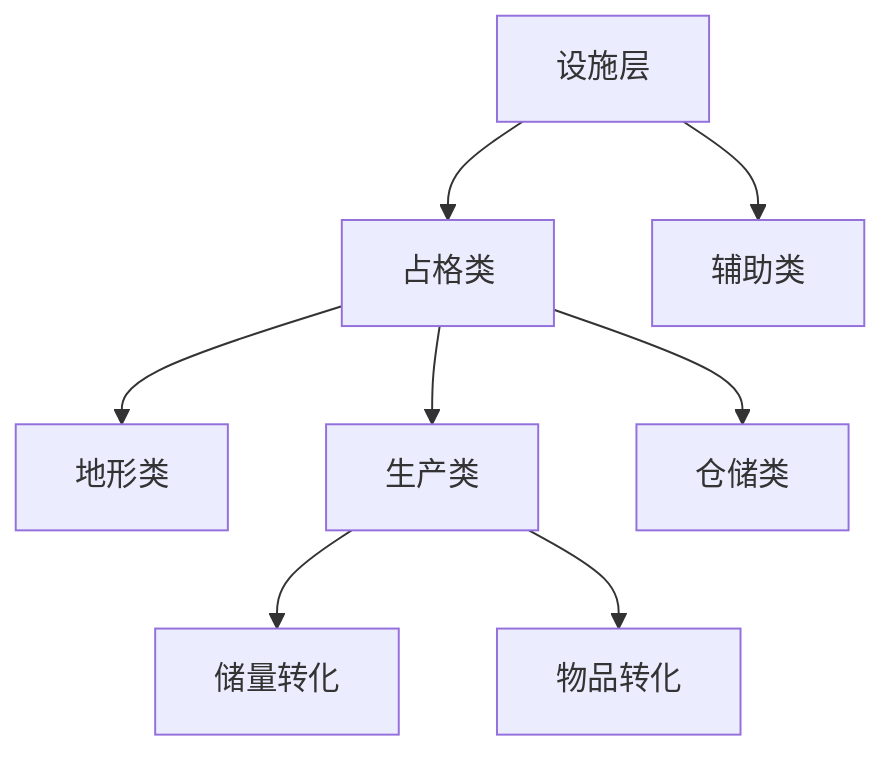

> 状态：草稿
> 校验状态：未校验

← [图层与地点](README.md)

# 设施层

## 定位

**设施层**位于地图图层栈的第五层（地形→环境→资源→**建筑**→**设施**→物品→单位），容纳**功能设施**：采集站、桥梁、哨塔、驿站、仓库等。

与 [资源层](资源层与荒野.md)（储量与资源点类型）、[建筑层](建筑层/)（城区模块）**正交**：
- **占格类**设施：占用地格或一般城区**设施建造位**，提供该格（或该位）上的主功能
- **辅助类**设施：以 Buff/Debuff、响应检测、警戒等**辅助**效果为主（见 [§设施分类](#设施分类占格类--辅助类)）

## 设施分类（占格类 / 辅助类）

设施按玩法职责分为**占格类**与**辅助类**（与草稿 `系统.md` §7 对齐；旧称「占位 / 仓库族」等并入下表，**不再**单独作为与占格类并列的大类名）。

| 大类 | 职责 | 典型效果 |
|------|------|----------|
| **占格类** | 占用合法建造位（世界地图格上的设施层槽位，或一般城区**设施建造位**），承担该位置上的**主功能** | 见下节三类细分 |
| **辅助类** | **不**以占格主功能为主；提供视野、陷阱、警戒、格内防守加成等**辅助**能力；常经 [响应检测器](地图图层.md#响应检测与行为触发) 触发行为，或以**有效时 Buff** 修正交战结算 | 哨塔、陷阱、**城墙**、驿站（**待定** 是否兼占格）等 |

### 占格类 · 三类细分

| 细分 | 职责 | 转化 / 效果链 | 建造位置（示例） | 示例 |
|------|------|---------------|------------------|------|
| **地形类** | 改变或扩展本格（及关联格）的**地形通过性 / 地貌能力** | 不直接产出物品；修改通行、连接、通过规则 | 可改造**地形格**（裂谷两端直线架桥、山地开凿隧道、丘陵平整为平原等） | **桥梁**（跨裂谷）；**隧道**（山地）；丘陵平整 **待定** |
| **生产类** | 经 [工作](../07-玩法循环/工作.md) 驱动**转化** | 见下表两档 | 资源点、一般城区设施位 | 矿区、加工厂、军工区等 |
| **仓储类** | 提升**本格**（或绑定的库存节点）**物品存储上限** | 不转化；扩容存放 | 一般城区设施位；**待定** 是否可建于荒野格 | 建材仓、粮仓、燃料库等 |

**生产类**两档转化（可并存于不同设施类型，由 `facility_type_config` 区分）：

| 档位 | 输入 | 输出 | 典型设施 |
|------|------|------|----------|
| **储量转化** | [资源层](资源层与荒野.md) **储量** | **资源物品**（金属 / 食物 / 能源 / 人口等进入 [物品层](地图图层.md) 或城市池） | **矿区**、**果园**、**能源站**、**征兵办**（建于对应资源点） |
| **物品转化** | **资源物品** | **资产物品**（队伍资产、装备组等，见 [队伍系统 · 队伍资产](../06-单位与交战/队伍系统.md#队伍资产与组建门槛)） | **加工厂**、**军工区**等（多建于一般城区，**待定** 完整名单） |

- **地形类**与草稿「某些地形可以搭建设施改变地形性质」一致；细则见 [地图图层 · 地形类型清单](地图图层.md#地形类型清单) 与 OPEN-028（隧道耐久、桥梁占格、丘陵平整工作 **待定**）。
- **仓储类**与 [城市管理系统 · 资源存储分配](../04-资源与人口/城市管理系统.md#资源存储分配) 联动：提升的是**该格 / 节点**物品容量，**不**改变一般城区**城区自身消耗**（见 [运作与居民 · 城区消耗与设施消耗](建筑层/运作与居民.md#城区消耗与设施消耗)）。
- **屋舍**（见 [§屋舍](#屋舍)）：**不属于**仓储类；在城区**基础居民承载**之上叠加额外承载。

### 屋舍

**屋舍**是建于 **一般城区** **设施建造位**的 **占格类**设施（**非**地形 / 生产 / 仓储三类），用于提升**居民承载**：

| 项 | 口径 |
|----|------|
| **与城区基础** | **每个城区**自带 **基础居民承载**（`district_type_config`）；屋舍 **不替代**基础上限，只在之上 **叠加** |
| **效果** | 每座有效屋舍增加 `extra_resident_cap`（SO 配置，**待定** 字段名与是否允许多座累加） |
| **合计** | 见 [城区总览 · 居民承载](建筑层/城区总览.md#居民承载) |
| **消耗** | 走 [设施消耗](建筑层/运作与居民.md#城区消耗与设施消耗) 独立账单；**不**改变城区 `base_resident_cap` 配置值 |
| **建造** | 工程队于一般城区合法空位建造；随移动城市迁移 |

### 辅助类

| 示例 | 主要机制 | 状态 |
|------|----------|------|
| **哨塔** | 响应检测器 → 视野 / 警戒；受地形 / 环境层修正 | 骨架 |
| **陷阱** | 响应检测器 → **战斗**通道 | 已对齐 |
| **城墙** | **有效时 Buff**：减免**本格**受击单位的**人口损失**（见 [§城墙](#城墙)） | 已定 |
| **驿站** | 运输中继、队伍补给 **待定**；是否纯辅助或兼占格 **待定** | 骨架 |

### 城墙

**城墙**是 **辅助类**设施，为**同一地图格**内的防守单位提供**人口减损**加成：

| 项 | 口径 |
|----|------|
| **分类** | **辅助类**（**非**占格类主功能）；与哨塔、陷阱同属辅助 taxonomy |
| **效果** | 设施**有效**时，**本格**内在 [交战结算](../06-单位与交战/交战系统.md#战斗结算当前版本) 中**受击**的单位，其**人口损失**按 SO 配置 **减免**（`population_loss_reduction` **待定** 字段名；固定值 / 比例 / 上限 **待定**） |
| **作用范围** | **仅本格**；不向外格扩散 |
| **不涵盖** | **不**替代队伍自身防御能力；**不**默认减免设施或城区**结构完整度**、耐久损失 |
| **失效** | 耐久归零或被摧毁后，本格不再享有减免 |
| **建造** | 工程队于设施层合法格或一般城区设施位建造（具体 `build_rule_guard_json` 见 OPEN-028） |

- 辅助类设施仍可有耐久、可被摧毁、可运维；**有效时** Buff/Debuff 见 [设施共性](#设施共性)。

## 类型示例表（与配置 ID 对照，骨架）

| 大类 | 细分 | 示例 | 建造位置 | 主要功能 | 状态 |
|------|------|------|----------|----------|------|
| 占格 | **地形类** | 桥梁 | 河流 / 裂谷（`GA_TerrainBuildBridge`） | 一般单位跨阻断地形通行 | 已定框架 |
| 占格 | **地形类** | 隧道 | 山地（`GA_TerrainBuildTunnel`） | `GE_Terrain_PostTunnel` | 已定框架 |
| 占格 | **地形类** | 丘陵平整 | 丘陵（`GA_TerrainFlattenToPlain`） | 地形改为平原 | 待定 |
| 占格 | **生产类** · 储量转化 | 矿区 / 果园 / 能源站 / 征兵办 | 对应资源点 | 储量 → 资源物品 | 已对齐 |
| 占格 | **生产类** · 物品转化 | 加工厂 / 军工区 | 一般城区设施位 | 资源物品 → 资产物品 | 待定 |
| 占格 | **仓储类** | 建材仓 / 粮仓 / 燃料库 | 一般城区设施位 | 提升本格存储上限 | 待定 |
| 占格 | **屋舍** | 屋舍 | 一般城区设施位 | 叠加 **额外**居民承载 | 已定 |
| 辅助 | — | 哨塔 / 陷阱 / **城墙** / 驿站 | 设施层合法格 | 检测 / 战斗 / **格内人口减损** / 中继 | 部分对齐 |

## 设施共性

- **有效时 Buff/Debuff**：设施对周围单位或城市的影响
- **提供工作**：设施是 [工作](../07-玩法循环/工作.md) 的载体
- **存在耐久、可被摧毁**：受交战、环境、事件影响
- **荒野有地形限制**：见 [地图图层 · 影响规则示例](地图图层.md#影响规则示例)

## 与相邻层的边界

### 与资源层（占格类 · 生产类 · 储量转化）

| 设施 | 绑定资源点 | 产出 | 文档 |
|------|------------|------|------|
| 矿区 | 矿藏 | 金属 | [资源层与荒野.md · 资源点与采集设施](资源层与荒野.md#资源点与采集设施) |
| 果园 | 果地 | 食物 | 同上 |
| 能源站 | 遗迹 | 能源 | 同上 |
| 征兵办 | 村镇 | 人口 | 同上 |

- 上表设施属 **占格类 · 生产类（储量转化）**；**建立于**资源点，通过 [工作](../07-玩法循环/工作.md) 将**储量**转化为物品层资产
- 建造与修复消耗 **金属**，部分运行消耗 **能源**

### 与建筑层（城区内设施 · 接入移动城市）

#### 接入移动城市（一般城区）

设施**可接入移动城市**：在移动城市连接网络内的**一般城区**上，于**设施建造位**建设配置允许的常规设施；所建设施随城迁移（见 [城区总览 · 一般城区](建筑层/城区总览.md#一般城区)）。

| 要点 | 说明 |
|------|------|
| **城区能力** | **一般城区本身不提供** [城区能力](建筑层/运作与居民.md#城区能力与设施效果)；能力来自**设施效果**，非城区模块 |
| **消耗分轨** | 设施建造 / 运行 / 运维消耗在**设施账单**独立结算；**不**计入、**不**改变所在一般城区的**城区自身消耗**（见 [运作与居民 · 城区消耗与设施消耗](建筑层/运作与居民.md#城区消耗与设施消耗)） |
| **与草稿** | 「性能强悍但增加运维成本」指**设施侧**运维，不是向城区叠加城区消耗 |

| 设施类型 | 占格细分 | 建造位置 | 与城市移动的关系 | 来源 |
|----------|----------|----------|------------------|------|
| **仓储类** / **生产类** · 物品转化 / **屋舍** | 占格类 | 一般城区设施位 | **随城市迁移** | 玩家建造 |
| **生产类** · 储量转化 | 占格类 | 资源点（荒野） | **城市离开后通常无法带走** | 工程队建造 |
| **地形类** | 占格类 | 特定地形格 | **绑定格子** | 工程队建造 |
| **辅助类** | 辅助类 | 设施层合法格 | 多绑定格子 **待定** | 工程队建造 |

- **城内设施** vs **荒野设施** 的核心差异：是否随移动城市整体迁移
- 见 [建筑层/城区总览.md · 一般城区](建筑层/城区总览.md#一般城区)

### 与物品层、单位层

- **物品层**：设施产出进入物品层；设施建造/修复消耗物品层资源
- **单位层**：工程队建造设施；队伍与设施交互（运维、交战）

## 待确认事项

- [ ] **占格类 / 辅助类**完整名单与 `facility_category` 枚举（OPEN-047）。
- [ ] **地形类**：隧道建造条件、与桥梁分工、击毁后地形是否回退（OPEN-028）。
- [ ] **生产类**：物品转化配方、军工区 / 加工厂产能（OPEN-044 交叉）。
- [ ] **仓储类**：与物品层 `cargo_node` 上限字段、 [城市管理系统 · 资源存储分配](../04-资源与人口/城市管理系统.md#资源存储分配) 联动（OPEN-046）。
- [ ] **屋舍**：多座累加规则、`extra_resident_cap` 数值（规则已定，见 [§屋舍](#屋舍)）。
- [ ] **辅助类**：驿站纯辅助或兼占格；**城墙**减免数值与多座叠加（规则已定，见 [§城墙](#城墙)）（OPEN-047）。
- [ ] 设施 Buff/Debuff 具体清单与影响规则。
- [ ] 一般城区设施建造位数量上限。
- [ ] 设施维护成本公式（耐久、能源、金属）；与城区消耗分轨（已定，见 [运作与居民 · 城区消耗与设施消耗](建筑层/运作与居民.md#城区消耗与设施消耗)）。
- [ ] 各类型 `build_rule_guard_json` 完整规则（OPEN-028）。

→ 交战侧设施耐久见 [待细化追踪 · OPEN-035](../../00-规范/待细化追踪.md)；设施 taxonomy 细则见 **OPEN-047**。

## 修订记录

| 日期 | 版本 | 说明 |
|------|------|------|
| 2026-06-27 | 0.0.1 | 初稿：taxonomy 骨架，与草稿 §7、差异对照对齐；边界说明 |
| 2026-06-27 | 0.0.2 | 哨塔/陷阱对齐响应检测器→行为通道口径 |
| 2026-06-27 | 0.0.3 | 接入移动城市（一般城区）；城区/设施消耗分轨 |
| 2026-06-27 | 0.0.4 | 设施分类：占格类（地形/生产/仓储）与辅助类 |
| 2026-06-27 | 0.0.5 | **屋舍**：叠加城区基础居民承载 |
| 2026-06-27 | 0.0.6 | **城墙**：辅助类；减免本格受击单位人口损失 |
| 2026-07-06 | 0.0.7 | 桥梁 / 隧道 / 丘陵平整对齐地形 capability GA |
