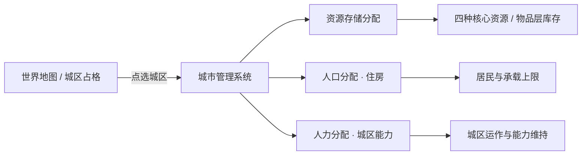

> 状态：草稿
> 程序实现：无

← [资源与人口](./README.md)

# 城市管理系统

| 字段 | 内容 |
|------|------|
| 状态 | 草稿 |
| 校验状态 | 部分符合 |
| 日期 | 2026-06-27 |
| 相关系统 | [人口与迁移](./人口与迁移.md)、[四种核心资源](./四种核心资源.md)、[运作与居民](../03-图层与地点/建筑层/运作与居民.md)、[城区总览](../03-图层与地点/建筑层/城区总览.md)、[设施层](../03-图层与地点/设施层.md)、[平台与操作](../01-核心体验/平台与操作.md)、[地图与移动](../02-地图与世界/地图与移动.md) |

## 定位

**城市管理系统**是一套**独立**的玩法系统：玩家在**己方城区**（含**占领**的城区）上，通过**地图选点 + 专用管理界面**完成三类**分配**配置。它**不是**地图图层规则本身，也**不是**泛用 UI 框架——而是与 [地图](../02-地图与世界/地图与移动.md) 上的城区实例、与 [UI](../01-核心体验/平台与操作.md) 面板绑定的**城内经营入口**。

## 适用范围

| 范围 | 说明 |
|------|------|
| **可用** | 玩家**移动城市**连接网络内的城区；玩家**占领**且可经营的城区；**招募 · 未效忠 / 效忠** recruited 外部城城区（未效忠 gate 见 [招募 · 未效忠 UI](#招募--未效忠-ui已定)） |
| **不可用** | **非玩家**外部城市的内部配置（**未招募 / 已脱离**；由 [领袖与势力 · 非玩家城市与人口调度](../05-城市与领袖/领袖与势力.md#非玩家城市与人口调度) **抽象统管**，不向玩家开放本系统） |
| **招募 · 未效忠** | **打开**与移动城市**同一套**管理面板；**不改变** Tab / 区块布局；不允许项 **禁用 + 说明**（见 [招募 · 未效忠 UI](#招募--未效忠-ui已定)） |
| **与地图** | 管理对象始终是地图 [建筑层](../03-图层与地点/地图图层.md#建筑层与城区) 上的**城区实例**；不存在单独的「城市内部场景」（见 [平台与操作 · 场景口径](../01-核心体验/平台与操作.md#场景口径open-038-已定)） |
| **与 UI** | 首版以**鼠标点选城区 → 打开管理面板**为主；三类分配可在同一面板分 Tab 或分区块呈现（线框 **待定**，OPEN-046） |

**状态限制**：**废墟**城区不可启用工作区与运作人力；居民**仅可迁出**（见 [人口与迁移 · 废墟与居民迁出](./人口与迁移.md#废墟与居民迁出)）。**招募 · 未效忠**废墟叠加规则见 [领袖与势力 · 废墟 × 招募](../05-城市与领袖/领袖与势力.md#废墟--招募--未效忠已定)。

### 招募 · 未效忠 UI（已定）

**招募 · 未效忠** recruited 外部城：点选城区**打开**本系统；**沿用**玩家移动城市 / 占领城区的**同一套 UI 框架**——Tab 划分、信息架构、布局**不变**，**不**另做专版或隐藏整块区域。

| 原则 | 口径 |
|------|------|
| **布局** | 与常规城市管理面板**一致**；三类分配 Tab / 区块**均保留可见** |
| **禁用态** | 玩法 gate **禁止**的控件：**禁用**（灰显、不可交互）+ **说明**（悬停提示或行内短文，写明原因与解封条件，如「效忠后解封」） |
| **数据源** | 与 [OPEN-059 · `city_capability_flags`](../05-城市与领袖/势力系统.md#open-059-能力-gate-待决说明) **同一表**驱动；**禁止** UI 与 API 两套规则 |
| **效忠后** | **解除**未效忠期禁用项；**不**换面板、**不**改布局（见 [效忠 · 资产划归](../05-城市与领袖/领袖与势力.md#效忠资产划归与-gate-解除已定)） |

**未效忠 · 三类分配 gate**

| 职能 | 未效忠 |
|------|--------|
| **资源存储分配** | **全部禁用**（调拨、出库、入库、仓库策略、「优先用于充饥」勾选等）；封存资源**不**经本面板动用（见 [未效忠资源管控](../05-城市与领袖/领袖与势力.md#未效忠资源管控已定)）。是否**只读**展示封存 / 存量概要 **待定**（OPEN-046） |
| **人口分配（住房）** | **禁用**：从住宅**迁出**、跨城区**改换住宅安置**（见 [势力城区管辖](../05-城市与领袖/领袖与势力.md#招募后势力城区管辖已定)）。**允许**：查看居民分布、承载等**只读**信息；其它未禁控件 **待定**（OPEN-046） |
| **人力分配（城区能力）** | **允许**编辑（城区运作人口指定） |

- 具体控件名单、说明文案模板、只读字段范围 **待定**（OPEN-046）；玩法 gate 以本节与 [势力城区管辖](../05-城市与领袖/领袖与势力.md#招募后势力城区管辖已定) 为准。

## 三类分配（核心职能）

三类分配**相互独立**，在同一系统内统一配置；**不要**与 [工作区启用与关闭](../03-图层与地点/建筑层/运作与居民.md#工作区启用与关闭)（能力启闭）、[连接与分离](../03-图层与地点/建筑层/分离与拆解.md#玩家操作连接与分离)（拓扑）混为一谈。

| 职能 | 玩家做什么 | 作用对象 | 详细规则 |
|------|------------|----------|----------|
| **资源存储分配** | 指定金属、食物、能源及 [物品层](../03-图层与地点/地图图层.md) 物资在哪些城区 / 仓库设施 / 库存节点中**存放与取用优先级** | 城区及其内 [仓库类设施](../03-图层与地点/设施层.md)（建材仓、粮仓、燃料库等 **待定** 完整名单） | 见 [§资源存储分配](#资源存储分配) |
| **人口分配（住房）** | 指定**哪类居民**安置在**哪座城区**，占用该城区**居民承载**上限 | 状态**正常**的城区 | 见 [§人口分配住房](#人口分配住房) |
| **人力分配（城区能力）** | 指定**哪一类人口**承担该城区的**城区运作** | 状态**正常**且**工作区已启用**的城区 | 见 [§人力分配城区能力](#人力分配城区能力) |

> **一般城区**：无**城区能力**；此项仅指维持**城区本体**的运作人力，**不**包含设施运行人力（设施侧 **待定**）。

### 资源存储分配

- **目标**：在城内（及占领城区）划分**存储职责**——哪些资源优先进入哪座城区的仓库、跨城区调拨时的默认来源与去向、与运输队 [装货 / 卸货](../07-玩法循环/回合与行动表.md#工作中状态) 的默认 **库存节点** 如何挂钩。
- **与四类资源**：金属、食物、能源的**总量**仍属 [四种核心资源](./四种核心资源.md) 城市池；本系统管的是**在空间上如何摊到各城区 / 节点**（上限、优先级、可见性 **待定**）。
- **与设施**：一般城区内的**仓储类**设施提升节点存储上限（见 [设施层 · 仓储类](../03-图层与地点/设施层.md#占格类--三类细分)）；分配规则须与设施是否建成、是否随 [工作区关闭](../03-图层与地点/建筑层/运作与居民.md#工作区启用与关闭) 停摆 **待定**（OPEN-046）。
- **优先用于充饥**：每个食物仓库节点可勾选「**优先用于充饥**」；周总结时按 [粮食与周总结 · §2.8](../../01-草稿/粮食与周总结/粮食与周总结-已定案详述.md) 两阶段均分扣减（OPEN-046）。
- **粮食充足性 UI**：**常驻**每回合简易判断各 `mobile_city_id` 粮食是否充足；不足时标注问题分区（§2.9，OPEN-046）。
- **与地图**：选中城区后，面板展示该城区及关联节点的**当前存量**与**分配策略**；世界地图上可通过城区 / 设施图标或摘要角标提示存储概况（表现 **待定**）。

### 人口分配（住房）

- **目标**：管理**居民**——谁**有住宅安置**在哪座城区；**不**消耗人口总量（见 [人口与迁移 · 人口不是消耗品](./人口与迁移.md#人口不是消耗品)）。
- **与显示口径**：城区上显示的人数 = **有住宅安置在该城区的人口**（**含**编组在外、仍占本城区住宅者），**不代表**已上岗的**工作人口**（见 [运作与居民 · 城区运作与居民人口](../03-图层与地点/建筑层/运作与居民.md#城区运作与居民人口)）。
- **承载**：**基础上限**（城区 SO）+ **[屋舍](../03-图层与地点/设施层.md#屋舍)** 等设施加成 = 合计**居民承载**上限；超额安置、自动均衡、迁移时的默认策略 **待定**（OPEN-033、OPEN-046）。
- **与队伍编制**：[队伍编制](./人口与迁移.md#队伍与人口) **占用**绑定城区的**住宅容量**，**不**从城区移除居民；编组外出**不**释放住宅槽位（见 [人口与迁移 · 人口与住宅](./人口与迁移.md#人口与住宅已定)）。

### 人力分配（城区能力）

- **目标**：为每座**状态正常**且**工作区已启用**的城区指定**哪一类人口**承担 [城区运作](../03-图层与地点/建筑层/运作与居民.md#城区运作与居民人口)——**特殊城区**侧重**城区能力**维持；**一般城区**侧重**城区本体**（**不提供城区能力**）。
- **与关闭工作区**：玩家 [关闭工作区](../03-图层与地点/建筑层/运作与居民.md#工作区启用与关闭) 后，该城区**自身**运作人力**不再占用**；**不**自动等同于关闭其上架设设施（设施启闭 **待定**，OPEN-045）。
- **与领袖**：运作人口类型通常与 [人口归属](./人口与迁移.md#人口归属) / 文化类别或领袖名下人口分类对应（完整名单 **待定**）；多城区复用同一类型、冲突与上限 **待定**（OPEN-046）。
- **不足时**：类型不匹配或人力不足时的停摆 / 降级规则见 [人口与迁移 · 待确认](./人口与迁移.md#待确认事项) 与 OPEN-046。

## 与其他系统的关系

| 系统 | 关系 |
|------|------|
| [回合与行动表](../07-玩法循环/回合与行动表.md) | 管理配置在**指挥阶段**修改；**不**占用行动表位（与多回合 [工作](../07-玩法循环/工作.md) 分离） |
| [工作](../07-玩法循环/工作.md) | 修复、建造、装卸等**实体工作**由队伍 / 核心区执行；本系统管的是**静态分配策略**，不是工作进度 |
| [队伍系统](../06-单位与交战/队伍系统.md) | 队伍载荷粮食（周总结）；存储分配影响运输队默认装货节点 |
| [连接与多核心](../03-图层与地点/建筑层/连接与多核心.md) | 多核心网络内各城区均可纳入本系统；跨核心资源分配 **待定**（OPEN-016 交叉） |
| 占领城区 | 占领后可纳入「己方可经营」范围（细则 **OPEN-054**） |

## 待确认事项

- [ ] 管理面板信息架构、Tab 划分与地图角标（OPEN-046）。
- [ ] **招募 · 未效忠**：禁用控件清单、说明文案、资源 Tab 只读展示范围（玩法 gate **已定**，见 [招募 · 未效忠 UI](#招募--未效忠-ui已定)）。
- [ ] 资源存储：默认策略、跨城区调拨、与 `cargo_node` 字段对应（OPEN-046）。
- [ ] 住房：超额安置、自动均衡、与队伍编制的交叉校验（OPEN-033、OPEN-046）。
- [ ] 人力：人口类型名单、多城区冲突、不足惩罚（OPEN-046）。
- [ ] 占领城区的纳入条件与权限边界（OPEN-054）。
- [ ] 航行态下是否允许打开本系统、是否只读（与 OPEN-041 交叉）。

## 修订记录

| 日期 | 版本 | 说明 |
|------|------|------|
| 2026-06-27 | 0.0.1 | 初稿：独立系统定位；资源存储 / 住房 / 城区能力人力三类分配；地图与 UI 关联 |
| 2026-06-27 | 0.0.2 | 人力分配：一般城区仅城区本体，不含设施 |
| 2026-06-27 | 0.0.3 | 住房：基础上限 + 屋舍加成 |
| 2026-06-30 | 0.0.4 | 「优先用于充饥」；常驻粮食充足性 UI（链粮食专篇草稿） |
| 2026-07-10 | 0.0.5 | 招募·未效忠：沿用原 UI；禁用+说明；效忠解除禁用 |
