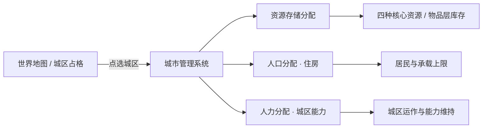

> 状态：草稿
> 程序实现：无

← [资源与人口](./README.md)

# 城市管理系统

| 字段 | 内容 |
|------|------|
| 状态 | 草稿 |
| 校验状态 | 待校验 |
| 日期 | 2026-06-27 |
| 相关系统 | [人口与迁移](./人口与迁移.md)、[四种核心资源](./四种核心资源.md)、[运作与居民](../03-图层与地点/建筑层/运作与居民.md)、[城区总览](../03-图层与地点/建筑层/城区总览.md)、[设施层](../03-图层与地点/设施层.md)、[平台与操作](../01-核心体验/平台与操作.md)、[地图与移动](../02-地图与世界/地图与移动.md) |

## 定位

**城市管理系统**是一套**独立**的玩法系统：玩家在**己方城区**（含**占领**的城区）上，通过**地图选点 + 专用管理界面**完成三类**分配**配置。它**不是**地图图层规则本身，也**不是**泛用 UI 框架——而是与 [地图](../02-地图与世界/地图与移动.md) 上的城区实例、与 [UI](../01-核心体验/平台与操作.md) 面板绑定的**城内经营入口**。

## 适用范围

| 范围 | 说明 |
|------|------|
| **可用** | 玩家**移动城市**连接网络内的城区；玩家**占领**且可经营的城区；**招募 · 未效忠 / 效忠** recruited 外部城城区（未效忠 gate 见 [招募 · 未效忠 UI](#招募--未效忠-ui已定)） |
| **不可用** | **非玩家**外部城市的内部配置（**未招募 / 已脱离**；由 [领袖与势力 · 非玩家城市与人口调度](../05-城市与领袖/领袖与势力.md#非玩家城市与人口调度) **抽象统管**，不向玩家开放本系统） |
| **招募 · 未效忠** | **打开**与移动城市**同一套**管理面板；**不改变** Tab / 区块布局；不允许项 **禁用 + 说明**（见 [招募 · 未效忠 UI](#招募--未效忠-ui已定)） |
| **与地图** | 管理对象始终是地图 [建筑层](../03-图层与地点/地图图层.md#建筑层与城区) 上的**城区实例**；不存在单独的「城市内部场景」（见 [平台与操作 · 场景口径](../01-核心体验/平台与操作.md#场景口径open-038-已定)） |
| **与 UI** | 首版以**鼠标点选城区 → 打开管理面板**为主；三类分配可在同一面板分 Tab 或分区块呈现（线框 **待定**，[sy-23](../../00-规范/待细化追踪-系统.md#当前开放项)） |

**状态限制**：**废墟**城区不可启用工作区与运作人力；居民**仅可迁出**（见 [人口与迁移 · 废墟与居民迁出](./人口与迁移.md#废墟与居民迁出)）。**招募 · 未效忠**废墟叠加规则见 [领袖与势力 · 废墟 × 招募](../05-城市与领袖/领袖与势力.md#废墟--招募--未效忠已定)。

### 招募 · 未效忠 UI（已定）

**招募 · 未效忠** recruited 外部城：点选城区**打开**本系统；**沿用**玩家移动城市 / 占领城区的**同一套 UI 框架**——Tab 划分、信息架构、布局**不变**，**不**另做专版或隐藏整块区域。

| 原则 | 口径 |
|------|------|
| **布局** | 与常规城市管理面板**一致**；三类分配 Tab / 区块**均保留可见** |
| **禁用态** | 玩法 gate **禁止**的控件：**禁用**（灰显、不可交互）+ **说明**（悬停提示或行内短文，写明原因与解封条件，如「效忠后解封」） |
| **数据源** | 与 [city-capability-flags](../../03-程序设计/03-数据字典/city-capability-flags.md) **同一表**驱动；**禁止** UI 与 API 两套规则 |
| **效忠后** | **解除**未效忠期禁用项；**不**换面板、**不**改布局（见 [效忠 · 资产划归](../05-城市与领袖/领袖与势力.md#效忠资产划归与-gate-解除已定)） |

**未效忠 · 三类分配 gate**

| 职能 | 未效忠 |
|------|--------|
| **资源存储分配** | **全部禁用**（调拨、出库、入库、仓库策略、「优先用于充饥」勾选等）；封存资源**不**经本面板动用（见 [未效忠资源管控](../05-城市与领袖/领袖与势力.md#未效忠资源管控已定)） |
| **人口分配（住房）** | **禁用**：从住宅**迁出**、跨城区**改换住宅安置**（见 [势力城区管辖](../05-城市与领袖/领袖与势力.md#招募后势力城区管辖已定)）。**允许**：查看居民分布、承载等**只读**信息 |
| **人力分配（城区能力）** | **允许**编辑（城区运作人口指定） |

#### 控件级清单（未效忠 · 已定）

下列为**首版须实现**的控件 gate；线框与视觉样式仍 **待定**（sy-23 **仅**阻塞表现层，**不**阻塞玩法 gate）。

**资源存储 Tab**

| 控件 | 未效忠 | 效忠后 diff | 禁用说明模板 ID |
|------|--------|-------------|-----------------|
| 跨城区调拨（来源 / 去向选择） | deny | 解除禁用 | `cms_deny_unloyal_sealed` |
| 手动出库 | deny | 解除禁用 | `cms_deny_unloyal_sealed` |
| 手动入库 | deny | 解除禁用 | `cms_deny_unloyal_sealed` |
| 仓库分配策略（默认节点 / 优先级） | deny | 解除禁用 | `cms_deny_unloyal_sealed` |
| 「优先用于充饥」勾选 | deny | 解除禁用 | `cms_deny_unloyal_sealed` |
| 各节点存量数字 | readonly | 解除只读（可编辑策略时同步） | — |
| 封存资源概要（金属 / 能源等） | readonly | 解封后并入可编辑流 | `cms_hint_sealed_readonly` |

**人口分配 Tab**

| 控件 | 未效忠 | 效忠后 diff | 禁用说明模板 ID |
|------|--------|-------------|-----------------|
| 从本城区迁出居民 | deny | 解除禁用 | `cms_deny_unloyal_no_move_out` |
| 跨城区改换住宅安置 | deny | 解除禁用 | `cms_deny_unloyal_no_move_out` |
| 向本城区迁入新居民 | deny¹ | 解除禁用 | `cms_deny_ruin_no_move_in` / `cms_deny_unloyal_no_move_out` |
| 居民分布列表 | readonly | 不变（仍可读） | — |
| 居民承载上限 / 占用率 | readonly | 不变 | — |

¹ 废墟城区：**deny**（不可迁入）；非废墟未效忠：迁入若涉及**迁出他区**则整体 **deny**。

**人力分配 Tab**

| 控件 | 未效忠 | 效忠后 diff | 禁用说明模板 ID |
|------|--------|-------------|-----------------|
| 城区运作人口类型下拉 | allow | 不变 | — |
| 工作区启用 / 关闭 | allow² | 不变 | `cms_deny_ruin_no_work` |
| 运作人力不足提示 | readonly | 不变 | — |

² 废墟城区：**deny**（无法工作）。

#### 禁用说明文案模板（简体中文）

模板由 `CityDenyReasonTemplateSO` 配置；UI 悬停或行内展示**完整句**，勿用自造缩写。

| 模板 ID | 文案 |
|---------|------|
| `cms_deny_unloyal_sealed` | 该城尚未效忠，资源仍封存。调拨与仓库策略将在效忠后开放。 |
| `cms_deny_unloyal_no_move_out` | 该城尚未效忠，不能安排居民从住宅迁出或改换安置。效忠后可按通常规则管理住房。 |
| `cms_deny_ruin_no_move_in` | 这座城区已是废墟，不能迁入新居民。可先修复结构。 |
| `cms_deny_ruin_no_work` | 这座城区已是废墟，不能启用工作区。请先修复结构。 |
| `cms_hint_sealed_readonly` | 封存中的资源仅展示存量，不能在此面板动用。粮食消耗由每周结算自动处理。 |

- **效忠后**：凡标注「解除禁用」的控件恢复 **allow**；**不**更换面板、**不**隐藏 Tab（见 [效忠 · 资产划归](../05-城市与领袖/领袖与势力.md#效忠资产划归与-gate-解除已定)）。
- **sy-23 线框**：面板布局、Tab 图标、地图角标等**视觉稿仍待定**；本节控件 gate **已定**，与 [city-capability-flags · 管理 UI](../../03-程序设计/03-数据字典/city-capability-flags.md#管理-ui) 对齐。

- 程序字段与 `entry_id` 映射见 [city-capability-flags](../../03-程序设计/03-数据字典/city-capability-flags.md)。

## 三类分配（核心职能）

三类分配**相互独立**，在同一系统内统一配置；**不要**与 [工作区启用与关闭](../03-图层与地点/建筑层/运作与居民.md#工作区启用与关闭)（能力启闭）、[连接与分离](../03-图层与地点/建筑层/分离与拆解.md#玩家操作连接与分离)（拓扑）混为一谈。

| 职能 | 玩家做什么 | 作用对象 | 详细规则 |
|------|------------|----------|----------|
| **资源存储分配** | 指定金属、食物、能源及 [物品层](../03-图层与地点/地图图层.md) 物资在哪些城区 / 仓库设施 / 库存节点中**存放与取用优先级** | 城区及其内 [仓库类设施](../03-图层与地点/设施层.md)（建材仓、粮仓、燃料库等 **待定** 完整名单） | 见 [§资源存储分配](#资源存储分配) |
| **人口分配（住房）** | 指定**哪类居民**安置在**哪座城区**，占用该城区**居民承载**上限 | 状态**正常**的城区 | 见 [§人口分配住房](#人口分配住房) |
| **人力分配（城区能力）** | 指定**哪一类人口**承担该城区的**城区运作** | 状态**正常**且**工作区已启用**的城区 | 见 [§人力分配城区能力](#人力分配城区能力) |

> **一般城区**：无**城区能力**；此项仅指维持**城区本体**的运作人力，**不**包含设施运行人力（设施侧 **待定**）。

### 资源存储分配

- **目标**：在城内（及占领城区）划分**存储职责**——哪些资源优先进入哪座城区的仓库、跨城区调拨时的默认来源与去向、与运输队 [装货 / 卸货](../07-玩法循环/回合与行动表.md#工作中状态) 的默认 **库存节点** 如何挂钩。
- **与四类资源**：金属、食物、能源的**总量**仍属 [四种核心资源](./四种核心资源.md) 城市池；本系统管的是**在空间上如何摊到各城区 / 节点**（上限、优先级、可见性 **待定**）。
- **与设施**：一般城区内的**仓储类**设施提升节点存储上限（见 [设施层 · 仓储类](../03-图层与地点/设施层.md#占格类--三类细分)）；分配规则须与设施是否建成、是否随 [工作区关闭](../03-图层与地点/建筑层/运作与居民.md#工作区启用与关闭) 停摆 **待定**（sy-23）。
- **优先用于充饥**：每个食物仓库节点可勾选「**优先用于充饥**」；周总结时按 [粮食与周总结 · §2.8](../../01-草稿/粮食与周总结/粮食与周总结-已定案详述.md) 两阶段均分扣减（sy-23）。
- **粮食充足性 UI**：**常驻**每回合简易判断各 `mobile_city_id` 粮食是否充足；不足时标注问题分区（§2.9，sy-23）。
- **与地图**：选中城区后，面板展示该城区及关联节点的**当前存量**与**分配策略**；世界地图上可通过城区 / 设施图标或摘要角标提示存储概况（表现 **待定**）。

### 人口分配（住房）

- **目标**：管理**居民**——谁**有住宅安置**在哪座城区；**不**消耗人口总量（见 [人口与迁移 · 人口不是消耗品](./人口与迁移.md#人口不是消耗品)）。
- **与显示口径**：城区上显示的人数 = **有住宅安置在该城区的人口**（**含**编组在外、仍占本城区住宅者），**不代表**已上岗的**工作人口**（见 [运作与居民 · 城区运作与居民人口](../03-图层与地点/建筑层/运作与居民.md#城区运作与居民人口)）。
- **承载**：**基础上限**（城区 SO）+ **[屋舍](../03-图层与地点/设施层.md#屋舍)** 等设施加成 = 合计**居民承载**上限；超额安置、自动均衡、迁移时的默认策略 **待定**（sy-14、sy-23）。
- **与队伍编制**：[队伍编制](./人口与迁移.md#队伍与人口) **占用**绑定城区的**住宅容量**，**不**从城区移除居民；编组外出**不**释放住宅槽位（见 [人口与迁移 · 人口与住宅](./人口与迁移.md#人口与住宅已定)）。

### 人力分配（城区能力）

- **目标**：为每座**状态正常**且**工作区已启用**的城区指定**哪一类人口**承担 [城区运作](../03-图层与地点/建筑层/运作与居民.md#城区运作与居民人口)——**特殊城区**侧重**城区能力**维持；**一般城区**侧重**城区本体**（**不提供城区能力**）。
- **与关闭工作区**：玩家 [关闭工作区](../03-图层与地点/建筑层/运作与居民.md#工作区启用与关闭) 后，该城区**自身**运作人力**不再占用**；**不**自动等同于关闭其上架设设施（设施启闭 **待定**，sy-22）。
- **与领袖**：运作人口类型通常与 [人口归属](./人口与迁移.md#人口归属) / 文化类别或领袖名下人口分类对应（完整名单 **待定**）；多城区复用同一类型、冲突与上限 **待定**（sy-23）。
- **不足时**：类型不匹配或人力不足时的停摆 / 降级规则见 [人口与迁移 · 待确认](./人口与迁移.md#待确认事项) 与 sy-23。

### `cargo_node` 字段映射（占位 · sy-23）

下列从 [资源存储分配](#资源存储分配)、[设施层 · 仓储类](../03-图层与地点/设施层.md#占格类--三类细分)、[回合与行动数据结构 · `cargo_node`](../../03-程序设计/03-数据字典/回合与行动数据结构.md)、[粮食与周总结 · FoodStorageNode](../../01-草稿/粮食与周总结/粮食与周总结-已定案详述.md) 推导。**程序统一库存节点**为 `cargo_node`；食物扣减侧别名 `FoodStorageNode`。**占位**：容量数值、默认策略、废墟 / 工作区关闭时节点停摆细则 **待定**。

| UI 概念 | 程序字段 | 数据来源 SO / 表 | 备注 |
|---------|----------|------------------|------|
| 资源存储 Tab · 节点列表行 | `cargo_node_id` | 运行时 `CargoNodeState`（**待定** SO） | 主键；绑定城区或设施格 |
| 节点显示名（粮仓 / 建材仓等） | `display_name_zh` | `L5_facility_defs` 或城区默认节点配置 | 无仓储设施时仍可有城区级默认节点（**待定**） |
| 节点所属城区 | `district_id` | `L4_district_defs` / 城区实例 | CMS 点选城区后筛出关联节点 |
| 节点绑定设施 | `facility_instance_id` | `FacilityInstanceState` | 可空；**仓储类**占格设施建成后记入 |
| 仓储类容量加成 | `capacity_max` | `FacilityCapacityContributor` + `L5_facility_defs`（`material_warehouse` / `food_warehouse` / `fuel_warehouse`） | 提升**本节点**物品上限；**不**改城区自身消耗 |
| 节点当前存量（四类资源 / 物品摘要） | `stock_by_resource_kind` / `item_stack_refs` | `CargoNodeState` + `L6_item_defs` | 金属 / 食物 / 能源走城市池分轨；**物品层**物资堆 **占位**，与节点引用分轨 |
| 「优先用于充饥」勾选 | `food_priority_for_consumption` | `CargoNodeState` 或 CMS 策略 SO | 仅**食物**节点；周总结 §2.8 两阶段扣减 |
| 仓库分配策略（默认节点 / 优先级） | `default_cargo_node_id` / `priority_list` | CMS 策略配置（**待定** SO） | 跨城区调拨默认来源与去向；未效忠 **deny** |
| 跨城区调拨（来源 / 去向） | `transfer_source_node_id` / `transfer_target_node_id` | 指令 / CMS 写入 | 须同属玩家可经营 `mobile_city_id` 网络（**待定** 跨核心） |
| 手动出库 / 入库 | `manual_draw_node_id` / `manual_deposit_node_id` | 同上 | 未效忠 **deny**；封存资源 **不**经节点出库 |
| 装货 / 卸货默认节点 | `default_load_cargo_node_id` | CMS 策略 + 队伍上下文 | `work_subject_kind=cargo_node`（见 [回合与行动数据结构](../../03-程序设计/03-数据字典/回合与行动数据结构.md)） |
| 封存资源概要（未效忠外部城） | `sealed_resource_summary` | 外部城封存池（**非** `cargo_node`） | CMS **只读**；金属 / 能源等 **不**映射为可编辑节点 |
| 队伍载荷分池 | `team_payload_cargo_ref` | `TeamInstanceState` | **不**纳入城区 CMS 调拨；与主城仓库分轨（见 [粮食与周总结 · 队伍容器](../../01-草稿/粮食与周总结/粮食与周总结-已定案详述.md)） |
| 废墟 / 工作区关闭 | `is_operational` | `is_ruin` + `pop.work_zone_toggle` gate | 废墟节点**是否**只读、是否禁止装货 **待定**（sy-23） |

- 程序字段落盘意向见 [设施数据结构 · 库存节点 `cargo_node`](../../03-程序设计/03-数据字典/设施数据结构.md#库存节点-cargo_node)；`CargoNodeState` 运行时 SO **待新建**（sy-23）。

### 人力类型名单占位表（占位 · 待策划定案 · sy-23）

下列从 [人口归属](./人口与迁移.md#人口归属)、[城区运作](../03-图层与地点/建筑层/运作与居民.md#城区运作与居民人口)、[领袖与势力 · 商队履约](../05-城市与领袖/领袖与势力.md#商队履约已定) 推导。**完整名单、数值与领袖特质对照待定**；表内 `population_type_id` 为程序占位主键，**禁止**当作已定势力专名。

| `population_type_id` | 显示名 | 可承担城区运作 | 可编组 | 备注 |
|--------------------|--------|:--------------:|:------:|------|
| `pop_unaffiliated` | 无归属 | **待定** | 是 | [村镇](./荒野地点/村镇.md) 储量经 [征兵办](./荒野地点/征兵办.md) 提取；接收后由**城市领袖**纳入管辖池 |
| `pop_player_default` | 玩家默认人口（占位） | 是 | 是 | 玩家移动城市管辖池默认类型；具体显示名 **待定** |
| `pop_faction_{org}_placeholder` | {组织}人口（占位） | 是 | 是 | 绑定**城市领袖**管辖池；`{org}` 换势力组织 id；名单 **待策划定案** |
| `pop_trade_capable` | 商队人口（占位） | **待定** | 是 | 须 `can_form_trade_caravan`（字段 **待定**）；[商队履约](../05-城市与领袖/领袖与势力.md#商队履约已定) 多类取舍后锁定单类型 |
| `pop_specialist_engineer` | 工程人口（占位） | 是 | 是 | 承担建造 / 运维类城区工作 **待定**；与 [工程队](../../06-单位与交战/队伍系统.md) 模板交叉 |
| `pop_specialist_military` | 武装人口（占位） | 是 | 是 | 承担武装编组 **待定**；与队伍模板交叉 |

**已定约束**（不随占位表消失）：

- 编组 **禁止混编**：全队锁定单一 `population_type_id`（见 [编组 · 单一人口类型](./人口与迁移.md#编组--单一人口类型已定)）。
- **人力分配 Tab** 下拉选项 = 该城管辖池内**仍有可上岗 / 可编组编制**的类型子集（不足时停摆规则 **待定**）。
- 运作人口类型与**居民安置**类型 **可不同**；同一类型可否多城区复用 **待定**。

## 与其他系统的关系

| 系统 | 关系 |
|------|------|
| [回合与行动表](../07-玩法循环/回合与行动表.md) | 管理配置在**指挥阶段**修改；**不**占用行动表位（与多回合 [工作](../07-玩法循环/工作.md) 分离） |
| [工作](../07-玩法循环/工作.md) | 修复、建造、装卸等**实体工作**由队伍 / 核心区执行；本系统管的是**静态分配策略**，不是工作进度 |
| [队伍系统](../06-单位与交战/队伍系统.md) | 队伍载荷粮食（周总结）；存储分配影响运输队默认装货节点 |
| [连接与多核心](../03-图层与地点/建筑层/连接与多核心.md) | 多核心网络内各城区均可纳入本系统；跨核心资源分配 **待定**（sy-08 交叉） |
| 占领城区 | 占领后可纳入「己方可经营」范围（细则 **sy-30**） |

## 待确认事项

- [ ] 管理面板信息架构、Tab 划分与地图角标（sy-23 **线框待定**；控件 gate **已定**，见 [招募 · 未效忠 UI](#招募--未效忠-ui已定)）。
- [ ] **招募 · 未效忠**：航行态是否只读（sy-19 交叉）。
- [ ] 资源存储：默认策略、跨城区调拨细则；`cargo_node` 运行时 SO 与废墟 / 工作区关闭时节点停摆（sy-23；字段映射 **占位已定**，见 [`cargo_node` 字段映射](#cargo_node-字段映射占位--sy-23)）。
- [ ] 住房：超额安置、自动均衡、与队伍编制的交叉校验（sy-14、sy-23）。
- [ ] 人力：人口类型**正式**名单与领袖特质对照、多城区冲突、不足惩罚（sy-23；占位表见 [人力类型名单占位表](#人力类型名单占位表占位--待策划定案--sy-23)）。
- [ ] 占领城区的纳入条件与权限边界（sy-30）。
- [ ] 航行态下是否允许打开本系统、是否只读（与 sy-19 交叉）。

## 修订记录

| 日期 | 版本 | 说明 |
|------|------|------|
| 2026-06-27 | 0.0.1 | 初稿：独立系统定位；资源存储 / 住房 / 城区能力人力三类分配；地图与 UI 关联 |
| 2026-06-27 | 0.0.2 | 人力分配：一般城区仅城区本体，不含设施 |
| 2026-06-27 | 0.0.3 | 住房：基础上限 + 屋舍加成 |
| 2026-06-30 | 0.0.4 | 「优先用于充饥」；常驻粮食充足性 UI（链粮食专篇草稿） |
| 2026-07-10 | 0.0.6 | sy-23：未效忠控件级清单、禁用文案模板；效忠 diff；链 city-capability-flags |
| 2026-07-10 | 0.0.7 | sy-23：`cargo_node` 字段映射占位表；人力类型名单占位表（待策划定案） |
