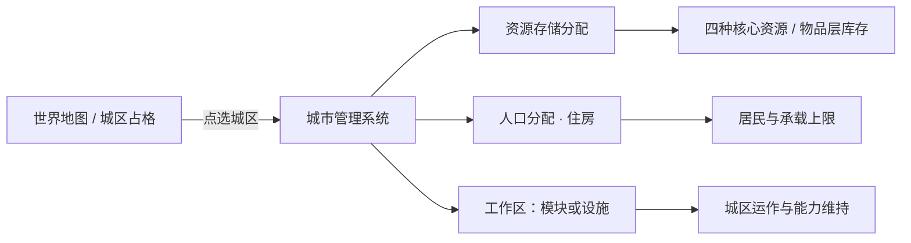

> 状态：草稿
> 程序实现：无

← [资源与人口](./README.md)

# 城市管理系统

| 字段 | 内容 |
|------|------|
| 状态 | 草稿 |
| 校验状态 | 待校验 |
| 日期 | 2026-06-27 |
| 相关系统 | [人口与迁移](./人口与迁移.md)、[四种核心资源](./四种核心资源.md)、[运作与居民](../03-图层与地点/建筑层/运作与居民.md)、[城区总览](../03-图层与地点/建筑层/城区总览.md)、[设施层](../03-图层与地点/设施层.md)、[平台与操作](../01-核心体验/平台与操作.md)、[地图与移动](../02-地图与世界/地图与移动.md) |

## 定位

**城市管理系统**是一套**独立**的玩法系统：玩家在**己方城区**（含**占领**的城区）上，通过**地图选点 + 专用管理界面**完成三类**分配**配置。它**不是**地图图层规则本身，也**不是**泛用 UI 框架——而是与 [地图](../02-地图与世界/地图与移动.md) 上的城区实例、与 [UI](../01-核心体验/平台与操作.md) 面板绑定的**城内经营入口**。

## 适用范围

| 范围 | 说明 |
|------|------|
| **可用** | 玩家**移动城市**连接网络内的城区；玩家**占领**且可经营的城区；**招募 · 未效忠 / 效忠** recruited 外部城城区（未效忠 gate 见 [招募 · 未效忠 UI](#招募--未效忠-ui已定)） |
| **不可用** | **非玩家**外部城市的内部配置（**未招募 / 已脱离**；由 [领袖与势力 · 非玩家城市与人口调度](../05-城市与领袖/领袖与势力.md#非玩家城市与人口调度) **抽象统管**，不向玩家开放本系统） |
| **招募 · 未效忠** | **打开**与移动城市**同一套**管理面板；**不改变** Tab / 区块布局；不允许项 **禁用 + 说明**（见 [招募 · 未效忠 UI](#招募--未效忠-ui已定)） |
| **与地图** | 管理对象始终是地图 [建筑层](../03-图层与地点/地图图层.md#建筑层与城区) 上的**城区实例**；不存在单独的「城市内部场景」（见 [平台与操作 · 场景口径](../01-核心体验/平台与操作.md#场景口径open-038-已定)） |
| **与 UI** | 首版以**鼠标点选城区 → 打开管理面板**为主；三类分配可在同一面板分 Tab 或分区块呈现（线框 **待定**，[sy-23](../../00-规范/待细化追踪-系统.md#当前开放项)） |

**状态限制**：**废墟**特殊城区不可启用模块工作区；**一般城区**设施工作区停摆（设施停止运行、保留占格）。居民**仅可迁出**（见 [人口与迁移 · 废墟与居民迁出](./人口与迁移.md#废墟与居民迁出)）。

### 招募 · 未效忠 UI（已定）

**招募 · 未效忠** recruited 外部城：点选城区**打开**本系统；**沿用**玩家移动城市 / 占领城区的**同一套 UI 框架**——Tab 划分、信息架构、布局**不变**，**不**另做专版或隐藏整块区域。

| 原则 | 口径 |
|------|------|
| **布局** | 与常规城市管理面板**一致**；三类分配 Tab / 区块**均保留可见** |
| **禁用态** | 玩法 gate **禁止**的控件：**禁用**（灰显、不可交互）+ **说明**（悬停提示或行内短文，写明原因与解封条件，如「效忠后解封」） |
| **数据源** | 与 [city-capability-flags](../../03-程序设计/03-数据字典/city-capability-flags.md) **同一表**驱动；**禁止** UI 与 API 两套规则 |
| **效忠后** | **解除**未效忠期禁用项；**不**换面板、**不**改布局（见 [效忠 · 资产划归](../05-城市与领袖/领袖与势力.md#效忠资产划归与-gate-解除已定)） |

**未效忠 · 三类分配 gate**

| 职能 | 未效忠 |
|------|--------|
| **资源存储分配** | **全部禁用**（调拨、出库、入库、仓库策略、「优先用于充饥」勾选等）；封存资源**不**经本面板动用（见 [未效忠资源管控](../05-城市与领袖/领袖与势力.md#未效忠资源管控已定)） |
| **人口分配（住房）** | **禁用**迁出 / 改换安置；**允许**只读查看 | 见 [§人口分配住房](#人口分配住房) |
| **工作区**（启停 + 运作人力） | **允许**（**特殊城区**模块行 + **一般城区**各**设施**行；**同一套 UI**） | 废墟特殊城区模块：**deny**；废墟一般城区设施：**deny**启停 |

**招募 · 未效忠**废墟叠加规则见 [领袖与势力 · 废墟 × 招募](../05-城市与领袖/领袖与势力.md#废墟--招募--未效忠已定)。

#### 控件级清单（未效忠 · 已定）

下列为**首版须实现**的控件 gate；线框与视觉样式仍 **待定**（sy-23 **仅**阻塞表现层，**不**阻塞玩法 gate）。

**资源存储 Tab**

| 控件 | 未效忠 | 效忠后 diff | 禁用说明模板 ID |
|------|--------|-------------|-----------------|
| 跨城区调拨（来源 / 去向选择） | deny | 解除禁用 | `cms_deny_unloyal_sealed` |
| 手动出库 | deny | 解除禁用 | `cms_deny_unloyal_sealed` |
| 手动入库 | deny | 解除禁用 | `cms_deny_unloyal_sealed` |
| 仓库分配策略（默认节点 / 优先级） | deny | 解除禁用 | `cms_deny_unloyal_sealed` |
| 「优先用于充饥」勾选 | deny | 解除禁用 | `cms_deny_unloyal_sealed` |
| 各节点存量数字 | readonly | 解除只读（可编辑策略时同步） | — |
| 封存资源概要（金属 / 能源等） | readonly | 解封后并入可编辑流 | `cms_hint_sealed_readonly` |

**人口分配 Tab**

| 控件 | 未效忠 | 效忠后 diff | 禁用说明模板 ID |
|------|--------|-------------|-----------------|
| 从本城区迁出居民 | deny | 解除禁用 | `cms_deny_unloyal_no_move_out` |
| 跨城区改换住宅安置 | deny | 解除禁用 | `cms_deny_unloyal_no_move_out` |
| 向本城区迁入新居民 | deny¹ | 解除禁用 | `cms_deny_ruin_no_move_in` / `cms_deny_unloyal_no_move_out` |
| 居民分布列表 | readonly | 不变（仍可读） | — |
| 居民承载上限 / 占用率 | readonly | 不变 | — |

¹ 废墟城区：**deny**（不可迁入）；非废墟未效忠：迁入若涉及**迁出他区**则整体 **deny**。

**工作区 Tab**

| 控件 | 未效忠 | 效忠后 diff | 禁用说明模板 ID |
|------|--------|-------------|-----------------|
| 工作区启用 / 关闭（**特殊城区**模块行） | allow¹ | 不变 | `cms_deny_ruin_no_work` |
| 工作区启用 / 关闭（**一般城区** · 各**设施**行） | allow¹ | 不变 | `cms_deny_ruin_no_facility` |
| 运作人口类型下拉（模块或设施） | allow | 不变 | — |
| 运作人力不足提示 | readonly | 不变 | — |

¹ 废墟：**特殊城区**模块 **deny**；**一般城区**设施 **deny** 启停（保留占格、停止运行）。

#### 禁用说明文案模板（简体中文）

模板由 `CityDenyReasonTemplateSO` 配置；UI 悬停或行内展示**完整句**，勿用自造缩写。

| 模板 ID | 文案 |
|---------|------|
| `cms_deny_unloyal_sealed` | 该城尚未效忠，资源仍封存。调拨与仓库策略将在效忠后开放。 |
| `cms_deny_unloyal_no_move_out` | 该城尚未效忠，不能安排居民从住宅迁出或改换安置。效忠后可按通常规则管理住房。 |
| `cms_deny_ruin_no_move_in` | 这座城区已是废墟，不能迁入新居民。可先修复结构。 |
| `cms_deny_ruin_no_work` | 这座城区已是废墟，不能启用模块工作区。请先修复结构。 |
| `cms_deny_ruin_no_facility` | 这座城区已是废墟，设施已停止运行。请先修复结构。 |
| `cms_hint_sealed_readonly` | 封存中的资源仅展示存量，不能在此面板动用。粮食消耗由每周结算自动处理。 |

- **效忠后**：凡标注「解除禁用」的控件恢复 **allow**；**不**更换面板、**不**隐藏 Tab（见 [效忠 · 资产划归](../05-城市与领袖/领袖与势力.md#效忠资产划归与-gate-解除已定)）。
- **sy-23 线框**：面板布局、Tab 图标、地图角标等**视觉稿仍待定**；本节控件 gate **已定**，与 [city-capability-flags · 管理 UI](../../03-程序设计/03-数据字典/city-capability-flags.md#管理-ui) 对齐。

- 程序字段与 `entry_id` 映射见 [city-capability-flags](../../03-程序设计/03-数据字典/city-capability-flags.md)。

## 三类分配（核心职能）

三类分配**相互独立**，在同一系统内统一配置；**不要**与 [连接与分离](../03-图层与地点/建筑层/分离与拆解.md#玩家操作连接与分离)（拓扑）混为一谈。

| 职能 | 玩家做什么 | 作用对象 | 详细规则 |
|------|------------|----------|----------|
| **资源存储分配** | 指定金属、食物、能源及 [物品层](../03-图层与地点/地图图层.md) 物资在哪些城区 / 仓库设施 / 库存节点中**存放与取用优先级** | 城区及其内 [仓库类设施](../03-图层与地点/设施层.md) | 见 [§资源存储分配](#资源存储分配) |
| **人口分配（住房）** | 指定**哪类居民**安置在**哪座城区** | 状态**正常**的城区 | 见 [§人口分配住房](#人口分配住房) |
| **工作区** | 启用 / 关闭 + 指定**运作人口类型** | **特殊城区**：模块行；**一般城区**：各**设施**行（[设施即工作区](../03-图层与地点/设施层.md#一般城区--设施即工作区)） | 见 [§工作区](#工作区) |

### 资源存储分配

- **目标**：在城内（及占领城区）划分**存放节点与取用优先级**——资源进哪座城区的仓库节点、跨城区调拨默认来源与去向、与运输队 [装货 / 卸货](../07-玩法循环/回合与行动表.md#工作中状态) 的默认 **库存节点** 如何挂钩。
- **与四类资源**：金属、食物、能源的**存量分轨记账**，但**共用**节点 `capacity_max`（`占用 = 金属 + 食物 + 能源`）；见 [四种核心资源 · 仓储容量](./四种核心资源.md#仓储容量已定框架)。人口**不**占仓。
- **与设施**：**仓库**（仓储类）抬高节点共用上限；`cargo_node` 存取权限**只看归属关系**——工作区开关仅控制城区功能激活与否，**不影响**节点存取（城区属于玩家即可正常读写，与工作区启停无关）。
- **空间挑战（已定）**：**不**按资源种类分仓；玩家须在有限空间内权衡囤粮 / 囤金属 / 囤能源。
- **出入库默认优先级（已定）**：玩家对**每个 `cargo_node`** × **每种可存放物品种类**（金属、食物、能源及各物品层物资）独立配置优先级，共四档：

| 档位 | 入库行为 | 扣减行为 |
|------|----------|----------|
| **高优先** | 新物资优先存入此节点 | 建造/修复/消耗时优先从此节点扣减 |
| **常规** | 高优先节点满后存入 | 高优先节点不足后从此节点扣减 |
| **低优先** | 高优先和常规均满后存入 | 高优先和常规均不足后从此节点扣减 |
| **禁存** | **不**接受该类物资入库 | 可正常扣减（存量为零时无影响） |

**批量粘贴**：玩家可多选若干城区，将某一城区的完整优先级配置一键粘贴到所有选中城区——避免逐区重复配置。

**示例**：
- 核心区：金属高优先、能源高优先（建造/修复就近扣减）；食物常规
- 仓库设施节点：食物高优先（囤粮）；金属/能源常规
- 前线城区：禁存金属、禁存能源（只存食物，方便运粮队卸货）
- **优先用于充饥**：节点可勾选「**优先用于充饥**」——影响周总结**扣粮顺序**（先从勾选节点扣食物），**不**单独开辟食物容量；见 [粮食与周总结 · §2.8](../../01-草稿/归档/粮食与周总结/粮食与周总结-已定案详述.md)（sy-23）。
- **粮食充足性 UI**：**常驻**每回合简易判断各 `mobile_city_id` 粮食是否充足；不足时标注问题分区（§2.9，sy-23）。
- **与地图**：选中城区后，面板展示该城区及关联节点的**当前占用 / 上限**与分资源存量；世界地图摘要角标（表现 **待定**）。

### 人口分配（住房）

- **目标**：管理**居民**——谁**有住宅安置**在哪座城区；**不**消耗人口总量（见 [人口与迁移 · 人口不是消耗品](./人口与迁移.md#人口不是消耗品)）。
- **与显示口径**：城区上显示的人数 = **有住宅安置在该城区的人口**（**含**编组在外、仍占本城区住宅者），**不代表**已上岗的**工作人口**（见 [运作与居民 · 城区运作与居民人口](../03-图层与地点/建筑层/运作与居民.md#城区运作与居民人口)）。
- **承载**：**基础上限**（城区 SO）+ **[屋舍](../03-图层与地点/设施层.md#屋舍)** 等设施加成 = 合计**居民承载**上限。**不可超额安置**：玩家主动迁入时，目标城区承载已满则**拒绝操作**（同仓库超限不可入库）。**被动超限处置**：若因设施拆除等原因导致居民数超过新上限，城区进入**停摆**状态——人力视为完全不足，工作区失效（不产出、不消耗日常开销、不触发被动/主动能力），玩家须**手动迁出居民至承载恢复**后方可解除停摆。
- **与队伍编制**：[队伍编制](./人口与迁移.md#队伍与人口) **占用**绑定城区的**住宅容量**，**不**从城区移除居民；编组外出**不**释放住宅槽位（见 [人口与迁移 · 人口与住宅](./人口与迁移.md#人口与住宅已定)）。

### 工作区

- **目标**：为**工作区**配置启用 / 关闭与**运作人口类型**——与 [运作与居民 · 工作区](../03-图层与地点/建筑层/运作与居民.md#工作区特殊城区模块--一般城区设施) 对齐。
- **人力来源（已定）**：工作区只能使用**本城区居民**中的人口；下拉选项 = 本城区居民中存在的**所有人口类型**，玩家从中任选一种。不同城区的工作区可各自选用不同或相同的类型——各城区人力互不冲突，各自从本区居民里抽取。
- **特殊城区**：**工作区开关**控制运作人口是否上岗；上岗后结算 **日常开销** 与 **被动能力**；**主动能力**在工作区开启后另行下达，扣 **激活开销**（见 [运作与居民 · 工作区](../03-图层与地点/建筑层/运作与居民.md#特殊城区--工作区启停)）。
- **一般城区**：**无**城区级工作区行；列出该城区上每座**设施**，每座设施**一行**，UI 与特殊城区模块**相同**（启停、人力、消耗）。
- **人力不足时（已定）**：开启时校验——本区该类型居民**不足最低需求则拒绝开启**；已开启后跌破最低需求 → 工作区**停摆**（被动失效、主动不可用），但开/关标记**维持开启**，不自动关闭。人口恢复至满足最低需求时自动复原，不须手动重开。**最低需求之上**：工作效率按比例随人数下降——`participant_count × work_efficiency`，与队伍人数比规则一致（见 [回合与行动表 · 工作效率与工作量](../07-玩法循环/回合与行动表.md#工作效率与工作量)）。

### `cargo_node` 字段映射（占位 · sy-23）

下列从 [资源存储分配](#资源存储分配)、[设施层 · 仓储类](../03-图层与地点/设施层.md#仓储类仓库)、[回合与行动数据结构 · `cargo_node`](../../03-程序设计/03-数据字典/回合与行动数据结构.md)、[粮食与周总结 · FoodStorageNode](../../01-草稿/归档/粮食与周总结/粮食与周总结-已定案详述.md) 推导。**程序统一库存节点**为 `cargo_node`；食物扣减侧别名 `FoodStorageNode`。**已定**：金属 / 食物 / 能源**共用** `capacity_max`；容量数值**已定**（核心 100、一般城区 50、仓库每座 +80，暂定）；结点存取权限**只看归属关系**（归属玩家即正常读写，与城区结构状态、工作区启停无关）；每座城区**自带**默认 `cargo_node`（不须额外设施）；**出入库优先级**——每节点 × 每物品独立四档（高优先/常规/低优先/禁存），支持多选批量粘贴。**待补**：无（策略规则已定，待 SO 落地）。

#### `cargo_node` 与荒野掉落物的边界（已定）

`cargo_node` **仅存在于城区**——每座城区自动生成一个默认节点，仓库设施可额外叠加。荒野格**不设** `cargo_node`。

荒野上的物资（队伍丢弃、单位阵亡掉落、废墟回收前的散落物品等）属于**独立的拾取层**，与城市仓库**完全分轨**：

| 维度 | `cargo_node`（城区仓库） | 荒野掉落物 |
|------|--------------------------|------------|
| **存在范围** | 仅城区格 | 任意格（荒野为主） |
| **容量** | 有上限（共用空间） | 无上限——堆在地上不占仓 |
| **管理方式** | CMS 面板调拨、设优先级 | 不纳入管理面板 |
| **取用方式** | 同城内即时扣除 | 队伍走到格上 → 装货 → 运回仓库卸下 |
| **数据模型** | `CargoNodeState`（容量、策略、归属） | 轻量物品堆（`grid_id` + `items[]` + 掉落来源日志） |

荒野掉落物是队伍运输的源头之一——队伍的装货/卸货行为将两者连接起来（见 [回合与行动表 · 装卸货](../07-玩法循环/回合与行动表.md)），但**不对荒野格建 `cargo_node`**。

| UI 概念 | 程序字段 | 数据来源 SO / 表 | 备注 |
|---------|----------|------------------|------|
| 资源存储 Tab · 节点列表行 | `cargo_node_id` | 运行时 `CargoNodeState`（**待定** SO） | 主键；绑定城区或设施格 |
| 节点显示名（仓库等） | `display_name_zh` | `L5_facility_defs` · `warehouse` 或城区默认节点配置 | 每座城区自带默认节点；仓库建成后叠加额外节点（**已定**） |
| 节点所属城区 | `district_id` | `L4_district_defs` / 城区实例 | CMS 点选城区后筛出关联节点 |
| 节点绑定设施 | `facility_instance_id` | `FacilityInstanceState` | 可空；**仓库**建成后记入 |
| 共用容量上限 | `capacity_max` | 城区基础 + `FacilityCapacityContributor`（`warehouse.storage_bonus=80`） | `占用 = 金属+食物+能源`；核心 100 / 一般城区 50（暂定） |
| 节点当前存量（分轨记账） | `stock_by_resource_kind` / `item_stack_refs` | `CargoNodeState` + `L6_item_defs` | 分轨显示；合计占用对照 `capacity_max`；物品层物资堆 **占位** |
| 「优先用于充饥」勾选 | `food_priority_for_consumption` | `CargoNodeState` 或 CMS 策略 SO | 扣粮**顺序**；**不**单独开食物仓 |
| 出入库优先级配置 | `per_item_priority_map`（`item_id → PriorityLevel` 四档） | `CargoNodeState` + CMS 策略 SO | 每节点 × 每物品独立四档（高优先/常规/低优先/禁存）；支持多选批量粘贴；未效忠 **deny** |
| 跨城区调拨（来源 / 去向） | `transfer_source_node_id` / `transfer_target_node_id` | 指令 / CMS 写入 | 须同属玩家可经营 `mobile_city_id` 网络；跨核心走需求指向行动（sy-37）自动运输链（**已定** → sy-08） |
| 手动出库 / 入库 | `manual_draw_node_id` / `manual_deposit_node_id` | 同上 | 未效忠 **deny**；封存资源 **不**经节点出库 |
| 装货 / 卸货默认节点 | `default_load_cargo_node_id` | CMS 策略 + 队伍上下文 | `work_subject_kind=cargo_node`（见 [回合与行动数据结构](../../03-程序设计/03-数据字典/回合与行动数据结构.md)） |
| 封存资源概要（未效忠外部城） | `sealed_resource_summary` | 外部城封存池（**非** `cargo_node`） | CMS **只读**；金属 / 能源等 **不**映射为可编辑节点 |
| 队伍载荷分池 | `team_payload_cargo_ref` | `TeamInstanceState` | **不**纳入城区 CMS 调拨；与主城仓库分轨（见 [粮食与周总结 · 队伍容器](../../01-草稿/归档/粮食与周总结/粮食与周总结-已定案详述.md)） |
| 废弃 | `is_operational`（2026-07-20） | — | 接入权限已定——只看归属，与此字段无关；保留字段已无意义 |

- 程序字段落盘意向见 [设施数据结构 · 库存节点 `cargo_node`](../../03-程序设计/03-数据字典/设施数据结构.md#库存节点-cargo_node)；`CargoNodeState` 运行时 SO **待新建**（sy-23）。

### 人口归属类型名单（已定）

`population_type_id` 表示人口的**势力归属**（文化 / 势力身份），决定队伍**归属 Buff** 的来源领袖与关系结算对象。Buff 由**领袖能力**提供（见 [领袖与势力 · 领袖能力](../05-城市与领袖/领袖与势力.md#领袖能力已定)），**人口类型本身不携带数值加成**。

**已定类型**：

| `population_type_id` | 显示名 | 来源 | 备注 |
|----------------------|--------|------|------|
| `pop_player` | 循烬城居民 | 玩家初始管辖池 | 默认归属；无专属领袖 Buff |
| `pop_unaffiliated` | 无归属 | 村镇经征兵办提取 | 接收后由城市领袖纳入管辖池 |
| `pop_andreia` | 安德雷亚佣兵 | 佣兵之城（安德雷亚 Andreia，第一章接纳） | 领袖 Buff：编组 ×1.2 战力 |
| `pop_hephaistia` | 赫菲斯提亚工匠 | 工匠之城（赫菲斯提亚 Hephaistia，第一章接纳） | 领袖 Buff：工程队建造设施 −1 回合工期 |

> 其他势力（无敌骄阳会、诸王国土、城邦同盟等）的人口类型待对应势力规则定案后追加。`pop_player` 为玩家初始人口的唯一归属类型。

**已定约束**：

- 编组 **禁止混编**：全队锁定单一 `population_type_id`（见 [编组 · 单一人口类型](./人口与迁移.md#编组--单一人口类型已定)）。
- **工作区 Tab** 下拉选项 = 本城区居民中存在的**所有人口类型**；工作区人力只从本区居民抽取（各城区独立，互不冲突）；不足则拒绝开启 / 停摆（**已定**，见 [§工作区](#工作区)）。

## 与其他系统的关系

| 系统 | 关系 |
|------|------|
| [回合与行动表](../07-玩法循环/回合与行动表.md) | 管理配置在**指挥阶段**修改；**不**占用行动表位（与多回合 [工作](../07-玩法循环/工作.md) 分离） |
| [工作](../07-玩法循环/工作.md) | 修复、建造、装卸等**实体工作**由队伍 / 核心区执行；本系统管的是**静态分配策略**，不是工作进度 |
| [队伍系统](../06-单位与交战/队伍系统.md) | 队伍载荷粮食（周总结）；存储分配影响运输队默认装货节点 |
| [连接与多核心](../03-图层与地点/建筑层/连接与多核心.md) | 多核心网络内各城区均可纳入本系统；跨核心资源分配 **待定**（sy-08 交叉） |
| 占领城区 | 接管完成时 `faction=player` + `city=player`，正式纳入「己方可经营」范围（详见 [领袖与势力 · 城区归属双字段模型](../05-城市与领袖/领袖与势力.md#城区归属faction--city-双字段模型已定)） |

## 待确认事项

- [ ] 管理面板信息架构、Tab 划分与地图角标（sy-23 **线框待定**；控件 gate **已定**，见 [招募 · 未效忠 UI](#招募--未效忠-ui已定)）。
- [x] **招募 · 未效忠**：航行态是否只读（sy-19 交叉）：**已定**——航行态仅阻断精密工作，管理面板为静态配置界面，航行中完全可用、不设只读；与 sy-23 一同闭合。
- [x] 资源存储：**三资源共用容量**（见 [四种核心资源 · 仓储容量](./四种核心资源.md#仓储容量已定框架)）；`cargo_node` 运行时 SO **待新建**（sy-23）；容量数值**已定**（核心 100 / 一般城区 50 / 仓库 +80，暂定）；结点存取权限**已定**（只看归属，与城区结构/工作区无关）；每座城区自带默认结点（**已定**）；出入库优先级规则**已定**——每节点 × 每物品独立四档（高优先/常规/低优先/禁存），支持多选批量粘贴。
- [x] 住房：超额安置、自动均衡、与队伍编制的交叉校验（sy-14、sy-23）：**已定**——承载满时拒绝主动迁入（同仓库超限不可入库）；被动超限（设施拆除等导致上限下降）→ 城区停摆、人力全不足，须手动迁出解除。
- [x] 人力：人口类型**正式**名单已定（`pop_player` / `pop_unaffiliated` / `pop_andreia` / `pop_hephaistia`，共 4 种）；领袖 Buff 已定（安德雷亚 ×1.2 战力、赫菲斯提亚 −1 工期）。工作区人力来源已定（本区居民，各城区独立互不冲突）；不足停摆已定（二元停摆、不设降级）。
- [x] 占领城区的纳入条件与权限边界（sy-30）：**已定**——接管完成时写入 `faction=player` + `city=player`，正式纳入玩家阵营，经营权限与玩家自有城区完全一致。详见 [领袖与势力 · 城区归属双字段模型](../05-城市与领袖/领袖与势力.md#城区归属faction--city-双字段模型已定)。
- [x] 航行态下是否允许打开本系统、是否只读（与 sy-19 交叉）：**已定**——航行态仅阻断精密工作（`is_precision_work`），城市管理面板为静态配置界面、不属任何「工作」类型，航行中**完全可用、不设只读**（sy-19 已闭合）。

## 修订记录

| 日期 | 版本 | 说明 |
|------|------|------|
| 2026-06-27 | 0.0.1 | 初稿：独立系统定位；资源存储 / 住房 / 城区能力人力三类分配；地图与 UI 关联 |
| 2026-06-27 | 0.0.2 | 人力分配：一般城区仅城区本体，不含设施 |
| 2026-06-27 | 0.0.3 | 住房：基础上限 + 屋舍加成 |
| 2026-06-30 | 0.0.4 | 「优先用于充饥」；常驻粮食充足性 UI（链粮食专篇草稿） |
| 2026-07-10 | 0.0.6 | sy-23：未效忠控件级清单、禁用文案模板；效忠 diff；链 city-capability-flags |
| 2026-07-10 | 0.0.7 | sy-23：`cargo_node` 字段映射占位表；人力类型名单占位表（待策划定案） |
| 2026-07-11 | 0.0.8 | 仓储：金属/食物/能源共用容量；统一仓库 |
| 2026-07-19 | 0.0.10 | **sy-23 大幅收窄**：航行态 CMS 完全可用（sy-19 推导）；cargo_node 权限只看归属；容量数值已定（核心 100 / 一般城区 50 / 仓库 +80）；每座城区自带默认结点；跨核心调拨走 sy-37 → sy-08；出入库优先级已定——每节点 × 每物品独立四档（高优先/常规/低优先/禁存），支持多选批量粘贴；`cargo_node` 与荒野掉落物明确分轨——`cargo_node` 仅限城区，荒野物资走独立拾取层 |
| 2026-07-19 | 0.0.12 | **人口类型正式名单已定**：`pop_player` / `pop_unaffiliated` / `pop_andreia` / `pop_hephaistia` 共 4 种；旧占位表（职能混淆行）废止；Buff 由对应领袖提供（见 [领袖与势力 · 领袖能力](../05-城市与领袖/领袖与势力.md#领袖能力已定)） |
| 2026-07-20 | 0.0.13 | **工作区人力来源与不足规则已定**：仅从本城区居民抽取（跨城区独立互不冲突）；不足最低需求拒绝开启/停摆（二元 cutoff），最低需求之上按比例随人数下降（与队伍人数比规则一致）；标记维持开启不自动关闭，人口恢复后自动复原 |
| 2026-07-20 | 0.0.14 | **废止 `is_operational`**：接入权限只看归属，此字段无实际用途 |
