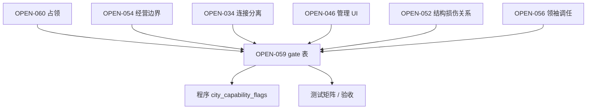

> 状态：草稿
> 程序实现：[03-程序设计/03-数据字典/回合与行动数据结构.md](../../03-程序设计/03-数据字典/回合与行动数据结构.md)

← [核心系统](./README.md)

# 势力系统

| 字段 | 内容 |
|------|------|
| 状态 | 草稿 |
| 校验状态 | 待校验 |
| 日期 | 2026-07-08 |
| 最后更新 | 2026-07-10 |
| 相关设定 | 无 |
| 相关系统 | [领袖与势力](./领袖与势力.md)、[荒野地点](../04-资源与人口/荒野地点.md)、[探索与扩张](./探索与扩张.md)、[回合与行动表](../07-玩法循环/回合与行动表.md)、[交战系统](./交战系统.md)、[通讯与视野系统](../06-单位与交战/通讯与视野系统.md) |

## 目标

定义玩家之外的势力与城市如何构成、如何行动、如何与玩家及彼此建立关系，以及组织内关系如何传导。

## 范围

- **包含**：外部城市占地与归属、**势力归属锚点（人口）**、**程序口径与 AI 模块边界**、**领袖关系**系统、组织与直接/间接关系传导、**人口损失与关系事件传导**、回合内行动顺序；与 [领袖与势力](./领袖与势力.md) 的衔接说明。
- **不包含**：关系数值上下限（人口损失折算、委托奖励除外）、领袖名单、人口归属转化公式、复杂 AI 策略与外交模拟。

> 本文档原题《外部城市与组织关系》；机制口径不变，正式名称统一为 **势力系统**。

## 详细说明

### 外部城市构成

- 外部城市不是 [移动城市](../02-地图与世界/地图与移动.md)，**不可整体移动**（整城无停泊 / 航行）。
- **城区与玩家城区为同一类**（共用 [建筑层 · 城区](../03-图层与地点/建筑层/城区总览.md) 运行时与占格规则）；外部城市仅在 [势力规则](#外部城市势力规则已定) 下附加约束，**不**单独 fork 城区实现。
- 每座外部城市有 **1 名城市领袖**；每位城市领袖为独立的**领袖关系**主体（一城一领袖）。城市可归属某一**势力**（组织）。

### 村镇（已定）

[村镇](../04-资源与人口/荒野地点/村镇.md)为**资源层资源点**，**不是**外部城市，**不是**领袖关系主体：**不**纳入领袖关系、组织间接传导与商队贸易；储量人口 **无归属**，经本地 **[征兵办](../04-资源与人口/荒野地点/征兵办.md)** 提取（见 [荒野地点](../04-资源与人口/荒野地点.md)）。关系事件 **`home_city_ref`** **不**指向村镇格。
- 每个势力在旗下城市领袖中认定 **1 名势力领袖**。领袖任职于该城的**特殊城区**（势力主城区 / 首都），人口归属绑定领袖；[人口归属转化](./领袖与势力.md#人口归属转化独立功能--已定框架) 为领袖 / 人口独立功能——详见 [领袖与势力](./领袖与势力.md)。

#### 外部城市：势力规则（已定）

在共用城区类之上，外部城市附加：

| 维度 | 口径 |
|------|------|
| **整城** | **不可**整体移动（无 `mobile_city_id` 航行；见 [地图与移动](../02-地图与世界/地图与移动.md)） |
| **城区类** | 与玩家城区**同一类**；**移动城市专属**拓扑操作见下节；其余能力由招募 / 占领状态 gate |
| **决策** | 未招募 / 已脱离：**AI 模块**；招募成功（未效忠 / 效忠）：**玩家**接管全城含人口之**全部指挥权**（见 [领袖与势力 · 招募后指挥权](./领袖与势力.md#招募后指挥权已定)） |
| **能力开关清单** | **已定**（见 [移动城市专属能力](#移动城市专属能力已定)、[OPEN-059 · 能力 gate](#open-059-能力-gate-已定)） |

### 外部城市：程序口径（已定）

外部城市与玩家移动城市在程序上**共用同一套城市与单位运行时**（城区、设施、资源、队伍、行动表等），由独立 **AI 模块**接入决策层；差异由**配置与势力规则**收敛，**不**为 NPC 裁减城区类本身：

| 维度 | 玩家移动城市 | 外部城市（NPC） |
|------|--------------|-----------------|
| **城区类** | 标准城区实例 | **同一类**；附加 [势力规则](#外部城市势力规则已定) |
| **核心区** | 有（骄阳之心、停泊/航行切换等） | **无** |
| **整城移动** | 停泊 / 航行 | **无** |
| **特殊城区** | 可有多个（试验城等） | **仅 1 个**首都（势力主城区）；其余为一般城区 |
| **决策** | **玩家**指挥 | 未招募 / 已脱离：**AI 模块**；招募后：**玩家**（AI 停写） |

- **城市层尽量完善**：共用实现；**移动城市专属**操作与外部城 **deny** 见下节；其余差异由 gate 表收敛（OPEN-059）。
- **决策层按需接入**：AI 模块仅调用当前版本需要的接口子集；能力开关与禁用入口清单见 **OPEN-059**。

### 移动城市专属能力（已定）

与**玩家移动城市**（含核心区、`mobile_city_id`、停泊 / 航行）绑定的拓扑与形态操作，**仅玩家移动城市**可发起；**外部城市**（含未招募、已招募 · 未效忠 / 效忠、已脱离）与 **AI** **均不具备**：

| 能力 | 外部 / AI | 玩家移动城市 |
|------|-----------|--------------|
| **连接 / 分离 / 再连接** | **不可** | **可**（见 [分离与拆解](../03-图层与地点/建筑层/分离与拆解.md)） |
| **城区占格迁移** | **不可** | **可**（仅停泊，见 [城区占格迁移](../03-图层与地点/建筑层/分离与拆解.md#城区占格迁移)） |
| **停泊 ↔ 航行** | **不可**（无核心区） | **可** |
| **航行中放弃城区** | **不可** | **可** |

- **未效忠**外部 recruited 城：**不能**主动与玩家移动城市**连接**；粮食「相连」仅指地图拓扑**既成**连通（用于扣粮路径），**不是**玩家对外部城下连接指令（见 [未效忠粮食](./领袖与势力.md#未效忠粮食已定)）。
- 招募后玩家**指挥权**含编组、工作、交战等；**不**含上表移动城市专属拓扑操作。

- 类型说明与玩家可见摘要见 [城市-外部](../04-资源与人口/荒野地点/城市-外部.md)。

### 外部城市 AI 模块（已定 · 首版）

- **架构**：AI 作为**独立模块**接入城市与单位管理，读写与玩家相同的行动表 / 指令表 / 资源与生产接口；**不**为外部城市单独 fork 一套城市逻辑。
- **首版能力边界**（**不**设计复杂 AI）：
  1. **资源管理**——粮食、金属、食物、能源等存量与分配（内部抽象，不向玩家暴露 [城市管理系统](../04-资源与人口/城市管理系统.md) 界面）。
  2. **生产单位**——按配置与库存编制队伍、设施守军等。
  3. **指挥单位**——为本城及下属单位生成并维护行动表 / 指令表（移动、工作、交战等），在 [AI 行动](../07-玩法循环/回合与行动表.md#回合阶段) 阶段执行。
- **首版不包含**：自主外交、**领袖关系**表主动改写、城区扩建、多核心、整城移动、复杂威胁评估与长期战略规划。
- **招募后停写**：某外部城市**招募成功**后，该城 **AI 模块对该实例停写**；决策改由玩家在**玩家指挥 / 玩家行动**阶段接管（见 [招募后指挥权](./领袖与势力.md#招募后指挥权已定)）。
- 遇敌时单位层行为仍由 `ai_strategy`（保守 / 激进）决定，见 [队伍系统 · 遭遇敌人时的行为](../06-单位与交战/队伍系统.md#遭遇敌人时的行为)。

### OPEN-059：能力 gate（已定）

> **策划裁定已闭合**（D-059-01～13，见 [待细化追踪 · OPEN-059](../../00-规范/待细化追踪.md#open-059--策划裁定已闭合)）。  
> **程序规格**：[city-capability-flags](../../03-程序设计/03-数据字典/city-capability-flags.md)（`city_control_state` 主枚举、正交修饰、能力入口 × 状态矩阵、UI/API 统一守卫、验收测试矩阵）。  
> **已定**：招募后**指挥权**归玩家；[移动城市专属能力](#移动城市专属能力已定)（连接 / 分离 / 占格迁移 / 停泊航行 **仅玩家移动城市**）；未效忠 / 效忠 / 脱离 / 占领互斥等 gate **已全部写入规格表**。

#### 1. 为什么需要 OPEN-059

外部城市与玩家移动城市**共用**城区、设施、队伍、行动表等实现，但**不能**把玩家城市的全部能力原样开放给外部城——否则与已定规则冲突：

| 已定规则 | 若 gate 缺失时的风险 |
|----------|----------------------|
| 整城**不可移动**（无核心区、无停泊 / 航行） | 程序或 UI 仍暴露「切换航行」「放弃城区」等仅适用于移动城市的入口 |
| **未效忠**资源封存、**禁止从住宅迁出**、**禁止资源主动操控** | 玩家指挥权已开，但城市管理 UI 若全开，可能误允许改换住宅安置、手动调拨封存资源 |
| **势力城区**禁止**改造** | 「占格迁移」「改词条」是否与「改造」同禁 **未写清** |
| 连接 / 分离 / 占格迁移由**势力规则 + 招募 / 占领状态** gate | 文档只声明「可 gate」，**零条**具体允许 / 禁止 → 测试无法写用例 |
| **占领**与**招募**分轨（OPEN-060） | **已定**：**互斥**；占领仅**敌对**态；**废墟 + 队伍占格**完成占领（框架）；无人口占格 = **接管**非占领 |
| **脱离**不保留玩家侧占格迁移 / 分离布局 | 暗示招募期**可能**允许占格迁移，但**何时允许**未定义 |

**结论**：「同一运行时」解决的是**代码复用**；OPEN-059 解决的是**玩法权限**——二者缺一不可。缺 OPEN-059 = 程序只能硬编码 `if (isExternal)` 散落判断，或与已定叙事规则打架。

#### 2. 能力维度索引（已定）

下列维度已写入 [city-capability-flags](../../03-程序设计/03-数据字典/city-capability-flags.md)；本表为设计侧索引。

| 类别 | 能力 / 入口 | 规格 |
|------|-------------|------|
| **整城移动** | 停泊 ↔ 航行、核心区切换 | 外部 / AI **永禁**（[移动城市专属能力](#移动城市专属能力已定)） |
| **拓扑** | 连接、分离、再连接 | 外部 / AI **永禁**；未效忠**不可**主动连接玩家城；粮食「相连」= 拓扑既成，非连接指令 |
| **形态** | 城区占格迁移 | 外部 / AI **永禁**；**不**再与「禁止改造」冲突（外部本无此操作） |
| **结构** | 修复、拆解 | 已定**允许**修复 / 拆解，但拆解走关系轨；gate 须与 UI 入口一致 |
| **人口** | 编组、城区工作、归属转化、**从住宅迁出** | 编组外出**允许**；**禁止从住宅迁出**；**未效忠**势力城内**禁止** [人口归属转化](./领袖与势力.md#人口归属转化独立功能--已定框架)；**效忠** **允许** |
| **资源** | 仓库扣减、生产消耗、出库 / 入库 | **已定（未效忠）**：**禁止**管理面板调拨与一切资源主动操控；封存禁出库；**仅**周总结规则**自动**扣粮（玩家池 → 封存回退）；指令附带非粮食消耗走玩家池（见 [未效忠资源管控](./领袖与势力.md#未效忠资源管控已定)） |
| **设施** | 建造、运维、拆除 | **已定**：未效忠 **禁**新建 / 拆除；**允许**修复 / 升级 / 运维（玩家资源）；效忠 **全部允许**（见 [招募后：设施](./领袖与势力.md#招募后设施已定)） |
| **管理 UI** | [城市管理系统](../04-资源与人口/城市管理系统.md) 全面板 | **已定**：招募 · 未效忠 **打开**同一套面板；gate **禁用 + 说明**（不改布局）；效忠 **解除**禁用 |
| **贸易** | 领袖页面贸易 | **已定**：**唯一**入口 · 商队履约（**仅**贸易创建、**不可**手动编组；**己方**商队可指挥）；未效忠 / 效忠对该领袖**不可**；**无**停泊 / 野外旁路（见 [商队履约](./领袖与势力.md#商队履约已定)） |
| **关系** | 强制脱离、效忠 | 已由**关系行动** gate 结算；**不设**专用 UI 预告（见 [关系反馈与对话](#关系反馈与对话已定)） |
| **回合** | AI 行动阶段是否执行 | 已定：招募后**不**走 AI 行动；须程序 flag 防止双写行动表 |

#### 3. 典型冲突场景（严逻辑推演）

1. **未效忠 + 玩家指挥 + 禁止从住宅迁出**  
   **编组外出** **不**改变城区**住宅安置**与**居民计数**（见 [人口与迁移 · 人口与住宅](../04-资源与人口/人口与迁移.md#人口与住宅已定)）。**禁止**的是**从住宅迁出**（改换住宅安置、跨城迁出），**不是**禁止组队出征。

2. **未效忠 + 相连 + 共享扣粮**（**已定**）  
   **不可**对外部城下**连接**指令。[移动城市专属能力](#移动城市专属能力已定)。粮食「相连」= 地图拓扑**既成**连通，用于 [未效忠粮食](./领袖与势力.md#未效忠粮食已定) 扣玩家池；**不**并入 `mobile_city_id`。

3. **招募期占格迁移 → 脱离复位**  
   已定脱离**不保留**玩家侧占格迁移；外部城**无**占格迁移能力（见 [移动城市专属能力](#移动城市专属能力已定)）。gate 见 [city-capability-flags · 拓扑](../../03-程序设计/03-数据字典/city-capability-flags.md#拓扑)。

4. **效忠前后 gate 翻转**（**已定**）  
   效忠 = **势力资产 → 玩家资产**；未效忠期全部 gate **解除**（见 [效忠 · 资产划归与 gate 解除](./领袖与势力.md#效忠资产划归与-gate-解除已定)）。城市管理 UI：**解除**未效忠禁用项，布局不变（[招募 · 未效忠 UI](../04-资源与人口/城市管理系统.md#招募--未效忠-ui已定)）。

5. **占领 + 招募叠加**（**已定**）  
   **不可**叠加。主控制态互斥：**效忠** > **未效忠** > **占领**（敌对 · **废墟 + 占格**）> 未招募 / 已脱离。无人口占格 = **接管**，**不是**占领（见 [占领、接管与招募](./领袖与势力.md#占领接管与招募分轨)、[废墟占领](./领袖与势力.md#废墟占领敌对--已定框架)）。

6. **废墟占领占格**（**框架已定**）  
   敌对城**打为废墟**后**队伍占格**写入占领；是否须整城全废墟、清空守军、占格范围 **待定**（[OPEN-060](../../00-规范/待细化追踪.md)）。废墟期间**设施**与**城区能力** [失能](../03-图层与地点/建筑层/城区总览.md#废墟失能)。程序触发字段见 [city-capability-flags · 占领触发](../../03-程序设计/03-数据字典/city-capability-flags.md#占领触发occupation_trigger--open-060-框架)。

   **占领写入顺序**（与招募轨 **互斥**）：

   1. 校验 **R ≤ −50**（敌对）且目标城**未**招募 / **未**效忠。
   2. 交战使至少一座城区进入**废墟**（整城废墟 **待定**）。
   3. 玩家**队伍占格**满足 `hostile_ruin_occupation_ready`（占格数量 / 守军 **待定**）。
   4. 写入 `city_control_state=Occupied`；**不**触发封存、招募委托或效忠。
   5. 掠夺与占领后 gate **待定**（[废墟占领](./领袖与势力.md#废墟占领敌对--已定框架)）。

#### 4. 程序侧交付物（已定）

| 交付物 | 说明 |
|--------|------|
| **状态枚举** | `ExternalNeutral` / `RecruitedUnloyal` / `RecruitedLoyal` / `Detached` / `Occupied` / `Takeover`——**互斥**，见 [city-capability-flags](../../03-程序设计/03-数据字典/city-capability-flags.md#主控制态city_control_state) |
| **flag 表** | 能力入口 × 状态 **allow / deny / conditional**；可 CSV / SO |
| **入口守卫** | UI 按钮、指令校验、AI 模块停写钩子**同一数据源** |
| **测试矩阵** | T-01～T-27，见 [city-capability-flags · 验收测试矩阵](../../03-程序设计/03-数据字典/city-capability-flags.md#验收测试矩阵) |

- 完整名单与默认对照值见 [city-capability-flags](../../03-程序设计/03-数据字典/city-capability-flags.md)；占领 / 接管 **△** 列：废墟占领框架 **已定**，掠夺与占领后 gate **待定**（OPEN-060）。

#### 5. 三层权限（最易混、须分开 gate）

同一座外部城在「招募 · 未效忠」时，文档已同时存在三种**不同层级**的权限，**不能**用一个「能否管理」概括：

| 层级 | 已定什么 | OPEN-059 要定什么 |
|------|----------|-------------------|
| **① 指挥权** | **玩家**接管；AI 停写；**玩家指挥 / 玩家行动**同轨 | 哪些**指令类型**可进行动表（移动、工作、交战、编组…） |
| **② 城市层操作** | [势力城区管辖](../04-资源与人口/荒野地点/城市-外部.md) 允许 / 禁止表（修复、拆解、禁改造…） | 每条操作在**地图 / 工作 / 资源 API** 的校验开关 |
| **③ 城市管理 UI** | [城市管理系统](../04-资源与人口/城市管理系统.md) | **已定**：未效忠 **同一面板** + **禁用 + 说明**；效忠 **解除**禁用；控件级清单见 [招募 · 未效忠 UI](../04-资源与人口/城市管理系统.md#招募--未效忠-ui已定) |

**典型事故**：① 已给玩家指挥权 → 程序默认 `CanManageCity=true` → ③ 全开 → 玩家在未效忠态**手动出库**或**改换住宅安置**，直接违反 [未效忠资源管控](./领袖与势力.md#未效忠资源管控已定) 与**禁止从住宅迁出**。

#### 6. 状态轴：不是一张 6×N 表就够

除「外部 · 未招募 / 未效忠 / 效忠 / 已脱离 / 占领」外，还有**正交轴**会改变 gate，须写清**优先级**或**组合规则**：

| 正交轴 | 影响 gate 的原因 |
|--------|------------------|
| **是否整城外部** | 无核心区 → 永禁停泊 / 航行 / 放弃城区（航行惩罚） |
| **是否与玩家 `mobile_city_id` 相连** | 未效忠粮食可走玩家池（**拓扑既成**，非连接指令） |
| **是否废墟** | 禁工作区、**不可迁入**；**设施**与**特殊城区能力** [失能](../03-图层与地点/建筑层/城区总览.md#废墟失能)；**仅可迁出**与招募 **未效忠** **禁止从住宅迁出**叠加时 → **招募优先**（见 [废墟 × 招募 · 未效忠](./领袖与势力.md#废墟--招募--未效忠已定)） |
| **废墟占领前置** | **敌对**且城已**打为废墟**时，**队伍占格**可写入 `Occupied`（占格细则 **待定**，OPEN-060；见 [废墟占领](./领袖与势力.md#废墟占领敌对--已定框架)） |
| **关系档位** | R≤−50 → **关系结算**阶段写入脱离、**下回合**生效；当回合在关系结算前仍可完成合法操作（见 [关系行动](#关系行动已定)）；关系下降反馈走 [对话](#关系反馈与对话已定) |
| **领袖是否在牌库 / 调任** | 脱离复位与 `home_city_ref`、编制来源城区 **交叉** OPEN-056 |
| **航行 vs 停泊**（玩家城） | 连接 / 分离 / 占格迁移代价不同（OPEN-034）；外部城仅部分适用 |

→ 程序应用 **`city_control_state` + 修饰 flag**，或 **gate 求值顺序表**；否则六态表填完仍会在边界组合上翻车。

#### 7. 能力入口清单（须逐条填 allow / deny / conditional）

下列为**已知入口**（非穷举）；缺任一行的测试用例 = OPEN-059 未闭合。

**地图 / 拓扑**

- 连接 / 分离 / 再连接（[分离与拆解](../03-图层与地点/建筑层/分离与拆解.md)）
- 城区占格迁移（仅停泊 · 玩家移动城）
- 被动分离（网络切断）

**结构**

- 修复城区、拆解结构、废墟阈值

**人口**（见 [人口与迁移 · 人口与住宅](../04-资源与人口/人口与迁移.md#人口与住宅已定)）

- 编组 / 解散 / 补员（**单一人口类型**、禁止混编；见 [编组 · 单一人口类型](../04-资源与人口/人口与迁移.md#编组--单一人口类型已定)）
- 城区工作分配、工作区启闭
- 人口归属转化 → 未效忠 recruited 势力城内 **deny**；效忠 **allow**
- **从住宅迁出** / 改换住宅安置
- `district_headcount_json` 城区聚合；减员按权重随机落点；补员来源见 [编组 · 城区来源人数](../04-资源与人口/人口与迁移.md#编组--城区来源人数已定)

**资源**

- 指令触发生产 / 维护消耗（未效忠 → 玩家池；**非**调拨）
- 封存池回退（**仅**粮食 · **自动** · 周总结规则）
- 城市管理系统 · **资源存储分配**、仓库「优先用于充饥」→ 未效忠 recruited 城 **deny**
- 手动调拨 / 出库 / 入库 → 未效忠 **deny**

**设施**

- 新建造 → 未效忠 **deny**；效忠 **allow**
- 拆除 → 未效忠 **deny**；效忠 **allow**
- 修复 / 升级 / 运维（既有设施 · 玩家资源）→ 未效忠 **allow**；效忠 **allow**

**贸易 / 关系**

- 领袖页面贸易 · 商队履约 → **唯一**城市领袖贸易路径
- 停泊 / 野外贸易旁路 → **deny**（城市领袖）
- 关系下降 → **剧情 / 脚本对话**警告（见 [关系反馈与对话](#关系反馈与对话已定)）；**无**关系行动专用 UI 预告

**回合**

- AI 行动阶段是否调度该城
- 关系行动后下一回合 flag 翻转

#### 8. 文档交叉矛盾（gate 表须一并消歧）

| 文档 A | 文档 B | 矛盾点 |
|--------|--------|--------|
| 城区与玩家**同一类** | 未效忠粮食「**相连**扣玩家粮」 | **已定**：相连 = 拓扑既成；**不可**主动连接（[移动城市专属能力](#移动城市专属能力已定)） |
| 势力城区 **禁止改造** | 城区占格迁移 | **已定**：外部 **无**占格迁移；仅玩家移动城可迁移占格 |
| 脱离 **不保留**占格迁移 / 分离布局 | —（外部城**无**此类操作） | 已在 [移动城市专属能力](#移动城市专属能力已定) **deny** |
| [城市管理系统](../04-资源与人口/城市管理系统.md) **可用**=移动城 + **占领** + **招募** | 招募 · 未效忠 gate | **已定**：同一 UI；**禁用 + 说明**（见 [招募 · 未效忠 UI](../04-资源与人口/城市管理系统.md#招募--未效忠-ui已定)）；效忠解除禁用 |
| 4 人降 1 统计「**玩家移动城市内**」 | 招募后可管**外部城**人口 | **已定**：**组织级统一累计**；**含**外部城城区与编组（见 [己方归属人口损失](#己方归属人口损失招募后已定)） |
| **效忠**解封资源 | 城区仍 **禁止改造**？ | **已定**：效忠后 **允许**改造（gate 解除） |

#### 9. 依赖网与阻塞关系

- **硬阻塞**：无 gate 表 → 无法写 `CanExecute(CityAction)` → UI 与 AI 停写无法共用数据源。
- **软依赖**：OPEN-060 掠夺、占格细则、占领后 gate 仍待补；gate **互斥**与**废墟占领框架**已定。

#### 10. 建议填表顺序（降低返工）

1. **人口 + 资源 + 管理 UI**（未效忠 / 效忠 diff）——与封存、粮食、**禁止从住宅迁出**直接相关  
2. **拓扑（连接 / 分离 / 占格迁移）**——与粮食「相连」、脱离复位相关  
3. **设施建造**——**已定**（未效忠禁建禁拆；效忠全开）  
4. **占领列**——**已定**互斥、废墟 + 占格占领框架；掠夺细则与占领后 gate 仍 OPEN-060  
5. **废墟 × 招募** 组合行——**已定**（未效忠：禁止迁出优先；可修复）；**废墟失能**（设施 + 城区能力）见 [城区总览 · 废墟失能](../03-图层与地点/建筑层/城区总览.md#废墟失能)

### 回合内行动顺序

- 每回合**玩家移动城市及其单位必然先于**所有外部城市行动（见 [回合与行动表 · 基本原则](../07-玩法循环/回合与行动表.md#基本原则)）。
- 外部城市在 **AI 行动**阶段按对局 **`game_seed`** 生成的**伪随机顺序**轮流行动；详见 [回合与行动表 · 外部城市行动顺序](../07-玩法循环/回合与行动表.md#外部城市行动顺序)。
- **[关系行动](#关系行动已定)** 在 **环境行动**之后执行（见 [回合与行动表 · 关系行动](../07-玩法循环/回合与行动表.md#关系行动)）。

### 关系行动（已定）

**关系行动**（**关系结算**）是每回合**第五阶段**，**仅在环境行动**（环境结算，含周总结）**结束之后**执行；**强制脱离**、**效忠**激活等归属此列。

| 项 | 口径 |
|----|------|
| **回合顺序** | **玩家指挥** → **玩家行动** → **AI 行动** → **环境行动**（环境结算）→ **关系行动**（关系结算）→ 下一回合 **玩家指挥**（见 [回合与行动表 · 回合阶段](../07-玩法循环/回合与行动表.md#回合阶段)） |
| **时点** | **环境行动**全部子步（含 `turn % 7 == 0` 的周总结）**完成之后**、下一回合 **玩家指挥** **之前** |
| **内容** | 本回合累积的领袖关系阈值跨越（如 **R ≤ −50** 脱离、**R ≥ 100** 效忠）在此**一并**结算 |
| **生效** | 状态变化在**此刻写入**；**下一回合**才对指挥、交战、资源 gate 产生玩法影响 |
| **与关系数值** | 委托完成、人口损失等可在回合内先改 **R**；**脱离 / 效忠**等**关系行动**仅根据**关系结算**时刻判定，**不**在环境结算中途插队 |

- 人口损失关系事件仍经 [人口损失与关系事件传导](#人口损失与关系事件传导) 回写 **R**；是否在同一回合末立刻触发关系行动，以阶段末 **R** 为准。

#### 关系反馈与对话（已定）

**不设**关系行动专用 UI（如效忠流程横幅、下回合脱离预告、领袖页 / 城市管理面板上的关系阈值提示等）。

| 项 | 口径 |
|----|------|
| **关系下降** | 当与该**城市领袖**的**直接领袖关系**发生**下降**时，由**剧情 / 脚本对话**（与章节任务、委托叙事等**同一套对话框架**）触发该领袖对玩家的**警告**台词 |
| **触发源** | 人口损失折算、委托失败、侵害他方等一切已写入 **R** 的下降；具体台词档位、冷却与脚本表 **待定**（OPEN-051 / 关卡叙事） |
| **与关系行动** | **脱离**、**效忠**等仍仅在 [关系行动](#关系行动已定) 阶段结算；对话为**叙事反馈**，**不**替代机制结算，**不**要求提前一回合在 UI 预告后果 |
| **关系上升** | **不**强制配套祝贺对话（委托完成等可有既有任务 / 委托叙事，**不**另开关系专用提示层） |

- 见 [领袖与势力 · 领袖委托](./领袖与势力.md#领袖委托已定-首版)（委托与剧情脚本可分轨）；OPEN-059 **D-059-13** **已定**。

### 势力归属：人口为准（已定）

判定某格、某城区或某设施上的内容**是否归于某一势力**，只看其中**人口**的归属，**不**看城区或设施本身：

| 对象 | 是否附带势力归属 |
|------|------------------|
| **城区** | **否**——占格模块，无独立势力标签 |
| **设施** | **否**——占格或辅助实例，无独立势力标签 |
| **人口**（**队伍**编制人数、城区**居民**等） | **是**——归属随 [领袖与势力 · 人口归属](./领袖与势力.md#人口归属) 绑定城市领袖及势力身份 |

- 空城区、无人驻守的设施、已被击溃且无驻留人口的据点，**不**因被攻击或占领而单独触发「侵害某势力」的关系结算；关系变化锚定在**造成对方势力人口损失**或 [领袖委托](./领袖与势力.md#领袖委托) 等人口/任务向规则上。
- 外出 **队伍**、设施守军等可交战单位仍记录 **`home_city_ref`（归属来源城市）**，用于关系事件送达目标；势力身份以单位所携**人口归属**为准。

### 领袖关系系统

- 每位**城市领袖**（含外部城市领袖与玩家方城市领袖）拥有一套**领袖关系**记录。
- 对外交互时，玩家面对的是**对方城市领袖**，而非抽象「城市」实体；程序上仍经 `home_city_ref` 路由事件，结算时写入该城**城市领袖**的领袖关系表。
- 领袖关系对以下对象有效：
  - **玩家**（玩家移动城市的代表人物 / 城市领袖，默认即玩家角色）
  - 与该领袖所属城市**邻近**的其他城市的**城市领袖**（邻近判定 OPEN-051）

#### 领袖关系：增减与演化（已定 · 首版）

- **不独立演化**：首版**不**设计 AI 驱动的领袖关系自主演化；外部城市 AI 模块**不**主动改写领袖关系表。
- **增减来源**（与玩家侧对称，经同一套 [关系事件](#人口损失与关系事件传导) 与组织传导）：
  1. **人口损失（侵害他方）**——行为方对受害方**归属势力的人口**造成损失，事件送达受害方 `home_city_ref` 对应**城市领袖**后，按 [人口损失折算](#人口损失折算侵害他方已定) 更新该领袖对行为方**城市领袖**的**直接领袖关系**，并触发组织间接传导（×1/4）。
  2. **己方归属人口损失（招募后）**——玩家已成功招募某城市领袖后，己方该领袖所属**势力人口归属**减员，按 [己方归属人口损失](#己方归属人口损失招募后已定) 下降关系；可通过委托与归属转化恢复（见 [领袖与势力 · 招募后](./领袖与势力.md#招募后己方归属人口损失与关系恢复已定)）。
  3. **领袖委托**——玩家接取并完成城市领袖发布的 [委托](./领袖与势力.md#领袖委托已定-首版)（含 [招募委托](./领袖与势力.md#招募委托已定)；每位领袖**恒展示 3 条**、消失即补、至少 **2 种**类型；**已接取失败**扣奖励 **1/4** 关系；**未接取失效**直接更换），提升与**委托方领袖**的直接领袖关系，并连带提升同组织内其他领袖（×1/4）；单次奖励一般为 **+10～+20**（见 [领袖与势力 · 领袖委托](./领袖与势力.md#领袖委托已定-首版)）。
  4. **剧情 / 脚本事件**——章节、任务、设定触发的领袖关系修正（数值框架延后）；**关系下降**时该领袖对玩家的**警告**台词沿用同一套**剧情 / 脚本对话**框架（见 [关系反馈与对话](#关系反馈与对话已定)）。
- **NPC 对 NPC**：两外部城市领袖互为关系主体时，人口损失事件结算与玩家参与时**同一规则**；**不**因「双方都是 AI」而省略回传或痕迹。
- **仍待定**：「邻近」判定、各领袖初始关系值与章节脚本（OPEN-051）；关系值上下限见 [04-数值框架/](../04-数值框架/)。
- **关系档位（已定）**：见下表；详情见各节。

| 档位 | 直接领袖关系 `R` | 贸易 | 常规委托（领袖页面） | 招募委托 |
|------|------------------|------|----------------------|----------|
| **敌对** | **R ≤ −50** | 不可 | 可 | 不可 |
| **中立** | **−50 < R < 50** | **可**（领袖页面） | 可 | 不可 |
| **友善** | **R ≥ 50** | 可（领袖页面，**八折**） | 可 | 可（补位刷新，见 [招募委托](./领袖与势力.md#招募委托已定)） |

边界：**一旦达到 ±50 即离开中立**（**−50**、**50** 均**不**算中立）。

**招募后城市状态**（与上表**叠加**；见 [领袖与势力 · 未效忠 / 效忠](./领袖与势力.md#效忠已定)）：

| 状态 | 条件 | 资源 / 粮食 | 贸易（对该领袖） | 关系后果 |
|------|------|-------------|------------------|----------|
| **未效忠** | 已招募，**未**效忠 | 资源**封存**；独立 §2.2.1 粮食主体；非粮食耗**玩家**资源 | **不可**（封存） | **R ≤ −50** → [强制脱离](./领袖与势力.md#未效忠关系跌破-50-强制脱离已定) |
| **效忠** | 已激活效忠 | **城市消解**；资源解封归玩家；粮食并入玩家 `mobile_city_id`（见 [效忠 · 城市消解](./领袖与势力.md#效忠城市消解与人口留存已定)） | **不可** | **不再受**关系数值影响 |

#### 敌对（已定）

当玩家与某**城市领袖**（及其所属**组织**内对称传导后的相关领袖）的**直接领袖关系 R ≤ −50** 时，双方**互为敌人**。

| 项 | 口径 |
|----|------|
| **敌我判定** | 该势力与玩家移动城市在 [交战系统](./交战系统.md#交战身份与敌我判定) 中按**敌对**处理 |
| **单位默认倾向** | 遇敌时**默认优先规避**（改道、脱离接触、暂停等待）；具体优先级由队伍 / 外部单位 **`ai_strategy`**（**保守** / **激进**）覆盖——见 [队伍系统 · 遭遇敌人时的行为](./队伍系统.md#遭遇敌人时的行为) |
| **保守** | 降低损失先于推进任务 → 更倾向规避 |
| **激进** | 推进任务先于损失控制 → 必要时交战或穿越威胁区 |
| **委托** | **仍可在领袖页面**查看、接取并完成**常规委托**；完成仍按 `reward_value` 改善关系。**招募委托**须 **R ≥ 50**；**贸易**不可用 |
| **贸易** | **不可**（须 **−50 < R** 且未触发未效忠脱离，见 [中立](#中立已定)） |

- **未效忠已招募**：**R ≤ −50** 时在 [关系行动](#关系行动已定) 触发 [强制脱离](./领袖与势力.md#未效忠关系跌破-50-强制脱离已定)（脱离后按敌对）。
- **已效忠**：**不**因关系档位变化撤销效忠或强制脱离（见 [效忠](./领袖与势力.md#效忠已定)）。

- 外部城市 AI 对玩家敌对时，其编制单位在 **AI 行动**阶段同样受 `ai_strategy` 约束；**不**在势力层单独设计复杂外交 AI（见 [外部城市 AI 模块](#外部城市-ai-模块已定-首版)）。

#### 中立（已定）

当 **−50 < 直接领袖关系 < 50** 时，双方为**中立**。

| 项 | 口径 |
|----|------|
| **敌我判定** | **不**按互为敌人处理（遇敌默认不因此档位置于敌对） |
| **贸易** | **解锁**；玩家在**领袖页面**发起贸易（见 [领袖与势力 · 领袖贸易](./领袖与势力.md#领袖贸易已定)）；**已效忠**城**不可**贸易 |
| **委托** | 可在**领袖页面**接取并完成常规委托 |
| **招募委托** | **不**出现（须 **R ≥ 50**） |

#### 友善（已定）

当 **直接领袖关系 ≥ 50** 时，双方为**友善**。

| 项 | 口径 |
|----|------|
| **贸易** | 可用（领袖页面，**八折** ×0.8）；**已效忠**城**不可**贸易 |
| **委托** | 可在领袖页面接取常规委托 |
| **招募委托** | 补位可刷新招募委托（刷新率见 [领袖与势力 · 招募委托](./领袖与势力.md#招募委托已定)） |
| **效忠** | **R ≥ 100** 且已招募 → 激活效忠（见 [领袖与势力 · 效忠](./领袖与势力.md#效忠已定)） |

#### 人口损失折算（侵害他方 · 已定）

当**玩家**对**其他势力**造成人口损失时（受害方为该势力的 **队伍** 编制或城区 **居民**）：

- **领袖关系下降量** = **损失人口数 ÷ 2**（向下取整；每损失 **2** 名归属该势力的人口，**直接领袖关系** **下降 1** 点）。
- 结算主体：受害方人口所属城市之**城市领袖**对**玩家方城市领袖**更新**直接领袖关系**，再触发 [组织](#组织) 间接传导（×1/4）。
- **分轨累计（已定）**：人口损失由**单位**与**城区**分别统计、分别累计余数，**不**跨轨合并后再折算（见 [人口损失与关系事件传导 · 分轨累计](#分轨累计已定)）。
- NPC 对玩家、NPC 对 NPC 的人口损失是否适用同一折算式 **待定**（OPEN-053）；首版倾向与玩家对称。

#### 己方归属人口损失（招募后 · 已定）

玩家已成功**招募**某外部**城市领袖**后，对该领袖所属**组织**下、**玩家指挥范围内**、归属为该势力的人口减员，按 [领袖与势力 · 招募后己方归属人口损失](./领袖与势力.md#招募后己方归属人口损失与关系恢复已定) 结算：

- **统计范围**：**含** recruited **外部城**城区居民与编组、玩家移动城市内同归属人口、外派单位等；**不论**减损发生地。
- **组织级统一累计**：该组织 **4 人降 1** 使用**单一余数池**；满 **4** 人降 **1** 点与被招募领袖的**直接领袖关系**。
- **与侵害他方分轨**：**不**替代 [人口损失折算（侵害他方）](#人口损失折算侵害他方已定)；**2 人降 1** 与 **4 人降 1** **分别**累计、**不**跨规则合并。
- **恢复**：完成领袖委托（`reward_value`）；将人口**转化**为该势力归属，转化人数与曾因此扣减所对应的损失人口数对等时，按 **4 人恢复 1 点**（见 [领袖与势力 · 招募后](./领袖与势力.md#招募后己方归属人口损失与关系恢复已定)）。

### 组织

- 外部城市可归属于同一组织（势力）。
- 玩家与组织内某一**城市领袖**发生**直接领袖关系**变化时，同组织内其他**城市领袖**同步受到**间接领袖关系**变化。
- 间接领袖关系变化量 = 直接领袖关系变化量 × 1/4。

### 示例

玩家与组织内城市 A 的领袖直接关系 +20，则同组织内城市 B、C 的领袖间接关系各 +5（20 × 1/4）。

### 与交战的关系

势力归属与**领袖关系**数值影响 [交战系统](./交战系统.md) 中的敌我判定，但「是否加入交战」与「是否敌对」为两条独立判定（见交战系统 · 交战身份）。

- **敌对（R ≤ −50）**：双方互为敌人；单位遇敌默认优先**规避**，并由 `ai_strategy`（保守 / 激进）决定规避与交战取舍（见 [敌对](#敌对已定)）。

### 人口损失与关系事件传导

外出 **队伍**、**设施**守军等可交战单位，均记录 **`home_city_ref`（归属来源城市）**——编制或建造时所属、关系结算所指向的城市（玩家移动城市、外部城市等；程序字段见 [队伍与战斗数据结构 · team_instance_state](../../03-程序设计/03-数据字典/队伍与战斗数据结构.md#表-9team_instance_state队伍实例状态)）。**势力归属**以单位所携人口为准，见 [势力归属：人口为准](#势力归属人口为准已定)。

**核心规则（已定）**

- 关系恶化由**对方势力人口损失**驱动，按 [人口损失折算](#人口损失折算已定) 计算下降量；**不**因单独损毁无人驻守的城区或设施而改关系。
- 人口损失由**单位**与**城区**两轨分别统计、分别累计（见下节）；**不**在行为发生的当回合直接改写双方**领袖关系**表。
- 各轨累计的损失事件先写入对应**受害实例**的待传导队列（与视野待同步队列**分轨**或**同队列分类型**，程序 **待定**）。
- 队列内容送达目标城市的 **`home_city_ref`** 后，解析为该城**城市领袖**，按 [领袖关系系统](#领袖关系系统) 更新该领袖对行为方**城市领袖**的直接领袖关系，并触发 [组织](#组织) 中间接传导（×1/4）。

#### 分轨累计（已定）

| 轨道 | 统计载体 | 计入人口 | 送达目标 |
|------|----------|----------|----------|
| **单位** | 受害 **队伍**、设施守军等可交战单位实例 | 编制人数减员 | 该单位的 **`home_city_ref`** |
| **城区** | 受害 **城区**实例 | 城区 **居民**减员（交战、灾害、事件等；含队伍减员经 [城区来源 map](../04-资源与人口/人口与迁移.md#编组--城区来源人数已定) **随机落点**后的城区侧扣减） | 城区所属城市的 **`home_city_ref`**（外部城市占格城区、玩家连接网络内城区等） |

- 各轨维护**独立的待结算人口损失累计**（程序字段名 **待定**，如 `pending_population_loss`）；**不足 2 人**的余数**仅在本轨内**跨事件保留，**不**与另一轨合并后再折算。
- 例：单位轨累计 1 人、城区轨累计 1 人 → **各轨**当回合均**不**产生关系下降；若单位轨再损 1 人，则单位轨累计 2 → 降 **1** 点关系，城区轨仍为 0。
- 同一回合内多来源伤害：先分别写入对应实例的累计，再按各轨已达阈值的部分打包传导。

**传导路径 A — 延迟（与待同步队列配套）**

适用于受害方须经 [通讯与视野系统](../06-单位与交战/通讯与视野系统.md) 回传信息的场景（无即时通讯、超出覆盖等）：

1. 人口损失写入对应**受害实例**（单位或城区）的本地队列。
2. **单位轨**：受害单位经 **即时通讯** 或 **待同步队列** 将关系事件包送回其 **`home_city_ref`**。**城区轨**：城区累计包送达城区所属城市（占格城市通常可当场感知，是否仍走延迟队列 **待定**，OPEN-043）。
3. 主城收到后，写入受害城**城市领袖**对行为方**城市领袖**的直接领袖关系变化与组织间接传导。

**歼灭前未送出 → 关系痕迹**（**单位轨**）

- 若在同步发出前，行为方已**歼灭**该受害**单位**，事件**不会**因单位消失而作废。
- 在受害单位**最后所在格**（或逻辑死亡格）留下 **关系痕迹**（地图可发现的信息残留），仍携带未送达的关系事件。
- 后续任意机制读取该痕迹（己方侦察、敌方拾取、事件格交互等，**待定**）并送回对应城市后，仍按路径 A 第 3 步结算关系。
- **城区轨**：城区实例不因单次交战而消失；居民清零后累计队列仍随城区 / 城市存续，是否生成地图痕迹 **待定**（OPEN-043）。

**传导路径 B — 即时**

适用于受害方已处于**即时通讯覆盖且规则允许当场结算关系**的场景：

- 人口损失**当场**写入受害城**城市领袖**对行为方**城市领袖**的直接领袖关系，并立即执行组织间接传导。
- 不产生待同步队列条目，**不**留关系痕迹（除非其它系统单独记录战报格）。

**两套路径并存**

- 设计**同时支持**路径 A 与路径 B；具体走哪条由受害方单位的通讯能力、覆盖状态与配置决定（见 [通讯与视野系统 · 关系事件传导](../06-单位与交战/通讯与视野系统.md#关系事件传导)）。
- 玩家侧同样适用：外出队伍遭袭时，关系事件可先积压在己方队伍本地，再经通讯回传至玩家移动城市后，才更新对外**领袖关系**（含 AI 城市领袖对玩家方城市领袖的关系变化）。

**与交战的关系**

- [交战系统](./交战系统.md) 结算后：**单位轨**按队伍 / 守军减员写入受害单位累计；**城区轨**按城区居民减员写入受害城区累计；是否当场更新领袖关系取决于传导路径。
- 关系值上下限归入 [04-数值框架/](../04-数值框架/)（配置模板搭建后设计）；人口损失折算式、委托完成奖励（+10～+20）已定。

## 待确认事项

- [ ] 「邻近」的判定范围（相邻格 / 视野内 / 其他）（OPEN-051）。
- [ ] 各**城市领袖**初始领袖关系值、章节脚本表与玩家对 NPC-NPC 领袖关系的可见性（OPEN-051）。
- [ ] 领袖关系数值档位：**中立 / 友善 / 敌对**阈值与贸易、招募委托挂钩（OPEN-052）**已定**；**友善八折**、**效忠关闭贸易**已定；贸易基准价表 **待定**。
- [ ] 组织间接传导：NPC 触发是否同规则、是否向组织外扩散（OPEN-053）。
- [ ] 占领 / 未效忠城市管理权限（OPEN-054）；**效忠后粮食已定**（见 [效忠 · 城市消解](./领袖与势力.md#效忠城市消解与人口留存已定)）。
- [ ] 外部城市存亡、势力消亡与领袖关系表清理（OPEN-055）。
- [ ] 领袖变更对领袖关系的影响（OPEN-056）。
- [ ] 外部城市 AI 内部经济与粮食是否与玩家同一周总结规则（OPEN-057）。
- [ ] 城市统一运行时与 NPC 能力开关（OPEN-059）**策划已闭合**；程序规格见 [city-capability-flags](../../03-程序设计/03-数据字典/city-capability-flags.md)，待代码落地。
- [ ] 城区轨传导是否仍需延迟队列 / 痕迹（OPEN-043）；NPC 对称折算（OPEN-053）。
- [ ] 关系痕迹的发现、读取与过期规则（OPEN-013、OPEN-043）。
- [ ] **情报延迟与关系传导规则对齐**（OPEN-050）。

## 修订记录

| 日期 | 版本 | 说明 |
|------|------|------|
| 2026-06-21 | 0.0.1 | 初稿（题名为势力系统） |
| 2026-06-22 | 0.0.2 | 补充回合内行动顺序 |
| 2026-06-25 | 0.0.3 | 正式更名为势力系统；补交战系统交叉链接 |
| 2026-06-27 | 0.0.4 | 衔接领袖与势力：城市领袖、势力领袖、人口归属绑定领袖 |
| 2026-06-27 | 0.0.5 | 单位归属来源城市；关系事件延迟/即时两套传导路径；关系痕迹 |
| 2026-07-08 | 0.0.6 | 外部城市程序口径（固定城区、无核心区/移动）；AI 模块首版边界；城市间关系不独立演化、NPC 对称结算 |
| 2026-07-08 | 0.0.7 | 城市层尽量完善 / AI 按需接入；待确认事项链至 OPEN-051～059 |
| 2026-07-08 | 0.0.8 | 势力归属锚定人口；人口损失每 2 人降 1 关系；领袖委托为关系改善主路径；单位 / 城区分轨累计损失 |
| 2026-07-09 | 0.1.0 | 领袖委托：已接取失败扣奖励 1/4；未接取失效直接更换 |
| 2026-07-10 | 0.1.8 | 未效忠粮食：玩家优先、封存回退；§2.2 玩家范围拆分 |
| 2026-07-10 | 0.1.9 | 招募后指挥权归玩家；新增 OPEN-059 能力 gate 待决说明 |
| 2026-07-10 | 0.2.0 | 队伍减员随机落点城区；分轨累计交叉链 |
| 2026-07-10 | 0.2.7 | 废墟×招募未效忠：禁止迁出优先 |
| 2026-07-10 | 0.2.8 | 占领与招募/效忠互斥；Takeover 非 Occupied |
| 2026-07-10 | 0.2.9 | 4人降1组织级统一累计，含外部城 |
| 2026-07-10 | 0.2.10 | 贸易商队履约；关闭停泊旁路 |
| 2026-07-10 | 0.2.11 | 商队：仅贸易创建；己方可指挥 |
| 2026-07-10 | 0.2.12 | 编组单类型队伍；补员与城区 map 交叉链 |
| 2026-07-10 | 0.2.13 | 关系下降走剧情对话警告；不设关系行动专用 UI |
| 2026-07-10 | 0.2.14 | 关系结算：环境结算之后；五阶段回合顺序 |
| 2026-07-10 | 0.2.16 | OPEN-059 策划裁定闭合；链至 city-capability-flags 程序规格 |
| 2026-07-10 | 0.2.17 | 废墟失能、废墟占领框架；村镇无贸易；OPEN-060 交叉链 |
| 2026-07-10 | 0.2.18 | OPEN-060 占领写入顺序；测试矩阵 T-27；链 occupation_trigger |
| 2026-07-09 | 0.1.1 | 人口归属转化改为领袖/人口独立功能交叉链 |
