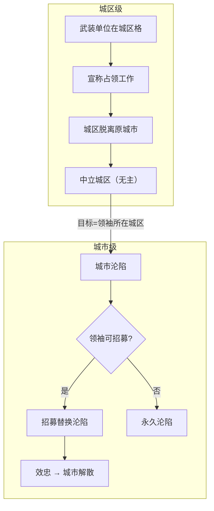

> 状态：草稿
> 程序实现：无

← [城市与领袖](./README.md)

# 领袖与势力

| 字段 | 内容 |
|------|------|
| 状态 | 草稿 |
| 校验状态 | 待校验 |
| 日期 | 2026-06-27 |
| 最后更新 | 2026-07-16 |
| 相关设定 | [02-角色与势力](../../04-设定/02-角色与势力/README.md) |
| 相关系统 | [势力系统](./势力系统.md)、[人口与迁移](../04-资源与人口/人口与迁移.md)、[城市模块化](../03-图层与地点/建筑层/README.md)、[队伍系统](../06-单位与交战/队伍系统.md)、[荒野地点](../04-资源与人口/荒野地点.md) |

## 目标

将**人口归属**、**外部势力**与**城区**统一到**领袖**框架下：每座城市有城市领袖，每个势力有势力领袖；人口归属随领袖而非城区绑定；领袖与特殊城区分别提供不同作用范围的能力。

## 范围

- **包含**：领袖层级、城区词条与任职条件、势力主城区、人口归属与转化、**领袖委托**、**招募城市领袖**、卸任与牌库、领袖能力与城区能力分工。
- **不包含**：具体数值、保质期回合数、转化公式、领袖名单与剧情（见设定层与 OPEN 条目）。

## 详细说明

### 领袖层级

| 层级 | 定义 | 数量 |
|------|------|------|
| **城市领袖** | 一座外部城市或玩家城市的**代表人物**；管理该城人口归属、能力生效与对外关系的主体之一 | 每座城市 **1 名** |
| **势力领袖** | 某一势力在旗下各城城市领袖中的**最高代表**；体现势力级加成与叙事重心 | 每个势力 **1 名**（从该势力城市领袖中认定） |

- 外部城市仍归属 [势力系统](./势力系统.md) 中的组织（势力）；城市领袖是势力在城市层面的**机制载体**，并作为**领袖关系**的对外主体。
- 玩家城市同样可有城市领袖（含玩家自身角色或招募来的领袖）；招募自外部的领袖进入玩家管理体系后，机制规则与外部城市一致部分见下文「卸任与牌库」。

### 城区词条与领袖特质

- 首版城区词条池 **5 个**：**奢华**、**工业**、**贫困**、**教会**、**农业**（效果见 [运作与居民 · 城区词条](../03-图层与地点/建筑层/运作与居民.md#城区词条)）。
- 每个城区携带 **0～2 个**词条（不重复），表示该城区的文化、设施与人口气质。
- **一般城区**：词条在实例生成时从池中**随机**抽取（可为 **0 个**）。
- **势力主城区**（外部城市首都等特殊城区）：词条**定死**，与所属势力**势力领袖**的特质词条**相契合**（非随机）。
- 每位**城市领袖**携带**特质词条**子集；领袖**任职**某城区时，须满足该城区的词条要求（领袖特质 ⊇ 城区词条，或按配置表判定 **待定**）。

### 势力主城区

- **势力主城区**：**当前有城市领袖任职**的城区，无论该城是否已被玩家占领、领袖是否已被玩家招募，此定义**不变**。
- 外部势力未与玩家合并时，城市领袖默认任职于该城的**特殊城区**——在叙事与地图上表现为势力的「主城区」；该城区词条已与**势力领袖**定死对齐，**默认满足**该城市领袖任职要求（无需玩家先行改造城区）。
- 玩家**招募**某外部城市领袖后，该领袖仍视其**原势力主城区**为任职地点的默认参照，并登记为**招募锚定城区**（脱离复位用，见 [强制脱离](#未效忠关系跌破-50-强制脱离已定)）；若玩家将其**调任**至玩家城市其它城区，须满足新区块的词条要求。
- 势力主城区曾承担的「人口归属转化」等职能，现改为由**领袖与人口**侧的独立功能承担（见下节），**不是**城区能力。

### 人口归属

- **人口归属**表示劳动力与兵源所从属的**文化 / 势力身份**（如某势力、无归属等），影响队伍加成、关系与事件，**不**等同于 [四种核心资源](../04-资源与人口/四种核心资源.md) 中的人口**总量**。
- **势力判定锚点**：是否归于某一势力，看**人口**（**队伍**编制人数、城区**居民**等），**不**看城区或设施本身——见 [势力系统 · 势力归属：人口为准](./势力系统.md#势力归属人口为准已定)。
- **绑定对象**：人口归属**绑定在城市领袖**名下，由领袖所管辖的城市人口池（及受其影响的编制）继承该归属。**不**再按城区直接绑定归属。

#### 人口归属转化（独立功能 · 已定框架）

**人口归属转化**是与**领袖**和**人口**相关的**独立功能**，**不是** [城区能力](../03-图层与地点/建筑层/运作与居民.md#城区能力被动--主动)。特殊城区「学院」等只影响**可转化目标范围**，**不**替代本功能本身。

| 项 | 口径 |
|----|------|
| **性质** | 领袖 / 人口侧玩法；改变人口所属文化 / 势力身份 |
| **默认目标** | 一般仅可转化为**该城区任职领袖**所代表的人口归属（或该城默认管辖池归属；细则 **待定**） |
| **学院放宽** | 若该城区为**学院**且其切换式能力**已开启**，则允许转化为玩家**已解锁**的**任意**人口归属——「已解锁」= 玩家**持有对应领袖**（已招募 / 牌库在保质期内等，判定 **待定**）；**不**限于本城区任职领袖 |
| **发起** | **不会**因占领、停留或设施建成而**自动**发生；须玩家**显式计划**（开启转化、选定目标归属、安排对应工作等）；未下达计划时人口归属**保持不变** |
| **招募 · 未效忠** | recruited **势力城内** **禁止**发起人口归属转化（见 [招募后：势力城区管辖](#招募后势力城区管辖已定)、[效忠 · 资产划归](#效忠资产划归与-gate-解除已定)） |
| **招募 · 效忠** | **允许**（与玩家移动城市一致；资产已划归玩家） |
| **速率** | 有效速率由**相关领袖**与城区词条（如奢华 / 贫困 / 教会的转化效率）等共同决定（具体公式 **待定**；程序侧预留 `leader_id` → 转化速率倍率） |
| **条件 / 消耗** | **待定** |

- **势力消亡**：若某势力旗下所有城市领袖均**离开**或失去对人口的管辖，且无可继任领袖，该势力视为**消亡**（与草稿「人口清空则势力消亡」对齐，判定锚点改为领袖与人口池）。

### 领袖委托（已定 · 首版）

城市领袖向玩家发布**委托**（任务），是玩家**主动改善**与该**领袖**的**领袖关系**的主路径（与 [势力系统 · 领袖关系系统](./势力系统.md#领袖关系系统) 对称）。

| 项 | 口径 |
|----|------|
| **发布者** | **城市领袖**（外部城市默认；玩家招募的领袖是否发布 **待定**） |
| **委托类型** | **建立设施**、**击败目标**、**提供资源**、**招募**（四类；前三类完整子类型名单 **待定**） |
| **任务池（已定）** | 每位城市领袖**始终展示 3 条**委托；槽位委托**消失**后**立刻**补 1 条（见下节分轨） |
| **类型多样性（已定）** | 当前 3 条委托中**至少包含 2 种**不同类型；补位生成时若会破坏此约束，优先生成缺失类型 |
| **接取** | 玩家在**领袖页面**从当前 3 条委托中**主动接取**；未接取的不产生完成 / 失败类领袖关系变化（**敌对**状态下仍可接取，见 [势力系统 · 敌对](./势力系统.md#敌对已定)） |
| **完成奖励** | 提升玩家方**城市领袖**与**委托方领袖**的**直接领袖关系**，一般为 **+10～+20**（由委托配置 `reward_value` 取值；领袖特质可修正 **待定**）；同组织内其他领袖按 [组织间接传导](./势力系统.md#组织) 同步提升（×1/4） |
| **失败惩罚（已定）** | 玩家**已接取**后**失败**的委托：**直接领袖关系**下降量 = **该委托完成奖励量 ÷ 4**（向下取整；例：奖励 +20 → **-5**；+10 → **-2**）；槽位消失并补位；是否连带组织间接传导 **待定** |
| **未接取失效（已定）** | 玩家**未接取**的槽位委托，若因世界状态而**已被他人完成**或**变为不可完成**，该槽位**直接更换**为新委托；**不**结算领袖关系变化，**不**视为玩家失败 |
| **单次奖励量** | **已定**：一般 **+10～+20**；特殊剧情委托可超出此区间（脚本配置） |

- 委托与章节主线、剧情脚本任务**可分轨**；剧情事件仍可直接修正关系，**不**替代委托作为日常改善入口。
- 槽位消失与补位（汇总）：
  1. **已接取 · 完成** → +`reward_value` 直接领袖关系（+ 组织间接 ×1/4）→ 补位。
  2. **已接取 · 失败** → -`reward_value ÷ 4` 直接领袖关系 → 补位。
  3. **未接取 · 失效**（他人完成 / 不可完成）→ **无**关系变化 → **直接更换**补位。
- 玩家**同时进行中的**委托数量上限 **待定**（sy-28）；任务池 3 条为领袖侧**供选列表**，与进行中数量**分轨**。

### 领袖贸易（已定）

玩家与外部**城市领袖**的**直接领袖关系**处于**中立**（**−50 < R < 50**）或**友善**（**R ≥ 50**）时，可在**领袖页面 · 贸易子面板**发起**贸易**；成交后由系统**自动**组建**商队**往返履约。

| 项 | 口径 |
|----|------|
| **入口** | **领袖页面 · 贸易子面板**（与委托同页；**唯一**城市领袖贸易入口） |
| **门槛** | **−50 < R < 50**（中立）或 **R ≥ 50**（友善）；**R ≤ −50**（敌对）**不可**贸易；**已招募 · 未效忠**（资源封存）或 **已效忠**对该领袖**不可**贸易 |
| **友善价** | **R ≥ 50**且贸易可用时，结算价 **× 0.8**（八折）；中立档 **不**享折扣 |
| **与委托关系** | 贸易与委托**并列**于领袖页面；**互不替代** |
| **旁路** | **无**停泊 / 野外「面对面贸易」绕开领袖页与商队履约（见 [商队履约](#商队履约已定)） |
| **结算货币** | **已定**：贸易以**金币**统一计价；金币为**纯计价单位**（仅作价值衡量标准）——**无**实物、**无**专属数据字段、**不可**持有或积攒，**不**属四类资源；贸易本质为**以物易物**：双方货物各自按金币基准价折算价值后比较 |
| **价表** | **方向已定**：正式方案为**库存分段定价**（结算价 = 金币基准价 × 库存分段系数；城市按库存高低分段取系数）；首版**替代方案**为**静态基准价表**（固定金币基准价，仅关系折扣等修正）。库存口径**已定**：按**整座城市**（该城市领袖名下）的该资源**总量**计算，**不**按城区或单个仓库分计。基准价**已定**——计价锚 **1 份能源 = 50 金币**；金属 **30**、食物 **15**、人口单位 **100**；**资产物品**（二级产物）同表登记：简陋兵甲 **450**、弓具 **600**。**定价原则（已定）**：低级资产物品的基准价**有意低于**其原料金属的金币价值——市场对低级制成品**需求低**，此类物品加工后转卖**亏值**，属设计意图而非配平错误。**配置入口**：各物品金币基准价见 [L6 物品策划主表](../../03-程序设计/03-数据字典/tables/L6_item_defs.csv)「金币基准价」列。分段系数与库存回归规则 **待定**（sy-04 / sy-28，与 sy-33 交叉）；单次贸易是否改关系 **待定** |
| **成交判定** | **已定**：AI 比较双方货物的**金币估值差额**，差额在 **10%** 以内接受成交，超出则**拒绝**。差额方向（仅允许 AI 让利 10%，或双向对称 ±10%）、与友善价（× 0.8）的叠加顺序、单笔交易跨库存分段时整单一价还是分段累计 **待定**（sy-04） |

#### 商队履约（已定）

玩家在贸易子面板**谈定**买卖后，**不**手动编组商队；系统按下列规则**自动**选人、组队、启程、往返：

| 项 | 口径 |
|----|------|
| **商队人口** | 须为具备**「能够组成商队」**能力的人口（领袖名下人口默认**多数**携带；程序字段 **待定**，如 `can_form_trade_caravan`） |
| **多类人口取舍** | 若辖下**多类**人口均具备该能力：参与**可否成交 / 派出方比较 / 规模上限**统计时，**每方**仅取**人数最多**的**一类**人口；**人数并列最多**时，按 `population_type_id` **字典序升序**取**最小**者（与配置表主键一致，保证可复现）；自动编组亦从该类人口所在城区选人 |
| **可否成交** | **双方**（经上条取舍后的）该类人口**均为 0** → **无法**贸易；**仅一方有** → **仍可**贸易（由有人口一方履约派出） |
| **派出方** | **双方**（经上条取舍后的）该类人口**总数较多**的一方负责派出商队；**相等**时由**对方**（贸易目标所在城市领袖方）派出 |
| **组队城区** | 在派出方辖区内，选**路径最短**且**未预占用可用量足够**的**城区**发起 `form_team`；**受理**时预占用（**先**于玩家创队受理则商队占用，**无**优先权，见 [编组 · 人口预占用](../04-资源与人口/人口与迁移.md#编组--人口预占用已定)） |
| **编组口径** | 锁定 [多类人口取舍](#商队履约已定) 选定类型；全队**单类型**（见 [编组 · 单一人口类型](../04-资源与人口/人口与迁移.md#编组--单一人口类型已定)） |
| **规模上限** | 单次贸易规模受**双方**（经上条取舍后的）该类人口数量**共同**限制（取双方可用上限的**较小值**；具体换算公式 **待定** sy-28） |
| **往返载荷** | **去程**携带交付**对方**的货物；**回程**携带交付**己方**的货物（一来一回各送一方） |
| **创建** | **仅**贸易子面板**成交**时由系统创建；**禁止**手动编组 / 创建商队 |
| **指挥权** | 商队为**己方**单位时，玩家**可**在 [玩家指挥 / 玩家行动](../07-玩法循环/回合与行动表.md#回合阶段) 阶段**指挥**；**对方**派出的商队**不**开放玩家指挥，按履约 AI 自动往返 |

- 商队作为 [队伍](../06-单位与交战/队伍系统.md) 实例往返；路径、遇敌与 **`ai_strategy`** 沿用队伍常规规则（细则 **待定**）。
- **未效忠 / 效忠** recruited 城：对该领袖**不可**发起贸易，**不**生成商队（资源已封存 / 已归并，见上表）。

- **城市领袖**贸易**仅**走本节（**村镇**等非城市资源点**无**贸易入口，见 [荒野地点 · 村镇](../04-资源与人口/荒野地点/村镇.md)）。

#### 招募委托（已定）

当 **R ≥ 50**（友善）且该领袖**当前未**处于玩家已招募成功状态时，委托池补位可刷新**招募委托**。

| 项 | 口径 |
|----|------|
| **出现条件** | **R ≥ 50**；**未**招募成功（含 [强制脱离](#未效忠关系跌破-50-强制脱离已定) 后） |
| **补位刷新率** | **50 → 20%**；**80 → 100%**；**> 80** 视为 **100%** |
| **公式** | `p_招募 = 0.2 + 0.8 × clamp((R − 50) / 30, 0, 1)` |
| **R < 50** | **不**生成招募委托 |
| **招募成功后** | **停止**刷新，直至 [强制脱离](#未效忠关系跌破-50-强制脱离已定) 或失去已招募状态 |
| **类型多样性** | 计入委托类型；仍须满足 3 条中**至少 2 种**类型 |
| **完成** | → [招募城市领袖](#招募城市领袖已定) |

### 招募城市领袖（已定）

玩家通过**招募委托**将外部**城市领袖**招入己方；招募成功后按下列规则维持与该势力（组织）的**领袖关系**。

#### 招募流程

1. 提升 **R ≥ 50**（友善）。
2. 等待 / 刷新**招募委托**。
3. 完成招募委托 → 领袖入玩家阵营；该城资源**封存**（见下节）；登记**招募锚定城区**；进入 **未效忠**。
4. 维持 **R** 并提升至 **100** → [关系行动](./势力系统.md#关系行动已定) 激活 **效忠**；封存资源**解封**归玩家。

#### 招募成功后（未效忠 · 已定）

| 项 | 口径 |
|----|------|
| **资源封存** | 被招募方**全部资源**（粮食、金属、能源等）**封存**——逻辑上绕开，**不**需独立「半归属」资源态；除 [粮食](#未效忠粮食已定) 外，该城一切运作**消耗玩家资源** |
| **资源管控** | 见 [未效忠资源管控](#未效忠资源管控已定)：**禁止**玩家对资源的**一切主动操控**（含管理面板调拨）；**仅**规则下**自动**扣减粮食 |
| **效忠解封** | **效忠**激活后，封存资源**归属玩家**（并入储备与 [城市管理系统](../04-资源与人口/城市管理系统.md)） |
| **人口** | 玩家可**管理**该城人口（编组、城区工作等）；**禁止从住宅迁出**（含迁至玩家其它城区或城外；**不**含编组外出，见 [人口与迁移 · 人口与住宅](../04-资源与人口/人口与迁移.md#人口与住宅已定)） |
| **指挥权** | 见 [招募后指挥权](#招募后指挥权已定) |
| **势力城区** | 见 [招募后：势力城区管辖](#招募后势力城区管辖已定)；**不**直接归属玩家 |
| **贸易** | 对该已招募领袖**不可**贸易（资源已封存） |
| **关系维护** | [己方归属人口损失](./势力系统.md#己方归属人口损失招募后已定)；**R ≤ −50** → [关系行动](#未效忠关系跌破-50-强制脱离已定) **强制脱离** |
| **委托** | **不**再刷新招募委托；其它类型 **待定** |
| **粮食** | 见 [未效忠粮食](#未效忠粮食已定) |
| **设施** | 见 [招募后：设施](#招募后设施已定) |
| **人口归属转化** | **未效忠** **禁止**（势力城内）；**效忠** **允许** |

#### 未效忠粮食（已定）

**未效忠**期间，该领袖**名下外部城市**的活跃人口纳入 [周总结](../../01-草稿/归档/粮食与周总结/粮食与周总结-已定案详述.md)，**不**并入玩家 `mobile_city_id` 的城区份额；扣粮顺序如下：

| 项 | 口径 |
|----|------|
| **优先玩家** | 当**可**从玩家侧扣粮，且玩家侧**足以**覆盖本城当周**全部**粮食需求时 → **仅**扣玩家粮食（按相连分区的 §2.8 仓库扣减） |
| **回退封存** | **无法**消耗玩家粮食时 → 从该城**封存粮食**扣减。**典型情形**：玩家粮尽；玩家移动城市与本城**未相连**；或相连但 §2.8 扣减后**仍不足**本城需求（不足部分走封存） |
| **相连但部分不足** | 先按 §2.8 扣尽相连玩家分区**可扣部分**，**剩余**从封存粮食扣 |
| **仍不足** | 玩家侧 + 封存**合计仍不足** → 常规定案 **半数减员**（§2.4.5）；L1→L2→L3 在本城容器内结算 |
| **封存例外** | 粮食为封存资源中**唯一**可按上节回退动用的类型；金属、能源等**仍**完全封存，运作**不**自动解封 |

- **相连**判定：与 [连接与多核心 · 相连](../03-图层与地点/建筑层/连接与多核心.md) 一致——本城经连接拓扑与玩家**至少一处**可扣粮的 `mobile_city_id` 连通。
- **效忠后** **不再**走本节；见 [效忠 · 城市消解](#效忠城市消解与人口留存已定) 与 [效忠后粮食](#效忠后粮食已定)。

#### 效忠后粮食（已定）

**效忠**后 **无**独立 recruited 外部城粮食主体：封存粮食解封并入**玩家**储备；活跃人口需求纳入玩家 **`mobile_city_id`** 周总结（按 [连接与多核心 · 相连](../03-图层与地点/建筑层/连接与多核心.md) 所属连通分量结算），与玩家自有城区**同一套** §2.8 扣减与 L1→L2→L3 规则。

- **不**再跑 §2.2.1 独立 `population_food_settlement`；**不**再存在「未效忠外部城」账套。

#### 未效忠资源管控（已定）

**未效忠**期间，玩家对 recruited 外部城的**资源层** **不**开放主动操控；与 [指挥权](#招募后指挥权已定)（编组、工作、交战等）分轨。

| 路径 | 未效忠 |
|------|--------|
| **管理面板**调拨、出库、入库、仓库分配策略 | **禁止** |
| **封存资源**主动动用 | **禁止**（金属、能源等**不**解封、**不**出库） |
| **周总结粮食** | **允许**——**仅** [未效忠粮食](#未效忠粮食已定) 规则**自动**扣减（玩家相连池优先 → 封存粮食回退）；**不**经玩家手动操作 |
| **指令附带消耗** | 编组、工作、维护等由指挥层下达的指令，其非粮食消耗**自动**从**玩家资源池**扣减；**不**视为调拨，**不**触达封存池（粮食仍只走上行周总结路径） |

- **城市管理系统**：**打开**与玩家城**同一套**面板；不允许项 **禁用 + 说明**（**不**隐藏 Tab、**不**改布局）；见 [招募 · 未效忠 UI](../04-资源与人口/城市管理系统.md#招募--未效忠-ui已定)。
- **效忠**后解封资源，**解除**禁用项，纳入 [城市管理系统](../04-资源与人口/城市管理系统.md)（布局不变）。

#### 招募后指挥权（已定）

**招募成功**后，玩家**接管**该领袖**名下外部城市**的**全部指挥权**，含该城**全部人口**（城区居民、城内编组、以该城为 `home_city_ref` 的外派单位等）：

| 项 | 口径 |
|----|------|
| **决策主体** | **玩家**；该城 **AI 模块停写**（资源管理、产兵、行动表 / 指令表 **均不再**由 AI 维护） |
| **指令入口** | **玩家指挥**与**玩家行动**阶段，与玩家移动城市单位**同轨**下达指令（移动、工作、交战等） |
| **AI 行动** | 该城及其单位**不**在 **AI 行动**阶段以 NPC 身份行动 |
| **生效时点** | **招募成功**写入后**下一回合**起生效（与 [关系行动](./势力系统.md#关系行动已定) 其它归属变化一致：本回合写入、下回合玩法生效） |
| **效忠** | **已效忠** **不**改变指挥权归属（仍为玩家） |
| **强制脱离** | [脱离](#未效忠关系跌破-50-强制脱离已定) 写入后**下一回合**起恢复 **AI 模块**决策 |
| **能力 gate** | 玩家可**下指令**，但部分**城市层操作**仍受 [势力城区管辖](#招募后势力城区管辖已定) 与 sf-02 **gate** 约束（如禁止改造城区、**禁止从住宅迁出**）——**指挥权 ≠ 无限制的城市管理 UI** |

- **未招募 / 已脱离**：仍由 [外部城市 AI 模块](./势力系统.md#外部城市-ai-模块已定-首版) 抽象决策，玩家**不**开放内部工作分配 UI（见 [非玩家城市与人口调度](#非玩家城市与人口调度)）。

#### 招募后：势力城区管辖（已定）

招募后，该领袖**名下城市**的城区（含 [势力主城区](#势力主城区)）**不**直接归属玩家。**未效忠**期间适用下表；**效忠**后禁止项**全部解除**（见 [效忠 · 资产划归与 gate 解除](#效忠资产划归与-gate-解除已定)）。

| 允许（未效忠） | 禁止（未效忠） |
|------|------|
| **管理**城内人口（编组、城区工作分配等）；**编组外出**（占用编制 + 住宅，**不**算从住宅迁出） | **从住宅迁出**（改换**住宅安置**、迁至玩家其它城区或城外） |
| **修复**结构、**维持**城区能力相关工作 | **转移**城内物资 / 资源出库；**管理面板**调拨、入库、仓库策略 |
| **拆解**城区结构、回收金属 | **改造**城区（改词条、改建模等）；**新建造** / **拆除** [设施](../03-图层与地点/设施层.md) |
| — | **[人口归属转化](#人口归属转化独立功能--已定框架)**（势力城内） |

**设施**（占格类 / 辅助类，与上表**城区结构**拆解分轨）见 [招募后：设施](#招募后设施已定)。

#### 废墟 × 招募 · 未效忠（已定）

某城区同时为**废墟**且属 recruited **未效忠**势力城时，[废墟 · 仅可迁出](../03-图层与地点/建筑层/城区总览.md#废墟) 与上表**禁止从住宅迁出**叠加：

| 规则 | 优先级 |
|------|--------|
| **禁止从住宅迁出**（招募 · 未效忠） | **优先** |
| 废墟「**仅可**从住宅迁出」 | **不**适用 |

- **理由**：招募城机制上**依附**玩家、**非**玩家资产；废墟**可修复**（上表允许**修复**结构），**不**以强制迁出处置。
- **仍适用**：废墟**不可迁入**、**无法工作**、**仍计**粮食需求等通用废墟规则。
- **效忠**后：城市消解为玩家资产，**禁止从住宅迁出**解除；废墟人口按 [废墟与居民迁出](../04-资源与人口/人口与迁移.md#废墟与居民迁出) 常规规则（**可**迁出）。

**拆解 / 修复与关系**（对该城结构损伤累计，与人口**同一单位**）：

- **拆解**造成的结构损伤 → 领袖关系变化**数值与人口损失相同**（比照 [侵害他方 · 2 人降 1](./势力系统.md#人口损失折算侵害他方已定) 的分轨累计与传导）。
- **修复**造成的结构恢复 → 关系恢复**数值与 [归属转化 / 委托恢复](./势力系统.md#己方归属人口损失招募后已定) 对称口径相同**（比照 **4 人恢复 1** 对称式；细则 **待定** sy-28）。

- 招募后**势力主城区**定义不变（见上节）；**招募锚定城区**仅用于 [脱离复位](#未效忠关系跌破-50-强制脱离已定)。

#### 招募后：设施（已定）

**设施**指 [设施层](../03-图层与地点/设施层.md) 占格类 / 辅助类实例；与上节**城区结构**修复 / 拆解分轨。

| 操作 | 未效忠 | 效忠 |
|------|--------|------|
| **新建造** | **禁止** | **允许**（与玩家移动城市一致） |
| **拆除** | **禁止** | **允许** |
| **修复** | **允许**（消耗**玩家**资源池） | **允许** |
| **升级** | **允许**（消耗**玩家**资源池） | **允许** |
| **运维** | **允许**（既有设施；消耗**玩家**资源池） | **允许** |

- **未效忠** **不**得改变设施占格布局（无新建、无拆除）；**可**维持并强化**已有**设施。
- **效忠**后**不单列**设施 gate，按玩家移动城市常规规则执行。

#### 未效忠：关系跌破 −50 · 强制脱离（已定）

**未效忠**期间，若 **R ≤ −50**，在当回合 **关系行动**（**关系结算**）阶段写入 **强制脱离**（**环境结算**结束之后，见 [回合与行动表 · 关系结算顺序](../07-玩法循环/回合与行动表.md#关系结算顺序)）：

| 项 | 口径 |
|----|------|
| **触发时点** | **环境行动**（含周总结）**完成后**的 **关系结算**；**不**在玩家 / AI / 环境阶段中途写入 |
| **当回合操作** | 本回合内 **R** 已降至 ≤−50 时，**关系结算前**仍可完成当回合合法操作（编组、拆解等，受其它 gate 约束）；**脱离** **下回合**起生效 |
| **城市** | 该领袖**名下城市**（招募所涉外部城市）**整体强制脱离**玩家接管，恢复为外部敌对控制 |
| **城区** | 随城市脱离；**不**保留玩家侧迁移城区 / 分离等布局（外部城本无移动城市专属操作；细则 sy-30） |
| **队伍** | 归属该领袖 / 该城的**队伍**同步**转为敌对**，与玩家在 [交战系统](./交战系统.md#交战身份与敌我判定) 中按敌对处理 |
| **领袖去向** | 脱离玩家阵营，回到其**名下城市**；**任职复位**至**招募时的原任职城区**（招募锚定城区，通常为该城 [势力主城区](#势力主城区)） |
| **调任无效** | 脱离前若玩家已**卸任**、**调任**该领袖至其它城区（含玩家移动城市），脱离时**仍**回到**原任职城区**，**不**留在当前任职格 |
| **废墟** | 原任职城区若为**废墟**，领袖**仍**复位至该城区；**废墟与领袖无一般规则关联**，本规则**不**因废墟而改换落点 |
| **再次招募** | **可以**；规则与首次一致（**R ≥ 50** → 招募委托 → **未效忠**；重登**招募锚定城区**） |
| **效忠前专属** | **已效忠** **不**受此规则 |

- **效忠前**该城**不**直接归属玩家；**效忠**解封资源并归玩家。

#### 效忠（已定）

当玩家**已成功招募**某**城市领袖**，且与该领袖的**直接领袖关系达到 100** 时，对该城激活**效忠**：

| 项 | 口径 |
|----|------|
| **触发** | 已招募 **且** **R ≥ 100**；在 [关系行动](./势力系统.md#关系行动已定) **一次性**激活 |
| **与关系解耦** | 激活后**不再受** **R** 升降影响：**不**撤销效忠、**不**脱离、**不**收回已解封资源 |
| **资源** | 封存资源**解封**，**完全归属**玩家 |
| **资产划归** | 该城由**势力资产**划为**玩家资产**；[未效忠](#招募成功后未效忠--已定) 期一切 gate **解除**（见 [效忠 · 资产划归与 gate 解除](#效忠资产划归与-gate-解除已定)） |
| **粮食** | 见 [效忠后粮食](#效忠后粮食已定)；并入玩家 `mobile_city_id` 周总结 |
| **设施** | **全部允许**（建造 / 拆除 / 修复 / 升级 / 运维；与玩家移动城市一致，见 [招募后：设施](#招募后设施已定)） |
| **贸易** | 对该领袖**不可**贸易 |
| **委托** | 是否仍发布常规委托 **待定** |

#### 效忠：城市消解与人口留存（已定）

**效忠**激活后，recruited **外部城**作为独立玩法实体**消解**——**不再**存在「那座外部城」的资源账、粮食主体、未效忠 gate 或独立经营态。

| 消解（不再作为独立外部城） | 留存 |
|---------------------------|------|
| 外部城资源封存 / 独立周总结主体 | **城市领袖**（玩家阵营，可任职 / 调任 / 牌库） |
| 「势力城」经营边界与未效忠 gate | 所辖人口的**人口归属**（文化 / 势力身份标签；编组加成、关系、转化等仍按归属结算） |
| 独立 `population_food_settlement`（§2.2.1） | 地图上的**城区实例**、设施、人口——**全部**划入**玩家资产**，按玩家移动城市规则运作 |

- 程序上：效忠写入后，相关城区自 **recruited 外部城**控制态转为**玩家经营**；仅 **`leader_id` + 人口归属`** 继续标识该批人口的历史 / 文化来源。
- 粮食、资源、城市管理见 [效忠后粮食](#效忠后粮食已定)、[效忠 · 资产划归与 gate 解除](#效忠资产划归与-gate-解除已定)。

#### 效忠：资产划归与 gate 解除（已定）

**效忠**激活时，该 recruited 外部城由**势力资产**正式划为**玩家资产**。此前 [未效忠](#招募成功后未效忠--已定) 期被 gate 的城市层能力**全部允许**，与玩家移动城市一致，包括但不限于：

| 未效忠 gate | 效忠后 |
|-------------|--------|
| 资源主动操控 / 管理面板调拨 | **允许**（解封；[城市管理系统](../04-资源与人口/城市管理系统.md) **解除**未效忠禁用项，布局不变） |
| 设施新建 / 拆除 | **允许** |
| 禁止从住宅迁出 | **允许** |
| 禁止城区改造 | **允许** |
| 禁止势力城内人口归属转化 | **允许** |
| 独立外部城粮食主体（§2.2.1） | **并入**玩家 `mobile_city_id` 周总结 |

- **指挥权**在招募后已为玩家，**不**因效忠改变。

- **未效忠 → 效忠**是招募后的**进阶**状态；**未**效忠前**不得**将非人口资源视为己有。

#### 招募后：己方归属人口损失与关系恢复（已定）

**适用**：玩家已成功招募某**城市领袖**之后、**未效忠**期间；关系变动可叠加触发 [强制脱离](#未效忠关系跌破-50-强制脱离已定)。**已效忠**后 **不**再因关系数值触发本节玩法后果（见 [效忠 · 与关系解耦](#效忠已定)）。

**统计范围（已定）**：该被招募领袖所属**组织**（势力）下、**玩家指挥范围内**一切**该势力人口归属**的减员——**含**玩家移动城市 **与** recruited **外部城**的**城区居民**、**编组编制**、外派单位等；**不**按城市、`mobile_city_id` 或损失发生地拆分。

**累计（已定）**：**组织级统一累计**——凡属该组织、该归属的人口减损**均计入同一余数池**，满 **4** 人降 **1** 点关系；**不**区分减损来自移动城市还是外部城、城区还是编组。

| 项 | 口径 |
|----|------|
| **关系下降** | 每损失 **4** 名该势力归属人口 → 与该势力相关**城市领袖**（默认：被招募领袖；组织传导见 [势力系统](./势力系统.md#组织)）的**直接领袖关系** **下降 1** 点 |
| **与侵害他方分轨** | 与交战「侵害他方」的 **2 人降 1** **独立**结算（**不**与组织级 **4 人降 1** 池合并） |
| **关系恢复 · 委托** | 完成领袖委托（含常规类型）仍按委托 `reward_value` 提升关系（一般 **+10～+20**） |
| **关系恢复 · 归属转化** | 将人口**转化**为该势力归属以恢复关系；**未效忠**期**不得**在 recruited **势力城内**发起（见 [人口归属转化 · 招募 gate](#人口归属转化独立功能--已定框架)）；须在**玩家移动城市**内对可转化人口操作（若存在）。**转化完成人数**与曾因此规则扣减关系所对应的**损失人口数**对等时，按 **4 人恢复 1 点**关系（与扣减对称） |

- 例：招募后因己方该归属减员 **12** 人 → 关系 **−3**；后续转化 **12** 人为该归属 → 关系 **+3**（若同时完成委托，委托奖励**叠加**结算）。

### 非玩家城市与人口调度

- **非玩家 · 未招募 / 已脱离**外部城市：每城 **1 名城市领袖**；城区与玩家**同一类**（见 [势力系统 · 外部城市构成](./势力系统.md#外部城市构成)）；**不**向玩家开放 NPC 内部城区工作分配 UI；机制上视为领袖已内部完成劳动力调度；玩家通过**领袖关系**、贸易、冲突等与**城市领袖**交互即可。
- **招募成功 · 未效忠 / 效忠**：玩家**接管**该城**全部指挥权**（见 [招募后指挥权](#招募后指挥权已定)）；须自行管理 [工作](../07-玩法循环/工作.md) 与编组、城区工作分配。
- **玩家移动城市**：须自行管理 [工作](../07-玩法循环/工作.md) 并为各城区指定工作人口类型，见 [人口与迁移 · 玩家：城区工作分配](../04-资源与人口/人口与迁移.md#玩家城区工作分配)。

### 占领、沦陷与招募（分轨 · 已定框架）

**占领**是城区级工作，**沦陷**是城市级状态，与招募 / 效忠分轨。三者关系如下：

- **占领**：武装单位在城区所在格完成「**宣称占领**」工作后，该城区**脱离原城市**变为**中立城区**（无主归属态；与废墟（损坏态）是不同维度概念——中立城区可完好也可为废墟，见下条）。占领是行为，不是城市控制态。
- **沦陷**：城市**领袖所在城区**（势力主城区）被占领 → 该城市进入**沦陷**状态。沦陷是城市级状态，与 **招募**（未效忠）同级，**效忠**是更高级态。
- **占领优先于招募**：已通过占领工作变为中立的城区**不随**招募 / 效忠转移——它们已不再属于原城市。

#### 占领（城区级 · 已定）

| 项 | 口径 |
|----|------|
| **前提** | **敌对**（**R ≤ −50**）；**未**招募 / **未**效忠该城领袖 |
| **占领动作** | 武装单位在目标城区所在格发起「**宣称占领**」工作（`work_type=claim_district`，对照工作量 **2 回合**）；工作完成后写入：城区脱离原城市，变为**中立城区** |
| **废墟前置** | **不要求**该城区为废墟——占领是对归属的变更，非对结构的破坏。城区占格后自然无守军（单位在格） |
| **结果** | 城区脱离原城市，变为无主**中立城区**（归属态变更，与原城市再无关联）；可被玩家移动城市连接（是否需要连接工作 **待定**）。中立城区可处于**正常**或**废墟**状态——归属与损坏态**独立** |
| **中立城区操作权限** | 已定：**完全沿用废墟权限表**——[城区总览 · 废墟失能](../03-图层与地点/建筑层/城区总览.md#废墟失能) 的全部规则直接适用。中立城区不可编组/工作，人口仅可迁出、不可迁入，设施失能，禁止改造/新建/拆除设施 |
| **与招募 / 效忠** | **不**触发招募委托、资源封存、效忠链；已变为中立的城区不随招募 / 效忠走 |

#### 沦陷（城市级 · 已定）

沦陷是**环境条件**，不是经营层面的控制态。城市领袖所在城区被占领后触发——敌方抵抗能力被削弱，守军**不主动还击**，玩家可逐城区安全执行占领工作。沦陷后的一切具体操作（资源、人口、设施、编组等）由**占领 → 接管**链路负责，沦陷本身不参与经营 gate。

| 项 | 口径 |
|----|------|
| **触发** | 城市**领袖所在城区**（势力主城区）被占领 → 城市进入**沦陷**（`Surrendered`） |
| **效果** | 敌方抵抗能力削弱；守军**不主动还击**，但受到攻击时仍有反击能力；玩家可安全对沦陷城市各城区发起「宣称占领」工作 |
| **与经营** | 沦陷**不**开放任何城市经营操作——一切人口、资源、设施、编组由占领（中立城区）与接管路径负责 |
| **退出** | 领袖可招募时，**招募**（未效忠）替换沦陷状态；领袖不可招募时，沦陷**永久无退出** |
| **沦陷 gate 表** | **已定**——沦陷仅影响守军行为（不主动还击），无需精细 gate 表（sy-34 分项⑨ 已闭合） |

- **定位**：占领是逐城区推进的战术行动；沦陷是战略转折——敌方抵抗崩溃、守军不还击，玩家可安全肢解城市；接管是接收——工程队将中立城区产权划归玩家；效忠是终极态——城市解散、全部资产归玩家。

#### 占领与招募 / 效忠（互斥 · 已定）

| 项 | 口径 |
|----|------|
| **占领前提** | **敌对**（**R ≤ −50**）；武装单位在城区格完成「宣称占领」工作 |
| **与招募互斥** | **已招募**（未效忠 / 效忠）的城市**不可**对其发起城区占领——二者为**外交招募轨**与**敌对占领轨**，**不叠加** |
| **与效忠互斥** | **已效忠**后该城已消解为玩家资产，**不存在**占领与沦陷 |
| **gate 优先级** | 城市级状态判定链：**效忠** > **未效忠** / **沦陷**（同级互斥）> **未招募 / 已脱离** |
| **占领优先于招募** | 已变为中立的城区不随招募 / 效忠走——它们已脱离原城市 |
| **路径切换** | 占领轨 **不**触发招募、封存、效忠；招募轨 **不**在友好 / 未效忠 / 效忠态下走占领掠夺结算 |

- 沦陷与招募：领袖可招募时，招募替换沦陷（未效忠）；领袖不可招募时沦陷永久。

#### 接管（已定）

**接管**是工程队（`team_ability=engineer`）对**中立城区**执行的城区级工作，将该城区的**城区结构归属**划归玩家——可经营（修复、改造、设施建造等），但人口所有权不随之转移。

| 项 | 口径 |
|----|------|
| **适用对象** | **中立城区**（归属态为无主；不区分正常/废墟） |
| **前置** | 中立城区上无敌对守军；工程队在场 |
| **操作** | 工程队发起「**接管**」工作（`work_type=takeover_district`，对照工作量 **2 回合**） |
| **结果** | 城区结构归属 → 玩家；`district_ownership` → `player`；城区**即为玩家直接资产**——**资源**与经营操作同玩家城区规则（已定，sy-34 分项⑪） |
| **与连接** | **接管**是产权归属操作（城区 → 玩家）；**连接**是拓扑操作（玩家城区 → 接入移动城市网络）。接管后的城区不等于已连接——连接需玩家另做 [分离与拆解 · 连接](分离与拆解.md#玩家操作连接与分离) |
| **人口** | **不**因接管改变归属——人口仍遵循独立规则：无对应领袖 → 不可编组/工作，可迁移（同资源点通道）与转化（原料）；转化需玩家持有目标归属对应领袖 |
| **与占领** | 不同阶段：占领是剥离（武装单位，产出中立城区），接管是接收（工程队，产权至玩家） |

- 接管**不**等于招募城市领袖；**不**触发资源封存或效忠链。
- 「无人口」场景下的直接接管（旧版定义）**不再单独存在**——无人中立城区的接管走同一 `takeover_district` 工作，工作完成即生效。

| 项 | 状态 |
|----|------|
| 宣称占领工作的对照工作量与 `work_type` | **已定**（2 回合，`claim_district`） |
| 接管工作的对照工作量 | **已定**（2 回合，`takeover_district`） |

### 玩家经营 vs 占领

| 范围 | 人口 | 指挥 | 资源 | 经营 |
|------|------|------|------|------|
| **外部 / 未招募** | 不属玩家 | **AI 模块** | 不属玩家 | 不可；可对他领袖 [贸易](#领袖贸易已定)（**−50 < R < 50** 或 **R ≥ 50**） |
| **招募 · 未效忠** | 可管内城人口；**不可从住宅迁出** | **玩家**（全城含人口） | **封存**；**禁止**资源主动操控；非粮食指令消耗走**玩家池**；粮食仅规则**自动**扣减（见 [未效忠资源管控](#未效忠资源管控已定)） | [势力城区管辖](#招募后势力城区管辖已定)；设施**禁建禁拆**、可修复升级（见 [招募后：设施](#招募后设施已定)）；**R ≤ −50** [脱离](#未效忠关系跌破-50-强制脱离已定) |
| **招募 · 效忠** | **领袖** + **人口归属**留存；**无**独立外部城实体 | **玩家** | **解封**；全归玩家 | **城市消解**（见 [效忠 · 城市消解](#效忠城市消解与人口留存已定)）；粮食进玩家 `mobile_city_id`；[城市管理系统](../04-资源与人口/城市管理系统.md) 全面可用 |
| **沦陷**（敌对 · 领袖城区被占） | 不属玩家 | 守军不主动还击（受攻击仍可反击） | 不直接操作——由占领 → 接管链路负责 | 领袖可招募时招募替换沦陷 |
| **中立城区**（占领工作产物 · 无主） | 不可编组 / 工作；可迁移与转化（人口是转化**原料**，非转化目标） | **无**归属 | 可抽取（拆解回收金属等） | 权限表 **已定**（完全沿用废墟规则；sy-34 分项⑧ 已闭合）；可连接至玩家移动城市。归属态（中立）与损坏态（正常/废墟）独立 |
| **接管**（工程队工作中立城区） | 不改变人口归属；人口仍不可调用、可迁移与转化 | **玩家**（城区为玩家直接资产） | **同玩家城区**（已定，sy-34 分项⑪） | 城区结构归属 → 玩家；资源与经营同玩家城区规则；人口仍受限。`work_type=takeover_district` |

详见 [粮食与周总结（草稿）](../../01-草稿/归档/粮食与周总结/README.md)。

### 卸任、牌库与离开

玩家可对已招募或自有的城市领袖执行**卸任**：

1. **卸任**：领袖解除与当前任职城区的绑定，**不再**占用该城区领袖槽位；城区词条与特殊城区能力保留在城区上，但领袖能力暂停（除非另有规则 **待定**）。
2. **进入牌库**：卸任后的领袖进入玩家的**领袖牌库**（待安置列表），可再次指派到**词条要求满足**的任意合法城区任职。
3. **保质期**：牌库中的领袖带有**保质期**（持续时间 **待定**）。玩家在保质期内将其上任至符合条件城区，则恢复正常任职与能力。
4. **离开**：保质期届满仍未上任时，领袖**离开**——触发剧情事件，从牌库**永久移除**（是否可再次遇见 **待定**）。

### 能力：领袖与城区

领袖与城区（含外部城市的**特殊城区**）**分别**拥有能力，**作用范围不同**：

| 来源 | 典型作用 | 作用范围 |
|------|----------|----------|
| **领袖能力** | 资源消耗减免、所属人口战斗或生产强化、势力级外交修正等 | 以领袖**名下人口**及领袖任职城市为主；势力领袖可扩展至势力范围 **待定** |
| **人口归属转化** | **独立功能**（见 [§人口归属转化](#人口归属转化独立功能--已定框架)）；**不是**城区能力 | 以目标人口池与选定目标归属为准；学院仅放宽可转化目标 |
| **城区能力** | **仅特殊城区**；走 [城区能力（被动 / 主动）](../03-图层与地点/建筑层/运作与居民.md#城区能力被动--主动)（**被动**如学院放宽转化目标；**主动**如巨炮、侦察塔视野）。清单 **延后**（sy-25） | 以该**特殊城区**及其连接网络、驻留单位为主 |
| **设施效果**（一般城区及荒野） | **非**城区能力；占格类 / 辅助类 [设施](../03-图层与地点/设施层.md) 效果 | 以**设施实例**及其所在格 / 城区为准 |

- 同一座城市可同时享有**任职领袖**与**城区**两路加成；设计时避免同一效果在两层重复叠加（叠加规则 **待定**）。
- 草稿中的势力**文化加成**（如某势力人口战力、工程效率偏向）优先落实为**势力领袖**或**城市领袖特质**所带能力，而非与领袖脱钩的抽象「人口文化」条。

### 与人口迁移、村镇的关系

- [人口与迁移](../04-资源与人口/人口与迁移.md) 中的流民、招募、交换等玩法，在归属层面**落地到领袖**：新流入人口默认进入目标城市的领袖管辖池，归属随该领袖或玩家选择的转化规则确定。
- **[村镇](../04-资源与人口/荒野地点/村镇.md)** **就是**资源点；经 **[征兵办](../04-资源与人口/荒野地点/征兵办.md)** 按资源点流程提取 **无归属**人口后，进入城区驻留或队伍随行人员时，由**接收城市的城市领袖**纳入管辖（**不是**村镇本身作为领袖关系主体）。

### 与势力系统的关系

- 外部城市的**领袖关系系统**、**组织间接传导**仍由 [势力系统](./势力系统.md) 定义；**关系恶化**由人口损失（侵害他方 **2 人降 1**；招募后己方归属损失 **4 人降 1**）驱动；**关系改善**由 [领袖委托](#领袖委托已定-首版)、[招募委托](#招募委托已定) 与剧情事件驱动。**关系下降**时领袖对玩家的**警告**走 [势力系统 · 关系反馈与对话](./势力系统.md#关系反馈与对话已定)（**不设**关系行动专用 UI 预告）。
- **势力领袖**变更（更换、离开、被击败）可触发势力级关系修正或组织任务（sy-32）。

## 待确认事项

- [ ] 各势力**势力领袖**与**势力主城区**定死词条对照；一般城区随机权重与改造改词条（见 [运作与居民 · 城区词条](../03-图层与地点/建筑层/运作与居民.md#城区词条)）。
- [ ] 归属转化消耗、冷却与速率（含各领袖速率表）。
- [ ] 领袖牌库保质期（回合 / 章节 / 难度缩放）。
- [ ] 势力领袖认定与变更条件（固定剧情 vs 动态推举）。
- [ ] 玩家城市是否必须设城市领袖、默认领袖是谁。
- [ ] 领袖能力与城区能力的叠加与互斥表。
- [x] 宣称占领工作对照工作量、中立城区操作权限、沦陷 gate 表（sy-34 分项⑧⑨⑩）**已定**：2 回合，`claim_district` / `takeover_district`；中立城区完全沿用废墟规则；沦陷不参与经营 gate。
- [x] 接管后城区的资源操作权限；程序侧 `Takeover` 城市级枚举与「接管 = 城区级工作」的对齐（sy-34 分项⑪）**已定**：接管后城区即玩家直接资产，资源同玩家城区；程序废止 `Takeover` 城市级枚举，以 `district_ownership=player` 按玩家资产求值。
- [ ] 势力城区拆解 / 修复与关系结算程序字段（sy-28）。
- [ ] 领袖委托：配置表结构、玩家**进行中**委托上限、失败惩罚是否连带组织间接传导；前三类子类型名单与「不可完成」判定（sy-28）。
- [ ] 招募成功后、效忠前后，已入阵营领袖是否仍发布非招募类委托。
- [ ] 势力领袖认定、变更与关系修正（sy-32）。

## 修订记录

| 日期 | 版本 | 说明 |
|------|------|------|
| 2026-06-27 | 0.0.1 | 初稿：领袖层级、城区词条、势力主城区、归属绑定领袖、卸任牌库、能力分工 |
| 2026-06-27 | 0.0.2 | 非玩家城市人口调度抽象；玩家城区工作分配交叉链接 |
| 2026-06-29 | 0.0.4 | 归属转化：须玩家主动计划、不自动；速率随领袖而异 |
| 2026-06-27 | 0.0.4 | 城区能力激活：切换式/一次性；学院、巨炮示例 |
| 2026-06-30 | 0.0.5 | 玩家经营 vs 占领；O-09 粮食主体待决 |
| 2026-07-08 | 0.0.6 | 势力归属锚定人口；领袖委托（建设施/击败目标/供资源）与关系改善 |
| 2026-07-08 | 0.0.7 | 城市关系更名为领袖关系；委托完成一般 +10～+20 |
| 2026-07-08 | 0.0.8 | 领袖委托池：恒 3 条、消失即补、至少 2 种类型 |
| 2026-07-09 | 0.0.9 | 已接取失败扣奖励 1/4 关系；未接取失效直接更换 |
| 2026-07-09 | 0.1.1 | 五词条定案（奢华/工业/贫困/教会/农业）及数值效果 |
| 2026-07-09 | 0.1.2 | 城区词条「学院」更名为「教会」 |
| 2026-07-09 | 0.1.3 | 城区能力补充触发式；侦察塔示例 |
| 2026-07-09 | 0.1.4 | 巨炮并入触发式；废止「一次性」旧称 |
| 2026-07-09 | 0.1.5 | 人口归属转化为独立功能；学院改为放宽可转化目标（已解锁领袖对应人口） |
| 2026-07-10 | 0.3.0 | 资源封存与玩家资源运作；势力城区管辖；±50 边界；占领分轨 sy-34 |
| 2026-07-10 | 0.3.1 | 未效忠粮食：玩家优先、无法则封存回退；未相连 / 粮尽为例 |
| 2026-07-10 | 0.3.2 | 招募后指挥权：玩家接管全城含人口；AI 停写；下回合生效 |
| 2026-07-10 | 0.3.3 | 编组外出≠从住宅迁出；禁止项为禁止从住宅迁出 |
| 2026-07-10 | 0.3.6 | 未效忠禁势力城内归属转化；效忠资产划归解除全部 gate |
| 2026-07-10 | 0.3.7 | 效忠后城市消解；粮食并入玩家 mobile_city_id |
| 2026-07-10 | 0.3.8 | 废墟×招募未效忠：禁止迁出优先于废墟仅可迁出 |
| 2026-07-10 | 0.3.9 | 占领与招募/效忠互斥；无人口占格=接管非占领 |
| 2026-07-10 | 0.4.0 | 4人降1：组织级统一累计，含外部城城区与编组 |
| 2026-07-10 | 0.4.1 | 领袖贸易：商队自动履约；商队人口与规模规则 |
| 2026-07-10 | 0.4.2 | 商队：仅贸易创建；己方商队可指挥 |
| 2026-07-10 | 0.4.3 | 商队人口：多类具备时取人数最多一类比较 |
| 2026-07-10 | 0.4.4 | 商队编组对齐单类型队伍与城区 map |
| 2026-07-10 | 0.4.5 | 商队多类人口并列：按 population_type_id 字典序最小 |
| 2026-07-10 | 0.4.6 | 关系下降：剧情对话警告；不设关系行动专用 UI |
| 2026-07-10 | 0.4.7 | 强制脱离：关系结算在环境结算之后写入 |
| 2026-07-10 | 0.4.9 | 链 city-capability-flags 主控制态 |
| 2026-07-10 | 0.5.0 | **废墟占领**：敌对打废墟+队伍占格；与接管/招募分轨 |
| 2026-07-10 | 0.5.1 | 村镇已定：非领袖关系主体；无贸易；提取后归属由接收城市领袖管辖 |
| 2026-07-16 | 0.5.2 | 领袖贸易：金币为**纯计价单位**（无实物、无专属数据字段、不可持有；贸易=以物易物按金币估值）；价表方向已定（正式=库存分段定价，首版替代=静态基准价表）；库存口径=整座城市该资源总量；成交判定=双方估值差额 10% 以内接受；基准价已定（计价锚 1 份能源 = 50 金币；金属 30、食物 15、人口单位 100、简陋兵甲 450、弓具 600；低级资产定价有意低于原料价值），配置入口=L6 物品策划主表；差额方向、折扣叠加顺序、跨段结算待定 sy-04/sy-28 |
| 2026-07-16 | 0.5.3 | **sy-34 大幅闭合**：占领 = 城区级工作（武装单位完成「宣称占领」→ 中立无主城区，2 回合）；沦陷 = 城市级状态（`Surrendered`，领袖城区被占触发，守军不主动还击）；接管 = 工程队城区级工作（`takeover_district`，2 回合，产权归玩家）；废弃废墟前置与 `Occupied` 枚举；占领优先于招募；沦陷与招募同级；中立城区权限完全沿用废墟规则（⑧闭合）；沦陷不参与经营 gate（⑨闭合）；接管后城区**视为玩家直接资产**——资源同玩家城区，程序废止 `Takeover` 城市级枚举（⑪闭合，sy-34 全部闭合） |
