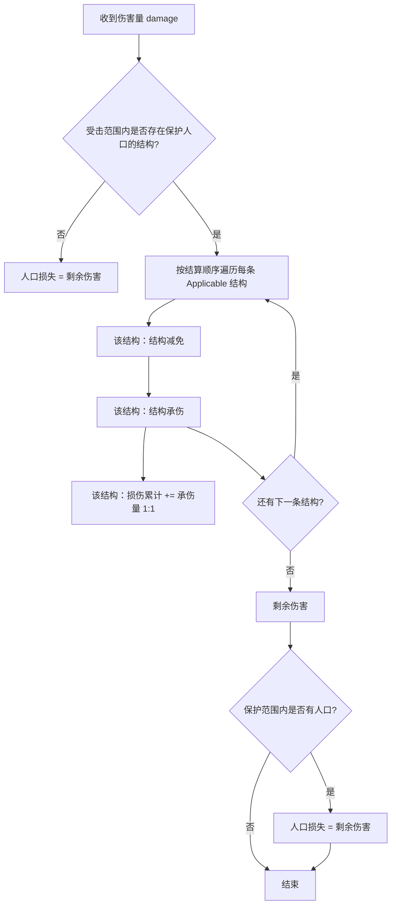

> 状态：草稿
> 程序实现：[03-程序设计/03-数据字典/队伍与战斗数据结构.md](../../03-程序设计/03-数据字典/队伍与战斗数据结构.md)、[03-程序设计/02-运行时逻辑/队伍与指令执行.md](../../03-程序设计/02-运行时逻辑/队伍与指令执行.md)

← [单位与交战](./README.md)

# 交战系统

| 字段 | 内容 |
|------|------|
| 状态 | 草稿 |
| 校验状态 | 待校验 |
| 日期 | 2026-06-25 |
| 相关设定 | 无 |
| 相关系统 | [队伍系统](./队伍系统.md)、[势力系统](../05-城市与领袖/势力系统.md)、[地图图层](../03-图层与地点/地图图层.md)、[回合与行动表](../07-玩法循环/回合与行动表.md)、[工作](../07-玩法循环/工作.md) |

## 目标

定义各类可交战对象之间如何进入交战、如何结算**减员、建筑损伤与设施耐久**，以及交战如何打断行动与工作。

## 范围

- **包含**：交战参与方类型（队伍、设施、城市）、交战身份与敌我判定、交战打断规则、与队伍战斗结算的衔接。
- **不包含**：具体数值公式、完整 UI 流程（见 [04-数值框架](../04-数值框架/)——**配置模板搭建后**再建）。

## 详细说明

### 交战参与方

交战不限于外出队伍。下列对象在规则上均可作为交战的一方或目标（具体能力由配置决定）：

| 类型 | 示例 | 说明 |
|------|------|------|
| **队伍** | 侦察队、武装巡逻队等 | 最常见交战主体；见 [队伍系统](./队伍系统.md) |
| **设施** | 哨塔、陷阱、开采站等 | 具备耐久；可通过**响应检测器**触发战斗等行为；耐久归零则失效 |
| **城市** | 移动城市（停泊占格时）、外部城市格 | 城市格或城区可作为打击目标；移动城市航行中与外界无物理接触，交战规则见 [地图与移动 · 停泊与航行](./地图与移动.md#停泊与航行) |

### 交战身份与敌我判定

- 是否**加入当前交战流程**与是否**属于敌对势力**，为两条独立判定。
- 敌我关系主要依据 [势力系统](../05-城市与领袖/势力系统.md) 中的关系数值与归属。
- `joined_combat_queue`（或等价字段）只控制是否进入当前交战流程，不直接决定敌我。

### 进入交战的典型路径

| 路径 | 说明 |
|------|------|
| 主动攻击 | 具备攻击能力的队伍对目标发动攻击指令 |
| 设施响应 | 单位行动满足设施**响应检测器**条件时，按配置发起**战斗**等行为（见 [地图图层 · 响应检测与行为触发](../03-图层与地点/地图图层.md#响应检测与行为触发)） |
| 被动卷入 | 路径被阻断、进入威胁范围、或已在交战中的战场波及 |
| 城市遭袭 | 停泊中的移动城市或外部城市格成为打击目标 |

### 与队伍 AI 的衔接

外出队伍遇敌时的优先级由 `ai_strategy`（保守 / 激进）决定，规则见 [队伍系统 · 遭遇敌人时的行为](./队伍系统.md#遭遇敌人时的行为)。交战系统负责**结算**，队伍系统负责**遇敌时的任务内调整**。

### 战斗结算（当前版本）

交战结算分两段：**发起方造成伤害**（口径已定）与 **遭受方受到伤害**（口径已定，见下节）。产出仍归纳为 **队伍减员**、**结构损伤累计**、**设施/城区失效**三类结果；**不**含已废弃的 [士气与逆风保护](#已废弃士气与逆风保护) 机制。

#### 造成伤害（发起方 · 已定）

主动攻击或反击的**发起方**按下列顺序得到本次 **伤害量** `damage`（与人口 **同一单位**，非负整数；小数 **向下取整**）：

1. 判定可攻击目标。
2. 发起攻击。
3. 计算攻击方战力：攻击能力系数 × **人数系数** → `attacker_power_final`。
4. 将攻击效果传递至防守方（受防御能力与**人数系数**影响）→ 得到本次 **`damage`**。

程序管线与字段见 [队伍与指令执行 · 战斗结算管线](../../03-程序设计/02-运行时逻辑/队伍与指令执行.md#战斗结算管线)、[队伍系统 · 战斗结算流程](./队伍系统.md#战斗结算流程当前版本)。

#### 受到伤害（遭受方 · 已定）

**遭受方**在收到 `damage` 后结算；**结构**包括 **城区**、**设施**（含 [城墙](../03-图层与地点/设施层.md#城墙) 等辅助类设施）。

**多条结构可同时保护同一范围内人口**：同一受击范围内若存在 **多处** Applicable 结构（例如本格 **城墙** + **城区** + 其它设施），**每条结构均可独立生效一次**结构防御（减免 → 承伤），共同削减作用于人口的剩余伤害；**不是**仅选取一条结构结算。

| 步骤 | 说明 |
|------|------|
| **Applicable 结构** | 与本次受击 **保护关系** 成立的结构实例（同格城墙、所在城区、覆盖该人口的设施等；细则由目标类型与 SO 配置） |
| **逐条生效** | 对 **每条** Applicable 结构各执行一轮 **结构减免 → 结构承伤**；上一轮输出的 **剩余伤害** 作为下一轮的输入 |
| **结构减免** | 按该结构类型 / SO 削减进入本轮承伤的伤害 |
| **结构承伤** | 该结构吸收部分伤害；吸收量 **1:1** 写入 **该结构自身** 的结构损伤累计 |
| **结构内人口** | **全部** Applicable 结构处理完毕后，**剩余伤害** 才转化为保护范围内人口的 **人口损失** |
| **无结构** | 开阔地等 **无结构** 保护时，不经过上述循环，直接结算人口减员 |
| **结算顺序** | 同一次受击内多条结构的遍历顺序（如由外到内、设施优先序）由 SO / 配置 **待定**；**原则已定**：每条结构各生效一次，**不**合并为单次承伤 |

**结果写入**（与 [势力系统 · 分轨累计](../05-城市与领袖/势力系统.md#分轨累计已定) 衔接）：

| 结果 | 适用 | 说明 |
|------|------|------|
| **队伍减员** | 可交战单位 | 编制人数减少；写入 **单位轨** 人口损失累计 |
| **城区居民减员** | 城区 | 写入 **城区轨** 人口损失累计 |
| **结构损伤累计** | 城区、设施 | 1:1 累加；达容量上限或阈值后设施失效 / 城区完整度展示下降 / 转废墟等（见 [城区总览 · 结构完整度](../03-图层与地点/建筑层/城区总览.md#废墟)） |

**结构完整度**（0～100%）为 **展示层**：由结构 **容量**（SO，与人口同单位）与 **结构损伤累计** 换算；交战写入累计时 **1:1**，不再使用「完整度下降 ↔ 损伤上升待定换算」的含糊口径（**负载成本、分离惩罚**等非交战来源是否并入同一累计池见 [待对齐项](#战斗结算待对齐项)）。

6. 若满足反击条件，执行一次反击（禁止反击连锁）；反击同样走「造成伤害 → 受到伤害」两段。

队伍侧步骤摘要见 [队伍系统 · 战斗结算流程](./队伍系统.md#战斗结算流程当前版本)；程序管线见 [队伍与指令执行 · 战斗结算管线](../../03-程序设计/02-运行时逻辑/队伍与指令执行.md#战斗结算管线)。

**关系事件**：人口损失写入受害实例本地累计后，按势力系统分轨传导；交战系统不负责关系数值公式。

#### 战斗结算 · 待对齐项

下列条目在写入本节前与旧稿 **部分冲突**；已按本节口径收束，**若你另有裁定可再改**：

| 项 | 旧稿 | 本节口径 | 状态 |
|----|------|----------|------|
| **城墙** | 仅减免本格单位 **人口损失** Buff；**不**减免城区完整度 / 设施耐久 | **城墙作为本格结构**参与 **结构减免 → 结构承伤**；人口减损为承伤后的结果，不再单独叠一层与承伤无关的 Buff | **已按本节改写** [设施层 · 城墙](../03-图层与地点/设施层.md#城墙) |
| **三轨并列表述** | 按目标类型直接写减员 / 完整度 / 耐久 | 统一先走 **受到伤害** 管线，再映射到减员与损伤累计 | **已收束** |
| **非交战损伤** | 负载成本、航行分离、拆解等各自写完整度 | 是否全部并入 **同一结构损伤累计池**（1:1）**待定**；交战路径已定 1:1 | **待你裁定** |
| **数值公式** | `population_loss_reduction` 等比例 **待定** | 结构减免系数、容量、人口损失分配公式仍归 [04-数值框架](../04-数值框架/) | **待数值化** |
| **多结构结算顺序** | （旧稿未写） | 多条结构 **逐条** 减免→承伤；遍历顺序 **待定** | **原则已定** |

### 已废弃：士气与逆风保护

下列机制**已从正式设计移除**，**不实现**、**勿回写**正式库或程序 schema（历史讨论见修订记录 0.0.4 以前版本）。

| 项 | 状态 |
|----|------|
| **战斗士气** · 战力公式中的士气乘数 | **已废弃** |
| **战斗士气** · 交战后士气升降 | **已废弃** |
| **逆风保护**（OPEN-012） | **已废弃** · 原与战斗士气绑定 |
| 程序字段 `morale`、`morale_attack_weight`、`attacker_morale_delta`、`defender_morale_delta` | **已废弃** · **不**纳入首版及后续 schema，除非单独立项重启 |

叙事层「恐慌 / 信任危机」等**章节玩法**与上表**战斗士气**分轨；第三章压力以暗渊环境、资源与叙事目标为主（见 [胜利条件](../01-核心体验/胜利条件.md)、[章节划分与故事大纲](../../04-设定/05-隐秘真相/章节划分与故事大纲.md)），**不**落地数值化士气条或逆风减伤规则。

### 与行动、工作的关系

- 交战可触发 [行动打断](../07-玩法循环/回合与行动表.md#工作中断与恢复)（占用行动、强制位移等），使进行中的 [工作](../07-玩法循环/工作.md) 暂停推进但保留完成度。
- 交战本身为即时结算能力通道，不走工作完成度；修复设施、城区等战后恢复走工作模块。

## 待确认事项

- [ ] 非交战来源（负载成本、航行分离、拆解等）是否与交战共用 **同一结构损伤累计池**（1:1）（见 [战斗结算 · 待对齐项](#战斗结算待对齐项)）。
- [ ] 结构 **容量** SO 与完整度展示换算；结构减免系数、结构内人口损失分配公式（见 [04-数值框架](../04-数值框架/)）。
- [ ] 移动城市**航行中**是否可被远程打击，以及与停泊占格遭袭的差异（sy-16，与 sy-19 交叉）。
- [ ] 多参与方同一格交战的结算顺序（sy-07）。
- [ ] 同一次受击内 **多条 Applicable 结构** 的遍历顺序（由外到内等，SO **待定**）。

## 修订记录

| 日期 | 版本 | 说明 |
|------|------|------|
| 2026-06-25 | 0.0.1 | 初稿：交战覆盖队伍、设施、城市；与势力、行动、工作分工 |
| 2026-06-27 | 0.0.2 | 设施响应对齐检测器→行为通道口径 |
| 2026-06-27 | 0.0.3 | 战斗结算接入**城墙**格内人口减损 |
| 2026-06-27 | 0.0.4 | **士气移出首版结算**；明确减员 / 建筑损伤 / 设施耐久三轨 |
| 2026-06-27 | 0.0.5 | **战斗士气**与**逆风保护**正式标为**已废弃** |
| 2026-07-10 | 0.0.6 | **受到伤害**管线：造成伤害/遭受方分段；损伤累计与人口同单位 1:1 |
| 2026-07-10 | 0.0.7 | 多结构可同时保护人口：结构防御逐条生效 |
