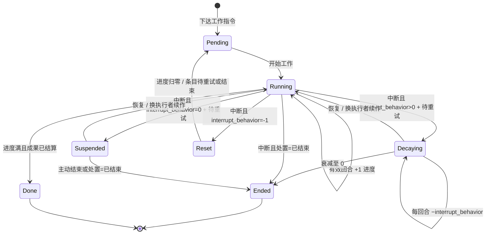
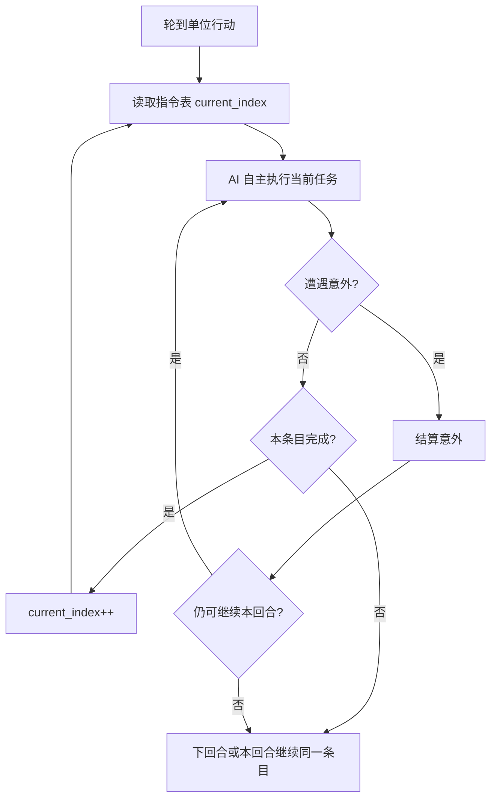

> 状态：草稿
> 程序实现：[03-程序设计/03-数据字典/回合与行动数据结构.md](../../03-程序设计/03-数据字典/回合与行动数据结构.md)、[03-程序设计/02-运行时逻辑/队伍与指令执行.md](../../03-程序设计/02-运行时逻辑/队伍与指令执行.md)

← [玩法循环](./README.md)

# 回合与行动表

| 字段 | 内容 |
|------|------|
| 状态 | 草稿 |
| 校验状态 | 待校验 |
| 日期 | 2026-07-15 |
| 相关设定 | 无 |
| 相关系统 | [核心循环](./核心循环.md)、[工作](./工作.md)、[队伍系统](../06-单位与交战/队伍系统.md)、[交战系统](../06-单位与交战/交战系统.md)、[地图与移动](../02-地图与世界/地图与移动.md)、[地图图层](../03-图层与地点/地图图层.md)、[势力系统](../05-城市与领袖/势力系统.md) |

## 目标

定义回合制的时间推进方式、每回合的阶段划分，以及单位如何通过行动表与可叠加指令完成多回合任务。

## 范围

- **包含**：回合阶段、行动主体与行动表、环境结算顺序、指令表与多回合执行、玩家指挥操作、移动城市停泊/航行、[队伍阵亡与清理](#队伍阵亡与清理)、[工作效率与工作量](#工作效率与工作量) 结算与 [数值通道](#数值通道) 展示要求；工作机制总览见 [工作](./工作.md)。
- **不包含**：界面交互细节、具体 UI 布局。

## 参考

整体节奏类似《文明 6》的回合制，但阶段划分与指令系统不同。

## 详细说明

### 基本原则

- **每回合玩家优先**：行动阶段内，**玩家移动城市及其阵营单位必然最先行动**；全部完成后，才进入外部城市行动，最后才是环境行动。
- **先指挥、后行动**：每回合开始时先进入**玩家指挥**阶段，玩家在此编辑各单位**指令表**（任务规划）与本回合**行动表**（行动顺序）；指挥结束后才进入**玩家行动**阶段执行。
- **外部城市顺序**：AI 行动阶段中，各[外部城市](../05-城市与领袖/势力系统.md)按由**对局种子生成的伪随机顺序**依次行动，直至本轮每个外部城市各行动一次（详见 [外部城市行动顺序](#外部城市行动顺序)）。

### 回合阶段

每个回合按以下顺序推进（**五阶段**）：

| 阶段 | 说明 |
|------|------|
| **玩家指挥** | 回合开始；玩家编辑指令表、调整行动表；**不执行**单位能力。指挥结束后锁定本回合输入，进入玩家行动。 |
| **玩家行动** | **玩家移动城市及其阵营**按行动表顺序执行本回合指令；本阶段全部完成前，外部城市与环境**不参与**行动。 |
| **AI 行动** | 各外部城市按 [种子伪随机顺序](#外部城市行动顺序) 轮流行动，直至全部各行动一次。外部城市由 [AI 模块](../05-城市与领袖/势力系统.md#外部城市-ai-模块已定-首版) 生成行动表并执行（首版：资源、产兵、指挥）；动画可跳过或加速；视野区外可跳过动画。 |
| **环境行动**（环境结算） | 太阳移动、黄昏带/暗渊带推移、环境效果、**周总结**（若 `turn_number % 7 == 0`）等非玩家、非城市机制结算；详见 [环境结算顺序](#环境结算顺序)。 |
| **关系行动**（关系结算） | **紧接环境行动结束之后**；[强制脱离](../05-城市与领袖/领袖与势力.md#未效忠关系跌破-50-强制脱离已定)、[效忠](../05-城市与领袖/领袖与势力.md#效忠已定) 等**关系阈值**在此阶段结算；详见 [关系结算顺序](#关系结算顺序) 与 [势力系统 · 关系行动](../05-城市与领袖/势力系统.md#关系行动已定)。 |

- **脱离**、**效忠**等关系行动**不**在玩家 / AI / 环境阶段中途插队；仅以本阶段末 **R** 等判定是否写入。
- 关系行动**写入**后，玩法 gate（指挥、交战、资源等）在**下一回合玩家指挥**起生效。


### 当前原型口径（MVP）

- `AiAction` 阶段已接入最小单位 AI 介入：当前原型存在 `team_ai_1`，在 AI 阶段会自动选择相邻可达格并执行移动。
- 玩家阶段与 AI 阶段分离执行：`PlayerAction` 仅处理玩家行动表，`AiAction` 仅处理 AI 行动表。
- AI 队伍默认不可被玩家“下达命令”进入指挥模式。
- 调试 UI 提供“一键完整推进一回合”入口：须依次执行玩家行动、AI 行动、环境结算、**关系结算**，再进入下一回合玩家指挥。
- 移动指令改为跨回合持续执行：单位每回合按 `movePoint` 推进路径，未到目标时保持 `running`，到达目标才标记 `completed` 并推进到下一条指令。
- 指令表与回合阶段解耦：若单位在同一回合内提前完成当前指令，且仍有行动力并满足条件，可在该回合继续执行下一条指令。
- 航行状态下移动城市具备移动能力，当前原型速度固定为每回合 1 格。
- 队伍注册时生成 `team_instance_state` 与 ASC；执行前由 `GameplayAbility` 校验 Tag 与规则。
- 工作类指令在首次推进前读取 ASC 的 `work_efficiency` Attribute 锁定时长；参与人数与试验城模块写入 GE 贡献快照（完整城模块修正仍待 sy-12）。
- 四类默认模板（侦察/运输/工程）已注册薄切片 GA/GE；城市指挥 UI 已接入学院切换式 GE 测试。

### 外部城市行动顺序

- 对局持有全局 **`game_seed`**（存档可读）。
- 每回合 AI 行动阶段开始前，根据 **当前存活的外部城市 ID 列表** 与 `game_seed` 生成**确定性伪随机**行动顺序（同种子、同城市集合 → 同顺序，可复现）。
- 各外部城市按该顺序依次完成本回合行动；顺序在**本回合内**不变。
- 外部城市集合变化（新发现、消亡等）时，下一回合按新集合重新生成顺序。

程序字段见 [回合与行动数据结构 · 外部城市行动顺序](../../03-程序设计/03-数据字典/回合与行动数据结构.md#外部城市行动顺序)。

### 行动主体与行动表

**行动**不限于外出队伍。凡在回合内需要执行指令、推进工作或结算能力的实体，均可进入 [行动表](#行动表)：

| 行动主体（示例） | 说明 |
|------------------|------|
| **移动城市** | 始终可指挥；停泊/航行切换、城内工作等 |
| **外出队伍** | 侦察、运输、工程等 |
| **外部城市及其单位** | AI 行动阶段按种子顺序行动 |
| **具备行动资格的设施** | 由配置决定（如自动炮塔、定时产出）；细则 **待定** |

- 行动表决定**本回合内**谁先动；与跨回合的 [指令表](#指令表与自主执行)、[工作](./工作.md) 配合使用。
- 玩家在**玩家指挥**阶段可为**己方**行动主体（含移动城市、外出队伍等）增删改指令表、调整行动表。

#### 行动表

- 任意一方在行动阶段中，单位均按行动表 `order_index` 从小到大依次行动。
- 玩家[移动城市](../02-地图与世界/地图与移动.md)、外部城市及其下属单位，在逻辑与实现上均适用同一套行动表规则。
- AI 程序自行生成并维护各自的行动表。

#### 默认插入与输入顺序

- **默认插入位置**：新进入行动表的单位（或本回合新获得行动条目者）默认追加到表**尾部**（`order_index` 最大）。
- **顺序输入**：本作是回合制游戏，**不允许**在指挥阶段并行提交多条行动表修改；玩家与 AI 对行动表的写入、调整须**逐条、按顺序**完成，不存在「同时输入两条」的情况。

#### 调节顺序（插队）

玩家在**玩家指挥**阶段可调整本回合行动表顺序。将某单位**提前**到目标顺位时：

1. 该单位占据目标 `order_index`；
2. **原占用该顺位及之后**的单位整体后移一位（各 `order_index` +1），等效于队列中被插队者往后排；
3. 已被插队后移的单位仍保留在表中，仅行动顺序变晚。

示例：原顺序 `A → B → C → D`，将 `D` 调到 `B` 之前 → `A → D → B → C`（`B`、`C` 各后移一位）。

程序实现见 [回合与行动数据结构 · 插入与重排](../../03-程序设计/03-数据字典/回合与行动数据结构.md#插入与重排规则)。

#### 移动城市与行动表

移动城市具有双重身份：**城市图层上的城区集合**（见 [城市模块化](../03-图层与地点/建筑层/README.md)），以及**始终存在的可指挥单位**（拥有指令表，在玩家指挥阶段可增删改查）。

与 [地图与移动 · 停泊与航行](../02-地图与世界/地图与移动.md#停泊与航行) 对齐：

| 维度 | 停泊 | 航行 |
|------|------|------|
| **世界地图占格** | **占据**地图格 | **不占**地图格（行进态多格移动，见 [sy-19](../02-地图与世界/地图与移动.md#航行态占格单位边界与禁用功能-sy-19)） |
| **可指挥** | 是 | 是 |
| **移动能力** | **禁用**（不可执行整城移动类指令） | **启用** |
| **队伍进出城** | 可派遣 / 召回（细则见 [队伍系统 · 停泊与航行](../06-单位与交战/队伍系统.md#停泊与航行中的队伍边界-sy-19)） | **不可**自由进出物理边界（sy-19） |
| **行动表** | 有指令则进入行动表（含切换至航行的**工作**） | 有指令则进入行动表 |

- 行动表条目使用 `actor_kind=mobile_city`。
- **切换停泊 / 航行**作为一类**工作**：下达后进入 [工作中](#工作中状态)，进度随回合推进，完成后才切换状态并启用/禁用移动能力。
- 移动消耗与航行速度仍见 sy-02；**切换工作时长已定**：各 **1 回合**（见 [工作中状态 · 默认时长](#工作中状态)）。

### 玩家指挥阶段的操作

玩家在**玩家指挥**阶段对**己方**单位（含**移动城市**、外出队伍等）可进行：

| 操作 | 说明 |
|------|------|
| **查** | 查看指令表、行动表顺位、当前任务条目 |
| **增** | 为尚无指令的单位**添加指令** → 该单位进入（或保留在）行动表 |
| **改** | 修改指令表条目、调整行动表顺序（含 [插队后移](#调节顺序插队)） |
| **删** | 删除指令表条目 |
| **移出行动表** | **清空该单位全部指令** → 该单位从本回合行动表移除（无指令即不参与本回合行动） |

约束：

- 须在指挥阶段**顺序**完成每次修改（见 [默认插入与输入顺序](#默认插入与输入顺序)）。
- 指挥结束后锁定；行动阶段不再接受玩家改写。

### 队伍阵亡与清理

己方队伍在战斗或事件结算中**全灭或逻辑阵亡**时，**逻辑状态与玩家界面同步**，**不**采用「逻辑已死、玩家尚不知」的双轨。

#### 已定原则

| 维度 | 规则 |
|------|------|
| **结算时点** | 战斗/事件结算完成时置 `is_alive=false`，写入 `death_hex`、`death_turn`；当回合起停止一切实际执行。 |
| **玩家界面** | 与逻辑层**同步**：不可再选中；不可再编辑指令表与行动表。 |
| **行动表** | 自当回合行动序列中移除；若尚未轮到执行则跳过。 |
| **指令表** | 清空；是否归档为只读战报 **待定**（表现层）。 |
| **编制与人口** | 按减员/解散规则更新编制、载荷与城区人口（细则见 [队伍系统](../06-单位与交战/队伍系统.md)、[人口与迁移](../04-资源与人口/人口与迁移.md)）。 |

程序字段见 [队伍与战斗数据结构 · 队伍阵亡](../../03-程序设计/03-数据字典/队伍与战斗数据结构.md#队伍阵亡)。

### 环境结算顺序

**环境行动**阶段内固定顺序：

1. **太阳移动**（优先，可跳过）：若 **`sun_motion_enabled`** 为真，**太阳照射区**由 **格修正工具** 沿**纵向**推移（**v(t)=v₀+a·t** 驱动 **x/y**，见 [地图与移动 · 程序口径](../02-地图与世界/地图与移动.md#程序口径sy-01-部分已定)）；照射区完全离图则置假。若为假，**跳过**本步；格级光照视为**全场暗渊带**（见 [太阳照射区与移动停用](../02-地图与世界/地图与移动.md#太阳照射区与移动停用)）。
2. **环境效果结算**：从暗渊带侧向黄昏带/日照侧，按顺序逐格结算；面向太阳时，同一排的格子从右向左依次结算。
3. **周总结**（若 `turn_number % 7 == 0`）：**第 7、14… 回合仍为正常行动回合**；在步骤 1～2 **完成后**调用 `WeeklySummaryOrchestrator.Run()`（粮食、buff、地图等子步骤）。详见 [粮食与周总结（草稿）](../../01-草稿/归档/粮食与周总结/README.md)。

环境行动**全部子步完成后**，进入 [关系结算顺序](#关系结算顺序)；**不**直接跳至下一回合玩家指挥。

### 关系结算顺序

**关系行动**为独立阶段，**仅在环境行动（含周总结）结束之后**执行：

| 顺序 | 内容 |
|------|------|
| 1 | 读取本回合末领袖关系 **R** 及招募 / 效忠等状态 |
| 2 | 判定阈值跨越：**R ≤ −50** → [强制脱离](../05-城市与领袖/领袖与势力.md#未效忠关系跌破-50-强制脱离已定)；**R ≥ 100** 且已招募 → [效忠](../05-城市与领袖/领袖与势力.md#效忠已定)；其它关系行动 **待定** |
| 3 | **写入**状态变化（脱离、效忠激活等） |
| 4 | 递增 `turn_number`（若程序在阶段末统一递增）→ 下一回合 **玩家指挥** |

| 项 | 口径 |
|----|------|
| **与回合内操作** | 本回合内 **R** 在玩家 / AI / 环境阶段已降至阈值时，**当回合**仍可完成至环境结算结束前的合法操作（含编组、拆解等，受其它 gate 约束）；**脱离**等在**关系结算**写入，**下回合**起生效 |
| **与关系数值** | 委托完成、人口损失等可在回合内先改 **R**；**脱离 / 效忠**仅据**关系结算**时刻判定 |
| **详情** | [势力系统 · 关系行动](../05-城市与领袖/势力系统.md#关系行动已定) |

### 指令系统

#### 指令表与自主执行

- 每个单位拥有一张**指令表**（程序实现为**指令队列** `team_command_queue`），不是单一指令。
- 指令表相当于单位的 **AI 任务表**：按顺序列出要完成的目标（探索、运输、建造、移动等）。
- 单位 AI **逐步**按指令表推进：当前聚焦 `current_index` 对应条目，完成后再进入下一条。
- **具体如何执行**当前任务（路径选择、等待时机、遇敌应对、局部换位等）由 **AI 自主决定**，不属于玩家逐步微操；玩家规划的是**做什么**，不是**每一步怎么做**。
- 指令可叠加、可组合，构成跨回合任务规划；一条指令可跨越多个回合才能完成。
- 需占用回合的任务，其**工作进度**由 [工作效率与工作量](#工作效率与工作量) 按每回合积累结算；战斗内攻击等即时结算能力仍走各自通道。
- 回合**玩家指挥**阶段，玩家可修改指令表；**行动**阶段按行动表顺序，各单位从指令表当前条目取出本回合应完成的部分，由 AI 自主执行。

**指令与行动的同名关系**：Move、BuildFacility 等既是 `TeamCommandKind`（指令种类）的值，也是单位在行动阶段实际执行的能力（行动）。这不是混淆——是指令定义目标种类、行动对该目标逐回合推进的自然结果。详见 [队伍与指令执行 · 概念区分](../../03-程序设计/02-运行时逻辑/队伍与指令执行.md#概念区分)。

#### 工作中状态

任意**行动主体**（含移动城市、外出队伍）在执行需占用时间的任务时，进入**工作中**状态。机制总览见 [工作](./工作.md)；下列为回合内细则。

- 工作以**工作进度**衡量（程序内常称 **完成度**）：向 **所需工作量** 积累；每有效推进一回合按 [工作效率与工作量](#工作效率与工作量) 增加本回合工作量（见 [完成度与推进](#完成度与推进)）。
- 工作进度到达配置阈值时，结算对应 **工作成果**（见 [工作 · 工作进度与工作成果](./工作.md#工作进度与工作成果)）；**100%** 时一般为该工作的完整成果。
- 不同**工作类型**在 SO（`work_type_config`）上配置**所需工作量**（对照值）、**可中止**、**被工作对象类型**、**工作成果列表**等字段（见 [工作类型配置](#工作类型配置)）；每回合增量由参与人数 × 工作效率决定。
- 运行时须区分 **工作对象**（执行者）与 **被工作对象**（承受该项工作的实体）；二者**可以相同**。工作类型**只约束被工作对象**，不约束工作对象。
- **停泊 / 航行切换**：**被工作对象**与**工作对象**均为 **核心区**城区实例（非移动城市抽象 ID）；见 [连接与多核心 · 停泊与航行切换](../../03-图层与地点/建筑层/连接与多核心.md#停泊与航行切换核心区工作)。
- 工作进行中条目保持 `running`（或 `suspended`）；进度满且全部应触发的工作成果已结算后，条目结束。
- 是否**可暂停**、中断后进度与条目处置，由 `interrupt_behavior` 与 `on_interrupt_disposition` 决定（见 [工作中断与恢复](#工作中断与恢复)）。
- 意外 / 行动 / 主动中止见 [工作中断与恢复](#工作中断与恢复)。
- 程序字段见 [回合与行动数据结构 · 工作状态](../../03-程序设计/03-数据字典/回合与行动数据结构.md#工作状态)。

**所需工作量（首版对照值，工作效率 = 1.0、参与人数 = 1 时）**

| 工作类型 | 所需工作量（对照） | 被工作对象 | 说明 |
|----------|-------------------|------------|------|
| **补员** | **2** | 队伍实例 | 在编队伍当前格；`reinforce_team`；人员取自**相邻格** |
| **创建队伍** | **2** | 城区实例 | 待组建队伍在城区编组；`form_team` |
| 停泊 → 航行 | **2** | **核心区** | `dock_to_sail` |
| 航行 → 停泊 | **2** | **核心区** | `sail_to_dock` |
| **迁移城区** | **3～5**（默认 **待定**） | **目标城区** | `district_relocate`；**仅停泊**；开始时目标格**地基占位** |
| 建造资源点设施 | **3** | 资源点 / 工地 | 工程队执行 |
| 运维设施 | **3** | 设施实例 | 工程队执行 |
| 装货 | **1** | 库存节点 | 运输队执行 |
| 卸货 | **1** | 库存节点 | 运输队执行 |
| **修复城区** | **待定** | **城区实例** | **工程队**执行；`work_subject_kind = district`；**仅停泊**（见 [分离与拆解 · 修复城区](../03-图层与地点/建筑层/分离与拆解.md#修复城区)） |

- SO 字段 `base_duration_turn` 存**所需工作量对照值**（历史字段名保留）。
- 其他建造类型对照值**待定**（sy-10）。

#### 工作类型配置

`work_type_config`（SO）上，下列字段与 **所需工作量** 同级，均由工作类型定义、程序不在代码中写死：

| 字段 | 说明 |
|------|------|
| `base_duration_turn` | **所需工作量**对照值（工作效率 = 1.0、参与人数 = 1 时的额度） |
| `interrupt_behavior` | **中断行为**：单一数值 — **-1**=不可暂停（进度归零）、**0**=可暂停（保留进度）、**n>0**=需维持（每回合衰减 n） |
| `is_precision_work` | **精密工作**：`true` 时被攻击或城市航行移动触发中断；中断后进度处置由 `interrupt_behavior` 决定 |
| `on_interrupt_disposition` | 中断时条目处置：**待重试**（`retry`）保留条目 / **已结束**（`ended`）清除本条工作事件 |
| `work_subject_kind` | 要求的**被工作对象**类型（见下节）；**不**定义工作对象（执行者） |
| `apply_headcount_factor` | 是否以 `current_headcount` 作为 `participant_count`（true=外出队伍工作；false=固定为 1） |
| `persist_progress_on_subject` | 是否把工作进度同步到被工作对象状态（**可暂停**/**需维持**类建议 `true`） |
| `work_outcomes` | **工作成果**列表：进度阈值 + 效果 + **`outcome_repeat_policy`**（**可重置** / **不可重置**） |

工作类型**不绑定**工作对象（执行者由指令归属单位决定：哪支工程队、哪座移动城市等）。草稿「不绑定实施者」= 进度挂在被工作对象，**任意合格执行者**可推进；`interrupt_behavior ≥ 0` 时允许换队续作（见 [工作 · 工作标签与中断](./工作.md#工作标签与中断已定)）。

#### 完成度与推进

> **术语**：**工作进度**在程序与 UI 中常以 **完成度**（百分比）表示；见 [工作 · 工作进度与工作成果](./工作.md#工作进度与工作成果)。

| 概念 | 说明 |
|------|------|
| **已积累工作量** | 本工作累计有效推进所积累的工作量（`work_accumulated`） |
| **所需工作量** | 完成该项工作的额度（`required_work_amount`，来自 `base_duration_turn`） |
| **完成度 / 工作进度** | `work_accumulated / required_work_amount`，UI 可展示为百分比 |
| **本回合增量** | `participant_count × work_efficiency`；`participant_count = max(1, current_headcount)` |
| **推进时机** | 该单位在行动阶段**正常执行当前工作条目**且本回合未被中断时，累加本回合增量 |
| **中断期间** | 不推进进度，**不**扣减已有积累 |
| **预计回合数** | UI 根据当前每回合增量估算剩余回合 |
| **工作成果** | 进度达到阈值时结算；是否可再次发放由该条 **`outcome_repeat_policy`** 决定（见 [工作 · 阶段性成果](./工作.md#阶段性成果与重置策略)） |

进度达到 **100%** 且该工作类型配置的**最终工作成果**已结算后，本条工作结束（如设施建成、资源入载、状态切换完成）。

#### 工作对象与被工作对象

| 概念 | 含义 | 谁决定 |
|------|------|--------|
| **工作对象** | 执行该项工作的实体（队伍实例、移动城市等） | 指令归属单位；**不由工作类型绑定** |
| **被工作对象** | 该项工作作用在其上的实体（资源点、设施、库存节点等） | 工作类型 `work_subject_kind` 约束类型；指令填写 `work_subject_ref` |

- **可以相同**：停泊 / 航行切换时，工作对象与被工作对象均为**同一核心区**城区实例。
- **通常不同**：工程队（工作对象）在资源点（被工作对象）上建造开采站。

| 工作类型（示例） | `work_subject_kind` | 被工作对象（示例） | 工作对象（示例） |
|------------------|----------------------|-------------------|------------------|
| 建造资源点设施 | 工地 / 资源点 | 目标格资源点 | 工程队 |
| 运维设施 | 设施实例 | 目标设施 | 工程队 |
| 装货 / 卸货 | 库存节点 | 来源或目标节点 | 运输队 |
| 采集资源（待定） | 资源点 | 资源点 | 工程队或运输队 |
| 停泊 / 航行 | `core_district` | **核心区**城区实例 | **核心区**（相同） |

- 指令条目：`work_actor_ref`（工作对象，默认同 `team_id` / 移动城市 ID）、`work_subject_ref`（被工作对象）；与导航用 `target_ref` 可相同也可不同。
- **`interrupt_behavior=0`（可暂停）** 且 **`persist_progress_on_subject=true`** 时，完成度写入 **`work_subject_state`**；恢复或**换队续作**时读取已存进度，`work_actor_ref` **可变**。
- **`interrupt_behavior>0`（需维持）** 且 **`persist_progress_on_subject=true`** 时，完成度写入 **`work_subject_state`**；中断期间每回合扣除 `interrupt_behavior` 进度，衰减至 0 后处置按 `on_interrupt_disposition`。
- **`interrupt_behavior=-1`（不可暂停）** 时，中断后 `work_progress_turn` 归零；已按 **不可重置** 策略结算的阶段性成果**不**因再次推进而重复发放。

#### 工作中断与恢复

在 [工作效率与工作量 · 结算时机](#工作效率与工作量) 之上，叠加以下规则。机制总览与示例见 [工作 · 工作标签与中断](./工作.md#工作标签与中断已定)。

**行为与作用**：见 [地图图层 · 行为通道与作用](../03-图层与地点/地图图层.md#作用对行动调度的修正)。**意外打断**、**行动打断**是**作用**（修正行动调度），不是行为通道内的结算步骤；通常由某次 **`trigger_behavior`** 结算后，按检测器或全局规则的 **`on_resolve`** 施加。

**中断类型**

| 类型 | 触发 | 对进度 | 对指令表 |
|------|------|--------|----------|
| **意外打断** | 行为结算后施加 **`on_resolve=意外打断`**；遇敌；环境效果；本回合行动点耗尽等 | 见 [中断行为](#中断行为) | 见 **`on_interrupt_disposition`** |
| **行动打断** | **`on_resolve=行动打断`**；交战占用行动、强制位移等 | 见 [中断行为](#中断行为) | 见 **`on_interrupt_disposition`** |
| **主动中止** | 指挥阶段改写指令表、AI 切换任务等 | 见 [中断行为](#中断行为) | 见 **`on_interrupt_disposition`** |
| **精密工作中断** | **`is_precision_work=true`** 且工作对象**被攻击**，或所在**城市航行移动** | 见 [中断行为](#中断行为) | 见 **`on_interrupt_disposition`** |

**中断行为**（`interrupt_behavior`）

| 中断后 | **-1**（不可暂停） | **0**（可暂停） | **n > 0**（需维持） |
|--------|-------------------|----------------|--------------------|
| **进度** | **重置为 0** | **保留** | **逐渐衰减**（每回合 −n） |
| **换工作对象** | 不适用（进度已归零） | **允许** · 另一合格单位可接续同一 `work_subject_ref` + `work_type_id` | **允许**（衰减中可接续） |
| **典型场景** | 食物生产 | 金属收集、建造 | 能量收集 |

**中断处置**（`on_interrupt_disposition`）

| 值 | 条目 | 典型场景 |
|----|------|----------|
| **待重试**（`retry`） | 条目 `suspended` 或下回合续作；**不**清除 `work_subject_state`（`interrupt_behavior ≥ 0` 时） | 工程建造、运维 — 意外后可恢复或换队 |
| **已结束**（`ended`） | **清除**本条工作事件；`current_index` 推进或移除进行中占位 |

**恢复与续作**

- **`retry` + `interrupt_behavior=0`（可暂停）**：意外 / 行动打断后，本回合可继续则同条目推进；否则下回合**从同一进度**继续；亦可由**另一** `work_actor_ref` 接续（读取 `work_subject_state`）。
- **`retry` + `interrupt_behavior>0`（需维持）**：条目保留，每回合流失 `interrupt_behavior` 进度；恢复后从衰减后的进度继续；亦可换队接续。衰减至 0 后自动转为 **已结束**。
- **`ended`**：当前指令条目结束；若再次下达指向同一被工作对象的同类工作，**新条目**从 0 起算（除非 SO 另有规定）。
- `interrupt_behavior=-1`（不可暂停） + 中断：进度必归零；**不可重置**的阶段性成果不重复发放；**可重置**的成果在新推进至阈值时可再次结算。



程序实现见 [队伍与指令执行 · 工作推进与中断](../../03-程序设计/02-运行时逻辑/队伍与指令执行.md#工作推进与中断)；原 [遭遇意外的中断与恢复](#遭遇意外的中断与恢复) 视为本节的**意外打断**子集。

#### 工作效率与工作量

**工作效率** (`work_efficiency`) 为合成倍率：**越高，每回合积累的工作量越多**。

**结算时机**

- 工作**进行中**，每有效推进回合结算一次**本回合工作量增量**，并生成（或更新）[数值通道](#数值通道) 明细。
- 人数变化或其它修正**自下一有效推进回合**起按**当时**状态计入增量；**不**回溯已积累工作量。

**公式（首版）**

```text
work_efficiency = clamp( Σ(加法修正项), min_efficiency, max_efficiency )
                × Π(乘法修正项)

participant_count = max( 1, current_headcount )

work_delta_per_turn = participant_count × work_efficiency

work_accumulated += work_delta_per_turn    // 每有效推进回合
```

- `required_work_amount`：来自 `work_type_config.base_duration_turn`（上表对照值）。
- `min_efficiency` / `max_efficiency`：由 SO 配置，防止极端值。
- **无需人员参与**的工作：`participant_count` 默认为 **1**。
- **完成度**：`work_accumulated / required_work_amount`；达 **100%** 且成果已结算后工作结束。
- **预计回合数**（UI）：根据当前 `work_delta_per_turn` 与剩余额度估算。

**人数修正**

- **满编人数** = 队伍模板 `default_headcount`（人数比分母；**不**再乘入 `work_efficiency`）。
- `apply_headcount_factor=true`：**参与人数** = `max(1, current_headcount)`，作为工作量增量的乘数（外出队伍工作默认）。
- `apply_headcount_factor=false`：**参与人数** = **1**（移动城市切换停泊/航行默认）。

**其他模块修正**

各来源可通过 **`GameplayEffect`**（GE）向 `work_efficiency` Attribute 注入**加法**或**乘法**修正项。每项须带稳定 `source_id` 与玩家可读 `display_name`。

```text
work_efficiency = clamp( Σ(additive), min_efficiency, max_efficiency )
                × Π(multiplicative)
```

| 参数 | 建议值 | 说明 |
|------|--------|------|
| `min_efficiency` | **0.20** | 极限负面叠加后仍可推进（5× 时长），防止工作永久卡死 |
| `max_efficiency` | **3.00** | 极限正面叠加上限（1/3 时长），防止一回合秒完成 |

---

**加法修正项（Σ additive，首版）**

| # | `source_id` | `display_name` | 值 | 适用范围 | 状态 |
|---|-------------|----------------|----|----------|------|
| 1 | `district_trait_industrial` | 城区词条·工业 | **+0.30** | 该城区内队伍/工作 | **已定** |
| 2 | `district_trait_poverty` | 城区词条·贫困 | **−0.20** | 该城区内队伍/工作 | **已定** |
| 3 | `leader_trait_production` | 领袖·生产专精 | **待配**（0～+0.25，按领袖） | 领袖任职城区 | 延后（sy-25） |
| 4 | `leader_trait_inefficient` | 领袖·低效 | **待配**（−0.10～−0.20） | 领袖任职城区 | 延后（sy-25） |
| 5 | `env_sandstorm` | 环境·沙暴 | **−0.15** | 沙暴区域格子 | 延后 |
| 6 | `env_heavy_rain` | 环境·暴雨 | **−0.10** | 暴雨区域格子 | 延后 |

**乘法修正项（Π multiplicative）**

| # | `source_id` | `display_name` | 值 | 适用范围 | 状态 |
|---|-------------|----------------|----|----------|------|
| 1 | `engineer_repair_specialty` | 工程队·修复专精 | **×1.50** | 工程队执行修复工作时 | **已定** |

---

**豁免项（`ignore_efficiency = true`）**

| # | 对象 | 效果 | 豁免原因 |
|---|------|------|----------|
| 1 | **侦察塔** | 视野 +3 格（地形修正叠加） | 固化为定值 |
| 2 | **非即时主动的最终效果** | 修复始终 +10% 完整度 | 效率只影响回合数，不影响效果值 |

---

**叠加规则**

1. **同词条不重复**：同一城区不会随机到重复词条（0～2 个不重复）。
2. **同框词条加算**：城区同时携带工业（+0.30）和贫困（−0.20）→ `1.0 + 0.30 − 0.20 = 1.10`。
3. **城区词条 + 领袖能力叠加**：同为加法项，直接相加。工业城区（+0.30）+ 生产专精领袖（+0.20）= +0.50。
4. **多城区不互相影响**：城区词条只影响**该城区内**出发的工作。队伍从一城区走到另一城区执行工作时，以**被工作对象所在城区**的词条为准。
5. **上限保护**：`clamp(min=0.20, max=3.00)` 保证极端组合仍可推进。

---

**各工作类型修正来源对照（首版已定）**

| 工作类型 | 每人基值 | 人数通道 | 加法修正 | 乘法修正 |
|----------|----------|----------|----------|----------|
| 自主修复 | 1.00 | ≤15 人 | 城区词条 | — |
| 工程队修复 | 1.00 | ≤20 人 | 城区词条 | 修复专精 ×1.50 |
| 城坞被动修复 | —（取决于上岗人数） | — | 城区词条 | — |
| 建造设施 | 1.00 | participant_count | 城区词条 | — |
| 运维设施 | 1.00 | participant_count | 城区词条 | — |
| 采集（矿区/能源站/果园） | 1.00 | participant_count | —（荒野格无词条） | — |
| 温室生产 | 1.00 | participant_count | 城区词条 | — |
| 拆解城区 | 1.00 | participant_count | 城区词条 | — |
| 宣称占领/接管 | 1.00 | participant_count | —（目标非己方） | — |
| 核心区停泊↔航行 | 1.00 | participant_count=1 | — | — |
| 迁移城区 | 1.00 | participant_count=1 | 城区词条（原位城区） | — |

**向下取整规则（已定）**：一切因人数变化而改变工作效率的场合，计算结果**一律向下取整**（如 15 人 × 效率 1.3 = 19.5 → 取 19）→ [运作与居民 · 工作效率影响规则](../03-图层与地点/建筑层/运作与居民.md#工作效率影响规则已定)。

---

**远期扩展（首版不启用）**

环境、领袖等远期修正来源通过新增 GE 配置绑定到对应 ASC 即可，不须改框架代码。环境修正也可通过 `L0_cross_modifiers.csv` 新增 `stat_key=work_efficiency` 行实现。

#### 数值通道

玩家界面须能查看当前工作的进度与效率来源：

| 要求 | 说明 |
|------|------|
| **通道** | 按数值类型分通道；工作量结算使用 `work_efficiency` 通道 |
| **明细** | 列出每一项修正的：来源名称、运算方式（加/乘）、数值、对合成效率的贡献 |
| **可追溯** | 与运行时 `stat_value_channel_entry` 一致，指挥阶段预览与行动阶段执行共用同一套结构 |
| **展示** | 至少展示：**已累计工作量 / 所需工作量**、本回合预计增量、**预计剩余回合数**、修正明细列表 |

程序字段见 [回合与行动数据结构 · 数值通道](../../03-程序设计/03-数据字典/回合与行动数据结构.md#数值通道)。

移动城市**停泊 / 航行切换**由 **核心区**执行：下达切换指令后进入工作中，进度满后整城才进入目标状态（见 [地图与移动 · 停泊与航行](../02-地图与世界/地图与移动.md#停泊与航行)、[连接与多核心 · 停泊与航行切换](../03-图层与地点/建筑层/连接与多核心.md#停泊与航行切换核心区工作)）。

#### 遭遇意外的中断与恢复

**意外**是 [工作中断与恢复](#工作中断与恢复) 中的一类（**意外打断**）：执行当前任务过程中、且非玩家在指挥阶段改写指令表所引发的事件，例如：[响应检测器触发的行为](../03-图层与地点/地图图层.md#响应检测与行为触发)、[遭遇敌人](../06-单位与交战/队伍系统.md#遭遇敌人时的行为)、环境效果、本回合行动点耗尽等。

| 维度 | 规则 |
|------|------|
| **对指令表** | 意外**不改变**指令表结构：不删除、不重排、不擅自跳过条目；`current_index` 保持不变。仅**玩家指挥**阶段可由玩家修改指令表。 |
| **对自主行动** | 意外**打断**当前条目本回合内的自主执行；完成度**不重置**、本回合**不推进** |
| **条目状态** | 当前条目维持**进行中**或**暂停**；已完成完成度保留 |
| **恢复** | 意外结算结束后：若本回合仍有行动点且条件允许，从**同一完成度**继续；否则下一回合仍从同一条目、同一完成度继续 |
| **终止当前条目** | 仅当 AI 按 [队伍系统 · 队伍 AI 接管规则](../06-单位与交战/队伍系统.md#队伍-ai-接管规则连续指令) 判定持续受阻且无法推进时，才标记当前条目失败或跳过，并进入下一条。 |



程序实现见 [队伍与指令执行 · 意外中断与恢复](../../03-程序设计/02-运行时逻辑/队伍与指令执行.md#意外中断与恢复)。

## MVP 落地对照（2026-06-27）

本期原型已落地以下最小闭环（代码位于 `Assets/Scripts/`）：

| 规则 | 程序入口 |
|------|----------|
| 四阶段回合推进 | `Yanxu.Turn/TurnPhaseMachine.cs` |
| 行动表尾部插入 / 重排 | `Yanxu.Turn/ActionTableService.cs` |
| 指令队列 `current_index` 推进 | `Yanxu.Team/Commands/TeamCommandQueueService.cs` |
| 停泊 ↔ 航行为工作（**1 回合**） | `Yanxu.City/MobileCityStateService.cs` + `Yanxu.Team/Work/WorkProgressService.cs` |
| 被工作对象固定核心区 `core_district` | `Yanxu.City/MobileCityStateService.cs`（`BuildSwitchCommand`） |
| 响应触发后意外打断且保留进度 | `Yanxu.Turn/Response/ResponseCheckPipeline.cs` + `Yanxu.Team/TeamActionExecutionService.cs` |
| 队伍实例状态 + ASC | `Yanxu.Team/TeamInstanceState.cs` + `Yanxu.Core.Effects/AbilitySystemComponent.cs` |
| 工作效率 Attribute 锁定时长 | `Yanxu.Team.Work/WorkEfficiencyResolver.cs` + `Yanxu.Core.Effects/EffectContributionSnapshot.cs` |
| 五类模板默认 GA/GE | `Yanxu.Team.Ability/DefaultTeamAbilityBootstrap.cs` |

## 待确认事项

- [ ] 队伍阵亡后指令表是否归档为只读战报（表现层）。

## 修订记录

| 日期 | 版本 | 说明 |
|------|------|------|
| 2026-06-21 | 0.0.1 | 初稿；正文首次提及外部城市、移动城市时加交叉链接 |
| 2026-06-22 | 0.0.2 | 明确指令表=AI 任务表、执行方式由 AI 自主决定；定案遭遇意外的中断与恢复规则 |
| 2026-06-22 | 0.0.3 | 定案行动表：默认尾部插入、顺序输入、调节时插队后移规则 |
| 2026-06-22 | 0.0.4 | 强化基本原则：玩家必然最先行动、先指挥后行动；外部城市顺序由 game_seed 伪随机生成 |
| 2026-06-22 | 0.0.5 | 定案移动城市停泊/航行与行动表、玩家指挥增删改查；框架化未知死亡与延迟宣告，开放项入追踪 |
| 2026-06-22 | 0.0.6 | 新增工作中状态与回合进度；移动城市始终可指挥，停泊禁用移动能力；状态切换视为工作 |
| 2026-06-22 | 0.0.7 | 定案首版工作默认时长：停泊/航行切换各 2 回合；资源点建造与运维各 3 回合；装货/卸货各 1 回合 |
| 2026-06-22 | 0.0.8 | 定案工作效率→时长公式；人数比乘法减值；数值通道记录并展示修正来源（sy-12 补全模块清单） |
| 2026-06-22 | 0.0.9 | 定案修正变化仅对下一项工作生效；进行中不重算当前时长 |
| 2026-06-22 | 0.0.10 | 完成度积累、工作对象与被工作对象、工作中断与恢复 |
| 2026-06-22 | 0.0.11 | 澄清：`allow_suspend` 为工作类型字段；类型绑定被工作对象、不绑定工作对象；二者可相同 |
| 2026-06-23 | 0.0.12 | 刷新图片 |
| 2026-06-25 | 0.0.13 | 明确行动主体不限队伍；环境结算改用黄昏带/暗渊带；链至工作模块与势力系统 |
| 2026-06-27 | 0.0.14 | 工作进度与工作成果；勘探 50%/100% 成果节点 |
| 2026-06-27 | 0.0.15 | 环境结算：太阳/光带格修正工具每 x 回合向上 y 格（sy-01 部分已定） |
| 2026-06-27 | 0.0.16 | 术语对齐格修正工具 |
| 2026-06-27 | 0.0.17 | 追加 MVP 落地对照：四阶段、行动表、核心区切换工作、响应打断接点 |
| 2026-06-27 | 0.0.17 | 工作中断对齐「作用」层：`on_resolve` 与行为通道分工 |
| 2026-06-27 | 0.0.18 | 环境结算：太阳推移对齐 v₀+a·t 运动学 |
| 2026-06-27 | 0.0.19 | 太阳移动可跳过；sun_motion_enabled 与全局暗渊带 |
| 2026-06-27 | 0.0.20 | 移动城市行动表对齐 sy-19（占格、队伍边界） |
| 2026-06-27 | 0.0.21 | 停泊/航行切换：被工作对象与执行者改为**核心区** |
| 2026-06-27 | 0.0.22 | **可暂停/不可暂停**、中断处置、阶段性成果重置；换队续作 |
| 2026-06-28 | 0.0.23 | 原型修正：移动指令为跨回合持续任务，未到目标不判完成 |
| 2026-06-28 | 0.0.24 | 原型修正：同回合允许连续执行多条指令（受行动力与条件约束） |
| 2026-06-28 | 0.0.25 | 航行态移动城市可移动，速度固定每回合 1 格 |
| 2026-07-10 | 0.0.27 | 新增**关系行动**阶段（环境行动之后；脱离 / 效忠等） |
| 2026-07-10 | 0.0.28 | 明确五阶段顺序；关系结算在环境结算（含周总结）之后 |
| 2026-06-29 | 0.0.27 | GAS-lite 替换：执行前改由 GA/Tag 校验，工作效率改由 ASC Attribute 与 GE 快照锁定 |
| 2026-06-30 | 0.0.28 | 停泊/航行切换 **1 回合**；新增 **迁移城区** 工作（3～5 回合、仅停泊） |
| 2026-07-05 | 0.0.29 | 工作结算改为工作量积累；展示累计/所需与预计回合数；无人参与时人数默认为 1 |
| 2026-07-07 | 0.0.30 | **废止**未知死亡与延迟宣告（OPEN-023～026）；改为队伍阵亡与清理，己方状态与 UI 同步 |
| 2026-07-15 | 0.0.31 | 指令与行动同名关系说明：指令定义目标种类，行动为该目标的逐回合推进 |
| 2026-07-19 | 0.1.0 | **工作标签体系裁定**：`interrupt_behavior` 改为单一数值字段（-1=不可暂停/0=可暂停/n>0=需维持衰减 n），`decay_per_turn` 字段废止（衰减量由 `interrupt_behavior` 数值本身表达）；`is_precision_work` 独立标签；字段表、工作中断与恢复全节、状态机同步 |
