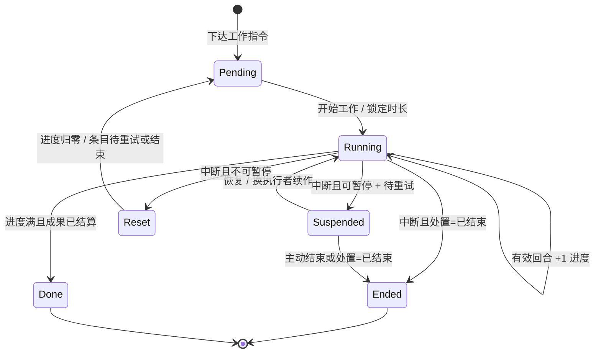
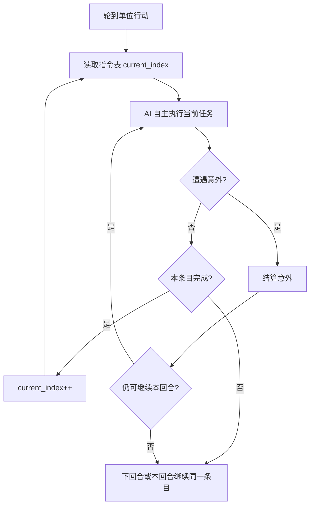

> 状态：草稿
> 程序实现：[03-程序设计/03-数据字典/回合与行动数据结构.md](../../03-程序设计/03-数据字典/回合与行动数据结构.md)、[03-程序设计/02-运行时逻辑/队伍与指令执行.md](../../03-程序设计/02-运行时逻辑/队伍与指令执行.md)

← [玩法循环](./README.md)

# 回合与行动表

| 字段 | 内容 |
|------|------|
| 状态 | 草稿 |
| 校验状态 | 待校验 |
| 日期 | 2026-06-23 |
| 相关设定 | 无 |
| 相关系统 | [核心循环](./核心循环.md)、[工作](./工作.md)、[队伍系统](../06-单位与交战/队伍系统.md)、[交战系统](../06-单位与交战/交战系统.md)、[地图与移动](../02-地图与世界/地图与移动.md)、[地图图层](../03-图层与地点/地图图层.md)、[势力系统](../05-城市与领袖/势力系统.md) |

## 目标

定义回合制的时间推进方式、每回合的阶段划分，以及单位如何通过行动表与可叠加指令完成多回合任务。

## 范围

- **包含**：回合阶段、行动主体与行动表、环境结算顺序、指令表与多回合执行、玩家指挥操作、移动城市停泊/航行、未知死亡与延迟宣告（细则见 [待细化追踪](../../00-规范/待细化追踪.md) OPEN-022 ~ OPEN-026）、[工作效率与时长](#工作效率与时长) 结算与 [数值通道](#数值通道) 展示要求；工作机制总览见 [工作](./工作.md)。
- **不包含**：界面交互细节、具体 UI 布局。

## 参考

整体节奏类似《文明 6》的回合制，但阶段划分与指令系统不同。

## 详细说明

### 基本原则

- **每回合玩家优先**：行动阶段内，**玩家移动城市及其阵营单位必然最先行动**；全部完成后，才进入外部城市行动，最后才是环境行动。
- **先指挥、后行动**：每回合开始时先进入**玩家指挥**阶段，玩家在此编辑各单位**指令表**（任务规划）与本回合**行动表**（行动顺序）；指挥结束后才进入**玩家行动**阶段执行。
- **外部城市顺序**：AI 行动阶段中，各[外部城市](../05-城市与领袖/势力系统.md)按由**对局种子生成的伪随机顺序**依次行动，直至本轮每个外部城市各行动一次（详见 [外部城市行动顺序](#外部城市行动顺序)）。

### 回合阶段

每个回合按以下顺序推进：

| 阶段 | 说明 |
|------|------|
| **玩家指挥** | 回合开始；玩家编辑指令表、调整行动表；**不执行**单位能力。指挥结束后锁定本回合输入，进入玩家行动。 |
| **玩家行动** | **玩家移动城市及其阵营**按行动表顺序执行本回合指令；本阶段全部完成前，外部城市与环境**不参与**行动。 |
| **AI 行动** | 各外部城市按 [种子伪随机顺序](#外部城市行动顺序) 轮流行动，直至全部各行动一次。动画可跳过或加速；视野区外可跳过动画。 |
| **环境行动** | 太阳移动、黄昏带/暗渊带推移、环境效果等非玩家、非城市机制结算。 |


### 外部城市行动顺序

- 对局持有全局 **`game_seed`**（存档可读）。
- 每回合 AI 行动阶段开始前，根据 **当前存活的外部城市 ID 列表** 与 `game_seed` 生成**确定性伪随机**行动顺序（同种子、同城市集合 → 同顺序，可复现）。
- 各外部城市按该顺序依次完成本回合行动；顺序在**本回合内**不变。
- 外部城市集合变化（新发现、消亡等）时，下一回合按新集合重新生成顺序。

程序字段见 [回合与行动数据结构 · 外部城市行动顺序](../../03-程序设计/03-数据字典/回合与行动数据结构.md#外部城市行动顺序)。

### 行动主体与行动表

**行动**不限于外出队伍。凡在回合内需要执行指令、推进工作或结算能力的实体，均可进入 [行动表](#行动表)：

| 行动主体（示例） | 说明 |
|------------------|------|
| **移动城市** | 始终可指挥；停泊/航行切换、城内工作等 |
| **外出队伍** | 侦察、勘探、运输、工程等 |
| **外部城市及其单位** | AI 行动阶段按种子顺序行动 |
| **具备行动资格的设施** | 由配置决定（如自动炮塔、定时产出）；细则 **待定** |

- 行动表决定**本回合内**谁先动；与跨回合的 [指令表](#指令表与自主执行)、[工作](./工作.md) 配合使用。
- 玩家在**玩家指挥**阶段可为**己方**行动主体（含移动城市、外出队伍等）增删改指令表、调整行动表。

#### 行动表

- 任意一方在行动阶段中，单位均按行动表 `order_index` 从小到大依次行动。
- 玩家[移动城市](../02-地图与世界/地图与移动.md)、外部城市及其下属单位，在逻辑与实现上均适用同一套行动表规则。
- AI 程序自行生成并维护各自的行动表。

#### 默认插入与输入顺序

- **默认插入位置**：新进入行动表的单位（或本回合新获得行动条目者）默认追加到表**尾部**（`order_index` 最大）。
- **顺序输入**：本作是回合制游戏，**不允许**在指挥阶段并行提交多条行动表修改；玩家与 AI 对行动表的写入、调整须**逐条、按顺序**完成，不存在「同时输入两条」的情况。

#### 调节顺序（插队）

玩家在**玩家指挥**阶段可调整本回合行动表顺序。将某单位**提前**到目标顺位时：

1. 该单位占据目标 `order_index`；
2. **原占用该顺位及之后**的单位整体后移一位（各 `order_index` +1），等效于队列中被插队者往后排；
3. 已被插队后移的单位仍保留在表中，仅行动顺序变晚。

示例：原顺序 `A → B → C → D`，将 `D` 调到 `B` 之前 → `A → D → B → C`（`B`、`C` 各后移一位）。

程序实现见 [回合与行动数据结构 · 插入与重排](../../03-程序设计/03-数据字典/回合与行动数据结构.md#插入与重排规则)。

#### 移动城市与行动表

移动城市具有双重身份：**城市图层上的城区集合**（见 [城市模块化](../03-图层与地点/建筑层/README.md)），以及**始终存在的可指挥单位**（拥有指令表，在玩家指挥阶段可增删改查）。

与 [地图与移动 · 停泊与航行](../02-地图与世界/地图与移动.md#停泊与航行) 对齐：

| 维度 | 停泊 | 航行 |
|------|------|------|
| **世界地图占格** | **占据**地图格 | **不占**地图格（行进态多格移动，见 [OPEN-041](../02-地图与世界/地图与移动.md#航行态占格单位边界与禁用功能-open-041)） |
| **可指挥** | 是 | 是 |
| **移动能力** | **禁用**（不可执行整城移动类指令） | **启用** |
| **队伍进出城** | 可派遣 / 召回（细则见 [队伍系统 · 停泊与航行](../06-单位与交战/队伍系统.md#停泊与航行中的队伍边界-open-041)） | **不可**自由进出物理边界（OPEN-041） |
| **行动表** | 有指令则进入行动表（含切换至航行的**工作**） | 有指令则进入行动表 |

- 行动表条目使用 `actor_kind=mobile_city`。
- **切换停泊 / 航行**作为一类**工作**：下达后进入 [工作中](#工作中状态)，进度随回合推进，完成后才切换状态并启用/禁用移动能力。
- 移动消耗与航行速度仍见 OPEN-007；**切换工作时长已定**：各 **2 回合**（见 [工作中状态 · 默认时长](#工作中状态)）。

### 玩家指挥阶段的操作

玩家在**玩家指挥**阶段对**己方**单位（含**移动城市**、外出队伍等）可进行：

| 操作 | 说明 |
|------|------|
| **查** | 查看指令表、行动表顺位、当前任务条目 |
| **增** | 为尚无指令的单位**添加指令** → 该单位进入（或保留在）行动表 |
| **改** | 修改指令表条目、调整行动表顺序（含 [插队后移](#调节顺序插队)） |
| **删** | 删除指令表条目 |
| **移出行动表** | **清空该单位全部指令** → 该单位从本回合行动表移除（无指令即不参与本回合行动） |

约束：

- 须在指挥阶段**顺序**完成每次修改（见 [默认插入与输入顺序](#默认插入与输入顺序)）。
- 指挥结束后锁定；行动阶段不再接受玩家改写。

### 未知死亡与延迟宣告

因 [通讯与飞信系统](../06-单位与交战/通讯与飞讯系统.md) 的信息延迟，单位可能在**逻辑上已死亡**，但**玩家尚未知晓**。此时期存在 **逻辑层** 与 **玩家视角** 双轨状态。

#### 已定原则

| 维度 | 规则 |
|------|------|
| **逻辑层** | 单位在战斗/事件结算完成时即可标记为已死亡（`is_alive=false`），停止一切实际执行。 |
| **玩家视角** | 在玩家**尚未宣告**该单位死亡前，UI 与指挥界面仍保留其指令表、行动表条目及历史记录，**不自动清空**。 |
| **宣告触发** | 当玩家视野**点亮死亡地点**（或经通讯/飞信规则同步到等同信息，**待定**）时，向玩家**宣告死亡**，并触发 [死亡清理流程](#死亡清理流程)。 |
| **宣告前** | 玩家仍可对界面上的该单位做增删改查（**是否允许、是否空转执行等待定**，见 OPEN-024）。 |

#### 死亡清理流程

宣告死亡后至少应：

1. 从行动表移除该单位条目；
2. 清空指令表（或归档为只读战报，**待定** OPEN-026）；
3. 更新编制/人口等（**待定** OPEN-026）；
4. 清理待同步视野队列中与该单位相关的未确认信息（**待定** OPEN-026）。

程序字段见 [队伍与战斗数据结构 · 死亡与宣告](../../03-程序设计/03-数据字典/队伍与战斗数据结构.md#死亡与玩家宣告) 与 [通讯与视野同步 · 单位状态同步](../../03-程序设计/03-数据字典/通讯与视野同步数据结构.md#单位状态与延迟宣告)。

#### 待敲定项（追踪）

完整开放项见 [待细化追踪 · OPEN-022 ~ OPEN-026](../../00-规范/待细化追踪.md#当前开放项)。

### 环境结算顺序

环境行动阶段固定顺序：

1. **太阳移动**（优先，可跳过）：若 **`sun_motion_enabled`** 为真，**黄昏带、暗渊带**由 **格修正工具** 向上推移（**v(t)=v₀+a·t** 驱动 **x/y**，见 [地图与移动 · 程序口径](../02-地图与世界/地图与移动.md#程序口径open-006-部分已定)）。若为假（**第三章前期以后**），**跳过**本步；格级光照视为**全场暗渊带**（见 [章节生命周期与太阳移动停用](../02-地图与世界/地图与移动.md#章节生命周期与太阳移动停用)）。
2. **环境效果结算**：从暗渊带侧向黄昏带/日照侧，按顺序逐格结算；面向太阳时，同一排的格子从右向左依次结算。

### 指令系统

#### 指令表与自主执行

- 每个单位拥有一张**指令表**（程序实现为**指令队列** `team_command_queue`），不是单一指令。
- 指令表相当于单位的 **AI 任务表**：按顺序列出要完成的目标（探索、运输、建造、移动等）。
- 单位 AI **逐步**按指令表推进：当前聚焦 `current_index` 对应条目，完成后再进入下一条。
- **具体如何执行**当前任务（路径选择、等待时机、遇敌应对、局部换位等）由 **AI 自主决定**，不属于玩家逐步微操；玩家规划的是**做什么**，不是**每一步怎么做**。
- 指令可叠加、可组合，构成跨回合任务规划；一条指令可跨越多个回合才能完成。
- 需占用回合的任务，其**实际工作时长**由 [工作效率与时长](#工作效率与时长) 在默认时长基础上结算；战斗内攻击等即时结算能力仍走各自通道。
- 回合**玩家指挥**阶段，玩家可修改指令表；**行动**阶段按行动表顺序，各单位从指令表当前条目取出本回合应完成的部分，由 AI 自主执行。

#### 工作中状态

任意**行动主体**（含移动城市、外出队伍）在执行需占用时间的任务时，进入**工作中**状态。机制总览见 [工作](./工作.md)；下列为回合内细则。

- 工作以**工作进度**衡量（程序内常称 **完成度**）：在已锁定的**实际工作时长**内，每有效推进一回合，进度增加；`完成度 = 已推进回合 / 实际时长`（见 [完成度与推进](#完成度与推进)）。
- 工作进度到达配置阈值时，结算对应 **工作成果**（见 [工作 · 工作进度与工作成果](./工作.md#工作进度与工作成果)）；**100%** 时一般为该工作的完整成果。
- 不同**工作类型**在 SO（`work_type_config`）上配置**对照时长**、**可中止**、**被工作对象类型**、**工作成果列表**等字段（见 [工作类型配置](#工作类型配置)）；**实际时长**由 [工作效率与时长](#工作效率与时长) 换算。
- 运行时须区分 **工作对象**（执行者）与 **被工作对象**（承受该项工作的实体）；二者**可以相同**。工作类型**只约束被工作对象**，不约束工作对象。
- **停泊 / 航行切换**：**被工作对象**与**工作对象**均为 **核心区**城区实例（非移动城市抽象 ID）；见 [连接与多核心 · 停泊与航行切换](../../03-图层与地点/建筑层/连接与多核心.md#停泊与航行切换核心区工作)。
- 工作进行中条目保持 `running`（或 `suspended`）；进度满且全部应触发的工作成果已结算后，条目结束。
- 是否**可暂停**、中断后进度与条目处置，由 `allow_suspend` 与 `on_interrupt_disposition` 决定（见 [工作中断与恢复](#工作中断与恢复)）。
- 意外 / 行动 / 主动中止见 [工作中断与恢复](#工作中断与恢复)。
- 程序字段见 [回合与行动数据结构 · 工作状态](../../03-程序设计/03-数据字典/回合与行动数据结构.md#工作状态)。

**对照工作时长（首版默认值，工作效率 = 1.0）**

| 工作类型 | 对照回合数 | 被工作对象 | 说明 |
|----------|------------|------------|------|
| 停泊 → 航行 | **2** | **核心区** | `dock_to_sail` |
| 航行 → 停泊 | **2** | **核心区** | `sail_to_dock` |
| 建造资源点设施 | **3** | 资源点 / 工地 | 工程队执行 |
| 运维设施 | **3** | 设施实例 | 工程队执行 |
| 装货 | **1** | 库存节点 | 运输队执行 |
| 卸货 | **1** | 库存节点 | 运输队执行 |
| **勘探** | **待定** | 资源点 | 勘探队执行；**50%** / **100%** 揭示 |

- 其他建造类型对照时长**待定**（OPEN-028）。

#### 工作类型配置

`work_type_config`（SO）上，下列字段与 **对照时长** 同级，均由工作类型定义、程序不在代码中写死：

| 字段 | 说明 |
|------|------|
| `base_duration_turn` | 对照时长（工作效率 = 1.0、满编时） |
| `allow_suspend` | **可暂停**：`true` 时中断**保留**进度，且允许**换工作对象**接续；`false` 时中断**重置进度为 0** |
| `on_interrupt_disposition` | 中断时条目处置：**待重试**（`retry`）保留条目 / **已结束**（`ended`）清除本条工作事件 |
| `work_subject_kind` | 要求的**被工作对象**类型（见下节）；**不**定义工作对象（执行者） |
| `apply_headcount_factor` | 是否参与人数比工作效率修正 |
| `persist_progress_on_subject` | 是否把工作进度同步到被工作对象状态（**可暂停**类建议 `true`） |
| `work_outcomes` | **工作成果**列表：进度阈值 + 效果 + **`outcome_repeat_policy`**（**可重置** / **不可重置**） |

工作类型**不绑定**工作对象（执行者由指令归属单位决定：哪支工程队、哪座移动城市等）。草稿「不绑定实施者」= 进度挂在被工作对象，**任意合格执行者**可推进；**可暂停**时允许换队续作（见 [工作 · 工作对象、可暂停与中断](./工作.md#工作对象可暂停与中断已定)）。

#### 完成度与推进

> **术语**：**工作进度**在程序与 UI 中常以 **完成度**（百分比）表示；见 [工作 · 工作进度与工作成果](./工作.md#工作进度与工作成果)。

| 概念 | 说明 |
|------|------|
| **已推进回合** | 本工作累计有效推进的回合数（`work_progress_turn`） |
| **实际时长** | 工作开始时锁定（`work_duration_turn`） |
| **完成度 / 工作进度** | `work_progress_turn / work_duration_turn`，UI 可展示为百分比 |
| **推进时机** | 该单位在行动阶段**正常执行当前工作条目**且本回合未被中断时，`work_progress_turn += 1` |
| **中断期间** | 不推进进度，**不**扣减已有进度 |
| **工作成果** | 进度达到阈值时结算；是否可再次发放由该条 **`outcome_repeat_policy`** 决定（见 [工作 · 阶段性成果](./工作.md#阶段性成果与重置策略)） |

进度达到 **100%** 且该工作类型配置的**最终工作成果**已结算后，本条工作结束（如设施建成、资源入载、状态切换完成）。

#### 工作对象与被工作对象

| 概念 | 含义 | 谁决定 |
|------|------|--------|
| **工作对象** | 执行该项工作的实体（队伍实例、移动城市等） | 指令归属单位；**不由工作类型绑定** |
| **被工作对象** | 该项工作作用在其上的实体（资源点、设施、库存节点等） | 工作类型 `work_subject_kind` 约束类型；指令填写 `work_subject_ref` |

- **可以相同**：停泊 / 航行切换时，工作对象与被工作对象均为**同一核心区**城区实例。
- **通常不同**：工程队（工作对象）在资源点（被工作对象）上建造开采站。

| 工作类型（示例） | `work_subject_kind` | 被工作对象（示例） | 工作对象（示例） |
|------------------|----------------------|-------------------|------------------|
| 建造资源点设施 | 工地 / 资源点 | 目标格资源点 | 工程队 |
| 运维设施 | 设施实例 | 目标设施 | 工程队 |
| 装货 / 卸货 | 库存节点 | 来源或目标节点 | 运输队 |
| 采集资源（待定） | 资源点 | 资源点 | 工程队或运输队 |
| 停泊 / 航行 | `core_district` | **核心区**城区实例 | **核心区**（相同） |

- 指令条目：`work_actor_ref`（工作对象，默认同 `team_id` / 移动城市 ID）、`work_subject_ref`（被工作对象）；与导航用 `target_ref` 可相同也可不同。
- **`allow_suspend=true`** 且 **`persist_progress_on_subject=true`** 时，完成度写入 **`work_subject_state`**；恢复或**换队续作**时读取已存进度，`work_actor_ref` **可变**。
- **`allow_suspend=false`** 时，中断后 `work_progress_turn` 归零；已按 **不可重置** 策略结算的阶段性成果**不**因再次推进而重复发放。

#### 工作中断与恢复

在 [工作效率与时长 · 结算时机](#工作效率与时长)（锁定时长、修正仅下一项生效）之上，叠加以下规则。机制总览与示例见 [工作 · 工作对象、可暂停与中断](./工作.md#工作对象可暂停与中断已定)。

**行为与作用**：见 [地图图层 · 行为通道与作用](../03-图层与地点/地图图层.md#作用对行动调度的修正)。**意外打断**、**行动打断**是**作用**（修正行动调度），不是行为通道内的结算步骤；通常由某次 **`trigger_behavior`** 结算后，按检测器或全局规则的 **`on_resolve`** 施加。

**中断类型**

| 类型 | 触发 | 对进度 | 对指令表 |
|------|------|--------|----------|
| **意外打断** | 行为结算后施加 **`on_resolve=意外打断`**；遇敌；环境效果；本回合行动点耗尽等 | 见 **可暂停** 表 | 见 **`on_interrupt_disposition`** |
| **行动打断** | **`on_resolve=行动打断`**；交战占用行动、强制位移等 | 见 **可暂停** 表 | 见 **`on_interrupt_disposition`** |
| **主动中止** | 指挥阶段改写指令表、AI 切换任务等 | 见 **可暂停** 表 | 见 **`on_interrupt_disposition`** |

**可暂停与不可暂停**（`allow_suspend`）

| | **可暂停**（`true`） | **不可暂停**（`false`） |
|---|---------------------|-------------------------|
| **中断后进度** | **保留** | **重置为 0** |
| **换工作对象** | **允许** · 另一合格单位可接续同一 `work_subject_ref` + `work_type_id` | 不适用（进度已归零） |
| **已锁定时长** | `work_duration_turn` **不**因中断重算 | 同上 |

**中断处置**（`on_interrupt_disposition`）

| 值 | 条目 | 典型场景 |
|----|------|----------|
| **待重试**（`retry`） | 条目 `suspended` 或下回合续作；**不**清除 `work_subject_state`（可暂停时） | 工程建造、运维 — 意外后可恢复或换队 |
| **已结束**（`ended`） | **清除**本条工作事件；`current_index` 推进或移除进行中占位 | **勘探**中断移动 — 结束本次会话；下次重新下达 |

**恢复与续作**

- **`retry` + 可暂停**：意外 / 行动打断后，本回合可继续则同条目推进；否则下回合**从同一进度**继续；亦可由**另一** `work_actor_ref` 接续（读取 `work_subject_state`）。
- **`ended`**：当前指令条目结束；若再次下达指向同一被工作对象的同类工作，**新条目**从 0 起算（除非 SO 另有规定）。
- **不可暂停** + 中断：进度必归零；**不可重置**的阶段性成果不重复发放；**可重置**的成果在新推进至阈值时可再次结算。



程序实现见 [队伍与指令执行 · 工作推进与中断](../../03-程序设计/02-运行时逻辑/队伍与指令执行.md#工作推进与中断)；原 [遭遇意外的中断与恢复](#遭遇意外的中断与恢复) 视为本节的**意外打断**子集。

#### 工作效率与时长

**工作效率** (`work_efficiency`) 为合成倍率：**越高，实际工作时长越短**。

**结算时机**

- 一项工作**开始时**结算一次实际时长，并生成 [数值通道](#数值通道) 明细；结算结果写入当前指令条目并**锁定**。
- 工作**进行中**，人数变化或其他模块修正**不**重算当前项的 `work_duration_turn`。
- 上述变化**仅对下一项工作**生效：下一条工作类指令（或同一指令表内下一项需占用回合的任务）开始时，按**当时**状态重新调用结算。

**公式（首版）**

```text
work_efficiency = clamp( Σ(加法修正项), min_efficiency, max_efficiency )
                × Π(乘法修正项)

work_duration_turn = max( 1, ceil( work_base_duration_turn / work_efficiency ) )
```

- `work_base_duration_turn`：来自 `work_type_config.base_duration_turn`（上表对照值）。
- `min_efficiency` / `max_efficiency`：由 SO 配置，防止除零或极端值。
- 结果至少 **1 回合**。

**人数修正（乘法，必记来源）**

- **满编人数** = 队伍模板 `default_headcount`（当前设计下即各类型默认编制）。
- **人数比** = `current_headcount / default_headcount`（当前人数低于满编时为减值，即倍率 &lt; 1）。
- 作为**乘法修正项**写入数值通道，来源显示名示例：「人数（当前/满编）」。
- 仅当 `work_type_config.apply_headcount_factor=true` 时参与（外出队伍工作默认为 true；移动城市切换停泊/航行默认为 false）。

**其他模块修正**

- 城模块、地形、状态、装备、关系等，可在工作开始时向同一 **`work_efficiency` 数值通道**注册**加法或乘法**修正项。
- 各来源须带稳定 `source_id` 与玩家可读 `display_name`；完整来源清单与数值 **待定**（OPEN-031）。
- 示例方向（非完整清单）：工业区对城内生产类工作的加成、城坞对城区修复的加成（与工程队运维分工见 OPEN-029）。

#### 数值通道

玩家界面须能查看当前（或最近一次）工作时长是**如何算出来**的：

| 要求 | 说明 |
|------|------|
| **通道** | 按数值类型分通道；工作时长结算使用 `work_efficiency` 通道 |
| **明细** | 列出每一项修正的：来源名称、运算方式（加/乘）、数值、对合成效率的贡献 |
| **可追溯** | 与运行时 `stat_value_channel_entry` 一致，指挥阶段预览与行动阶段执行共用同一套结构 |
| **展示** | 至少展示：默认时长、合成工作效率、实际时长、修正明细列表 |

程序字段见 [回合与行动数据结构 · 数值通道](../../03-程序设计/03-数据字典/回合与行动数据结构.md#数值通道)。

移动城市**停泊 / 航行切换**由 **核心区**执行：下达切换指令后进入工作中，进度满后整城才进入目标状态（见 [地图与移动 · 停泊与航行](../02-地图与世界/地图与移动.md#停泊与航行)、[连接与多核心 · 停泊与航行切换](../03-图层与地点/建筑层/连接与多核心.md#停泊与航行切换核心区工作)）。

#### 遭遇意外的中断与恢复

**意外**是 [工作中断与恢复](#工作中断与恢复) 中的一类（**意外打断**）：执行当前任务过程中、且非玩家在指挥阶段改写指令表所引发的事件，例如：[响应检测器触发的行为](../03-图层与地点/地图图层.md#响应检测与行为触发)、[遭遇敌人](../06-单位与交战/队伍系统.md#遭遇敌人时的行为)、环境效果、本回合行动点耗尽等。

| 维度 | 规则 |
|------|------|
| **对指令表** | 意外**不改变**指令表结构：不删除、不重排、不擅自跳过条目；`current_index` 保持不变。仅**玩家指挥**阶段可由玩家修改指令表。 |
| **对自主行动** | 意外**打断**当前条目本回合内的自主执行；完成度**不重置**、本回合**不推进** |
| **条目状态** | 当前条目维持**进行中**或**暂停**；已完成完成度保留 |
| **恢复** | 意外结算结束后：若本回合仍有行动点且条件允许，从**同一完成度**继续；否则下一回合仍从同一条目、同一完成度继续 |
| **终止当前条目** | 仅当 AI 按 [队伍系统 · 队伍 AI 接管规则](../06-单位与交战/队伍系统.md#队伍-ai-接管规则连续指令) 判定持续受阻且无法推进时，才标记当前条目失败或跳过，并进入下一条。 |



程序实现见 [队伍与指令执行 · 意外中断与恢复](../../03-程序设计/02-运行时逻辑/队伍与指令执行.md#意外中断与恢复)。

## MVP 落地对照（2026-06-27）

本期原型已落地以下最小闭环（代码位于 `Assets/Scripts/`）：

| 规则 | 程序入口 |
|------|----------|
| 四阶段回合推进 | `Yanxu.Turn/TurnPhaseMachine.cs` |
| 行动表尾部插入 / 重排 | `Yanxu.Turn/ActionTableService.cs` |
| 指令队列 `current_index` 推进 | `Yanxu.Team/Commands/TeamCommandQueueService.cs` |
| 停泊 ↔ 航行为工作（2 回合） | `Yanxu.City/MobileCityStateService.cs` + `Yanxu.Team/Work/WorkProgressService.cs` |
| 被工作对象固定核心区 `core_district` | `Yanxu.City/MobileCityStateService.cs`（`BuildSwitchCommand`） |
| 响应触发后意外打断且保留进度 | `Yanxu.Turn/Response/ResponseCheckPipeline.cs` + `Yanxu.Team/TeamActionExecutionService.cs` |

## 待确认事项

- [ ] 未知死亡与延迟宣告细则（见 [待细化追踪 OPEN-022 ~ OPEN-026](../../00-规范/待细化追踪.md)）。

## 修订记录

| 日期 | 版本 | 说明 |
|------|------|------|
| 2026-06-21 | 0.0.1 | 初稿；正文首次提及外部城市、移动城市时加交叉链接 |
| 2026-06-22 | 0.0.2 | 明确指令表=AI 任务表、执行方式由 AI 自主决定；定案遭遇意外的中断与恢复规则 |
| 2026-06-22 | 0.0.3 | 定案行动表：默认尾部插入、顺序输入、调节时插队后移规则 |
| 2026-06-22 | 0.0.4 | 强化基本原则：玩家必然最先行动、先指挥后行动；外部城市顺序由 game_seed 伪随机生成 |
| 2026-06-22 | 0.0.5 | 定案移动城市停泊/航行与行动表、玩家指挥增删改查；框架化未知死亡与延迟宣告，开放项入追踪 |
| 2026-06-22 | 0.0.6 | 新增工作中状态与回合进度；移动城市始终可指挥，停泊禁用移动能力；状态切换视为工作 |
| 2026-06-22 | 0.0.7 | 定案首版工作默认时长：停泊/航行切换各 2 回合；资源点建造与运维各 3 回合；装货/卸货各 1 回合 |
| 2026-06-22 | 0.0.8 | 定案工作效率→时长公式；人数比乘法减值；数值通道记录并展示修正来源（OPEN-031 补全模块清单） |
| 2026-06-22 | 0.0.9 | 定案修正变化仅对下一项工作生效；进行中不重算当前时长 |
| 2026-06-22 | 0.0.10 | 完成度积累、工作对象与被工作对象、工作中断与恢复 |
| 2026-06-22 | 0.0.11 | 澄清：`allow_suspend` 为工作类型字段；类型绑定被工作对象、不绑定工作对象；二者可相同 |
| 2026-06-23 | 0.0.12 | 刷新图片 |
| 2026-06-25 | 0.0.13 | 明确行动主体不限队伍；环境结算改用黄昏带/暗渊带；链至工作模块与势力系统 |
| 2026-06-27 | 0.0.14 | 工作进度与工作成果；勘探 50%/100% 成果节点 |
| 2026-06-27 | 0.0.15 | 环境结算：太阳/光带格修正工具每 x 回合向上 y 格（OPEN-006 部分已定） |
| 2026-06-27 | 0.0.16 | 术语对齐格修正工具 |
| 2026-06-27 | 0.0.17 | 追加 MVP 落地对照：四阶段、行动表、核心区切换工作、响应打断接点 |
| 2026-06-27 | 0.0.17 | 工作中断对齐「作用」层：`on_resolve` 与行为通道分工 |
| 2026-06-27 | 0.0.18 | 环境结算：太阳推移对齐 v₀+a·t 运动学 |
| 2026-06-27 | 0.0.19 | 太阳移动可跳过；sun_motion_enabled 与全局暗渊带 |
| 2026-06-27 | 0.0.20 | 移动城市行动表对齐 OPEN-041（占格、队伍边界） |
| 2026-06-27 | 0.0.21 | 停泊/航行切换：被工作对象与执行者改为**核心区** |
| 2026-06-27 | 0.0.22 | **可暂停/不可暂停**、中断处置、阶段性成果重置；换队续作 |
