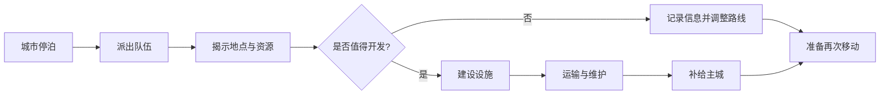

> 状态：草稿
> 程序实现：无

← [玩法循环](./README.md)

# 探索与扩张

| 字段 | 内容 |
|------|------|
| 状态 | 草稿 |
| 校验状态 | 待校验 |
| 作者 | |
| 日期 | 2026-06-23 |
| 相关设定 | [核心世界观](../../04-设定/01-世界观/核心世界观.md)、[03-地点与场景/](../../04-设定/03-地点与场景/) |
| 相关系统 | [地图与移动](../02-地图与世界/地图与移动.md)、[地图图层](../03-图层与地点/地图图层.md)、[城市模块化](../03-图层与地点/建筑层/README.md)、[队伍系统](../06-单位与交战/队伍系统.md)、[单位类型与视野](../06-单位与交战/单位类型与视野.md)、[通讯与视野系统](../06-单位与交战/通讯与视野系统.md)、[荒野地点](../04-资源与人口/荒野地点.md)、[四种核心资源](../04-资源与人口/四种核心资源.md)、[核心循环](./核心循环.md)、[势力系统](../05-城市与领袖/势力系统.md) |

## 目标

定义城市停下后如何与外部世界互动，包括勘探、建立设施、补充资源与人口。

## 范围

- **包含**：停泊后的勘探、资源点确认、**荒野**设施建设（征兵办 / 矿区 / 果园 / 能源站）、**城内一般城区**设施建设、驿站与桥梁、运输补给、前往外部据点。
- **不包含**：设施建造消耗公式、据点生成规则、界面交互细节、完整数值平衡。

## 详细说明

### 系统定位

探索与扩张承接 [地图与移动](../02-地图与世界/地图与移动.md) 中的**停泊**状态：移动城市停下后，玩家通过队伍把城市能力带到周边荒野，换取资源、信息、路线选择与外部据点关系。它是「停下交互 → 勘探与开发 → 资源与人口管理 → 再次移动」的中段。

### 基本流程

| 阶段 | 玩家在做什么 | 主要系统 | 产出 |
|------|--------------|----------|------|
| 停泊准备 | 确认主城已停下，规划外出目标 | [地图与移动](../02-地图与世界/地图与移动.md)、[回合与行动表](./回合与行动表.md) | 可执行停下后的交互 |
| 派出队伍 | 从主城派出侦察队、勘探队、运输队或工程队 | [队伍系统](../06-单位与交战/队伍系统.md)、[单位类型与视野](../06-单位与交战/单位类型与视野.md) | 外出单位与指令表 |
| 揭示信息 | 发现资源点、地形、危险或据点 | [单位类型与视野](../06-单位与交战/单位类型与视野.md)、[通讯与视野系统](../06-单位与交战/通讯与视野系统.md) | 即时进入玩家已知层 |
| 判断开发 | 依据储量、距离、风险与当前资源决定是否开发 | [荒野地点](../04-资源与人口/荒野地点.md)、[四种核心资源](../04-资源与人口/四种核心资源.md) | 开发、放弃或延后 |
| 建设设施 | 在资源点上建立 **征兵办、矿区、果园、能源站** 等采集设施，或桥梁、驿站 | [地图图层](../03-图层与地点/地图图层.md)、[荒野地点](../04-资源与人口/荒野地点.md)、[队伍系统](../06-单位与交战/队伍系统.md) | 设施与后续维护需求 |
| 运输补给 | 将资源点产出或据点补给带回主城 | [队伍系统](../06-单位与交战/队伍系统.md)、[四种核心资源](../04-资源与人口/四种核心资源.md) | 资源回流与行动范围扩大 |

### 勘探与信息同步

- 侦察队优先提升至 **揭示种类**（`kind`），勘探队经工作提升至 **揭示储量**（`amount`）；见 [资源点揭示等级](../06-单位与交战/单位类型与视野.md#资源点揭示等级)。
- 外出单位看到的**地图情报**当场进入玩家战略地图已知层；见 [通讯与视野系统](../06-单位与交战/通讯与视野系统.md)（**不存在通讯时间差**）。
- 若情报尚未同步，玩家可以基于旧信息继续下达指令，但要承担路径、风险或资源判断失准的后果（**不含**己方队伍已阵亡却仍显示可指挥的情况）。

### 设施建设

设施按**建造位置**分为两类，投资回收预期不同：

| 位置 | 典型用途 | 与城市移动的关系 |
|------|----------|------------------|
| **一般城区**（[城市模块化 · 一般城区](../03-图层与地点/建筑层/城区总览.md#一般城区)） | **占格类** · 仓储 / 生产（物品转化）等；长期产能随城携带 | **随移动城市迁移** |
| **荒野**（地图 [设施层](../03-图层与地点/设施层.md)） | **占格类** · 储量转化、地形类；**辅助类** | 城市离开后**通常无法整体带走** |

#### 荒野设施

- 工程队负责在合法位置建设荒野设施；合法性由 [地图图层](../03-图层与地点/地图图层.md) 的地形、资源层、设施层影响规则共同决定。
- **占格类 · 生产类（储量转化）**（建于 [资源点](../04-资源与人口/荒野地点.md#资源点与采集设施)）：

| 资源点 | 采集设施 | 主要产出 |
|--------|----------|----------|
| 村镇 | **征兵办** | **无归属**人口；单次 **15** 人（见 [产出锚](../04-资源与人口/四种核心资源.md#四类资源产出锚已定)） |
| 矿藏 | **矿区** | 金属；单次 **25** |
| 果地 | **果园** | 食物；单次 **25** |
| 遗迹 | **能源站** | 能源；单次 **40** |

- 采集设施建成后通过 [工作](../07-玩法循环/工作.md) 将资源点**储量**转化为物品；建造消耗 **金属**（采集类各 **30**），部分设施运行消耗 **能源**（温室转化时）。
- 其它常见设施：**驿站**（运输中继）、**桥梁**（跨裂谷，见 [地图图层 · 裂谷与桥梁](../03-图层与地点/地图图层.md#裂谷与桥梁)）、**隧道**（山地，见 [地形类型清单](../03-图层与地点/地图图层.md#山地与隧道)）。
- 设施建设是按回合推进的工作；工程队规则见 [单位类型与视野 · 工程队模板](../06-单位与交战/单位类型与视野.md#4-工程队模板)。

#### 城内设施（一般城区）

- 玩家在 [一般城区](../03-图层与地点/建筑层/城区总览.md#一般城区) 的空地内建造 **占格类**设施（**仓储类**、**生产类 · 物品转化** 等）；所建设施归属**移动城市**，随城航行与停泊切换而保留。
- **一般城区不提供城区能力**——玩法能力来自所建**设施效果**；设施消耗与城区自身消耗**分轨**（见 [运作与居民 · 城区消耗与设施消耗](../03-图层与地点/建筑层/运作与居民.md#城区消耗与设施消耗)）。
- 建造合法性、设施类型白名单与槽位数量 **待定**（与荒野设施规则可能部分共用 `facility_type_config`）。
- 战略取舍：高频、长期使用的功能优先放在城内；绑定资源点储量的一次性开采仍放在荒野采集设施。

### 外部城市交互

- **[村镇](../04-资源与人口/荒野地点/村镇.md)** **就是**资源点，交互已含于上文 [占格类 · 生产类](#占格类--生产类储量转化) 与 [资源点揭示](#资源点揭示机制)；**无**独立据点玩法。
- **外部城市**（建筑层）：贸易、委托、冲突、领袖关系变化等；**不是**玩家的 [移动城市](../02-地图与世界/地图与移动.md)，**不能**按资源点开采。
- 与外部城市的领袖关系变化归入 [势力系统 · 领袖关系系统](../05-城市与领袖/势力系统.md#领袖关系系统)；同组织内**城市领袖**的间接领袖关系变化不在本文重复展开。

### 与再次移动的关系

探索与扩张的结果最终回到 [核心循环](../07-玩法循环/核心循环.md)：

| 结果 | 对下一次移动的影响 |
|------|--------------------|
| 资源充足 | 支撑能源、食物、金属与人口消耗，扩大可行路线 |
| 路线信息更完整 | 降低撞上障碍、危险或无效资源点的风险 |
| 建立中继设施 | 延长运输和补给能力，允许主城更早离开当前位置 |
| 关系改善 | 领袖页面委托 / 贸易（**−50<R<50** 或 **R≥50** 八折）；招募 **R≥50** → 资源封存 → 效忠解封；**占领**另轨 sy-34 |
| 开发失败或信息延迟 | 可能迫使玩家停留更久、改线或牺牲城区模块 |

## 待确认事项

- [ ] 城内一般城区 vs 荒野设施：类型白名单、槽位、迁移与拆解规则差异。
- [x] 征兵办 / 矿区 / 果园 / 能源站首版产出与建造金属 → [产出锚](../04-资源与人口/四种核心资源.md#四类资源产出锚已定)；维护失效细则仍待补。
- [ ] 不同固定据点的交互选项：外部城市补给、招募、贸易、任务、关系变化（**村镇走资源点流程，见 [村镇](../04-资源与人口/荒野地点/村镇.md)**）。
- [ ] 信息延迟对玩家指令、地图标记和风险提示的具体影响。
- [ ] 主城离开后，已建设施是否继续产出，是否需要运输队或工程队维护。
- [ ] 开发失败、队伍失联、设施被破坏时，如何向玩家反馈。

## 修订记录

| 日期 | 版本 | 说明 |
|------|------|------|
| 2026-06-20 | 0.0.1 | 初稿 |
| 2026-06-21 | 0.0.2 | 补全与核心循环的交叉链接；正文首次提及队伍系统、荒野地点时加链 |
| 2026-06-23 | 0.0.3 | 按核心系统结构扩写：补停泊后流程、勘探与信息同步、设施建设、外部据点交互与再次移动关系；刷新图片 |
| 2026-06-27 | 0.0.4 | 采集设施按草稿：征兵办、矿区、果园、能源站 |
| 2026-06-27 | 0.0.5 | 设施建设分城内一般城区与荒野；随城迁移 vs 弃置拆解 |
| 2026-06-27 | 0.0.6 | 一般城区无城区能力；设施/城区消耗分轨 |
| 2026-06-27 | 0.0.7 | 设施建设对齐占格类/辅助类 taxonomy |
| 2026-07-11 | 0.1.1 | 修正跨域相对链接；情报即时同步表述 |
