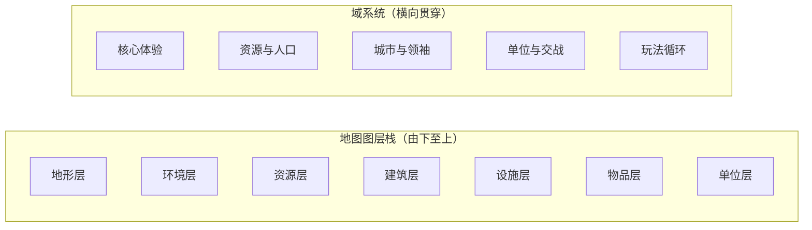

> 状态：评审中
> 校验状态：已对照（与 [01-草稿/系统.md](../01-草稿/系统.md) 同构）

← [文档库](../README.md)

# 系统设计

本目录存放《循光之城》的**玩家体验、玩法规则、流程、数值设计意图**。

> 对外读者请先从 [游戏介绍.md](../游戏介绍.md) 入手；本目录各文档为机制专题详解。

## 阅读顺序（与草稿同构）

建议按「地图图层栈 + 域系统」的顺序阅读：

| 顺序 | 目录 | 回答的问题 | 草稿对应 |
|------|------|------------|----------|
| 1 | [`01-核心体验/`](01-核心体验/) | 游戏是什么、核心幻想、玩家目标与压力 | 目标层 |
| 2 | [`02-地图与世界/`](02-地图与世界/) | 世界地图如何构成、城市如何移动与停泊 | 地图系统 |
| 3 | [`03-图层与地点/`](03-图层与地点/) | 地形→环境→资源→建筑→设施→物品→单位的叠放规则 | 瓦片与层级 |
| 4 | [`04-资源与人口/`](04-资源与人口/) | 金属、食物、能源、人口如何流动 | 物品层、资产 |
| 5 | [`05-城市与领袖/`](05-城市与领袖/) | 城区模块化、领袖、势力、归属转化 | 建筑层、人口归属 |
| 6 | [`06-单位与交战/`](06-单位与交战/) | 队伍、视野、通讯、交战结算 | 单位层 |
| 7 | [`07-玩法循环/`](07-玩法循环/) | 回合、工作、探索与扩张、核心循环 | 指挥、工作 |
| 8 | [`08-关卡与叙事/`](08-关卡与叙事/) | 关卡结构、任务流程、叙事节奏 | 关卡 |

---

## 各目录索引

### 01-核心体验

| 文档 | 说明 |
|------|------|
| [`核心幻想.md`](01-核心体验/核心幻想.md) | 一句话卖点、核心体验描述 |
| [`胜利条件.md`](01-核心体验/胜利条件.md) | 胜利条件、失败条件、动态难度 |

### 02-地图与世界

| 文档 | 说明 |
|------|------|
| [`地图与移动.md`](02-地图与世界/地图与移动.md) | 六边形卷轴地图、移动城市占格、停泊与航行 |

### 03-图层与地点

地图图层栈主场，对齐草稿的「瓦片与层级」：

| 文档 | 说明 | 对应图层 |
|------|------|----------|
| [`README.md`](03-图层与地点/) | 图层一览、叠放顺序 | 总览 |
| [`地图图层.md`](03-图层与地点/地图图层.md) | 地形层 / 环境层分工、地形类型清单、影响规则 | L1-L2 |
| [`资源层与荒野.md`](03-图层与地点/资源层与荒野.md) | 四类资源点、采集设施、遗迹vs废墟 | L3 |
| [`设施层.md`](03-图层与地点/设施层.md) | **占格类**（地形/生产/仓储）与**辅助类** | L5 |
| [`建筑层/`](03-图层与地点/建筑层/) | 城区（特殊/一般）、废墟、连接、运作 | L4 |
| `物品层.md` | 物品存取、搬运、上限（计划中） | L6 |
| `单位层.md` | 队伍、视野、通讯（见 06-单位与交战） | L7 |

### 04-资源与人口

| 文档 | 说明 |
|------|------|
| [`README.md`](04-资源与人口/) | 资源与人口总览 |
| [`四种核心资源.md`](04-资源与人口/四种核心资源.md) | 金属、食物、能源、人口 |
| [`人口与迁移.md`](04-资源与人口/人口与迁移.md) | 居民vs工作人口、城区运作、迁移 |
| [`城市管理系统.md`](04-资源与人口/城市管理系统.md) | 资源存储、住房、城区能力人力分配 |
| [`荒野地点.md`](04-资源与人口/荒野地点.md) | 村镇、矿藏、果地、遗迹 |

### 05-城市与领袖

| 文档 | 说明 |
|------|------|
| [`README.md`](05-城市与领袖/) | 城市与领袖总览 |
| [`领袖与势力.md`](05-城市与领袖/领袖与势力.md) | 城市领袖、势力领袖、人口归属、卸任牌库 |
| [`势力系统.md`](05-城市与领袖/势力系统.md) | 外部城市、关系系统、组织传导 |

### 06-单位与交战

| 文档 | 说明 |
|------|------|
| [`README.md`](06-单位与交战/) | 单位与交战总览 |
| [`队伍系统.md`](06-单位与交战/队伍系统.md) | 队伍模板、编制、能力 |
| [`单位类型与视野.md`](06-单位与交战/单位类型与视野.md) | 侦察/勘探/运输/工程单位 |
| [`交战系统.md`](06-单位与交战/交战系统.md) | 交战判定、减员 / 建筑损伤 / 设施耐久结算 |
| [`通讯与视野系统.md`](06-单位与交战/通讯与视野系统.md) | 即时通讯、地图情报同步（飞信已废止） |

### 07-玩法循环

| 文档 | 说明 |
|------|------|
| [`README.md`](07-玩法循环/) | 玩法循环总览 |
| [`核心循环.md`](07-玩法循环/核心循环.md) | 三级玩家行为循环 |
| [`回合与行动表.md`](07-玩法循环/回合与行动表.md) | 回合结构、指令表、行动顺序 |
| [`工作.md`](07-玩法循环/工作.md) | 工作进度、工作成果、多回合任务 |
| [`探索与扩张.md`](07-玩法循环/探索与扩张.md) | 停泊后的勘探、建设、运输、据点交互 |

### 08-关卡与叙事

关卡结构、任务流程、叙事节奏（待建）。

---

## 成对索引（设计 ↔ 实现）

| 主题 | 设计文档 | 实现文档 |
|------|----------|----------|
| 核心幻想 / 架构 | [`01-核心体验/`](01-核心体验/)、[`核心循环.md`](07-玩法循环/核心循环.md) | [`03-程序设计/01-架构总览/`](03-程序设计/01-架构总览/) |
| 队伍与战斗 | [`06-单位与交战/`](06-单位与交战/) | [`03-程序设计/03-数据字典/队伍与战斗数据结构.md`](03-程序设计/03-数据字典/队伍与战斗数据结构.md) |
| 回合与行动 | [`07-玩法循环/回合与行动表.md`](07-玩法循环/回合与行动表.md) | [`03-程序设计/03-数据字典/回合与行动数据结构.md`](03-程序设计/03-数据字典/回合与行动数据结构.md) |
| 通讯与视野 | [`06-单位与交战/通讯与视野系统.md`](06-单位与交战/通讯与视野系统.md) | [`03-程序设计/03-数据字典/通讯与视野同步数据结构.md`](../03-程序设计/03-数据字典/通讯与视野同步数据结构.md) |

---

## 重构前目录（重定向）

| 旧目录 | 状态 | 重定向 |
|--------|------|--------|
| `01-核心系统/` | 已拆分 | [→ 重定向页](01-核心系统/) |
| `04-资源与人口/` | 已迁移 | [→ 04-资源与人口](04-资源与人口/) |
| `07-玩法循环/` | 已迁移 | [→ 07-玩法循环](07-玩法循环/) |
| `03-模块与城市/` | 已拆分 | [→ 03-图层与地点/建筑层](03-图层与地点/建筑层/) |
| `03-关卡与叙事/` | 已重编号 | [→ 08-关卡与叙事](08-关卡与叙事/) |

---

## 修订记录

| 日期 | 版本 | 说明 |
|------|------|------|
| 2026-06-27 | 0.1.0 | 重构：按草稿 `系统.md` 的图层栈 + 域模型重组目录；消除重复编号 |
