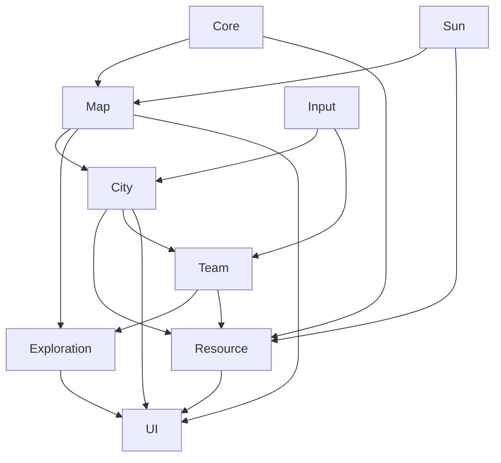

> 状态：草稿
> 对应设计文档：[核心幻想](../../02-系统设计/01-核心体验/核心幻想.md)、[核心循环](../../02-系统设计/02-玩法循环/核心循环.md)

# 模块划分

| 字段 | 内容 |
|------|------|
| 状态 | 草稿 |
| 校验状态 | 未校验 |
| 日期 | 2026-06-21 |
| 关联设计 | [核心幻想](../../02-系统设计/01-核心体验/核心幻想.md)、[地图与移动](../../02-系统设计/01-核心系统/地图与移动.md)、[城市模块化](../../02-系统设计/03-模块与城市/城市模块化.md)、[四种核心资源](../../02-系统设计/02-资源循环/四种核心资源.md)、[队伍系统](../../02-系统设计/01-核心系统/队伍系统.md) |

## 模块列表

| 模块 | 职责 | 入口脚本 | 主要命名空间 |
|------|------|----------|--------------|
| Core | 生命周期、事件总线、存档、时间推进 | | |
| Input | 输入抽象、选中与指令 | | |
| Map | 正六边形网格、地形、荒野地点刷新 | | |
| City | 城区连接、分离、拆解、新建、移动 | | |
| Resource | 建材 / 食物 / 燃料 / 人口四类资源 | | |
| Team | 勘探队、运输队、工程队及人员分配 | | |
| Exploration | 视野、勘探、采集站与驿站 | | |
| Sun | 太阳位置、随距离加大的生存压力、动态难度 | | |
| UI | 界面、HUD、菜单 | | |
| Audio | 音频管理 | | |

## 依赖图

## 待确认事项

- [ ] 平台与视角（2D / 3D、PC 等），见 [待细化追踪](../../00-规范/待细化追踪.md) OPEN-004。
- [ ] 时间推进方式与模块 tick 边界。

## 修订记录

| 日期 | 版本 | 说明 |
|------|------|------|
| 2026-06-20 | 0.1.0 | 初稿 |
| 2026-06-21 | 0.2.0 | 按移动城市玩法重写模块列表与依赖图 |
