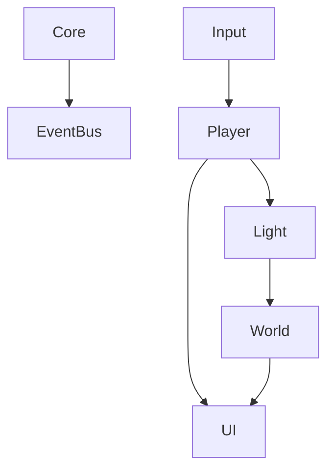

> 状态：草稿
> 对应设计文档：[02-系统设计/核心幻想.md](../../02-系统设计/01-核心体验/核心幻想.md)

# 模块划分

## 模块列表

| 模块 | 职责 | 入口脚本 | 主要命名空间 |
|------|------|----------|--------------|
| Core | 生命周期、事件总线、存档 | | |
| Input | 输入抽象 | | |
| Player | 玩家状态、移动、能力 | | |
| Light | 光源收集、消耗、传递 | | |
| World | 区域解锁、场景对象 | | |
| UI | 界面、HUD、菜单 | | |
| Audio | 音频管理 | | |

## 依赖图

## 修订记录

| 日期 | 版本 | 说明 |
|------|------|------|
| 2026-06-20 | 0.1.0 | 初稿 |
