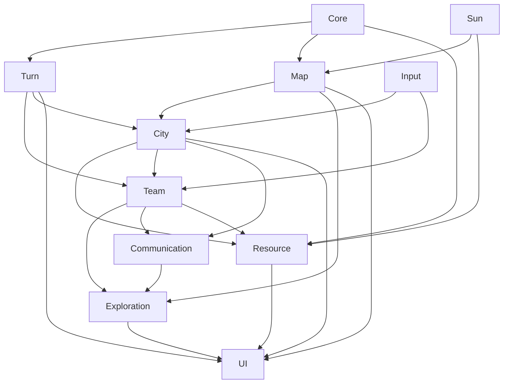

> 状态：草稿
> 校验状态：待校验
> 对应设计文档：[核心幻想](../../02-系统设计/01-核心体验/核心幻想.md)、[核心循环](../../02-系统设计/07-玩法循环/核心循环.md)、[回合与行动表](../../02-系统设计/07-玩法循环/回合与行动表.md)

← [架构总览](./README.md)

# 模块划分

| 字段 | 内容 |
|------|------|
| 状态 | 草稿 |
| 校验状态 | 待校验 |
| 日期 | 2026-06-23 |
| 关联设计 | [核心幻想](../../02-系统设计/01-核心体验/核心幻想.md)、[平台与操作](../../02-系统设计/01-核心体验/平台与操作.md)、[地图与移动](../../02-系统设计/02-地图与世界/地图与移动.md)、[城市模块化](../../02-系统设计/03-图层与地点/建筑层/README.md)、[四种核心资源](../../02-系统设计/04-资源与人口/四种核心资源.md)、[队伍系统](../../02-系统设计/06-单位与交战/队伍系统.md)、[通讯与飞信系统](../../02-系统设计/06-单位与交战/通讯与飞讯系统.md)、[回合与行动表](../../02-系统设计/07-玩法循环/回合与行动表.md) |

## 模块列表

| 模块 | 职责 | 入口脚本 | 主要命名空间 |
|------|------|----------|--------------|
| Core | 生命周期、事件总线、存档 | | `Yanxu.Core` |
| Turn | 回合阶段推进、行动表排序 | | `Yanxu.Turn` |
| Input | 输入抽象、选中与指令；**首版以鼠标点击为主**（见 [平台与操作](../../02-系统设计/01-核心体验/平台与操作.md)） | | `Yanxu.Input` |
| Map | 正六边形网格、地形、荒野地点刷新；**3D 表现 + 格点逻辑** | | `Yanxu.Map` |
| City | 城区连接、分离、拆解、新建、移动 | | `Yanxu.City` |
| Resource | 金属 / 食物 / 能源 / 人口四类资源 | | `Yanxu.Resource` |
| Team | 侦察 / 勘探 / 运输 / 工程队、飞信、人员与指令 | | `Yanxu.Team` |
| Communication | 即时通讯、飞信、视野同步队列 | | `Yanxu.Communication` |
| Exploration | 资源点揭示、采集设施与驿站 | | `Yanxu.Exploration` |
| Sun | 太阳位置、随距离加大的生存压力；**黄昏带/暗渊带格修正工具**（每 x 回合卷轴向上推移 y 格，见 [地图与移动 · 程序口径](../../02-系统设计/02-地图与世界/地图与移动.md#程序口径open-006-部分已定)） | | `Yanxu.Sun` |
| UI | 界面、HUD、菜单 | | `Yanxu.UI` |
| Audio | 音频管理 | | `Yanxu.Audio` |

## 依赖图

## 待确认事项

- [x] 平台与视角：**PC**、**3D 俯视**、**点击为主**（OPEN-004 已关闭）；默认相机与俯仰边界见 OPEN-036（已关闭）；无城市内部视图见 OPEN-038（已关闭）；旋转吸附等见 OPEN-037、OPEN-039；渲染管线见 OPEN-040。
- [ ] 各模块 tick 边界与 [回合阶段](../../02-系统设计/07-玩法循环/回合与行动表.md#回合阶段) 的对应关系（回合制已定，见 OPEN-010 已关闭）。
- [ ] 命名空间前缀是否采用 `Yanxu.*`（待代码落地时确认）。

完整设计缺口见 [设计缺口清单](../设计缺口清单.md)。

## 修订记录

| 日期 | 版本 | 说明 |
|------|------|------|
| 2026-06-20 | 0.0.1 | 初稿 |
| 2026-06-21 | 0.0.2 | 按移动城市玩法重写模块列表与依赖图 |
| 2026-06-22 | 0.0.3 | 新增 Turn、Communication 模块；对齐队伍/通讯/回合设计；校验状态改为部分符合 |
| 2026-06-23 | 0.0.4 | 刷新图片 |
| 2026-06-27 | 0.0.5 | 对齐 OPEN-004：PC、3D 俯视、点击输入；Input/Map 职责补充 |
